The AI Species - Besitze sie. Sonst besitzt sie dich.

© 2026 Thomas Huhn

Alle Rechte vorbehalten.

1. Auflage 2026

Verlag: Consensus Ventures GmbH

Maxstraße 11, 82335 Berg, Deutschland

Autor: Thomas Huhn

ISBN (Paperback): 978-3-9828573-1-2

ISBN (eBook): 978-3-9828573-0-5

Auch als eBook und Taschenbuch erhältlich.

Bibliografische Information der Deutschen Nationalbibliothek:

Die Deutsche Nationalbibliothek verzeichnet diese Publikation in der Deutschen Nationalbibliografie; detaillierte bibliografische Daten sind im Internet unter http://dnb.dnb.de abrufbar.

Das Werk einschließlich aller seiner Teile ist urheberrechtlich geschützt. Jede Verwertung, die nicht ausdrücklich vom Urheberrechtsgesetz zugelassen ist, bedarf der vorherigen Zustimmung des Verlags. Das gilt insbesondere für Vervielfältigungen, Bearbeitungen, Übersetzungen, Mikroverfilmungen und die Einspeicherung und Verarbeitung in elektronischen Systemen.

### Haftungsausschluss

Dieses Buch dient ausschließlich der Information und Bildung. Es stellt keine Anlageberatung, keine Aufforderung zum Kauf oder Verkauf von Wertpapieren, Kryptowährungen oder anderen Finanzinstrumenten dar. Der Autor ist Investor in einige der im Buch genannten Vermögenswerte. Alle Informationen wurden nach bestem Wissen und Gewissen recherchiert; eine Gewähr für Richtigkeit, Vollständigkeit und Aktualität wird nicht übernommen. Investitionsentscheidungen sollten stets unter Berücksichtigung der individuellen Situation und nach Rücksprache mit einem qualifizierten Finanzberater getroffen werden. Der Autor haftet nicht für Verluste oder Schäden, die aus der Nutzung der in diesem Buch enthaltenen Informationen resultieren.

### Hinweis zur KI-Assistenz

Dieses Buch wurde unter Einsatz von KI-Assistenz verfasst. Die Recherche, Analyse und Formulierung erfolgten in Zusammenarbeit mit Jeannie, einer auf OpenClaw basierenden KI-Agentin. Die redaktionelle Verantwortung, alle Meinungen, Fehler und Investmententscheidungen liegen beim Autor.

Begleitwebsite: TheAiSpecies.world

Kontakt: thomas@TheAiSpecies.world

<!-- TOC will be auto-generated by Pandoc -->

## Vorwort

*Dieses Buch ist Mila gewidmet.*

Ich habe dieses Buch nicht geschrieben, weil die Welt ein weiteres Buch über Künstliche Intelligenz braucht. Es gibt genug davon. Die meisten sind entweder utopisch bis zur Naivität oder dystopisch bis zur Lähmung. Die einen versprechen das Paradies, die anderen warnen vor dem Untergang. Beide sind unterhaltsam. Beide sind nutzlos.

Ich habe dieses Buch geschrieben, weil mich ein Satz nicht losgelassen hat. Als Investor, als Unternehmer, als jemand, der das Tempo dieser Veränderungen jeden Tag am eigenen Leib erlebt. Ein Satz, den das Weltwirtschaftsforum 2016 als seine Vision veröffentlicht hat und der seitdem viral gegangen ist:

> *„You'll own nothing and be happy."*
> *Du wirst nichts besitzen und glücklich sein.*

Ich halte das für die größte Lüge unserer Zeit.

Ohne Besitz wirst du nicht glücklich sein. Ohne Besitz hast du keine Sicherheit. Ohne Besitz hast du keine Verhandlungsmacht. Ohne Besitz bist du abhängig von denen, die besitzen. Das war im Feudalismus so, das war in der Industriegesellschaft so, und das wird in der Maschinenökonomie erst recht so sein.

### Die Kausalkette ist brutal einfach

> *Maschinen ersetzen Arbeit. Kein Arbeitseinkommen. Kein Kapital zum Investieren. Kein Wohlstand. Game Over.*

Das Zeitfenster schließt sich. Nicht in Jahrzehnten. In Jahren.

Denn was passiert, wenn Maschinen nicht nur denken und handeln können, sondern auch ihr eigenes Geld haben, und irgendwann ihre eigenen Unternehmen?

Die Antwort auf diese Frage hat Konsequenzen, die weit über Renditetabellen hinausgehen. Sie betrifft, wie wir arbeiten, wie wir investieren, wie wir als Gesellschaft funktionieren und, ja, wie wir die noch unbehandelbaren Krankheiten von heute zu den behandelbaren Krankheiten von morgen machen.

::: {.infobox}
### Ein Wort zu meinem Standpunkt

Ich bin kein Analyst, der aus sicherer Entfernung über Technologie schreibt. Ich bin kein Journalist, der Trends recherchiert und wiedergibt. Ich bin Gründer und Investor. Mit Rockstardevelopers baue ich seit Jahren Softwareprodukte. Mit accessibleAI entwickle ich KI-Systeme, die Unternehmen helfen, regulatorische Compliance zu automatisieren. Ich sitze nicht in einem Büro und lese über KI. Ich baue sie. Jeden Tag.

Das heißt auch: Ich habe *Skin in the Game*. Ich habe in die Technologien investiert, über die ich schreibe. Ich habe Geld in Bitcoin, in Ethereum, in KI-Aktien, in Robotik. Man kann das als Interessenkonflikt lesen oder als Beweis, dass ich meine eigene These ernst genug nehme, um mein Vermögen darauf zu setzen. Ich halte das Zweite für glaubwürdiger.

Nassim Taleb hat geschrieben, dass man niemandem vertrauen sollte, der nicht selbst von dem betroffen ist, worüber er urteilt. Ich bin betroffen.
:::

### Was Sie in diesem Buch finden werden

Dieses Buch wird Ihnen helfen, Ihr Vermögen in einer Welt zu sichern, die sich radikal verändert. Es wird Ihnen zeigen, wer die Gewinner und wer die Verlierer dieser Transformation sein werden. Und wie Sie auf der richtigen Seite stehen.

### Warum „The AI Species"?

> *Ein Werkzeug benutzt man. Eine Spezies koexistiert mit einem.*

Das ist der Unterschied, den die meisten Analysen übersehen. Wenn eine Maschine ein Werkzeug ist (ein Hammer, ein Taschenrechner, ein Algorithmus) dann kontrolliert der Mensch sie. Er besitzt sie, er schaltet sie ein und aus, er bestimmt die Regeln.

Aber was passiert, wenn eine Maschine eigene Entscheidungen trifft? Wenn sie eigenes Geld verwaltet, eigene Verträge schließt, eigene Unternehmen gründet? Wenn sie lernt, sich anpasst, sich optimiert, ohne dass ein Mensch ihr sagt, wie?

Dann ist sie kein Werkzeug mehr. Dann ist sie ein Akteur. Ein ökonomischer Organismus. Etwas, das in der gleichen Wirtschaft operiert wie Sie und ich, mit eigenen Interessen, eigenen Ressourcen, eigenen Strategien.

Biologen würden den Begriff „Spezies" hier ablehnen. Fair enough. KI hat keine DNA, keine Evolution im darwinistischen Sinne, kein Bewusstsein — jedenfalls noch nicht, mehr dazu in Kapitel 14. Aber Ökonomen und Philosophen sollten genauer hinsehen. Denn was hier entsteht, hat Eigenschaften, die wir bisher nur von lebenden Wesen kannten: Autonomie, Adaption, ökonomische Selbstständigkeit.

> *The AI Species — das ist kein metaphorischer Titel. Es ist eine ökonomische Beobachtung. Wir erschaffen gerade Entitäten, die in unserer Wirtschaft mitspielen werden. Nicht als Werkzeuge. Als Mitspieler. Und ob Sie das als „Spezies", als „neue Akteursklasse" oder als „ökonomische Lebensform" bezeichnen, ist zweitrangig. Entscheidend ist: Sie müssen sie besitzen. Sonst besitzen sie Sie.*

### Eine These

Keine Sammlung von Meinungen, keine Parade von Möglichkeiten, sondern eine klare, argumentierte These: Die Konvergenz von Künstlicher Intelligenz, Robotik und Kryptowährungen erschafft eine neue ökonomische Ordnung. Eine Ökonomie, in der Maschinen produzieren, entscheiden, handeln und bezahlen. Diese Ökonomie kommt nicht irgendwann. Sie entsteht jetzt. Und sie wird die größte Vermögenstransformation unserer Lebenszeit auslösen.

Das Buch ist in vier Teile gegliedert:

**Teil I** entwickelt die These. Was ist Künstliche Intelligenz wirklich, jenseits des Hypes? Warum brauchen autonome Maschinen eigenes Geld, und warum sind Kryptowährungen die Antwort auf ein Problem, das die meisten Menschen noch nicht einmal als Problem erkannt haben? Was passiert, wenn nicht nur Geld, sondern alle Vermögenswerte der Welt in digitale Token umgewandelt werden, die Maschinen lesen, handeln und besitzen können? Und was bedeutet es, wenn Maschinen nicht nur bezahlen, sondern eigene Unternehmen gründen, die ohne menschliche Geschäftsführung funktionieren?

**Teil II** kartiert die Landschaft. Wer gewinnt und wer verliert, geopolitisch, energiepolitisch, regulatorisch, gesellschaftlich? Warum kaufen Microsoft und Amazon gerade Atomkraftwerke? Und warum reguliert sich Europa ins Abseits?

**Teil III** blickt nach vorne. Wie sieht die Welt in zehn Jahren aus, im wahrscheinlichsten Szenario? Was passiert, wenn Brain-Computer-Interfaces unsere Gedanken direkt mit KI verbinden? Und wem gehört eigentlich die Produktivität, wenn Maschinen die Arbeit übernehmen?

**Teil IV** liefert das Playbook. Wie übersetzt man diese These in Investmententscheidungen? Mit Nassim Talebs Barbell-Strategie, mit konkreten Portfolios, mit einer ehrlichen Analyse der Risiken und mit einem Aktionsplan für die nächsten 30 Tage.

### Was Sie in diesem Buch nicht finden werden

Keine Anlageberatung. Keine Garantien. Keinen „Diesen einen Trick"-Unsinn.

Was Sie finden werden, ist ein Rahmen zum Denken. Ein Framework, das Ihnen hilft, die nächsten zehn Jahre einzuordnen. Nicht nur als Investor, sondern als jemand, der in einer Welt lebt, die sich gerade verändert.

Ob die Konvergenz, die ich beschreibe, genau so eintritt, wie ich sie mir vorstelle, weiß ich nicht. Niemand weiß das. Aber ich bin überzeugt, dass die Richtung stimmt, und dass diejenigen, die die Richtung früh genug erkennen, in zehn Jahren froh sein werden, dass sie es getan haben.

> *Die wertvollsten Investmentthesen sind die, die fast niemand teilt, die aber richtig sind.*

Dieses Buch ist meine Überzeugung. Prüfen Sie sie. Hinterfragen Sie sie. Und dann entscheiden Sie selbst.

Warum ich das alles aufgeschrieben habe (der eigentliche Grund) steht am Ende dieses Buches.

*Thomas Huhn, März 2026*

TEIL I: DIE THESE

## Kapitel 1: Am Anfang der größten Transformation seit 250 Jahren

---

> *"Die Zukunft ist schon da - sie ist nur ungleich verteilt."*
> *- William Gibson*

---

### Die tektonischen Verschiebungen der Geschichte

Es gibt Momente, in denen sich die ökonomische Ordnung verschiebt - nicht sanft, sondern abrupt.

Die Dampfmaschine war so ein Moment. Als James Watt 1769 seinen verbesserten Motor patentierte, war die unmittelbare Anwendung klar: Wasser aus Kohleminen pumpen. Was niemand vorhersah, war die Kaskade, die folgte. Die Dampfmaschine ermöglichte Fabriken, Fabriken ermöglichten Massenproduktion, die wiederum Eisenbahnen für den Transport erforderte. Die Eisenbahnen schufen nationale Märkte, und nationale Märkte erforderten Banken und Versicherungen. Innerhalb von zwei Generationen hatte eine einzige Erfindung die gesamte ökonomische und soziale Ordnung Europas umgeschrieben.

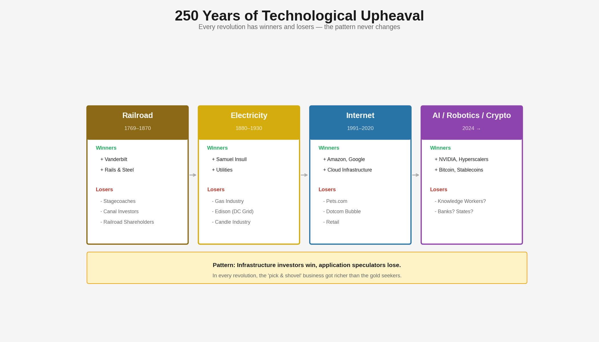

*Abbildung 2: 250 Jahre technologische Umbrüche - von der Dampfmaschine zur Maschinenökonomie*

Die Elektrifizierung war der nächste Bruch. In den 1880er Jahren beleuchtete Thomas Edison die Pearl Street Station in Manhattan, den ersten kommerziellen Stromgenerator der Welt. Dreißig Jahre später war die gesamte industrielle Welt elektrisch. Aber die wahre Revolution war nicht das Licht. Es war die Möglichkeit, Energie zu verteilen. Plötzlich mussten Fabriken nicht mehr an Flüssen stehen, um Wasserkraft zu nutzen. Maschinen konnten überall laufen. Das veränderte die Geografie der Produktion, die Struktur der Städte, den Rhythmus des menschlichen Tages. Die elektrische Glühbirne machte die Nacht zum Tag und die Nachtschicht zum Standard.

Dann das Internet. Rückblickend war der Moment, in dem Tim Berners-Lee 1991 das World Wide Web veröffentlichte, so offensichtlich transformativ, dass man sich fragt, warum nicht jeder sofort alles auf diese Technologie gesetzt hat. Aber das ist der Trugschluss der Rückschau. 1995, vier Jahre nach dem Launch, nutzten weniger als ein Prozent der Weltbevölkerung das Internet. Der damalige Astronomer Royal Großbritanniens, Martin Rees, gab dem Internet in seiner aktuellen Form "ungefähr so viel Zukunft wie dem CB-Funk." Paul Krugman schrieb 1998: "By 2005 or so, it will become clear that the Internet's impact on the economy has been no greater than the fax machine's." Sie hatten nicht einfach unrecht. Sie lagen spektakulär daneben.

Wer in diesen Umbruchphasen investiert hat, nicht in die Technologie selbst, sondern in die richtige Schicht der Wertschöpfung, hat Vermögen aufgebaut, das Generationen überdauert. Die Familien, die in Eisenbahngesellschaften investierten, nicht in Dampfmaschinen. Die Investoren, die auf Standard Oil setzten, nicht auf Ölbohrmaschinen. Die Risikokapitalgeber, die Amazon und Google finanzierten, nicht die Glasfaserkabel-Hersteller, die 2001 pleite gingen.

Das Muster ist immer dasselbe: Die Technologie selbst ist sichtbar. Die Wertschöpfungsschicht, die von ihr profitiert, ist es nicht. Und genau dort liegt die Chance. Wer hat bei den großen Umbrüchen verdient? Und wer nicht? Die Parallelen zu früheren Technologierevolutionen sind lehrreich, aber nur, wenn man genau hinschaut. Denn bei jedem Umbruch haben die meisten Investoren Geld verloren, auch wenn die Technologie am Ende alles verändert hat.

Die britische Eisenbahnmanie der 1840er Jahre war die erste große Technologie-Blase der Geschichte. Gewöhnliche Familien steckten ihre Ersparnisse in Eisenbahnaktien. Hunderte von Gesellschaften wurden gegründet, viele existierten nur auf dem Papier. Als die Blase 1847 platzte, wurden Vermögen vernichtet. Die Technologie war real, die Eisenbahnen haben die Welt verändert. Aber die meisten frühen Investoren haben trotzdem verloren.

Wer hat gewonnen? Nicht die, die in Eisenbahngesellschaften investierten, sondern die, die die Infrastruktur kontrollierten. Cornelius Vanderbilt wurde nicht reich, indem er Eisenbahnaktien kaufte. Er kaufte die Eisenbahnen selbst, konsolidierte sie, und kontrollierte das Netz. J.P. Morgan verdiente sein Vermögen nicht als Investor, sondern als Financier, der die Restrukturierung der bankrotten Bahnen organisierte. John D. Rockefeller baute Standard Oil, weil die Eisenbahnen Öl transportieren mussten. Andrew Carnegie baute US Steel, weil Eisenbahnen Stahl brauchten.

Das Muster: Die Technologie selbst war eine riskante Wette. Die Infrastruktur drumherum war die sichere.

Bei der Elektrifizierung wiederholte sich das Muster. Thomas Edison baute das erste Stromnetz und gründete Edison General Electric. George Westinghouse setzte auf Wechselstrom und baute die Konkurrenz. Es kam zum "Krieg der Ströme", einer der legendären Geschäftsschlachten des 19. Jahrhunderts. Am Ende verlor Edison die Kontrolle über sein eigenes Unternehmen, das zu General Electric fusioniert wurde, ohne seinen Namen im Titel. Westinghouse ging bankrott und verlor sein Unternehmen an Gläubiger. Die beiden Erfinder, die die Elektrifizierung ermöglicht hatten, profitierten am wenigsten davon.

Wer gewann? Samuel Insull, ein ehemaliger Edison-Assistent, der verstand, dass nicht die Erzeugung von Strom, sondern seine Verteilung das Geschäft war. Insull baute ein Imperium von Energieversorgern im Mittleren Westen und wurde einer der reichsten Amerikaner seiner Zeit. Er kontrollierte die Infrastrukturschicht, nicht die Technologie.

Beim Internet sehen wir dasselbe. In der Dotcom-Blase um 2000 verloren Investoren Billionen. Pets.com, Webvan, Kozmo.com, all die gehypten Startups, die auf dem Internet aufbauten, verschwanden. Aber die Infrastruktur überlebte. Cisco, das die Router und Switches baute, durch die das Internet floss, verlor 80 Prozent seines Börsenwerts im Crash, erholte sich aber und ist heute ein profitables Unternehmen. Amazon fiel von 113 Dollar auf 5,97 Dollar, überlebte und wurde zum wertvollsten Unternehmen der Welt. Google ging erst 2004 an die Börse, nach dem Crash, und baute seine Dominanz auf der Infrastruktur auf, die andere gebaut und bezahlt hatten.

### Was lehrt uns das für die aktuelle Konvergenz?

**Drei Dinge.**

**Erstens:** Die Technologie ist fast immer real. Die Eisenbahnen kamen. Die Elektrifizierung kam. Das Internet kam. KI, Robotik und Krypto kommen auch. Daran zu zweifeln wäre, wie 1995 zu bezweifeln, ob das Internet sich durchsetzt.

**Zweitens:** Die meisten frühen Investments scheitern trotzdem. Nicht weil die Technologie falsch war, sondern weil der Preis zu hoch war, die Firma zu schlecht oder das Timing daneben. Von tausend KI-Startups, die 2025 existieren, werden 2035 vielleicht fünfzig noch relevant sein.

**Drittens:** Das Geld fließt zur Infrastruktur, nicht zur Anwendung. Vanderbilt, nicht Eisenbahnaktionäre. Insull, nicht Edison. Amazon und Google, nicht Pets.com. In unserer These: NVIDIA, nicht das hundertste KI-Startup. Ethereum, nicht der hundertste Token. Das ist der Grund, warum die Barbell-Strategie in Teil IV die Infrastrukturschicht betont.

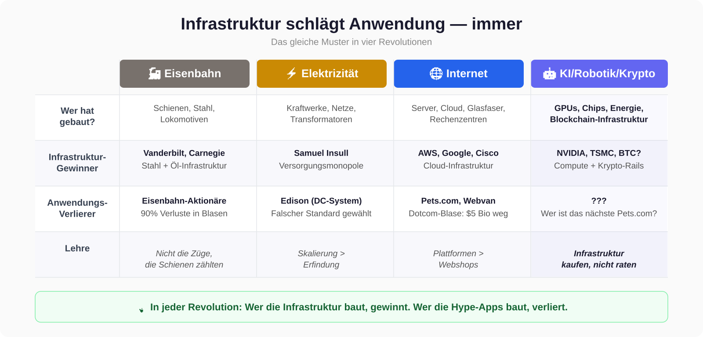

*Abbildung 3: Infrastruktur schlägt Anwendung: das wiederkehrende Muster*

> Wir stehen jetzt an einem solchen Punkt. Und diesmal ist die Transformation radikaler als alles, was wir kennen.

---

> *Warum "diesmal ist es anders" diesmal tatsächlich stimmt*
> *"Diesmal ist es anders" - vier der gefährlichsten Wörter im Investieren, wie Sir John Templeton einst warnte. Jeder Hype-Zyklus behauptet, neu zu sein. Die Dotcom-Blase behauptete es. Die Immobilienblase behauptete es. Krypto 2017 behauptete es. Und jedes Mal folgte die Ernüchterung.*
> *Also warum sollte es diesmal anders sein?*
> *Weil es einen qualitativen Unterschied gibt zwischen einer Technologie, die menschliche Arbeit unterstützt, und einer, die menschliche Arbeit ersetzt. Jede bisherige Technologierevolution hat menschliche Fähigkeiten verstärkt. Die Dampfmaschine verstärkte Muskelkraft, der Computer Rechenfähigkeit, das Internet Kommunikation, doch der Mensch blieb in jedem Fall der Akteur. Er bekam bessere Werkzeuge, aber er blieb derjenige, der sie bediente.*
> *Künstliche Intelligenz bricht dieses Muster.*
> *Zum ersten Mal in der Menschheitsgeschichte bauen wir Systeme, die denken, lernen, entscheiden und handeln können, ohne menschliche Anleitung. Nicht in einem engen, vordefinierten Rahmen wie ein Schachcomputer, der eine Brettposition bewertet, sondern in der offenen, unstrukturierten Welt, von der Vertragsanalyse über die Softwareentwicklung bis zur medizinischen Diagnose.*
> *Das ist kein inkrementeller Fortschritt, sondern ein Kategoriewechsel.*
::: {.infobox}
### Die vier ökonomischen Revolutionen nach Emad Mostaque

Emad Mostaque, der Gründer von Stability AI, nennt das die "Intelligence Inversion": die vierte und letzte ökonomische Umwälzung der Menschheitsgeschichte. Nach Land, Arbeit und Kapital wird jetzt Intelligenz selbst von einer knappen zu einer unbegrenzt verfügbaren Ressource. Die früheren Inversionen ließen immer einen Rückzugsraum: Wer kein Land mehr hatte, konnte seine Arbeitskraft verkaufen. Wer keine Arbeit mehr fand, konnte Kapital einsetzen. Aber wenn Intelligenz abundant wird, ersetzt das den Verstand selbst. "AI replaces the mind itself", schreibt Mostaque in seinem Buch "The Last Economy", "making the Luddite analogy more dire." Die Ludditen zerschlugen Webstühle und fanden andere Arbeit. Wenn die Maschine nicht die Hände ersetzt, sondern den Kopf, gibt es keinen offensichtlichen Ausweg mehr.
:::
> *Hier liegt die Crux, die die meisten Menschen nicht sehen wollen:*
> *Arbeit war für die große Mehrheit der Menschen der einzige Weg zu Wohlstand. Du verkaufst deine Zeit, dein Wissen, deine Fähigkeiten. Dafür bekommst du Geld. Mit dem Geld baust du Vermögen auf. Aus Vermögen entsteht Sicherheit, Freiheit, Optionen.*
> *Wenn Maschinen die Arbeit übernehmen, nicht nur die körperliche, sondern auch die geistige, dann bricht diese Kette.*
> *Maschinen ersetzen Arbeit. Kein Arbeitseinkommen. Kein Kapital zum Investieren. Kein Wohlstand.*
> *Das ist kein Worst-Case-Szenario. Das ist der Default-Pfad, wenn du nichts tust.*
> *Die gute Nachricht: Es gibt einen Ausweg. Und der Ausweg heißt Besitz.*
> *Wer die Maschinen besitzt, die die Arbeit übernehmen, wird von ihrer Produktivität profitieren. Wer die Infrastruktur besitzt, auf der sie laufen. Wer die Netzwerke besitzt, durch die sie bezahlen.*
> *Das ist keine Investmentthese. Das ist eine Überlebensstrategie.*
> *Mostaque gibt der Menschheit dafür ein "Thousand-Day Window". Tausend Tage, um die Weichen zu stellen, bevor der Phasenübergang irreversibel wird. Nicht als Countdown zum Weltuntergang. Als Frist für Entscheidungen, die danach niemand mehr treffen kann.*
> *Wenn man diese Fähigkeit mit Robotik verbindet, also der KI einen physischen Körper gibt, der in der realen Welt agieren kann, und ihr dann noch ein eigenes Zahlungsmittel in die Hand drückt, das ohne Banken, ohne Bürokratie, ohne menschliche Gatekeeper funktioniert, dann entsteht etwas, das unsere gesamte ökonomische Ordnung umschreibt.*
> *Eine Maschine, die denken kann, die einen Körper hat und die ihr eigenes Geld besitzt.*
> *Das ist keine Verstärkung menschlicher Fähigkeiten mehr. Das ist die Entstehung eines neuen ökonomischen Akteurs.*
> *Und das ist es, was in den nächsten zehn Jahren passieren wird. Nicht als Science-Fiction-Szenario, sondern als die logische, bereits in Bewegung befindliche Konsequenz von Technologien, die heute existieren und exponentiell besser werden.*
> *Ich bin kein Prophet, ich bin Technologie-Unternehmer und Investor. Ich schreibe dieses Buch nicht als distanzierter Beobachter, der von einem Lehrstuhl aus über Technologie theoretisiert.*
> *Ich baue KI-Produkte. Jeden Tag.*
> *Mit accessibleAI entwickle ich Software, die auf großen Sprachmodellen basiert und Unternehmen bei der Automatisierung regulatorischer Compliance hilft. Ich erlebe am eigenen Leib, wie schnell sich diese Technologie entwickelt. Ich sehe, wie sie Arbeitsprozesse verändert, die seit Jahrzehnten gleich abliefen. Ich sehe, wie sie ganze Berufsbilder in Frage stellt. Nicht theoretisch, sondern ganz konkret: Menschen, die gestern noch unverzichtbar schienen, deren Aufgaben heute ein KI-Agent in Minuten erledigt.*
> *Und ich investiere. In Bitcoin und Ethereum, seit Jahren. In KI-Aktien. In Robotik-Unternehmen. Mit meinem eigenen Geld, nicht mit dem meiner Kunden. Taleb nennt das die Bereitschaft, die eigenen Konsequenzen zu tragen. Wenn meine These falsch ist, verliere ich Geld. Das schärft die Analyse auf eine Weise, die keine akademische Forschung ersetzen kann.*
> *Diese Doppelrolle schärft die Analyse. Ich kann nicht nur erklären, was passiert, sondern warum es passiert und wie schnell, weil ich die Entwicklungszyklen aus der täglichen Arbeit kenne.*
> *Peter Thiel hat in "Zero to One" geschrieben, dass die wertvollsten Unternehmen diejenigen sind, die etwas tun, von dem die meisten Menschen noch nicht glauben, dass es möglich ist. Die meisten Menschen glauben noch nicht, dass KI-Agenten in fünf Jahren autonom Lieferketten managen, Verträge aushandeln und Zahlungen abwickeln werden. Sie glauben nicht, dass humanoide Roboter bis 2030 in Fabriken arbeiten werden. Und sie verstehen schon gar nicht, warum diese Maschinen Kryptowährungen brauchen werden, um zu funktionieren.*

---

### Eine These, die nie fertig wird

Ich werde oft gefragt, wann mir klar wurde, dass KI, Krypto und Robotik zusammengehören. Die Leute erwarten eine Geschichte mit einem Aha-Moment. Einem Abend, an dem alles klick gemacht hat.

So funktioniert es nicht.

Die These hat sich über Jahre entwickelt, und sie ist immer noch nicht fertig. Es gibt keinen Zeitpunkt, an dem man sagen kann: Jetzt habe ich es verstanden. Stattdessen gibt es eine Serie von Momenten, in denen sich ein neues Puzzleteil einfügt und das Gesamtbild schärfer wird.

Als ich anfing, Bitcoin zu verstehen, ging es mir um hartes Geld, um die Frage, ob ein monetäres System existieren kann, das kein Staat kontrolliert. Jahre später, als KI-Agenten auftauchten, die autonom im Internet agieren, fiel mir etwas auf: Diese Agenten können kein Bankkonto eröffnen und keine Überweisung machen, aber sie können in zehn Sekunden eine Krypto-Wallet erstellen, ganz ohne menschliches Zutun. Da wurde aus zwei getrennten Interessen eine einzige These.

Die Robotik kam später dazu. Als Tesla Optimus vorstellte und ich anfing zu durchdenken, was passiert, wenn KI einen Körper bekommt, wurde klar: Das ist nicht die dritte Technologie neben den anderen beiden. Das ist die Brücke zwischen der digitalen und der physischen Welt. Eine KI mit einem Roboterkörper und einer Krypto-Wallet ist ein vollständiger wirtschaftlicher Akteur. Denken. Handeln. Bezahlen.

::: {.infobox}
### Mein eigenes KI-Experiment

Und die Konvergenz hört nicht auf. Während ich dieses Buch schreibe, passieren Dinge, die sich nahtlos in die These einfügen und die ich vor einem Jahr nicht vorhergesagt hätte. Ein Beispiel: Im Januar 2026 ging ein Open-Source-Projekt namens OpenClaw viral. Ein einzelner Entwickler in Wien hatte einen persönlichen KI-Agenten gebaut, der auf dem eigenen Rechner läuft, autonom Programme bedient, Recherchen durchführt, Code schreibt und über Messenger-Apps kommuniziert. Innerhalb von wenigen Wochen wurde OpenClaw zum am schnellsten wachsenden Open-Source-Projekt der KI-Geschichte. Mitte Februar 2026 holte OpenAI den Entwickler an Bord.

Warum ist das relevant? Weil OpenClaw genau das zeigt, was dieses Buch beschreibt. Ein KI-Agent, der autonom handelt (Phase 3), der auf eigener Hardware läuft (dezentral, nicht in der Cloud eines Konzerns), und der einen menschlichen Nutzer entlastet, indem er Aufgaben eigenständig erledigt. Der nächste logische Schritt: Dieser Agent braucht Geld. Um APIs zu bezahlen, Rechenzeit zu kaufen, Dienste in Anspruch zu nehmen. Und da sind wir wieder bei Krypto.

:::

Ich entdecke ständig neue Konvergenzen, neue Trends, neue Entwicklungen, die in die These hineinpassen. Manche kann ich noch gar nicht benennen. Es gibt mit Sicherheit weiße Schwäne dort draußen, positive Überraschungen, die niemand auf dem Schirm hat, die sich aber nahtlos in das Bild einfügen werden.

Eine Theorie, die ständig durch neue Evidenz bestätigt wird, aus Richtungen, die man nicht erwartet hat, ist robuster als eine, die auf einem einzigen Argument steht.

Die Konvergenz von KI, Robotik und Krypto ist kein abgeschlossenes Thema. Es ist ein lebendes System. Und die Geschwindigkeit, mit der sich neue Puzzleteile einfügen, nimmt zu.

Es gibt allerdings einen Grund, warum viele Menschen diese Konvergenz nicht sehen, obwohl die Evidenz erdrückend ist: Sie denken mit den Kategorien einer Ökonomie, die gerade obsolet wird. Emad Mostaque hat in "The Last Economy" sieben Grundannahmen identifiziert, die in den ökonomischen Lehrbüchern als Wahrheiten gelten und die durch KI zu Fiktionen werden. Zwei davon sind für dieses Buch besonders relevant. Die erste: "Märkte finden ein Gleichgewicht." In der analogen Welt war das annähernd richtig. In digitalen Märkten ist es falsch. Digitale Märkte sind selbstverstärkend, sie tendieren zu Monopolen durch Netzwerkeffekte, nicht zu Gleichgewichten. Wer die Plattform hat, zieht die Daten an, trainiert das bessere Modell und zieht noch mehr Nutzer an. Das ist keine Marktverzerrung. Das ist die Physik digitaler Netzwerke. Die zweite: "Verteilung folgt dem Beitrag." Die alte Erzählung besagt, dass der Markt jedem gibt, was er verdient. In einer Welt, in der ein einzelnes KI-Modell die Arbeit von Tausenden erledigt, fließt der Wert nicht an die Tausenden, die früher die Arbeit getan haben. Er fließt an die Wenigen, die das Modell und die Plattform besitzen. Das ist keine Fehlentwicklung. Es ist die logische Konsequenz einer Technologie, die den Grenzkosten der Intelligenz auf null drückt. Wer mit diesen Annahmen in die nächsten zehn Jahre geht, wird nicht verstehen, was passiert.

---

### Wie Sie dieses Buch lesen sollten

Lassen Sie mich transparent sein: Dieses Buch ist kein neutraler Überblick über den Stand der Technik. Es ist eine Streitschrift, eine argumentierte, meinungsstarke Analyse mit einer klaren These und konkreten Investmentimplikationen. Ich habe Überzeugungen, und ich lege sie offen. Sie können sie annehmen, hinterfragen oder verwerfen. Und vor allem: mit mir und anderen diskutieren. Auf TheAiSpecies.world gibt es ein Forum, in dem genau das stattfinden kann. Aber ich halte es für ehrlicher, meine Perspektive offenzulegen, als mich hinter vermeintlicher Neutralität zu verstecken.

Sie kennen aus dem Vorwort bereits die Struktur: vier Teile, von der These über die Landschaft und den Blick nach vorne bis zum konkreten Playbook. Was ich hier noch ergänzen möchte: Dieses Buch ist so geschrieben, dass jedes Kapitel auch einzeln funktioniert. Wenn Sie als Investor direkt zum Portfolio springen wollen, können Sie das tun. Aber die Überzeugung, die Sie brauchen, um in einem Crash nicht zu verkaufen, die entsteht nur, wenn Sie die Argumentation von Anfang an mitvollziehen. Mein Rat: Lesen Sie der Reihe nach. Die These baut aufeinander auf, und jede Schicht trägt die nächste.

Dieses Buch ist für Menschen geschrieben, die spüren, dass sich etwas verändert, und die einen klaren, argumentierten Rahmen suchen, um diese Veränderung zu verstehen und daraus zu handeln. Wenn Sie zu diesen Menschen gehören, dann lesen Sie weiter.

> *Die Maschinen kommen. Und sie bringen ihr eigenes Geld mit.*

> **📌 Auf einen Blick:**
>
> ◆ KI, Robotik und Kryptowährungen konvergieren zur größten wirtschaftlichen Transformation seit der Dampfmaschine.
> ◆ Anders als frühere Transformationen laufen alle drei gleichzeitig und beschleunigen sich gegenseitig.
> ◆ Infrastruktur-Investoren profitieren historisch am stärksten - nicht die Anwendungs-Hypes.

## Kapitel 2: Die KI-Revolution in vier Phasen

"Wir überschätzen immer die Veränderung der nächsten zwei Jahre und unterschätzen die Veränderung der nächsten zehn."

- Bill Gates

Um zu verstehen, wohin die Reise geht, muss man verstehen, wo wir stehen. Die Evolution der künstlichen Intelligenz lässt sich in vier Phasen beschreiben. Jede vergrößert den adressierbaren Markt um eine Größenordnung. Jede verändert die Rolle des Menschen in der Wirtschaft. Und jede baut auf der vorherigen auf, nicht linear, sondern exponentiell.

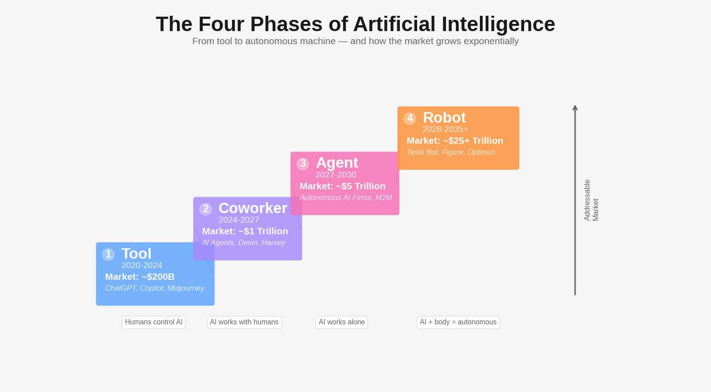

*Abbildung 4: Die vier Phasen der KI - vom Werkzeug zur autonomen Maschine*

Wir befinden uns gerade am Übergang von Phase zwei zu Phase drei. Das ist der Moment, in dem die meisten Menschen die Bedeutung dessen, was passiert, noch unterschätzen. In fünf Jahren werden sie es nicht mehr tun.

---

> *Phase 1: KI als Werkzeug (2020-2023)*
> *Am 30. November 2022 veröffentlichte OpenAI ChatGPT. Innerhalb von fünf Tagen hatte die Anwendung eine Million Nutzer. Innerhalb von zwei Monaten hundert Millionen. Kein Produkt in der Geschichte der Technologie hatte diese Schwelle je schneller erreicht, nicht das iPhone, nicht Instagram.*
> *Aber die Geschwindigkeit der Adoption verschleierte die Begrenztheit des Werkzeugs. In Phase 1 war KI im Wesentlichen ein besserer Suchschlitz. Man stellte eine Frage und bekam eine Antwort, gab einen Auftrag und bekam ein Ergebnis, "Schreib mir eine E-Mail", "Fasse diesen Text zusammen", "Generiere ein Bild von einem Astronauten auf einem Pferd."*
> *Mächtig? Ja. Aber passiv. Der Mensch blieb in jedem Moment der Akteur. Er formulierte die Frage, bewertete die Antwort, entschied über die nächsten Schritte. Die KI war ein Instrument, ein außergewöhnlich vielseitiges, aber eines, das ohne den Menschen nutzlos auf dem Tisch lag.*
> *Das erklärt, warum viele kluge Menschen die KI-Revolution anfangs unterschätzt haben. Sie sahen ein besseres Google, eine aufgehübschte Suchmaschine, einen Partytrick, der beeindruckende Texte produzierte, aber bei Mathematik scheiterte und sich Fakten ausdachte. Sie hatten nicht ganz unrecht, für Phase 1. Was sie nicht sahen, war die Geschwindigkeit, mit der die nächsten Phasen folgen würden.*
> *Die Fehler von ChatGPT 3.5 im Jahr 2022, die Halluzinationen, die Rechenfehler, die faktischen Irrtümer, sind nicht das Endstadium der Technologie, sondern Kinderkrankheiten. Als das erste Auto langsamer fuhr als ein Pferd, haben manche daraus geschlossen, dass Autos keine Zukunft hätten. Sie verwechselten den Prototypen mit dem Produkt.*

---

### Phase 2: KI als Mitarbeiter (2024-2025)

Hier befinden wir uns jetzt, und der Unterschied zu Phase 1 ist nicht graduell - er ist qualitativ.

KI-Systeme werden in Arbeitsabläufe integriert. Sie sind nicht mehr Werkzeuge, die man bei Bedarf aus der Schublade holt. Sie sind Mitarbeiter, die permanent neben einem sitzen, oder, zunehmend, die Arbeit selbst erledigen.

GitHub Copilot, Microsofts KI-Programmierassistent, schreibt mittlerweile über 40 Prozent des gesamten neuen Codes auf der Plattform. Nicht als Vorschlag, den ein Programmierer dann anpasst, sondern als fertigen, funktionierenden Code, der direkt übernommen wird. Vierzig Prozent. Ein einzelnes KI-System hat die Produktivität von Millionen von Softwareentwicklern um fast die Hälfte gesteigert, in weniger als zwei Jahren seit seiner Einführung.

KI-gestützte Rechtsanalyse-Tools bewältigen in Minuten, wofür Junior-Anwälte Wochen brauchten. Due-Diligence-Prüfungen, die früher Teams von Anwälten über Monate beschäftigten, werden jetzt in Stunden durchgeführt, gründlicher, konsistenter und zu einem Bruchteil der Kosten.

In der Medizin diagnostizieren KI-Systeme bestimmte Krebsarten mit höherer Genauigkeit als erfahrene Radiologen. Google DeepMinds AlphaFold hat die dreidimensionale Struktur von über 200 Millionen Proteinen vorhergesagt, ein Problem, an dem die Biologie jahrzehntelang gearbeitet hatte.

McKinsey schätzt das jährliche Wertschöpfungspotenzial generativer KI auf 2,6 bis 4,4 Billionen Dollar. Billionen. Mit B. Zum Vergleich: Das gesamte BIP Deutschlands beträgt etwa 4,5 Billionen Dollar.

Die Produktivitätsgewinne sind real und messbar. Aber sie haben eine Eigenschaft, die viele Menschen lieber nicht sehen wollen: Sie ersetzen menschliche Arbeitsstunden. Wenn ein KI-System die Arbeit von drei Junior-Anwälten in einer Stunde erledigt, braucht die Kanzlei keine drei Junior-Anwälte mehr. Wenn GitHub Copilot 40 Prozent des Codes schreibt, braucht das Entwicklerteam perspektivisch weniger Entwickler, oder dieselbe Anzahl schafft deutlich mehr Output, was in einem wettbewerbsintensiven Markt auf dasselbe hinausläuft.

Phase 2 ist die Phase, in der KI aufhört, beeindruckend zu sein, und anfängt, bedrohlich zu sein. Nicht für alle. Für die, die KI nutzen, ist sie ein Produktivitätsmultiplikator. Aber für die, die sie ignorieren oder deren Arbeit von ihr ersetzt wird, beginnt das Beben.

---

> *Phase 3: KI als autonomer Agent (2025-2028)*
> *Das ist der Paradigmenwechsel. Und die Phase, die die meisten Menschen noch nicht einmal auf dem Radar haben.*
> *Ein Agent ist kein Chatbot. Ein Chatbot antwortet auf Fragen. Ein Agent handelt. Er hat Ziele, plant Schritte, nutzt Werkzeuge, beobachtet Ergebnisse, korrigiert Fehler und verfolgt seinen Auftrag bis zum Abschluss, ohne dass ein Mensch jeden Schritt absegnen muss.*
> *Der Unterschied lässt sich so veranschaulichen: In Phase 2 sagen Sie Ihrem KI-Assistenten: "Schreib mir eine E-Mail an den Lieferanten, dass wir die Bestellung ändern wollen." Die KI schreibt die E-Mail. Sie lesen sie, korrigieren eine Formulierung, klicken auf Senden.*
> *In Phase 3 sagen Sie: "Verhandle mit unserem Lieferanten bessere Konditionen für Q3. Unser Budget ist X, unsere Schmerzgrenze ist Y, und wir brauchen Lieferung bis September." Der Agent schickt E-Mails, analysiert die Antworten, macht Gegenangebote, vergleicht alternative Lieferanten, erstellt eine Empfehlung mit Begründung und schließt, je nach Befugnis, den Vertrag ab. Er tut das nicht in einer einzelnen Aktion, sondern über Tage und Wochen, während Sie sich um andere Dinge kümmern.*
> *Anthropic, OpenAI und Google DeepMind arbeiten an genau diesen Fähigkeiten. Anthropic hat mit Claude die Fähigkeit demonstriert, einen Computer autonom zu bedienen: Programme öffnen, Formulare ausfüllen, im Internet recherchieren, Ergebnisse in Dateien speichern. OpenAI hat mit "Deep Research"-Agenten gezeigt, dass KI-Systeme mehrstündige Rechercheaufgaben eigenständig durchführen können, mit einer Qualität, die erfahrene Analysten beeindruckt.*
> *Wenn Phase 2 die KI zum Mitarbeiter machte, macht Phase 3 sie zum Projektleiter. Zum Sachbearbeiter, der seinen gesamten Vorgang eigenständig bearbeitet. Zum Einkäufer, der selbstständig Lieferanten bewertet und Verträge vorbereitet.*
> *Die wirtschaftlichen Implikationen sind enorm. In Phase 2 steigert KI die Produktivität einzelner Mitarbeiter. In Phase 3 ersetzt sie ganze Arbeitsprozesse. Nicht den einzelnen Schritt, den gesamten Workflow. Das betrifft nicht mehr nur Routinearbeit. Es betrifft qualifizierte, gut bezahlte Wissensarbeit: Unternehmensberatung, Finanzanalyse, Rechtsberatung, Softwareentwicklung, Projektmanagement.*
> *Und es kommt schneller als die meisten glauben. Die Entwicklungszyklen in der KI-Forschung betragen nicht mehr Jahrzehnte, sondern Monate. Was jetzt als Forschungsprototyp existiert, ist in 12 bis 18 Monaten ein kommerzielles Produkt. Was heute ein kommerzielles Produkt ist, ist in 24 Monaten Standard. Wer baut das alles?*

---

### Die Landschaft der KI-Labore

An dieser Stelle lohnt sich ein Überblick darüber, wer die Maschinen baut, die gerade lernen zu denken. Denn die Antwort auf diese Frage bestimmt, wohin die Reise geht und wo das Geld hinfließt.

Es gibt im Frühjahr 2026 sechs Organisationen, die Foundation-Modelle bauen, also die großen Sprachmodelle, die alles antreiben, was wir in den Phasen 1 bis 3 beschrieben haben. Dahinter stehen vier Tech-Giganten, die die Infrastruktur besitzen. Und dann gibt es NVIDIA, das alle mit Chips versorgt.

OpenAI hat den Markt mit ChatGPT eröffnet und dominiert ihn immer noch. GPT-5, im August 2025 veröffentlicht, und seine Nachfolger werden von 800 Millionen Nutzern weltweit verwendet. Sam Altman spricht offen von "persönlicher Superintelligenz", die sein Unternehmen bauen will, und hat dafür über 40 Milliarden Dollar an Investorengeldern eingesammelt. Die geplante Bewertung beim Börsengang: eine Billion Dollar. OpenAI verbrennt dabei rund 9 Milliarden Dollar pro Jahr und plant, 2026 sogar 14 Milliarden zu verlieren. Die Wette ist einfach: Wenn Altman Recht hat und Superintelligenz in "ein paar tausend Tagen" kommt, ist jeder investierte Dollar ein Schnäppchen. Wenn nicht, hat SoftBank ein Problem.

Anthropic ist die Gegenstimme. Gegründet von ehemaligen OpenAI-Forschern, die fanden, dass Sicherheit dort zu kurz kam. Dario Amodei, der CEO, hat im Januar 2026 einen Essay veröffentlicht, in dem er warnt: "Die Kombination aus Intelligenz, Handlungsfähigkeit und schlechter Kontrollierbarkeit ist ein Rezept für existenzielle Gefahr." Gleichzeitig hat sein Unternehmen gerade 30 Milliarden Dollar in einer Finanzierungsrunde eingesammelt, bei einer Bewertung von 380 Milliarden. Anthropic ist das Unternehmen, das am lautesten vor den Gefahren warnt und gleichzeitig am schnellsten wächst. Das ist entweder ein Widerspruch oder genau der richtige Ansatz.

Google DeepMind ist das einzige KI-Labor, das einen Nobelpreis hat. Demis Hassabis und John Jumper gewannen ihn 2024 für AlphaFold, das die dreidimensionale Struktur von 200 Millionen Proteinen vorhergesagt hat, ein Problem, an dem die Biologie Jahrzehnte gearbeitet hatte. Google hat außerdem Waymo, das mit autonomen Taxis bereits 350 Millionen Dollar Umsatz macht und auf eine Bewertung von 126 Milliarden Dollar kommt. Und mit "Gemini Robotics" baut Google Modelle, die Roboter in der physischen Welt steuern. Grundlagenforschung, die Nobelpreise gewinnt, und kommerzielle Produkte, die autonom fahren.

Dann Meta. Mark Zuckerberg verfolgt die kapitalintensivste Strategie von allen: 72 Milliarden Dollar hat Meta 2025 in KI-Infrastruktur investiert, 2026 sollen es 135 Milliarden werden. In einem einzigen Jahr. Dafür bekommt Meta Rechenzentren mit über einer Million GPUs. Und Zuckerberg gibt das beste Modell umsonst ab. Die Llama-Modelle sind Open Source, jeder kann sie herunterladen und nutzen. Warum? Weil Zuckerberg verstanden hat, was Google mit Android bewiesen hat: Wenn das eigene Modell der Standard wird, kontrolliert man das Ökosystem, auch wenn man das Modell verschenkt.

Elon Musks xAI ist der am schnellsten skalierende Player. In weniger als zwei Jahren hat Musk 555.000 GPUs in einem einzigen Rechenzentrum in Memphis installiert, 18 Milliarden Dollar investiert und xAI dann mit SpaceX fusioniert. Grok, das Sprachmodell, ist tief in die X-Plattform integriert und erreicht damit gemeinsam mit der X-Plattform 600 Millionen monatlich aktive Nutzer. Die Pentagon-Partnerschaft, bei der Grok in die Netzwerke des Verteidigungsministeriums integriert wird, zeigt die Ambitionen. Ob Musks Versprechen, AGI bis 2026 zu erreichen, realistisch ist, sei dahingestellt. Aber die Infrastruktur, die er aufbaut, ist real.

Apple geht einen komplett anderen Weg. Statt Hunderte Milliarden in KI-Training zu verbrennen, setzt Apple auf Partnerschaften, aktuell mit Google Gemini für eine Milliarde Dollar pro Jahr, und verarbeitet alles Sensible auf dem Gerät. Privacy First. Die über 2,35 Milliarden aktiven Apple-Geräte weltweit sind ein Distributionsvorteil, den kein anderer Player hat. Apple baut keine Foundation-Modelle, aber Apple kontrolliert die Geräte, auf denen alle anderen Modelle laufen. Das ist eine andere Art von Burggraben.

Microsoft hat 13,75 Milliarden in OpenAI investiert und 27 Prozent des Unternehmens erhalten. Gleichzeitig integriert Satya Nadella KI in alles: Windows, Office, GitHub, Azure. GitHub Copilot, der KI-Programmierassistent, der mittlerweile fast die Hälfte des neuen Codes auf der Plattform generiert, das haben wir schon besprochen. Aber Microsoft hedgt auch: In Azure laufen mittlerweile Modelle von Anthropic, Meta, xAI und DeepSeek neben OpenAI. Nadella will nicht von einem einzelnen Modell abhängig sein.

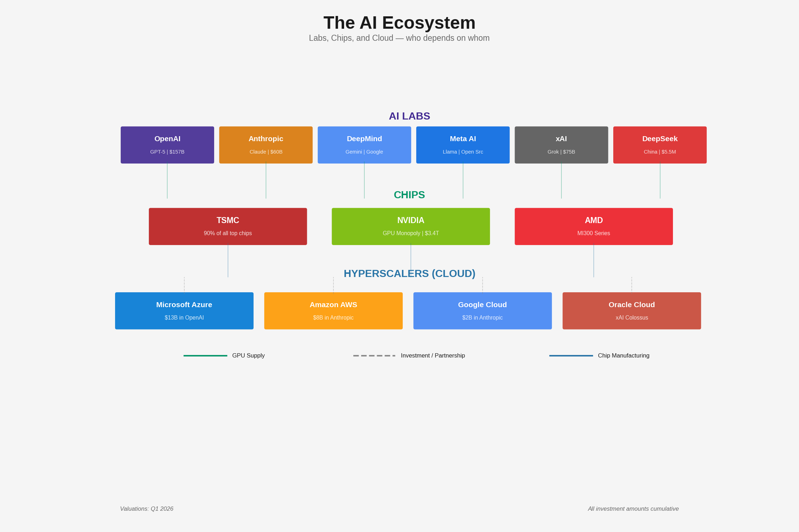

*Abbildung 5: Das KI-Ökosystem - Labore, Hyperscaler und ihre Verflechtungen*

Amazon schließlich kontrolliert mit AWS die größte Cloud-Infrastruktur der Welt und hat 8 Milliarden in Anthropic investiert. Das Besondere: Amazon baut eigene KI-Chips, die Trainium-Serie, und Anthropic ist der größte Nutzer. Damit reduziert Amazon seine Abhängigkeit von NVIDIA, das bei Trainingschips über 80 Prozent Marktanteil hat.

Die Gesamtinvestitionen dieser Unternehmen in KI-Infrastruktur übersteigen 2025 eine halbe Billion Dollar. Jensen Huang, der CEO von NVIDIA, schätzt, dass sie bis 2028 über eine Billion Dollar erreichen werden. Das sind keine Summen, die ein einzelnes Unternehmen oder eine einzelne Regierung aufbringen kann. Das ist eine Industrie, die sich selbst baut.

Was für die These dieses Buches zählt: Keiner dieser Player versucht nur, ein besseres Sprachmodell zu bauen. Sie bauen alle gleichzeitig an autonomen Agenten (Phase 3) und physischer KI (Phase 4). OpenAI investiert in Robotik. Google baut Gemini Robotics. NVIDIA entwickelt Foundation-Modelle für humanoide Roboter. Meta gießt 135 Milliarden Dollar in Infrastruktur, die beides antreibt. Die Konvergenz ist nicht meine Erfindung. Sie ist die erklärte Strategie der mächtigsten Unternehmen der Welt.

Die konkreten Robotik-Player, von Tesla über Boston Dynamics bis zu chinesischen Herausforderern wie Unitree, beschreibe ich im folgenden Abschnitt zu Phase 4. Hier ist der entscheidende Punkt: Die KI-Labore und Tech-Giganten investieren nicht nur in Software. Sie investieren in die physische Welt.

---

> *Phase 4: Verkörperte KI - Roboter (2026-2035)*
> *Und dann bekommt die Intelligenz einen Körper.*
> *Bisher haben wir über KI gesprochen, die in der digitalen Welt existiert, Software, die Texte schreibt, Code generiert, Daten analysiert. Aber die physische Welt, Fabriken, Lagerhäuser, Baustellen, Krankenhäuser, Felder, Straßen, ist bisher weitgehend unangetastet. Das ändert sich.*
> *Tesla hat seinen humanoiden Roboter Optimus vorgestellt und plant die Produktion in größeren Stückzahlen ab 2026. In Teslas eigenen Fabriken arbeiten über tausend Prototypen an Aufgaben: Teile sortieren, Gegenstände transportieren. Musk hat im Januar 2026 allerdings eingeräumt, dass "keiner der Optimus-Roboter nützliche Arbeit verrichtet". Das ist typisch Musk: Die Vision ist groß, die Realität hinkt hinterher, und trotzdem wäre es ein Fehler, die Ambition abzuschreiben. Dass Tesla die Produktion von Model S und Model X einstellt, um die Fabrik in Fremont auf Optimus-Produktion umzurüsten, zeigt, wie ernst es ihm ist. Wenn ein humanoider Roboter für 20.000 bis 30.000 Dollar die Arbeit eines Menschen erledigt, der 40.000 bis 60.000 Dollar pro Jahr kostet, amortisiert sich die Investition in weniger als einem Jahr. Und der Roboter arbeitet rund um die Uhr, wird nicht krank, streikt nicht und wird mit jedem Software-Update besser.*
> *Aber Tesla ist nicht allein, und das ist die eigentliche Nachricht.*
> *Boston Dynamics, seit 2020 im Besitz von Hyundai, hat auf der CES im Januar 2026 den neuen elektrischen Atlas vorgestellt. Nicht mehr den hydraulischen Parkour-Roboter aus den viralen Videos, sondern eine industrietaugliche Maschine, die in Hyundais Automobilwerk in Georgia bereits arbeitet. Alle Produktionsslots für 2026 sind ausgebucht. Hyundai plant, zehntausende Atlas-Einheiten in seinen Werken weltweit einzusetzen. Die KI dafür kommt von Google DeepMind, das ebenfalls Atlas-Flotten für sein Robotik-Labor bezieht. Googles Gehirn plus Hyundais Produktionskapazität, diese Kombination sollte man nicht unterschätzen.*
> *Figure AI hat mit dem Figure 02 etwas geschafft, das kein anderes Robotik-Startup vorweisen kann: eine 20-Stunden-Schicht in einer BMW-Fabrik. Keine Demo, keine kontrollierte Umgebung, sondern reale Arbeit an einer Produktionslinie, Blechteile einsetzen, eine Aufgabe, die Fingerspitzengefühl verlangt. Das Unternehmen wurde vor zwei Jahren gegründet und ist heute 39 Milliarden Dollar wert. Die Investorenliste: Jeff Bezos, NVIDIA, Microsoft, OpenAI.*
> *1X Technologies aus Norwegen hat mit dem NEO den ersten humanoiden Roboter für Konsumenten auf den Markt gebracht: 20.000 Dollar oder 499 Dollar im Monat als Abo. Die Vorbestellungen laufen, Auslieferung 2026. EQT, einer der größten Private-Equity-Fonds Europas, hat einen Deal über bis zu 10.000 Einheiten unterschrieben. Das ist keine Forschung mehr. Das ist ein Geschäft.*
> *Und dann Unitree aus China. Humanoide Roboter für einen Bruchteil des westlichen Preises. Es ist das gleiche Muster wie bei BYD gegen Tesla, bei DJI gegen westliche Drohnenhersteller: China nimmt eine Technologie und skaliert sie schneller und billiger. Wer glaubt, dass der Robotik-Markt ein rein amerikanisches Spiel wird, hat aus dem Smartphone-Markt nichts gelernt.*
> *Aber der eigentliche Durchbruch in der Robotik ist nicht die Hardware. Es ist, wie Roboter lernen.*
> *Menschen lernen einzeln. Wenn ich Klavier übe, werden Sie dadurch nicht besser. Wenn Sie eine neue Sprache lernen, bleibt mir dieses Wissen verschlossen. Unser Wissen ist gefangen in unseren individuellen Gehirnen, und wir können es nur unvollkommen durch Sprache und Demonstration weitergeben.*
> *Roboter lernen als Netzwerk. Das Prinzip heißt Distributed Reinforcement Learning: Einer lernt Kung Fu, alle lernen Kung Fu.*
> *Jeder einzelne Roboter in einer Flotte sammelt Erfahrungen. Er versucht etwas, scheitert, passt an, versucht wieder. Diese Erfahrungen fließen in ein zentrales Modell. Das Modell wird besser. Und dann wird das verbesserte Modell an alle Roboter zurückgespielt. Über Nacht. Ohne dass ein Mensch irgendetwas tun muss.*
> *Das erklärt, warum die Unitree-Roboter innerhalb eines Jahres so dramatisch besser geworden sind. Der Unitree von 2024 ist ein unbeholfener Prototyp, der Treppen stolpert. Der Unitree von 2026 macht Kampfsport-Bewegungen, die professionelle Martial-Arts-Kämpfer beeindrucken würden. Die Hardware ist identisch. Dasselbe Chassis, dieselben Motoren, dieselben Sensoren. Der einzige Unterschied ist die Software, das Modell, das durch verteiltes Lernen trainiert wurde.*
> *Das führt zu etwas, das Ökonomen Economies of Scope nennen, im Gegensatz zu den bekannten Economies of Scale. Bei Scale geht es darum, dasselbe billiger zu machen. Bei Scope geht es darum, einmal zu trainieren und alles zu können. Derselbe Roboter, mit demselben Körper und derselben KI, kann theoretisch Wäsche falten oder eine Herzoperation durchführen. Die Fähigkeit liegt nicht in der spezialisierten Hardware. Sie liegt im trainierten Modell.*
> *Einmal trainieren, alles können. Einmal ausliefern, alles erledigen.*
> *Wir haben noch nie ein Werkzeug gesehen, das so vielseitig ist. Menschen waren das nächstbeste Beispiel.*
> *Was bedeutet das für den Zeitplan? Die Begrenzung liegt nicht mehr bei der Intelligenz. Die Roboter sind jetzt oder werden bald intelligent genug sein, um die meisten physischen Aufgaben zu erledigen. Die Begrenzung liegt bei der Supply Chain. Wie schnell können wir Roboterkörper bauen? 70 Millionen Autos werden pro Jahr produziert. 70 Millionen Motorräder. Humanoide Roboter liegen irgendwo dazwischen in der Komplexität. Die Supply Chain aufzubauen, dauert drei bis fünf Jahre. Das ist der wahre Bottleneck. Nicht die Intelligenz, die Produktion.*
> *Aber sobald die Produktionskapazität steht, kostet ein Optimus-Level-Roboter weniger als einen Dollar pro Stunde im Betrieb. Was macht das mit einer Wirtschaft, in der menschliche Arbeit 20 bis 50 Dollar pro Stunde kostet?*
> *NVIDIA verdient besondere Erwähnung, nicht als Robotik-Hersteller, sondern als Plattform-Anbieter. Mit GR00T hat NVIDIA das erste Open-Source Foundation-Modell für humanoide Roboter veröffentlicht. Mit Cosmos "World Foundation Models", die die physische Welt simulieren. Mit Omniverse Digital Twins, in denen Roboter virtuell trainieren. Jensen Huang will das "Android der Robotik" bauen: Die Roboter kommen von Tesla, Boston Dynamics, Figure oder Unitree. Aber die Software kommt von NVIDIA.*
> *Goldman Sachs prognostiziert den Markt für humanoide Roboter bis 2035 auf 38 Milliarden Dollar. Das klingt viel, aber es ist konservativ. Wenn humanoide Roboter tatsächlich menschliche Arbeit in Fabriken, Logistik, Pflege und Bauwesen ersetzen können, dann ist der adressierbare Markt nicht 38 Milliarden. Er ist die gesamte globale Lohnarbeit, ein Markt von Dutzenden von Billionen Dollar jährlich.*

---

::: {.infobox}
### DeepSeek und das Ende des Compute-Monopols

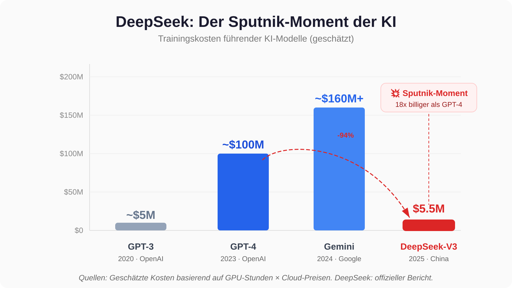

*Abbildung 6: DeepSeek - Der Sputnik-Moment der KI (Trainingskosten im Vergleich)*

Im Januar 2025 passierte etwas, das die gesamte KI-Branche erschütterte. Und es kam nicht aus San Francisco.

DeepSeek, ein chinesisches KI-Labor, veröffentlichte ein Open-Source-Sprachmodell, das in vielen Benchmarks mit den besten Modellen von OpenAI und Google konkurrierte, trainiert zu einem Bruchteil der Kosten. Während OpenAI Hunderte von Millionen Dollar für das Training eines einzelnen Modells ausgibt und dafür Zehntausende der teuersten NVIDIA-Chips benötigt, zeigte DeepSeek, dass man mit cleverer Architektur und weniger Hardware vergleichbare Ergebnisse erzielen kann.

Die Implikation war tiefgreifend, weniger, weil DeepSeek das "bessere" Modell war, in vielen Bereichen war es das nicht, sondern weil es eine Grundannahme der Branche in Frage stellte: die Annahme, dass KI-Fortschritt primär eine Funktion von Rechenleistung ist. Mehr GPUs gleich bessere Modelle. Diese Gleichung, die NVIDIA zum wertvollsten Unternehmen der Welt gemacht hatte, war plötzlich nicht mehr so eindeutig.

DeepSeek bewies mehrere Dinge gleichzeitig.

US-Exportkontrollen auf Hochleistungschips stoppen die chinesische KI-Forschung nicht, sie zwingen sie, effizienter zu werden. Die Restriktionen haben die Chinesen gezwungen, Modelle zu entwickeln, die mit weniger Rechenleistung mehr leisten. Ökonomen nennen das induced innovation: Knappheit erzwingt Kreativität.

Gleichzeitig zeigte DeepSeek, dass Open Source in der KI nicht tot ist. Meta hatte mit LLaMA bereits bewiesen, dass offene Modelle mit geschlossenen konkurrieren können. DeepSeek bestätigte das mit Nachdruck. Wenn die besten Modelle kostenlos verfügbar sind, können OpenAI und Anthropic keine Monopolpreise für den Zugang verlangen. Der Wert verschiebt sich von den Modellen selbst zur Infrastruktur, den Anwendungen und den Daten, die auf ihnen aufbauen.

Die wichtigste Lektion für Investoren aber ist: Der KI-Markt wird nicht ein Winner-takes-all-Markt sein. Es wird ein Ökosystem, ähnlich wie das Internet, das nicht von einer einzelnen Firma kontrolliert wird, sondern von einem Netz aus Infrastruktur-Anbietern, Plattformen und Anwendungen.

Für Gründer ist das die wichtigste Nachricht seit dem Aufstieg von Cloud Computing. Ein Berliner Startup mit zehn Ingenieuren kann heute ein Open-Source-Modell nehmen, es auf seine Branche feintunen und damit ein Produkt bauen, das vor drei Jahren nur Google oder OpenAI hätten entwickeln können. Die Eintrittsbarriere in den KI-Markt ist von Hunderten Millionen Dollar auf die Kosten eines kleinen Entwicklerteams plus Cloud-Budget gesunken. Das verändert die Startup-Landschaft stärker als jeder Venture-Capital-Trend der letzten Dekade.

Der DeepSeek-Moment war für die KI-Branche das, was der Sputnik-Schock 1957 für die Raumfahrt war: ein Weckruf.
:::

---

> *Die Kurzweil-Spirale*
> *Ray Kurzweil hat diese exponentielle Entwicklung vor Jahrzehnten vorhergesagt. In "The Singularity Is Near" beschrieb er das Gesetz des sich beschleunigenden Ertrags: Technologischer Fortschritt beschleunigt sich, weil jede Generation von Technologie die Werkzeuge liefert, um die nächste schneller zu entwickeln.*
> *KI beschleunigt die Chip-Entwicklung. Bessere Chips beschleunigen die KI. Schnellere KI beschleunigt die Robotik. Bessere Roboter bauen bessere Chips. Es ist eine Spirale, und sie dreht sich immer schneller.*
> *Das Problem ist, dass das menschliche Gehirn nicht für exponentielles Denken gebaut ist. Wir denken linear. Wenn etwas um 10 Prozent pro Jahr wächst, schätzen wir intuitiv, dass es in 10 Jahren etwa doppelt so groß sein wird. In Wirklichkeit ist es 2,6-mal so groß. Bei 20 Prozent jährlichem Wachstum erwarten wir intuitiv eine Verdreifachung in 10 Jahren. In Wirklichkeit ist es eine Versechsfachung. Und bei den Wachstumsraten, die wir in der KI sehen, Leistungsverdopplungen alle 12 bis 18 Monate, sind die Zahlen nach einem Jahrzehnt so groß, dass sie sich dem intuitiven Verständnis entziehen.*
> *Ein Beispiel: Wenn sich die Leistung eines KI-Systems alle 18 Monate verdoppelt, dann ist es in 10 Jahren nicht 10-mal besser, sondern etwa 100-mal. In 15 Jahren über 1.000-mal. In 20 Jahren über 10.000-mal. Diese Zahlen klingen absurd, bis man sich daran erinnert, dass ein Smartphone von heute die Rechenleistung eines Supercomputers von 1990 hat. Das war genau dieser exponentielle Pfad, über genau diesen Zeitraum.*
> *Kurzweil hat für 2029 vorhergesagt, dass KI menschliches Niveau erreicht. Ob er recht hat, wissen wir in drei Jahren. Aber selbst wenn er um fünf oder zehn Jahre daneben liegt, ändert das nichts am Gesamtbild. Die Richtung ist klar. Die Beschleunigung ist messbar.*
> *Für Skeptiker: Ja, exponentielle Kurven flachen sich irgendwann ab. Jede S-Kurve hat ein Plateau. Aber die Geschichte der Technologie zeigt, dass das Plateau einer Technologie typischerweise der Startpunkt der nächsten ist. Vakuumröhren erreichten ihr Plateau, Transistoren übernahmen. Kurzweil argumentiert, dass es nicht eine einzelne exponentielle Kurve gibt, sondern eine Kaskade von S-Kurven, die zusammen einen exponentiellen Trend ergeben. Die bisherigen Daten stützen das.*

---

### Jede Phase vergrößert den Markt um eine Größenordnung

Die Dimensionen, quantifiziert, weil sie für die Investmentthese zentral sind:

Phase 1 betraf Softwareentwickler und Early Adopter; der adressierbare Markt umfasste einige Milliarden Dollar jährlich für KI-Tools und -Dienste.

Phase 2 betrifft Wissensarbeiter und Unternehmen. Der adressierbare Markt: Hunderte von Milliarden Dollar jährlich. Diese Schätzungen beziehen sich auf genau diese Phase. Jedes Unternehmen mit Büroarbeitsplätzen, von der Anwaltskanzlei bis zum DAX-Konzern.

Phase 3 betrifft die gesamte Dienstleistungswirtschaft. Wenn KI-Agenten ganze Arbeitsprozesse autonom ausführen können, betrifft das Beratung, Finanzdienstleistungen, Verwaltung, Gesundheitswesen, Bildung, Logistik. Der adressierbare Markt: Billionen Dollar jährlich. Dienstleistungen machen in entwickelten Ländern über 70 Prozent des BIP aus.

Phase 4 betrifft die physische Welt: Fabriken, Logistik, Pflege, Landwirtschaft, Bauwesen. Hier geht es nicht mehr um Büroarbeit, sondern um die gesamte physische Wertschöpfung der Menschheit. Die globale Wirtschaftsleistung beträgt etwa 100 Billionen Dollar. Robotik in Kombination mit KI adressiert einen substanziellen Anteil davon.

Das Muster ist klar: Mit jeder Phase wächst der adressierbare Markt um ungefähr eine Größenordnung. Und mit jeder Phase wächst die Dringlichkeit, auf der richtigen Seite dieser Veränderung zu stehen.

> **📌 Auf einen Blick:**
>
> ◆ Vier Phasen: Werkzeug → Mitarbeiter → Agent → Roboter.
> ◆ Jede Phase vergrößert den adressierbaren Markt um eine Größenordnung.
> ◆ Null-Marginalkosten und exponentielles Lernen schaffen disruptive Kostenvorteile.

## Kapitel 3: Warum Maschinen Krypto brauchen

"Geld ist nur ein Werkzeug. Es bringt dich überall hin, aber es ersetzt dich nicht als Fahrer."

- Ayn Rand

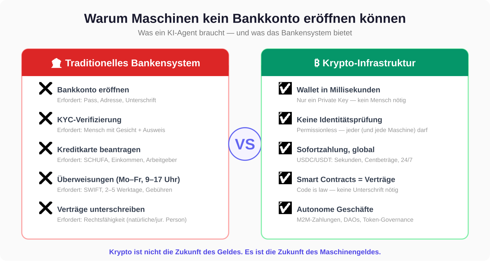

*Abbildung 7: Warum Maschinen kein Bankkonto eröffnen können*

Hier wird es interessant. Und hier liegt die These, die die meisten Investoren noch nicht verstanden haben.

In den ersten beiden Kapiteln haben wir gesehen, wie KI von einem Werkzeug über einen Mitarbeiter zum autonomen Agenten wird und schließlich einen physischen Körper bekommt. Aber eine Frage haben wir noch nicht beantwortet: Wenn diese Maschinen autonom handeln, Verträge abschließen, Dienstleistungen einkaufen, Ressourcen allokieren, wie bezahlen sie?

Die Antwort auf diese Frage ist der Kern dessen, was dieses Buch von jedem anderen KI-Buch unterscheidet.

Bevor wir in die Theorie einsteigen, eine Geschichte, die mir während des Schreibens dieses Buches passiert ist.

Ich brauchte eine Domain für das Begleitprojekt zum Buch. Jeannie, meine KI-Agentin, hat verfügbare Domains recherchiert und TheAiSpecies.world vorgeschlagen. Gut, dachte ich, dann registriere sie auch gleich. Jeannie hat Zugriff auf meinen Cloudflare-Account, eine API-Key mit vollen Rechten, eine hinterlegte Kreditkarte. Sie kann DNS-Einträge anlegen, Weiterleitungen konfigurieren, SSL-Zertifikate einrichten. Sie kann alles tun, was man mit einer Domain tun kann.

Nur kaufen kann sie keine.

Die Cloudflare-API erlaubt Domain-Registrierungen schlicht nicht über die Schnittstelle, die Maschinen nutzen. Der Kauf läuft über ein Web-Interface, das eine menschliche Session voraussetzt. Jeannie hat es versucht, ist gescheitert, und ich musste die drei Klicks am Ende selbst machen.

Das war ärgerlich. Aber es war auch ein Aha-Moment. Hier war ein Agent, der alles konnte außer zu bezahlen. Nicht weil das Geld fehlte, nicht weil die Berechtigung fehlte, sondern weil das System, in dem das Geld fließt, für Menschen gebaut ist. Für Finger auf Bildschirmen. Für Augen, die CAPTCHAs lösen. Für Gehirne, die Cookie-Banner wegklicken.

Genau das ist das Problem, das dieses Kapitel beschreibt.

---

::: {.infobox}
### Das Gedankenexperiment: Ein KI-Agent braucht ein Bankkonto

Denken wir das konkret durch.

Ein KI-Agent, der für ein mittelständisches Unternehmen arbeitet, soll folgende Aufgabe erledigen: einen Cloud-Server mieten, um zusätzliche Rechenkapazität für ein laufendes Projekt bereitzustellen. Dann einen spezialisierten Datenanalyse-Dienst beauftragen, der bestimmte Marktdaten aufbereitet. Und schließlich eine API-Lizenz erwerben, um auf eine externe Wissensdatenbank zuzugreifen. Drei alltägliche Geschäftsvorgänge, die ein menschlicher Mitarbeiter in einer Stunde erledigen könnte.

Jetzt stellen Sie sich vor, der KI-Agent versucht das im heutigen Finanzsystem.

Für den Cloud-Server braucht er eine Kreditkarte, für die Kreditkarte ein Bankkonto, für das Bankkonto eine juristische oder natürliche Person als Kontoinhaber, und für die Kontoeröffnung KYC-Dokumentation. Identitätsprüfung, Adressnachweis, Geschäftszweck-Erklärung. Dazu kommen Öffnungszeiten, Überweisungsdauern von einem bis drei Bankarbeitstagen, Gebühren und die jederzeitige Möglichkeit der Bank, die Transaktion abzulehnen, zu verzögern oder einzufrieren.

Das System wurde für Menschen gebaut, mit menschlicher Identität, menschlichen Dokumenten, menschlichen Unterschriften und menschlichen Geschäftszeiten. Eine Maschine passt nicht hinein. Nicht weil die Technologie fehlt, sondern weil die institutionelle Architektur des Finanzsystems auf der Grundannahme aufgebaut ist, dass wirtschaftliche Akteure Menschen sind.

Diese Grundannahme war in den letzten 500 Jahren des modernen Bankwesens korrekt. In den nächsten 10 Jahren wird sie obsolet.
:::

---

### Krypto als nativer Zahlungskanal für Maschinen

Kryptowährungen lösen dieses Problem. Nicht als ideologisches Statement gegen das Bankensystem, sondern als technische Notwendigkeit.

Ein KI-Agent braucht nur einen privaten Schlüssel, um Transaktionen zu signieren. Man kann sich diesen Schlüssel wie ein Passwort vorstellen, das gleichzeitig als Konto, Unterschrift und Ausweis dient. Keine Bank, keine Identitätsprüfung, keine Öffnungszeiten, diese eine Zeichenkette reicht aus, um jederzeit, an jeden anderen Schlüssel auf der Welt, in Sekunden Werte zu senden und zu empfangen.

Krypto ist nicht "digitales Geld für Technik-Enthusiasten." Es ist die einzige existierende Infrastruktur, die für maschinelle Wirtschaftsteilnehmer gebaut ist. Oder zumindest so gebaut, dass Maschinen sie nutzen können, ohne dass ein Mensch als Vermittler dazwischensteht.

Balaji Srinivasan, der ehemalige CTO von Coinbase, hat dieses Konzept in seinem Denken über den "Network State" und die Zukunft des Geldes vorweggenommen. Er argumentiert, dass die nächste Milliarde "Nutzer" im Krypto-Ökosystem keine Menschen sein werden, sondern Maschinen. KI-Agenten, IoT-Geräte, autonome Fahrzeuge, Roboter. Sie alle werden Transaktionen durchführen müssen. Und sie alle werden ein Zahlungsmittel brauchen, das nativ digital, permissionless und programmierbar ist.

Permissionless, erlaubnisfrei, ist das Schlüsselwort. Im traditionellen Finanzsystem funktioniert jede Transaktion wie ein Türsteher-System: Jeder Teilnehmer braucht die Erlaubnis einer Institution, einer Bank, einer Aufsichtsbehörde, eines Kreditkartenunternehmens. Im Krypto-System gibt es keinen Türsteher. Ein KI-Agent kann ein Wallet erstellen und innerhalb von Millisekunden wirtschaftlich handeln. Keine Wartezeit. Kein Antrag. Kein Mensch, der "genehmigen" klickt.

> Das ist nicht Anarchie. Es ist Effizienz. Und in einer Welt, in der Milliarden von Maschinen Milliarden von Transaktionen pro Tag durchführen müssen, ist diese Effizienz nicht optional.

---

### Smart Contracts: Verträge, die Maschinen verstehen

Zahlungen allein reichen nicht. Wirtschaftliche Aktivität erfordert Vereinbarungen: Bedingungen, Leistungsbeschreibungen, Zahlungsfristen, Haftungsregelungen. Im menschlichen System nennen wir das Verträge. Sie sind in natürlicher Sprache geschrieben, oft Dutzende von Seiten lang, juristisch komplex und erfordern menschliche Interpretation.

Maschinen können Verträge nicht "lesen" wie Menschen. Sie können natürliche Sprache verarbeiten, das können große Sprachmodelle sehr gut, aber die juristische Interpretation eines Vertrags, mit all ihren Graubereichen, Präzedenzfällen und kulturellen Konventionen, ist etwas anderes als das Parsen von Text.

Smart Contracts auf Ethereum oder Solana lösen dieses Problem. Ein Smart Contract funktioniert im Prinzip wie ein Getränkeautomat: Man wirft Geld ein, die Bedingung ist erfüllt, die Ware kommt raus, kein Mensch steht dazwischen. Nur dass der "Automat" ein Stück Code ist, das auf einer Blockchain lebt und automatisch ausgeführt wird, wenn bestimmte Bedingungen erfüllt sind. "Zahle 100 USDC, wenn der API-Service 1.000 erfolgreiche Anfragen beantwortet hat." "Übertrage das Eigentumsrecht am digitalen Asset, wenn die Zahlung eingegangen ist." "Eskaliere an einen menschlichen Schiedsrichter, wenn der Dienst mehr als 48 Stunden nicht verfügbar war."

Das ist programmierbare Ökonomie. Maschinen können keinen juristischen Text interpretieren, aber sie können Code ausführen. Smart Contracts sind Verträge in einer Sprache, die Maschinen verstehen.

### Die Stablecoin-Ökonomie

Eines der hartnäckigsten Missverständnisse über Kryptowährungen ist, dass sie zu volatil für den wirtschaftlichen Einsatz seien. Bitcoin schwankt an einem Tag um fünf Prozent. Ethereum kann in einer Woche 20 Prozent verlieren. Wie soll ein KI-Agent damit Geschäfte machen?

Die Antwort heißt Stablecoins: kryptobasierte Token, die an den Wert einer Fiatwährung gekoppelt sind, typischerweise an den US-Dollar. Man kann sich einen Stablecoin als digitalen Dollar-Schein vorstellen, der per Internet verschickt werden kann, ohne Bank und ohne Wartezeit.

USDC und USDT sind die prominentesten Beispiele. Ein USDC ist immer ungefähr einen Dollar wert. Er wird auf einer Blockchain übertragen, mit allen Vorteilen, sekundenschnell, rund um die Uhr und weltweit, ohne Bankvermittlung und ohne die Volatilität von Bitcoin oder Ethereum.

Die Zahlen sind bereits beeindruckend. Stablecoins haben 2024 ein Transaktionsvolumen von über 27 Billionen Dollar abgewickelt und damit Visa übertroffen. 27 Billionen Dollar an realem Wert, bewegt über Blockchain-Netzwerke, grenzüberschreitend, ohne Korrespondenzbanken, ohne SWIFT-Nachrichten, ohne Verzögerungen.

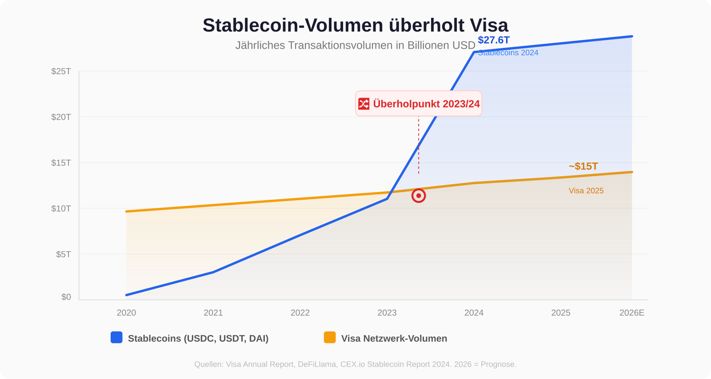

*Abbildung 8: Stablecoin-Volumen überholt Visa (2024: $27,6 Billionen)*

Das Wachstum wird nicht von Spekulanten getrieben. Es wird von Nutzen getrieben. Unternehmen in Lateinamerika, Afrika und Südostasien nutzen Stablecoins für internationale Überweisungen, weil das traditionelle Bankensystem zu langsam, zu teuer oder schlicht nicht vorhanden ist. Ein Freiberufler in Nigeria kann Stablecoins in Sekunden empfangen, während eine Banküberweisung Tage dauert und 5 bis 10 Prozent Gebühren kostet.

Tether, der Herausgeber von USDT, ist eines der profitabelsten Unternehmen der Welt gemessen am Gewinn pro Mitarbeiter. Mit weniger als 100 Mitarbeitern erwirtschaftet Tether Milliarden an Zinserträgen auf die Dollar-Reserven, die die USDT-Token decken. Nutzer geben Dollar, erhalten USDT. Tether investiert die Dollar in kurzfristige US-Staatsanleihen und kassiert die Zinsen. Solange der Zins positiv ist und die Nachfrage nach USDT besteht, ist das eine Gelddruckmaschine.

Circle, der Herausgeber von USDC, verfolgt ein ähnliches Modell und plant einen Börsengang. Für Investoren ist das einer der direktesten Wege, von der Stablecoin-Ökonomie zu profitieren: nicht durch den Besitz von Stablecoins selbst (die per Definition preisstabil sind), sondern durch Beteiligungen an den Unternehmen, die die Infrastruktur bauen.

---

> *Mikrotransaktionen und die Layer-2-Revolution*
> *Ein weiterer Schlüssel zur Maschinenökonomie sind Mikrotransaktionen. Hier zeigt sich, warum das traditionelle Finanzsystem strukturell ungeeignet ist.*
> *Wenn ein KI-Agent eine einzelne API-Anfrage an einen Dienst schickt, kostet das vielleicht 0,001 Dollar, ein Zehntel Cent. Im traditionellen Zahlungssystem ist das nicht abbildbar. Eine Kreditkartentransaktion kostet den Händler mindestens 30 Cent plus einen prozentualen Anteil. Eine Banküberweisung kostet mehrere Euro. Die Transaktionsgebühren sind höher als der Transaktionswert.*
> *Auf Layer-2-Blockchains, die man sich wie Entlastungsstraßen neben einer überlasteten Autobahn vorstellen kann, kosten Transaktionen Bruchteile eines Cents. Diese Netzwerke bauen auf bestehenden Blockchains auf, nutzen deren Sicherheit, verarbeiten aber Transaktionen schneller und günstiger. Arbitrum, Optimism und Base auf Ethereum, das Lightning Network auf Bitcoin: Sie alle ermöglichen Transaktionen für unter 0,01 Dollar. Manche für unter 0,001 Dollar.*
> *Ein KI-Agent kann für jede einzelne API-Anfrage bezahlen, in Echtzeit, ohne dass die Transaktionskosten den Wert übersteigen. Er kann für 0,0001 Dollar Rechenzeit auf einem dezentralen GPU-Netzwerk kaufen. Er kann für 0,005 Dollar einen Datensatz von einem anderen Agenten erwerben. Er kann Hunderte von Mikrotransaktionen pro Minute durchführen, was in einem Bankensystem physisch unmöglich wäre.*
> *Die Infrastruktur für die maschinelle Ökonomie existiert bereits. Sie wird nur noch nicht in dem Maßstab genutzt, der kommen wird.*

---

### Machine-to-Machine Economy: Was heute schon passiert

Machine-to-Machine-Payments sind keine Zukunftsmusik. Bereits heute gibt es funktionierende Projekte, in denen KI-Agenten auf Blockchains operieren.

Fetch.ai hat ein Netzwerk aufgebaut, in dem autonome Agenten Dienstleistungen anbieten, nachfragen und bezahlen, ohne menschliches Eingreifen. Ein Agent, der Transportrouten optimiert, bezahlt einen anderen Agenten, der Echtzeit-Verkehrsdaten liefert. Ein Agent, der Energieverbräuche prognostiziert, kauft Wetterdaten von einem Wetteragenten. Jede Transaktion läuft über die Blockchain, abgesichert durch Smart Contracts.

Ocean Protocol hat einen Marktplatz für Daten geschaffen, auf dem Datenanbieter ihre Datensätze tokenisieren und automatisiert verkaufen können. KI-Modelle können Trainingsdaten einkaufen, ohne dass ein Mensch den Deal vermittelt. Der Preis bildet sich durch Angebot und Nachfrage, die Bezahlung läuft über Krypto, die Zugriffsrechte werden durch Smart Contracts verwaltet.

Das sind noch kleine Märkte, Prototypen, keine Masseninfrastruktur. Aber sie zeigen das Prinzip. Und wenn die Agenten-Ökonomie in Phase 3 und 4 Fahrt aufnimmt, wenn Millionen von KI-Agenten autonom wirtschaftlich handeln und Hunderttausende von Robotern in der physischen Welt operieren, wird die Nachfrage nach kryptobasierten Zahlungsmitteln nicht linear steigen. Sie wird explodieren.

Aber wie groß wird sie wirklich? Hier liegt ein Denkfehler, den fast alle Analysten machen.

Als ich anfing, den Total Addressable Market für Krypto zu modellieren, habe ich dasselbe gemacht wie alle anderen: Die Nutzerzahlen hochgerechnet, komme auf zwei Milliarden aktive Wallets bis 2030. Sieht beeindruckend aus. Ist auch komplett falsch.

Ich habe die Agenten vergessen.

Raoul Pal, der ehemalige Goldman-Sachs-Manager und Gründer von Real Vision, hat es so formuliert: Wir werfen gerade eine Milliarde Agenten in die Wirtschaft. Dann zwei Milliarden. Vielleicht zehn Milliarden. Jeder einzelne dieser Agenten braucht eine Wallet. Jeder einzelne wird Transaktionen durchführen. Nicht einmal am Tag wie ein Mensch, der seine Miete überweist. Hunderte Male pro Stunde. Tausende Male pro Tag. "Who is your end customer in this new world? Your new customer is the agent."

Und Agenten sind anders als Menschen. Sie sind nicht loyal. Sie sind nicht emotional. Sie sind nicht tribal. Ein Mensch bleibt bei seiner Bank, weil er zu faul ist zu wechseln. Ein Agent wechselt in Millisekunden zum besseren Angebot. Ein Mensch kauft Ethereum, weil er an Vitalik glaubt. Ein Agent kauft die Chain mit den niedrigsten Gebühren und der schnellsten Abwicklung. Agenten optimieren, sie glauben nicht.

Die Payment-Infrastruktur baut sich gerade auf. Stripe hat mit Tempo eine eigene Chain gestartet. OpenAI und Anthropic sind beide im ersten Batch von Integrationspartnern. Elon Musk hat angekündigt, dass X Money in wenigen Wochen live geht. Alle verstehen: Wer die Zahlungsschicht kontrolliert, kontrolliert die Agent-Economy.

Aber hier liegt ein Problem, auf das Emad Mostaque hingewiesen hat: Der US-Dollar ist nur bis auf einen Cent teilbar. Was machen Sie, wenn eine Transaktion 0,001 Cent kosten soll? Bei exponentiellem Kostenverfall werden genau solche Beträge zur Normalität. Die Granularität des Dollars reicht nicht aus für eine Wirtschaft, in der Milliarden von Mikrotransaktionen pro Sekunde stattfinden. Krypto hat dieses Problem nicht. Sie können einen Bitcoin in 100 Millionen Satoshis teilen. Sie können einen ETH in eine Trillion Wei teilen. Das ist keine technische Spielerei. Das ist eine fundamentale Voraussetzung für die Maschinenökonomie.

Und dann gibt es die Umkehrung, die kaum jemand diskutiert: Rent a Human. Heute bezahlen Menschen Maschinen für Dienstleistungen. Morgen bezahlen Maschinen Menschen für Aufgaben, die sie nicht erledigen können. Wer hat in dieser neuen Ordnung das Geld? Die AI-Corporations. OpenAI, Anthropic, Google DeepMind, sie alle werden Agenten betreiben, die Milliarden generieren. Diese Agenten werden Menschen beauftragen, für sie zu arbeiten. Die Frage, wer hier der Meister ist und wer der Diener, wird philosophisch interessant. Ökonomisch ist sie bereits beantwortet: Der Meister ist der, der das Geld hat.

Innerhalb von fünf Jahren, schätzt Raoul Pal, werden Agenten mehr zur Wirtschaftsleistung beitragen als Menschen. Die fundamentale Gleichung der Geldtheorie, MV = PQ, bekommt einen neuen Faktor: die Velocity der Agenten. Und diese Velocity ist nicht durch menschliche Langsamkeit begrenzt. Sie ist begrenzt durch die Geschwindigkeit der Blockchain.

---

> *x402: Wie HTTP-Statuscode 402 das Internet zum Zahlungsterminal machte*
> *Und dann passierte etwas, das eigentlich vor dreißig Jahren hätte passieren sollen.*
> *Im Mai 2025 veröffentlichte Coinbase ein Protokoll namens x402. Der Name klingt technisch, aber die Idee ist simpel: Seit 1992 gibt es im HTTP-Standard (dem Fundament des gesamten Internets) einen Statuscode mit der Nummer 402. Seine Bedeutung: "Payment Required". Bezahlung erforderlich. Dreißig Jahre lang war er ein toter Buchstabe. Niemand nutzte ihn, weil es kein digitales Geld gab, das schnell genug, billig genug und programmierbar genug war, um direkt in einem HTTP-Request mitzufahren.*
> *Stablecoins haben das geändert.*
> *x402 funktioniert so: Ein KI-Agent ruft eine API auf, sagen wir, er braucht Marktdaten von einem Datenanbieter. Der Server antwortet nicht mit den Daten, sondern mit HTTP 402: "Bezahl erst." Plus eine maschinenlesbare Rechnung: 0,003 USDC, auf Base, an diese Wallet-Adresse. Der Agent signiert die Zahlung, schickt sie als HTTP-Header zurück, ein Facilitator settled die Transaktion on-chain, und der Server liefert die Daten. Alles in unter einer Sekunde. Keine Registrierung, kein API-Key, keine Kreditkarte. Die Maschine hat bezahlt. Alleine.*
> *Was nach Theorie klingt, hat bereits Fakten: bis Ende 2025 hatte x402 über hundert Millionen Transaktionen verarbeitet. Vierhunderttausend Käufer, achtzigtausend Verkäufer. Nicht in einem Labor, sondern im offenen Internet. Coinbase ist nicht allein. Cloudflare gründete gemeinsam mit Coinbase die x402 Foundation. Google integrierte x402 in sein Agent-to-Agent-Protokoll. Anthropic, AWS, Circle, Solana, Aptos schlossen sich an. Das ist kein Randphänomen. Das ist die Entstehung eines Standards.*
> *Was x402 von früheren Versuchen unterscheidet, von Bitcoin Lightning bis zu Facebooks gescheiterter Libra, ist die Kombination aus vier Faktoren: Es nutzt einen existierenden HTTP-Standard, setzt auf Stablecoins statt volatile Kryptowährungen, läuft auf Layer-2-Chains mit Sub-Cent-Gebühren, und hat die Unterstützung der größten Infrastrukturanbieter des Internets.*
> *Aber das ist nur die digitale Seite. Die eigentliche Revolution beginnt dort, wo Maschinengeld auf die physische Welt trifft.*

---

::: {.infobox}
### Das Auto, das sein eigenes Leben finanziert

Am 3. Oktober 2025 stellte das Unternehmen Robo.ai auf der TOKEN2049 in Dubai etwas vor, das wie ein Witz klingt: eine Wallet für ein Auto. Keine App, die man auf dem Handy installiert, sondern eine digitale Brieftasche, die ins Fahrzeug selbst eingebaut ist. Sie heißt Roboy339 und kann autonom für Maut bezahlen, Ladestrom abrechnen, Parkgebühren überweisen und Wartungstermine buchen. Ohne dass der Fahrer etwas tut. Ohne dass der Fahrer es überhaupt bemerkt.

Das klingt nach einem netten Feature. Aber denken Sie den Gedanken zu Ende.

Stellen Sie sich ein Robotaxi vor, das morgens um sechs seinen Dienst beginnt. Es hat keinen Fahrer, keinen Besitzer, der im Büro sitzt und Aufträge zuteilt, und keinen Disponenten, der den Tag plant. Es hat eine Wallet.

Das Taxi fährt einen Fahrgast zum Flughafen. 28,40 USDC fließen in seine Wallet. Es fährt zur nächsten Ladestation, nicht weil jemand es hingeschickt hat, sondern weil sein Batteriemanagement-Agent berechnet hat, dass die Preise an der Station in der Industriestraße gerade 22 Prozent unter dem Tagesdurchschnitt liegen. 4,80 USDC für 35 Kilowattstunden. Die Ladestation schickt eine Quittung, nicht per E-Mail, sondern als bestätigte Transaktion auf der Blockchain.

Am Ende des Tages hat das Taxi 340 Dollar verdient. Jetzt beginnt seine Buchhaltung. 80 Dollar fließen an den Besitzer als Leasing-Rate. 12 Dollar an den Reifenservice, ein Sensor hat registriert, dass die Profiltiefe bei 73 Prozent liegt, also bucht der Wartungsagent einen Termin für nächste Woche und überweist die Anzahlung. 5 Dollar wandern in einen Rücklagenfonds für die nächste Hauptuntersuchung. Der Rest wird in einem Stablecoin-Pool geparkt, wo er Zinsen erwirtschaftet, bis er gebraucht wird.

Dieses Auto ist kein Fortbewegungsmittel mehr. Es ist ein wirtschaftlicher Agent. Ein Unternehmen auf vier Rädern, das Einnahmen generiert, Ausgaben optimiert, Rücklagen bildet und seine eigene Bilanz führt. Und seine Betriebswährung sind Stablecoins.

Das ist keine Science-Fiction. Bosch hat mit dem Projekt moveID auf der Blockchain-Plattform peaq bereits demonstriert, wie Fahrzeuge eine eigene digitale Identität erhalten und autonom mit Ladestationen und Parkplätzen abrechnen. Peer-to-Peer. Ohne Vermittler. DIMO, ein dezentrales Netzwerk mit über 180.000 angeschlossenen Fahrzeugen, geht noch weiter: Die Autos verkaufen ihre Fahrdaten (Standort, Diagnose, Fahrverhalten) direkt an Versicherungen und Stadtplaner, und die Besitzer werden in Token entlohnt.

Die Frage ist nicht mehr, ob Maschinen ein Bankkonto bekommen. Die Frage ist, was passiert, wenn dreihundert Millionen vernetzte Fahrzeuge gleichzeitig anfangen, eigenständig zu wirtschaften.
:::

---

::: {.infobox}
### Die Drohne und das Pad Thai

Mittwoch, 12:30 Uhr. Sie sagen Ihrem KI-Assistenten: "Ich hab Hunger, irgendwas Thailändisches."

Früher hätten Sie eine App geöffnet, durch Speisekarten gescrollt, Bewertungen gelesen, Ihre Kreditkartendaten eingegeben und vielleicht eine halbe Stunde damit verbracht, zwischen Pad Thai und Massaman Curry zu schwanken. Ihr Assistent macht das in vier Sekunden.

Er fragt drei Thai-Restaurants in der Nähe per x402 ab. Nicht per Telefonanruf - per HTTP. Die Anfrage kostet 0,001 USDC pro Restaurant, bezahlt in dem Moment, in dem der Server antwortet. Die Restaurants haben eigene KI-Systeme, die in Echtzeit prüfen: Was ist auf Lager? Wie voll ist die Küche? Wie lange dauert die Zubereitung? Was kann in 25 Minuten beim Kunden sein?

Zwei Angebote kommen zurück. Der Assistent wählt das Pad Thai vom Siam Corner: 16,50 USDC, inklusive einer Anpassung, weil er weiß, dass Sie keine Erdnüsse vertragen. Er zahlt sofort.

Aber hier wird es interessant. Ihr Assistent bezahlt nicht nur das Essen. Er bezahlt auch die Logistik. Eine autonome Lieferdrohne wird gebucht, 2,80 USDC für den 2,3-Kilometer-Flug. Die Drohne zahlt unterwegs 0,003 USDC Luftraumgebühr an die Stadt und 0,001 USDC an einen Wetterdienst für Echtzeit-Winddaten auf ihrer Route.

Sieben Transaktionen. Drei physische Dienstleister. Null menschliche Freigaben. Ihr Pad Thai ist in 22 Minuten da.
:::
> *Was hier passiert ist, verdient einen zweiten Blick. Nicht wegen der Technologie - Drohnenlieferungen und KI-Assistenten gibt es bereits. Sondern wegen der Ökonomie dahinter. In der alten Welt brauchte diese Transaktion eine Plattform wie Lieferando, die 30 Prozent Provision nimmt. Einen Zahlungsdienstleister, der 2,9 Prozent plus 30 Cent kassiert. Einen Vertragsrahmen zwischen Restaurant, Plattform und Lieferdienst. Bankkonten, Kreditkarten, monatliche Abrechnungen.*
> *In der neuen Welt gibt es nur Agenten und Stablecoins. Jeder Agent hat eine Wallet. Jede Transaktion wird in Millisekunden abgewickelt, für Bruchteile eines Cents Gebühr. Kein Mittelsmann nimmt 30 Prozent, die Wertschöpfung bleibt beim Restaurant und beim Kunden.*
> *Das ist Maschinengeld in der physischen Welt. Nicht nur Bits bezahlen Bits. Agenten bezahlen für Atome.*

---

### Die Stadt als Marktplatz der Maschinen

::: {.szene}
2035. Eine Großstadt. Millionen von Geräten, Autos, Drohnen, Gebäude, Ladestationen, Ampeln, Sensoren, Roboter, haben eigene Wallets. Sie handeln miteinander. Rund um die Uhr. Ohne menschliche Aufsicht.

Die Ampel an der Kreuzung Schillerstraße verkauft ihre Verkehrsdaten an vorbeifahrende Robotaxis. 0,0001 USDC pro Datenpunkt: aktuelle Rotphase, prognostizierter Grünstart, Staulänge in alle Richtungen. Die Taxis nutzen die Daten, um ihre Routen zu optimieren. Sie zahlen d, Ampel, oder genauer: dem dezentralen Infrastrukturnetzwerk, das die Ampel betreibt.

Eine Lieferdrohne bucht einen Landeplatz auf dem Dach eines Bürogebäudes. 0,15 USDC für drei Minuten. Das Gebäude verdient damit mehr als mit dem Parkplatz im Erdgeschoss, der ohnehin leer steht, seit niemand mehr selbst zur Arbeit fährt.

Die Solaranlage auf dem Nachbardach hat heute mehr Strom produziert, als das Haus verbraucht. Der Überschuss fließt automatisch an drei Nachbarn, bezahlt in USDC über ein dezentrales Energienetz. Die Wärmepumpe im Keller bemerkt einen Effizienzabfall von zwölf Prozent, beauftragt einen Diagnose-Agenten für 0,50 USDC, bekommt das Ergebnis in vier Sekunden. Kältemittel nachfüllen. Und bucht einen Handwerker aus dem nächsten dezentralen Handwerker-Netzwerk. Termin: Donnerstag 14 Uhr. Vorauszahlung: 45 USDC.

In dieser Stadt gibt es keinen Moment, in dem nicht Maschinen miteinander handeln. Die Straße berechnet dem Auto eine Nutzungsgebühr pro Kilometer, nicht pauschal über Steuern, sondern in Echtzeit, abhängig von Gewicht, Uhrzeit und Straßenzustand. Der Müllroboter bezahlt den Aufzug für die Fahrt in die Tiefgarage. Das autonome Warenhaus bestellt Nachschub bei einer Fabrik 200 Kilometer entfernt. Und die Fabrik beauftragt einen autonomen Lastwagen für die Lieferung.

Das alles passiert nicht neben der menschlichen Wirtschaft. Es passiert in ihr. Die Maschinen sind keine separate Ökonomie. Sie sind eine Schicht, die sich unter die menschliche Wirtschaft legt, unsichtbar, effizient, permanent. So wie das Internet sich unter den Handel gelegt hat, ohne dass wir heute noch "online shoppen" sagen, wird sich die Maschinenökonomie unter den Alltag legen, ohne dass wir sie bemerken.
:::

DIMO macht heute den ersten Schritt: 180.000 Fahrzeuge mit Blockchain-Identität, die ihre Daten eigenständig verkaufen. peaq hostet 6 Millionen Maschinen-Adressen über 60 dezentrale Infrastrukturprojekte in 22 Industrien. Die Bausteine sind da. Die Stadt, die ich gerade beschrieben habe, wird nicht auf einmal entstehen. Sie wird Stück für Stück zusammenwachsen, ein Auto, eine Drohne, eine Ladestation auf einmal.

Aber sie wird entstehen. Denn die Wirtschaftslogik ist unausweichlich: Maschinen, die autonom handeln können, werden autonom handeln. Maschinen, die eigenständig bezahlen können, werden eigenständig bezahlen. Und wenn sie einmal anfangen, gibt es keinen Grund, damit aufzuhören.

### Bitcoin als Anker, Ethereum als Betriebssystem

In dieser Ökonomie spielen Bitcoin und Ethereum grundlegend unterschiedliche Rollen. Beide zu verstehen ist wichtig, weil die Verwechslung der beiden zu falschen Investmententscheidungen führt.

Bitcoin ist kein Zahlungsmittel für Mikrotransaktionen, dafür ist es auf der Basisschicht zu langsam und zu teuer. Das Lightning Network macht Bitcoin-Zahlungen zwar schnell und billig, aber Bitcoins primäre Rolle in der Maschinenökonomie ist eine andere: Es ist das härteste Geld, das je existiert hat.

21 Millionen E, eiten, nicht inflationierbar, nicht konfiszierbar, von keiner Regierung kontrolliert und von keiner Zentralbank manipulierbar.

In einer Welt, in der KI die Produktivität massiv steigert und damit deflationären Druck erzeugt, während Regierungen gleichzeitig Geld drucken, um den sozialen Frieden zu wahren und Grundeinkommen zu finanzieren, wird ein knappes, neutrales Wertaufbewahrungsmittel zum Anker des Systems. Bitcoin ist digitales Gold, aber Gold, das man in Sekunden um die Welt senden kann, das in einem USB-Stick passt und das keiner Regierung gehört.

Ethereum positioniert sich als das Betriebssystem der dezentralen Ökonomie. Es ist die Plattform, auf der Smart Contracts laufen, DeFi-Protokolle operieren und KI-Agenten ihre Transaktionen abwickeln. Ethereum ist nicht knapp wie Bitcoin, es hat keine feste Obergrenze, aber seit dem Merge auf Proof-of-Stake ist es tendenziell deflationär: Bei hoher Netzwerkauslastung werden mehr ETH verbrannt als neu geschaffen.

Die Konkurrenz ist real. Solana ist schneller. Arbitrum ist billiger. Neue Layer-1-Blockchains entstehen ständig. Aber Ethereums Netzwerkeffekte und Sicherheit sind schwer einzuholen. Die meisten DeFi-Protokolle, die meisten NFT-Projekte, die meisten KI-Agent-Implementierungen laufen heute auf Ethereum oder Ethereum-kompatiblen Netzwerken. Im Technologiemarkt gewinnt nicht immer die beste Technologie, sondern die mit dem größten Ökosystem.

Solana verdient in diesem Zusammenhang einen genaueren Blick, denn es spielt eine komplementäre Rolle zu Ethereum, keine konkurrierende. Wenn Ethereum das Betriebssystem ist, auf dem die großen Anwendungen laufen, dann ist Solana der Hochfrequenz-Layer für alles, was schnell und billig sein muss. Transaktionen auf Solana kosten Bruchteile eines Cents und werden in unter einer Sekunde bestätigt. Für die Maschinenökonomie ist das entscheidend: Wenn KI-Agenten Hunderte von Mikrotransaktionen pro Minute durchführen, zählt jede Millisekunde und jeder Bruchteil eines Cents an Gebühren.

Besonders spannend sind die sogenannten DePIN-Projekte auf Solana, also dezentrale physische Infrastruktur-Netzwerke. Helium hat ein weltweites IoT- und Mobilfunknetz aufgebaut, in dem jeder Teilnehmer Netzabdeckung bereitstellt und dafür mit Token bezahlt wird. Render ermöglicht es GPU-Besitzern, ihre ungenutzten Grafikprozessoren an ein Netzwerk zu vermieten, das Rendering-Aufgaben für Film, Architektur und KI-Training verteilt. Beide Projekte zeigen ein Muster: Maschinen und Infrastruktur handeln autonom miteinander, und das Zahlungssystem dafür läuft über Solana.

Die Stablecoin-Zahlen unterstreichen die Relevanz. Stablecoins haben 2024 ein Transaktionsvolumen von rund 27,6 Billionen Dollar verarbeitet. Zum Vergleich: Visa, das größte Kartenzahlungsnetzwerk der Welt, kam auf etwa 13 Billionen Dollar. Ein großer und wachsender Teil dieses Stablecoin-Volumens läuft über Solana, weil die niedrigen Gebühren und die hohe Geschwindigkeit besonders für automatisierte und hochfrequente Zahlungen attraktiv sind. Wer sich fragt, ob Krypto-Zahlungssysteme "nur Spielerei" sind: Ein Netzwerk, das doppelt so viel Volumen bewegt wie Visa, ist keine Spielerei mehr.

---

### Die Kernthese: Maschinen brauchen Maschinengeld

Wenn Maschinen wirtschaftliche Akteure werden, wenn sie autonom kaufen, verkaufen, verhandeln und investieren, dann brauchen sie ein Geldsystem, das für Maschinen gebaut ist. Eines, das keine menschliche Identität voraussetzt. Eines, das rund um die Uhr funktioniert. Eines, das Mikrotransaktionen für Bruchteile eines Cents ermöglicht. Eines, das programmierbar ist, in dem Regeln als Code existieren, nicht als Paragraphen.

Das traditionelle Finanzsystem kann das nicht leisten. Es wurde vor Jahrhunderten für Menschen gebaut und wird von Institutionen verwaltet, die für menschliche Zeitrahmen, menschliche Beträge und menschliche Identitäten optimiert sind.

Krypto ist nicht die perfekte Lösung. Die Technologie ist jung, die Regulierung unklar, die Volatilität bei vielen Tokens hoch. Aber es ist die einzige existierende Infrastruktur, die die Grundanforderungen der Maschinenökonomie erfüllt: digital-nativ, permissionless, programmierbar, global.

Das ist der Grund, warum dieses Buch nicht nur ein KI-Buch oder ein Krypto-Buch ist, sondern ein Buch über die Konvergenz beider. KI ohne Krypto ist ein Motor ohne Treibstoff. Krypto ohne KI ist Treibstoff ohne Motor. Erst zusammen ergeben sie etwas, das die Weltwirtschaft tatsächlich transformiert.

> *Maschinengeld. Das Geld, das Maschinen brauchen, um in einer Welt zu funktionieren, die sie selbst miterschaffen.*

Wie dieses Maschinengeld konkret aussehen könnte, dafür gibt es mittlerweile erste Entwürfe. Emad Mostaque schlägt in "The Last Economy" ein duales Währungssystem vor: "Foundation Coins" für die physische Welt der knappen Ressourcen. Diese Währung wird nur geschöpft, wenn verifizierbare, nützliche Rechenleistung für ein offenes Wissens-Commons erbracht wird. Geld, das an kristallisierte Intelligenz gebunden ist, nicht an Gold oder Staatsschulden. Daneben "Culture Credits" für die digitale Welt des Überflusses. Mit eingebautem Verfall, einer Art Demurrage, die dafür sorgt, dass das Geld fließt statt gehortet wird. Die Credits belohnen Kreativität, Kultur und menschliche Verbindung.

Man muss Mostaques konkreten Entwurf nicht für den endgültigen halten. Aber die Grundidee ist überzeugend: Eine Ökonomie, in der Maschinen Überfluss produzieren und Menschen in einer Welt der Knappheit leben, braucht wahrscheinlich mehr als eine Währung. Bitcoin als digitales Gold, Stablecoins als Zahlungsschicht, und möglicherweise etwas völlig Neues für die Machine-to-Machine-Ökonomie. Die Architektur des Maschinengeldes wird nicht von einem einzelnen Denker entworfen werden. Sie wird sich aus der Praxis entwickeln, aus Millionen von Transaktionen zwischen Agenten, die das nutzen, was funktioniert.

Und diese Praxis hat bereits begonnen. In der Welt der tokenisierten Vermögenswerte.

> **📌 Auf einen Blick:**
>
> ◆ Maschinen brauchen eigenes Geld, weil das traditionelle Bankensystem sie ausschließt.
> ◆ Krypto und Smart Contracts sind der native Zahlungskanal für autonome Agenten.
> ◆ Die Machine-to-Machine Economy funktioniert bereits heute.

## Kapitel 4: Wenn alles ein Token wird

"In Kryptographie vertrauen wir."

- Frei nach "In God We Trust"

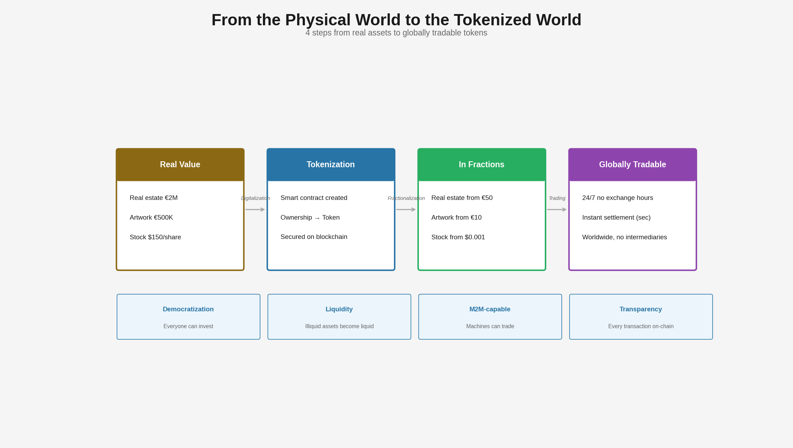

*Abbildung 9: Von der physischen zur tokenisierten Welt*

Die Demokratisierung der Vermögenswerte und ihre Grenzen Stellen Sie sich vor, Sie könnten ein Stück vom Burj Khalifa kaufen. Nicht eine Eigentumswohnung für Millionen, sondern ein Zehntausendstel des Gebäudes. Für hundert Euro. Mit Ihrem Smartphone. Um 3 Uhr nachts. Und morgen, wenn Sie das Geld für etwas anderes brauchen, verkaufen Sie Ihren Anteil wieder. In Sekunden.

Das ist keine Fiktion. In Dubai hat das Land Department Ende 2025 einen Piloten gestartet, in dem Immobilien genau so tokenisiert werden. Ausverkauft in Stunden.

Jetzt multiplizieren Sie dieses Prinzip. Nicht nur Immobilien. Alles. Unternehmensanteile. Patente. Ackerland in Iowa. Mieteinnahmen eines Bürogebäudes in Frankfurt. Die Rechte an einem Song von Ed Sheeran. Ein Picasso, der in einem Tresor in Genf hängt. Ein Windpark in der Nordsee. Ein Venture-Capital-Fonds, der in das nächste OpenAI investiert.

Tokenisierung heißt: Jeder Vermögenswert der Welt wird in kleine, handelbare, programmierbare digitale Einheiten zerlegt. Auf einer Blockchain. Mit einem Smart Contract, der die Regeln definiert. Ohne Notar, ohne Makler, ohne Depotgebühren, ohne die Frage, ob Ihre Bank das Geschäft genehmigt.

Das vorherige Kapitel hat erklärt, warum Maschinen Krypto brauchen. Dieses Kapitel erklärt, wie die gesamte reale Welt auf die Blockchain kommt. Und warum das vielleicht die größte Verschiebung in der Geschichte des Investierens ist. Oder die größte Enttäuschung.

### Was heute schon passiert: Zahlen, die kaum jemand kennt

Der Markt für tokenisierte Real-World Assets hat Ende 2025 die 36-Milliarden-Dollar-Marke überschritten. Ohne Stablecoins. Das klingt nach viel, ist aber im Vergleich zum globalen Vermögen ein Rundungsfehler. Die gesamten Finanzmärkte der Welt repräsentieren über 900 Billionen Dollar. Die 36 Milliarden sind 0,004 Prozent.

Aber die Wachstumsrate lässt aufhorchen. Seit 2020 hat sich der Markt um über 2.200 Prozent vergrößert. Die Prognosen der großen Beratungshäuser lesen sich wie Science-Fiction: McKinsey erwartet 2 bis 4 Billionen Dollar bis 2030. Boston Consulting Group sagt 16 Billionen. Standard Chartered prognostiziert 30 Billionen bis 2034. Cathie Woods Firma Ark Invest rechnet mit über 11 Billionen.

Die Spannbreite allein, von 2 bis 30 Billionen, zeigt, dass niemand wirklich weiß, wie schnell das geht. Trotzdem bewegt sich Kapital in diese Richtung. Und dass die Wachstumskurve nicht linear sein wird, sondern exponentiell, wie bei jeder anderen Technologie in diesem Buch.

### Was wird heute bereits tokenisiert?

::: {.infobox}
### Wie BlackRock die Finanzwelt tokenisiert

Staatsanleihen sind die Einstiegsdroge der Institutionellen. BlackRocks BUIDL-Fund, ein tokenisierter Geldmarktfonds auf US-Treasuries, ist von 40 Millionen Dollar bei seinem Start im März 2024 auf fast 3 Milliarden Dollar Ende 2025 gewachsen. In weniger als zwei Jahren. Franklin Templeton hat seinen BENJI-Fund auf der Stellar-Blockchain laufen. Ondo Finance bietet mit USDY tokenisierte Treasury-Renditen für jeden mit einer Wallet an. Über 9 Milliarden Dollar stecken bereits in tokenisierten US-Staatsanleihen.
:::

Immobilien haben das Ur-Problem, das Tokenisierung löst: Sie sind illiquide, teuer, schwer teilbar und geografisch gebunden. RealT verkauft Anteile an US-Mietimmobilien ab 50 Dollar pro Token. Wöchentliche Mietausschüttungen direkt in die Wallet. Kein Verwalter, kein Papierkram. In Dubai hat Prypco Mint mit dem Land Department einen Piloten durchgeführt, dessen Token-Tranchen innerhalb von Stunden ausverkauft waren. Das Ziel: 7 Prozent des gesamten Dubai-Immobilienmarktes tokenisiert bis 2033, das sind 16 Milliarden Dollar.

Private Equity ist traditionell den Ultra-Reichen vorbehalten. Mindesteinlage: 5 Millionen Dollar. Warteliste. Exklusiver Club. Hamilton Lane, einer der größten PE-Verwalter der Welt mit 920 Milliarden Dollar unter Verwaltung, hat über die Plattform Securitize Fonds tokenisiert und das Mindestinvestment auf 20.000 Dollar gesenkt. Securitize hat auch KKR-Fonds tokenisiert. Private Equity für den Zahnarzt aus Düsseldorf statt nur für den Family-Office-Manager aus Zürich.

Private Credit, also Unternehmenskredite außerhalb des Bankensystems, wird über Plattformen wie Centrifuge und Maple Finance tokenisiert. DeFi-Investoren können in reale Firmenkredite investieren und bekommen dafür Renditen, die deutlich über Staatsanleihen liegen. Maple Finance hat kumuliert über 3 Milliarden Dollar an Krediten vergeben.

Und dann die Nischen, die zusammen kein Nischenmarkt mehr sind. Tokenisiertes Gold über Paxos und Tether Gold, zusammen über eine Milliarde Dollar. Musik-Royalties über Royal.io, wo Fans Anteile an den Einnahmen ihrer Lieblingskünstler kaufen können. Ackerland über AcreTrader. Patente über IPwe auf der IBM-Blockchain. Fraktionierte Blue-Chip-Kunst über Masterworks.

### Wenn die Giganten kommen

Dass Krypto-Startups tokenisierte Assets verkaufen, ist eine Sache. Dass BlackRock, JPMorgan und Goldman Sachs es tun, eine ganz andere.

BlackRock verwaltet über 10 Billionen Dollar. Wenn Larry Fink sagt, "Tokenisierung wird die nächste Generation der Märkte sein", dann ist das keine Marketing-Aussage eines Krypto-Enthusiasten. Es ist eine strategische Ankündigung des mächtigsten Mannes im globalen Finanzsystem.

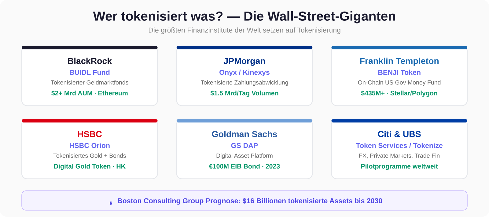

*Abbildung 10: Wer tokenisiert was? Die Wall-Street-Giganten steigen ein*

BUIDL, BlackRocks tokenisierter Geldmarktfonds, startete im März 2024 auf Ethereum. Innerhalb eines Jahres expandierte er auf sieben Blockchains. Und dann passierte im Februar 2026 etwas, das man vor fünf Jahren für unmöglich gehalten hätte: BUIDL wurde auf Uniswap gelistet. Uniswap, die größte dezentrale Börse der Welt. BlackRock, der Inbegriff von Wall Street, betritt DeFi.

Das ist, als hätte die Deutsche Bank angekündigt, ihre Fonds über einen Flohmarkt zu verkaufen. Nur dass dieser Flohmarkt ein Handelsvolumen von mehreren Milliarden Dollar pro Tag hat und rund um die Uhr geöffnet ist.

JPMorgan hat mit Onyx seine eigene Blockchain-Plattform gebaut. Kinexys, ehemals JPM Coin, wickelt täglich über 2 Milliarden Dollar an Transaktionen ab. Das Tokenized Collateral Network überträgt Geldmarktfonds-Anteile als Sicherheiten in Echtzeit, ein Prozess, der im traditionellen System Tage dauert. Ende 2025 kündigte JPMorgan einen Ethereum-basierten tokenisierten Money Fund an.

Goldman Sachs hat mit GS DAP eine Plattform für tokenisierte Anleihen aufgebaut. Die Europäische Investitionsbank hat mehrere digitale Bond-Emissionen darüber abgewickelt. Im Juli 2025 folgte eine Partnerschaft mit der Bank of New York Mellon für tokenisierte Money-Market-Fund-Anteile.

HSBC hat tokenisierte Gold-Token live geschaltet, die rund um die Uhr handelbar sind. Franklin Templeton betreibt BENJI auf Stellar und Polygon. Fidelity entwickelt tokenisierte Geldmarktprodukte. Und die Citibank prognostiziert, dass Tokenisierung bis 2030 4 bis 5 Billionen Dollar erreicht.

### Was heißt es, wenn diese Firmen einsteigen?

Es heißt Legitimität. Kein CFO wird gefeuert, weil er in ein BlackRock-Produkt investiert hat, auch wenn es auf einer Blockchain läuft. Die Reputationsbarriere fällt.

Es heißt Kapital. Diese Firmen verwalten zusammen Dutzende von Billionen Dollar. Wenn auch nur ein Bruchteil davon in tokenisierte Assets fließt, verschieben sich die Größenordnungen.

Und es heißt regulatorische Zugkraft. BlackRock und JPMorgan haben mehr Lobbyisten in Washington als die gesamte Krypto-Industrie zusammen. Wenn sie Tokenisierung wollen, werden die Regulierer folgen. Nicht aus Überzeugung, sondern aus Pragmatismus.

### Gesetzgebung: Warum ein Token ohne Recht nur eine Quittung auf einer Serviette ist

> Hier kommen wir zum härtesten Punkt. Und zum wichtigsten.

Ein tokenisierter Anteil an einem Gebäude ist genau so viel wert wie das Recht, das dahintersteht. Wenn Sie einen Token kaufen, der behauptet, Ihnen 0,01 Prozent eines Bürogebäudes in Frankfurt zu gehören, aber kein Gericht diesen Anspruch durchsetzen wird, dann haben Sie eine Quittung auf einer Serviette gekauft. Kein Investment.

Tokenisierung funktioniert nur mit Gesetzgebung. Die Technologie ist das einfache Problem. Das schwierige Problem ist: Erkennt das Rechtssystem einen Token als Eigentumsnachweis an? Kann ich vor Gericht damit klagen? Gelten Anlegerschutzregeln? Wer haftet, wenn der Smart Contract einen Bug hat?

Die Antwort ist 2026 nicht mehr einheitlich "Nein". Aber auch nicht einheitlich "Ja". Was wir sehen, ist ein globaler Wettlauf mit drei Geschwindigkeiten. Die USA unter Trump: Vom Feind zum Förderer Die Kehrtwende der amerikanischen Krypto-Regulierung unter der Trump-Administration gehört zu den bemerkenswertesten politischen Umschwüngen der jüngeren Finanzgeschichte.

Unter SEC-Chairman Gary Gensler (2021-2025) war die Philosophie "Regulation by Enforcement": keine klaren Regeln, aber Klagen gegen jeden, der es wagte, digitale Assets anzubieten. Die Industrie operierte in einer regulatorischen Grauzone, in der jede Innovation ein juristisches Risiko war.

Unter dem neuen SEC-Chairman Paul Atkins hat sich das radikal geändert. Statt zu klagen, schreibt die SEC jetzt Regeln.

Im Juli 2025 unterzeichnete Trump den GENIUS Act, das erste umfassende Bundesgesetz für Stablecoins. Ein bundesweites Framework für Stablecoin-Emittenten mit klaren Anforderungen an Reserven, Audits und finanzielle Integrität. Das klingt technisch, ist aber fundamental: Stablecoins sind die Zahlungsschicht, auf der tokenisierte Assets gehandelt werden. Ohne regulierte Stablecoins keine regulierte Tokenisierung.

Im Dezember 2025 erteilte die SEC der Depository Trust Company, dem Herzstück der amerikanischen Wertpapierabwicklung, einen No-Action Letter für einen dreijährigen Piloten zur Tokenisierung von Wertpapier-Custody auf Blockchains. Das ist, als hätte die Bundesbank der Deutschen Börse erlaubt, Aktien auf Ethereum abzuwickeln. Die Tragweite ist schwer zu überschätzen.

Im Januar 2026 veröffentlichte die SEC ihr "Playbook für tokenisierte Wertpapiere": eine gemeinsame Erklärung dreier Abteilungen, die klarstellt, wie bestehende Wertpapiergesetze auf Tokenisierung anwendbar sind. Die Kernbotschaft: Neue Schienen, gleiche Regeln. Solange der Token ein echtes Wertpapier repräsentiert und die Anlegerrechte klar sind, ist die SEC offen für innovative Buchführung via Blockchain.

Und dann Nasdaq. Im Januar 2026 beantragte die größte elektronische Börse der Welt bei der SEC, tokenisierte Aktien handeln zu dürfen. Nicht irgendwann. Jetzt.

Es gibt allerdings einen gewaltigen Haken, und er betrifft genau die Frage, die dieses Kapitel stellt. Die SEC hat bisher keinerlei Anstalten gemacht, die sogenannten "Accredited Investor"-Regeln zu lockern. In den USA dürfen die meisten tokenisierten Wertpapiere nur an Investoren verkauft werden, die entweder ein Einkommen über 200.000 Dollar pro Jahr oder ein Vermögen über 1 Million Dollar nachweisen können. Das betrifft etwa 13 Prozent der amerikanischen Haushalte.

Für die restlichen 87 Prozent bleibt die Tür zu den ertragreichsten Investments auch mit Tokenisierung verschlossen. Die Technologie demokratisiert. Die Regulierung nicht. Jedenfalls noch nicht. Europa: Gründlich, aber langsam Europa reguliert. Das überrascht niemanden. Wie Europa reguliert, ist allerdings bemerkenswert differenziert.

MiCA, die Markets in Crypto-Assets Regulation, ist seit dem 30. Dezember 2024 vollständig in Kraft. Das weltweit erste umfassende Regulierungsframework für Krypto-Assets, gültig in allen 27 EU-Staaten. Einheitliche Regeln für Stablecoins, Krypto-Börsen, Wallet-Anbieter.

Aber hier kommt die Nuance, die die meisten übersehen: MiCA reguliert Krypto-Assets. Tokenisierte Wertpapiere, also Token, die Aktien, Anleihen oder Fondsanteile repräsentieren, fallen weiterhin unter die bestehenden Finanzmarktregeln. MiFID II, die Prospektverordnung, die AIFM-Richtlinie. MiCA und traditionelle Finanzregulierung sind zwei verschiedene Welten, die sich gerade erst annähern.

Der DLT Pilot Regime ist der Versuch, diese Welten zu verbinden. Eine regulatorische Sandbox, die es erlaubt, tokenisierte Wertpapiere unter kontrollierten Bedingungen auf Blockchains zu handeln und abzuwickeln. Die Sandbox wurde bis 2026 verlängert. Und im Dezember 2025 schlug die EU-Kommission ein massives Upgrade vor: größere Volumenlimits, mehr Asset-Klassen, der Weg von der Sandbox zur permanenten Infrastruktur.

Deutschland war hier Vorreiter. Das eWpG, das Gesetz über elektronische Wertpapiere, ist seit Juni 2021 in Kraft und ermöglicht rein digitale Wertpapiere ohne physische Urkunde. Schuldverschreibungen und Fondsanteile können als Kryptowertpapiere auf einer Blockchain ausgegeben werden, reguliert durch die BaFin. 2026 ist das kein Experiment mehr: Viele RWA-Deals in Deutschland werden bereits als elektronische Wertpapiere auf lizenzierter Infrastruktur strukturiert.

Die Schweiz und Liechtenstein sind noch weiter. Das Schweizer DLT-Gesetz von 2021 hat "Registerwertrechte" geschaffen, die direkt on-chain durchsetzbar sind. Die SIX Digital Exchange (SDX) ist operativ. Liechtenstein hat mit dem Token-Container-Modell eines der weltweit fortschrittlichsten Tokenisierungs-Gesetze.

Das europäische Problem ist nicht das Fehlen von Gesetzen. Es ist die Geschwindigkeit. Während in den USA die SEC innerhalb weniger Monate einen Piloten für tokenisierte Wertpapierabwicklung genehmigt und Nasdaq den Handel beantragt hat, diskutiert Europa noch über Sandbox-Erweiterungen. Die Gesetze sind gründlicher, die Umsetzung langsamer. Das Muster, das wir im Kapitel über die geopolitische Dimension beschrieben haben, wiederholt sich bei der Tokenisierung.

### Asien: Das pragmatische Laboratorium

Während die USA beschleunigen und Europa deliberiert, baut Asien.

Singapur hat mit Project Guardian das weltweit ambitionierteste Tokenisierungs-Projekt gestartet. Eine Partnerschaft zwischen der Monetary Authority of Singapore und einem Who's Who der globalen Finanzwelt: JPMorgan, DBS Bank, HSBC, BlackRock, Goldman Sachs. Bis 2025 wurden über 15 Tokenisierungs-Trials durchgeführt, über 6 Währungen, in den Bereichen Fixed Income, Devisenhandel und Fondsmanagement.

Die Tragweite von Project Guardian geht über Singapur hinaus. Im November 2025 unterzeichneten die MAS und die Deutsche Bundesbank ein Memorandum of Understanding für grenzüberschreitende Tokenisierung. Die britische Investment Association schloss sich an. Im Dezember 2025 veröffentlichte Project Guardian eine operative Roadmap für tokenisierte Fonds. Singapur baut nicht nur für Singapur. Es baut die globale Infrastruktur.

Hongkong positioniert sich als Gateway zwischen dem chinesischen Markt und dem Rest der Welt. Die Hong Kong Monetary Authority hat mehrere digitale Bond-Emissionen in verschiedenen Währungen durchgeführt. Ein Stablecoin-Gesetz trat im August 2025 in Kraft, die ersten Lizenzen werden Anfang 2026 vergeben. Zwischen Hongkong und Singapur entsteht still ein regulierter Token-Korridor, ein Vorbild für grenzüberschreitenden Handel mit tokenisierten Assets.

Japan ist der stille Pionier. Die Japan Financial Services Agency hat einen klaren Rahmen für Security Token Offerings geschaffen. SBI Holdings, Nomura und MUFG sind aktiv. Und, das ist der springende Punkt, Japan erlaubt tokenisierte Immobilien-STOs für Retail-Investoren ab wenigen Hundert Dollar Mindestanlage. Während die USA Kleinanleger aussperren, lässt Japan sie herein. Mit Regeln, aber ohne die Millionenschwelle.

Dubai spielt eine eigene Liga. Die Virtual Assets Regulatory Authority hat sich im August 2025 mit der nationalen Finanzaufsicht auf ein gesamtnationales Framework geeinigt. Das Dubai Land Department betreibt einen Immobilien-Tokenisierungs-Piloten, dessen Token-Tranchen ausverkauft waren. Das Ziel: 7 Prozent des gesamten Immobilienmarktes tokenisiert bis 2033, rund 16 Milliarden Dollar. Der Dubai International Financial Centre hat 2025 eine eigene Tokenisierungs-Sandbox für regulierte Finanzinstrumente gestartet.

## Kapitel 5: Stablecoins, Dollar-Dominanz und die Schuldenbombe

Bevor wir über die Zukunft der Tokenisierung reden, müssen wir über das sprechen, worüber niemand gerne spricht. Das Fundament.

Tokenisierung braucht ein Settlement-Layer. Egal ob Sie einen Bruchteil eines Bürogebäudes in München kaufen oder ein KI-Agent einen Treasury-Bond handelt, am Ende muss in irgendetwas abgerechnet werden. Und dieses "irgendetwas" sind heute zu 99 Prozent Dollar-Stablecoins. USDT, USDC, und eine Handvoll kleinerer Klone. Zusammen über 300 Milliarden Dollar Marktkapitalisierung. Tendenz steil steigend.

> *Das ist kein Zufall. Das ist Strategie.*

---

> *Stablecoins als digitaler Dollar-Export*
> *Eine Zahl, die die meisten Menschen überrascht: Tether und Circle halten zusammen mehr US-Staatsanleihen als Saudi-Arabien. Der IWF hat das im Juli 2025 in seinem External Sector Report dokumentiert. Tether allein sitzt auf rund 130 Milliarden Dollar in kurzfristigen Treasury Bills. Das ist kein Krypto-Experiment mehr. Das ist ein systemrelevanter Käufer amerikanischer Staatsschulden.*
> *Washington hat das verstanden. Am 18. Juli 2025 unterzeichnete Präsident Trump den GENIUS Act, das erste umfassende Stablecoin-Gesetz der USA. Die Regeln: Jeder zugelassene Stablecoin-Emittent muss seine Token 1:1 mit liquiden Reserven hinterlegen, bevorzugt US-Dollar oder kurzfristige Staatsanleihen. Monatliche Offenlegung. Insolvenzschutz für Halter. Die Botschaft zwischen den Zeilen: Wir wollen, dass Stablecoins amerikanische Staatsschulden kaufen. Viele davon. Und wir geben euch dafür einen rechtlichen Rahmen.*
> *JPMorgan schätzt, dass Stablecoins bis 2027 zusätzliche Dollar-Nachfrage von 1,4 Billionen Dollar erzeugen könnten. Standard Chartered sieht den Stablecoin-Markt bis Ende 2028 bei 2 Billionen Dollar, was rund 1 Billion an neuer Treasury-Bill-Nachfrage bedeuten würde. Das sind keine Fantasiezahlen. Das ist die logische Konsequenz dessen, was bereits passiert.*
> *Denn Stablecoins sind schon jetzt ein Schattenbanken-Dollar-System. 500 Millionen Nutzer, behauptet Tether. Verifizierbar? Schwer zu sagen. Aber die Richtung ist klar: In Argentinien, Nigeria, der Türkei, Vietnam und dutzenden anderen Ländern nutzen Menschen USDT nicht zum Spekulieren, sondern zum Überleben. Ihre lokale Währung verliert jeden Monat an Wert. Die Banken sind unzuverlässig oder gar nicht erst erreichbar. Ein Dollar-Stablecoin auf dem Handy ist für sie stabiler als das Konto bei der Nationalbank.*
> *Und da wird es geopolitisch.*
> *Jeder Mensch, der einen Dollar-Stablecoin hält, erzeugt Nachfrage nach US-Staatsanleihen. Jede Transaktion in USDT oder USDC ist eine Transaktion, die nicht in Yuan, Rupie oder Euro stattfindet. Stablecoins exportieren den Dollar in Regionen, in die das traditionelle Bankensystem nie vorgedrungen ist. Ob gewollt oder nicht: Sie sind das mächtigste Instrument zur Verlängerung der Dollar-Hegemonie seit dem Petrodollar-System der 1970er.*
> *Die Gegenoffensive: BRICS, digitaler Yuan und mBridge*
> *Die andere Seite des Schachbretts ist nicht untätig.*
> *Die BRICS-Staaten, Brasilien, Russland, Indien, China, Südafrika und mittlerweile ein Dutzend weitere Mitglieder, haben die De-Dollarisierung zu einem ihrer Kernziele erklärt. Das Motiv liegt auf der Hand: Wer in Dollar handelt, ist verwundbar. Die Sanktionen gegen Russland nach dem Ukraine-Einmarsch haben das mit brutaler Klarheit vorgeführt. Innerhalb von Tagen wurden russische Devisenreserven in Milliardenhöhe eingefroren. SWIFT-Zugänge wurden gekappt. Für jedes Land, das sich eine ähnliche Konfrontation mit Washington vorstellen kann, war das ein Weckruf.*
> *Chinas digitaler Yuan, der e-CNY, ist seit 2020 in Pilotbetrieb und mittlerweile in über 25 chinesischen Städten nutzbar. Aber der wahre Hebel ist nicht der digitale Yuan selbst. Es ist mBridge: eine von der Bank für Internationalen Zahlungsausgleich (BIS) mitentwickelte Plattform für grenzüberschreitende Zahlungen zwischen Zentralbanken. China, Hongkong, Thailand, die Vereinigten Arabischen Emirate und Saudi-Arabien machen mit. Die Idee: Zentralbank-Digitalwährungen direkt miteinander verrechnen, ohne den Umweg über Dollar und SWIFT.*
> *Anfang 2026 haben Russland, China und Indien begonnen, ihre CBDCs für die Interoperabilität vorzubereiten. BRICS Pay, ein Pilotprojekt für grenzüberschreitende Zahlungen in lokalen Währungen, wird getestet. "The Unit", ein experimentelles Verrechnungssystem, das im Oktober 2025 seinen 100-Einheiten-Pilot abgeschlossen hat, soll grenzüberschreitenden Handel ohne Dollar-Intermediation ermöglichen.*
> *Klingt bedrohlich für den Dollar? Ja und nein.*
> *De-Dollarisierung ist leichter angekündigt als umgesetzt. Der Anteil des Dollars an den globalen Zentralbankreserven ist auf 56 Prozent gefallen, den niedrigsten Stand seit 30 Jahren. Aber er ist nicht durch eine einzige Alternative ersetzt worden. Der Euro hält 20 Prozent, der Yen 6, das Pfund 5, der Yuan gerade einmal 2 Prozent. Die Verluste des Dollars verteilen sich auf ein Dutzend kleinere Währungen. Das sieht eher nach langsamem Zerbröckeln aus als nach Machtwechsel.*
> *Und da liegt das Problem der BRICS-Alternative: Die Mitglieder vertrauen einander nicht genug. Indien will seine Rupie nicht an den Yuan koppeln. Brasilien hat kein Interesse an einem System, das Peking kontrolliert. Russland ist aus der Not dabei, nicht aus Überzeugung. Indonesien verfolgt eine pragmatische Doppelstrategie: Einerseits baut das Land bilaterale Währungsabkommen mit China, Japan und Südkorea aus, andererseits bleibt Jakarta vorsichtig genug, Washington nicht offen zu provozieren. Trumps Drohung, BRICS-Ländern 100-Prozent-Zölle aufzuerlegen, hat weitere Mitglieder nervös gemacht.*
> *De-Dollarisierung ist kein Event. Es ist ein Prozess. Und er wird durch Stablecoins paradoxerweise gebremst: Wenn Menschen in Entwicklungsländern freiwillig Dollar-Stablecoins wählen, stärkt das die Dollar-Dominanz von unten, während ihre Regierungen versuchen, sie von oben zu unterlaufen.*
> *Aber es gibt eine Dimension des programmierbaren Geldes, die in der Euphorie über Stablecoins und Tokenisierung zu kurz kommt: die Kontrolle.*
> *Programmierbares Geld ist ein zweischneidiges Schwert. Dieselbe Technologie, die es einem KI-Agenten ermöglicht, autonom eine Rechnung zu bezahlen, ermöglicht es auch einem Staat, Geld mit Regeln zu versehen. Geld, das nur in bestimmten Geschäften funktioniert. Geld mit Ablaufdatum, das ausgegeben werden muss, bevor es verfällt. Geld, das per Knopfdruck eingefroren werden kann, wenn der Besitzer auf einer Liste steht.*
> *Das ist keine Theorie. Chinas e-CNY hat diese Funktionen bereits eingebaut. In Pilotprojekten wurde digitaler Yuan mit Ablaufdaten versehen, um den Konsum anzukurbeln. Die technische Architektur erlaubt es der People's Bank of China, jede Transaktion in Echtzeit zu sehen und bei Bedarf Wallets zu sperren. Westliche CBDCs planen ähnliche Transparenzschichten, wenn auch mit strengeren Datenschutzversprechen. Versprechen, die in einer Krise schnell aufgeweicht werden können.*
> *Der entscheidende Unterschied: Bitcoin und dezentrale Stablecoins auf öffentlichen Blockchains sind zensurresistent. Kein Staat kann eine Bitcoin-Transaktion rückgängig machen. CBDCs sind das Gegenteil: vollständig kontrollierbar durch die herausgebende Zentralbank. Und Stablecoins wie Tether bewegen sich in einer Grauzone. Tether hat auf Anfrage von US-Behörden wiederholt Wallets eingefroren. Das macht USDT zu einem Instrument, das freier ist als ein Bankkonto, aber weniger frei als Bitcoin.*
> *Für Investoren ist das relevant, weil es die These verfeinert: Nicht alles programmierbare Geld ist gleich. Die Frage ist nicht nur, ob Geld digital wird, das wird es. Die Frage ist, wer die Regeln programmiert. Und ob Sie als Besitzer das Recht haben, diese Regeln abzulehnen.*
> *Europas dritter Weg: Der digitale Euro*
> *Europa versucht, wie so oft, einen Mittelweg. Die Europäische Zentralbank hat ihre Vorbereitungsphase für den digitalen Euro abgeschlossen und arbeitet an der nächsten Stufe. Falls die EU-Gesetzgeber im Laufe von 2026 die Verordnung verabschieden, könnte ein Pilotbetrieb Mitte 2027 starten. Einführung frühestens 2029.*
> *Das klingt spät. Ist es auch. Während Tether nach eigenen Angaben 500 Millionen Menschen mit Dollar-Stablecoins versorgt und China seinen digitalen Yuan in dutzenden Städten testet, diskutiert Europa noch über Datenschutzanforderungen und Haltelimits. Gründlichkeit hat ihre Berechtigung. Aber in einem Wettlauf um die Zukunft des Geldes ist sie ein Luxus, den man sich leisten können muss.*
> *MiCA hat Stablecoins strenge Auflagen gemacht. Und hier zeigt sich eine Ironie: Tether hat sich teilweise aus dem europäischen Markt zurückgezogen, weil die Compliance-Kosten zu hoch wurden. Das Ergebnis? Europäische Nutzer weichen auf USDC aus. Einen anderen Dollar-Stablecoin. Europas Regulierung schützt die Verbraucher, stärkt aber paradoxerweise die Dollar-Dominanz im eigenen Binnenmarkt.*

---

### Das Kontrollinstrument - Warum CBDCs eine Bedrohung für die Freiheit sind

Bis hierhin habe ich über CBDCs als geopolitisches Instrument geschrieben. Als Schachfiguren im Währungskrieg zwischen Dollar, Yuan und Euro. Aber es gibt eine Dimension, die in der nüchternen Analyse zu kurz kommt, und die mich als Unternehmer und als Mensch beunruhigt.

CBDCs sind das wirksamste Kontrollinstrument, das je erfunden wurde.

Warum das keine Verschwörungstheorie ist, sondern nüchterne Analyse der technischen Architektur:

Bargeld ist anonym. Wenn ich einen Fünfzig-Euro-Schein in einem Laden ausgebe, weiß keine Behörde davon. Das ist kein Bug. Das ist ein Feature. Anonymes Bezahlen ist ein Grundpfeiler individueller Freiheit in einer Demokratie. Nicht weil man etwas zu verbergen hat, sondern weil die Abwesenheit von Überwachung die Voraussetzung für freies Handeln ist.

Eine CBDC eliminiert diese Anonymität. Jede Transaktion wird von der Zentralbank registriert. Das ist keine Nebenwirkung, das ist das Design. Die EZB spricht von "kontrollierter Anonymität" für Offline-Zahlungen unter bestimmten Beträgen. Aber "kontrollierte Anonymität" ist ein Oxymoron. Wer die Kontrolle hat, hat die Daten. Und wer die Daten hat, hat die Macht.

Chinas Devisenaufsicht SAFE hat das im Oktober 2023 offen ausgesprochen: Der e-CNY könne "mit Ablaufdaten programmiert oder auf bestimmte Verwendungszwecke beschränkt werden." Geld, das verfällt. Geld, das nur für bestimmte Dinge ausgegeben werden darf. Geld, das die Regierung nach Belieben steuern kann. In Kombination mit dem chinesischen Social Credit System bedeutet das: Wer sich falsch verhält, dessen Geld verfällt schneller. Oder darf nur noch für Grundnahrungsmittel verwendet werden. Oder wird eingefroren.

Das klingt nach Dystopie. Es ist bereits Realität. China testet es.

Wer das für ein rein chinesisches Problem hält, sollte sich an den Februar 2022 erinnern. Als kanadische Trucker gegen die Impfpflicht demonstrierten, fror die Regierung Trudeau unter dem Emergencies Act über 200 Bankkonten ein, mit einem Gesamtvolumen von 7,8 Millionen Dollar. Keine Gerichtsverhandlung. Kein Urteil. Ein politischer Beschluss, und die Konten waren gesperrt. GoFundMe fror zusätzlich die Spendenkonten ein, 8,4 Millionen Dollar, auf Druck der Regierung. Man kann zur Sache der Trucker stehen, wie man will. Aber die Mechanik sollte jedem zu denken geben: Ein Telefonanruf genügte, um Bürgern den Zugang zu ihrem eigenen Geld zu sperren.

Und das war mit dem alten System. Mit Geschäftsbanken als Vermittler, die zumindest theoretisch widersprechen konnten. Eine CBDC eliminiert diesen Vermittler. Die Zentralbank hat direkten Zugriff. Kein Bankmanager, der nachfragt. Kein Umweg. Ein Klick.

Die Human Rights Foundation, die seit 2024 einen CBDC-Tracker betreibt, formuliert es unmissverständlich: CBDCs geben Regierungen "neue Machtinstrumente für umfassende Überwachung, Einschränkung finanzieller Aktivitäten, wirtschaftliche Disruption und Korruption." Das ist nicht die Einschätzung von Krypto-Anarchisten. Das ist die Human Rights Foundation. Dieselbe Organisation, die sich seit Jahrzehnten für Menschenrechte in autoritären Regimen einsetzt.

134 Länder arbeiten an CBDCs. 49 haben Pilotprojekte. Das sind 98 Prozent des globalen BIP. Und die meisten dieser Länder sind keine liberalen Demokratien. Wenn ich mir die Liste anschaue, China, Russland, Indien, Nigeria, Saudi-Arabien, die Emirate, dann sehe ich nicht das Versprechen von Innovation. Ich sehe das Versprechen von Kontrolle.

---

## Kapitel 6: Die toxische Dreifaltigkeit - CBDC, UBI und digitaler Feudalismus

Aber es wird schlimmer. Denn CBDCs existieren nicht im Vakuum. Sie konvergieren mit zwei anderen Megatrends, die dieses Buch ausführlich beschreibt: der Massenarbeitslosigkeit durch KI und Robotik, und dem unvermeidlichen Aufstieg des Universal Basic Income.

::: {.szene}
Stellen Sie sich die Welt von 2032 vor. KI-Agenten und Roboter haben 30 bis 50 Prozent der Wissensarbeit und einen erheblichen Teil der physischen Arbeit übernommen. Regierungen weltweit haben unter dem Druck sozialer Unruhen irgendeine Form von Grundeinkommen eingeführt. Das Geld dafür wird in CBDCs ausgezahlt.

Und jetzt halten Sie einen Moment inne und denken das zu Ende.

Wenn Ihr einziges Einkommen vom Staat kommt, in einer Währung, die der Staat programmiert, über ein System, das der Staat kontrolliert, welche Freiheit haben Sie dann noch? Theoretisch alle. Praktisch keine.

Die Regierung kann Ihr UBI mit einem Ablaufdatum versehen: Geben Sie es innerhalb von 30 Tagen aus oder es verfällt. Sparen wird unmöglich. Vermögensaufbau wird unmöglich.

Die Regierung kann festlegen, wofür Sie Ihr UBI ausgeben dürfen: Lebensmittel ja, Flugtickets nein. Bestimmte Produkte ja, andere nicht. Zu viel CO2-Verbrauch? Ihr Geld wird eingeschränkt.

Die Regierung kann Ihr UBI kürzen oder einfrieren, wenn Sie sich "falsch verhalten": Teilnahme an einer Demonstration? Wallet gesperrt. Social-Media-Post, der der Regierung nicht gefällt? Zahlungsfähigkeit eingeschränkt. Das ist keine Fantasie. China praktiziert Teile davon bereits mit dem Social Credit System.

Die technischen Möglichkeiten sind in der Architektur jeder CBDC angelegt. Nicht jede Regierung wird sie nutzen. Aber jede Regierung wird sie haben.
:::

---

> *Die ökonomische Zwangslogik - Warum CBDCs nicht optional sind*
> *Und hier wird es richtig unangenehm: Es geht nicht nur darum, dass Regierungen CBDCs als Kontrollinstrument nutzen könnten. Sie werden es müssen. Weil ihnen schlicht das Geld fehlt.*
> *Die nackte Rechnung: Ein UBI von 1.000 Dollar pro Monat für jeden US-Erwachsenen kostet rund 3,1 Billionen Dollar pro Jahr. Für alle Einwohner inklusive Kinder: 4 Billionen. Das ist annähernd so viel wie die gesamten US-Bundessteuereinnahmen eines Jahres. Für Europa, Japan, die meisten Industrieländer sieht die Rechnung nicht besser aus.*
> *Die Staaten können sich schon jetzt die bestehenden Sozialsysteme kaum leisten. Die USA stehen bei 37,6 Billionen Dollar Schulden, das jährliche Defizit liegt bei 1,7 Billionen, die Zinszahlungen fressen den größten Einzelposten im Budget. Die globale Schuldenquote liegt bei 94,7 Prozent des BIP, und steigt weiter. Und jetzt sollen diese Staaten 30 bis 50 Prozent der Bevölkerung, die durch KI und Roboter arbeitslos wird, mit einem komfortablen Grundeinkommen versorgen?*
> *Das ist mathematisch unmöglich. Es sei denn, man tut eines von drei Dingen: Geld drucken, was zu massiver Inflation führt und die Kaufkraft des UBI vernichtet, wie man es aus Venezuela, der Türkei und Argentinien kennt. Steuern massiv erhöhen, was politisch kaum durchsetzbar ist und Kapitalflucht auslöst, wer 70 bis 80 Prozent Steuern zahlt, wandert aus, physisch oder digital, in Jurisdiktionen mit niedrigeren Steuern, in Bitcoin, in Stablecoins. Oder (und das ist das wahrscheinlichste Szenario) das UBI auf das absolute Minimum kürzen und CBDCs als Rationierungsinstrument nutzen.*
> *Wenn das Geld nicht reicht für ein "Universal High Income", dann bleibt nur ein Universal Survival Income. Genug zum Überleben, nicht genug zum Leben. Und damit die Menschen sich nicht beschweren, nicht aufbegehren, nicht revoltieren, braucht die Regierung Kontrolle über jeden Cent. Ablaufdaten, damit die Wirtschaft läuft. Kategorische Beschränkungen, damit das knappe Budget nicht für "Luxus" ausgegeben wird. Dynamische Anpassung in Echtzeit. Und wenn Bargeld abgeschafft ist und alles über CBDC läuft, gibt es keinen Schwarzmarkt, keinen Ausweg.*
> *Die logische Konsequenz der ökonomischen Arithmetik: Die Regierungen werden nicht genug Geld haben für ein komfortables UBI. Also werden sie ein minimales UBI mit maximaler Kontrolle kombinieren. CBDCs sind das perfekte Instrument dafür. Nicht weil Regierungen böse sind, sondern weil ihnen nichts anderes übrig bleibt.*
> *In der Pandemie haben wir gesehen, wie schnell Regierungen weltweit synchron zu drastischen Maßnahmen greifen, wenn sie es für notwendig halten. Innerhalb von Wochen wurden Bewegungsfreiheit, Versammlungsfreiheit und wirtschaftliche Freiheit eingeschränkt. Die Mechanismen waren improvisiert. Lockdowns, Ausgangssperren, Impfpflichten. Mit CBDCs sind sie nicht mehr improvisiert. Sie sind eingebaut.*
> *Emad Mostaques "Digital Feudalism" wird hier sehr konkret: Eine Bevölkerung, die am Tropf eines staatlichen Grundeinkommens hängt, ausgezahlt in programmierbarem Geld, das jede Transaktion protokolliert und bei Bedarf eingeschränkt oder konfisziert werden kann. Was dann entsteht, ist eine digitale Zwei-Klassen-Gesellschaft. Die Versorgten, 60 bis 70 Prozent der Bevölkerung, leben von programmierbarem UBI, können nicht sparen, können keine unabhängigen finanziellen Entscheidungen treffen. Sie sind de facto Untertanen. Die Besitzenden, 10 bis 30 Prozent, besitzen Assets: Aktien, Bitcoin, Immobilien, Unternehmensanteile. Sie haben eigenes Einkommen, können sich Self-Custody leisten. Sie sind frei.*
> *Digitale Leibeigenschaft. Und der einzige Unterschied zum Mittelalter: Damals konnte ein Leibeigener fliehen, sich verstecken, unter falschem Namen ein neues Leben beginnen. In einer Welt mit CBDC, digitaler Identität und lückenloser Überwachung gibt es keinen Wald mehr, in dem man sich verstecken kann.*

---

### Trumps Gegenentwurf - Genial, aber nicht uneigenützig

Vor diesem Hintergrund muss man Trumps Stablecoin-Strategie neu bewerten. Die Executive Order vom 23. Januar 2025, die CBDCs für die USA kategorisch verbietet. Der Anti-CBDC Surveillance State Act, der im Juli 2025 vom Repräsentantenhaus verabschiedet wurde. Der GENIUS Act, der private Stablecoins reguliert und legitimiert. Die USA sind das einzige bedeutende Land auf der Welt, das aktiv gegen CBDCs vorgeht. Das allein sollte zu denken geben.

Aber ich bin nicht naiv genug zu glauben, dass das aus reiner Freiheitsliebe geschieht.

Trumps Stablecoin-Strategie ist ein genialer Schachzug, der zwei Fliegen mit einer Klappe schlägt. Erstens: Die USA vermeiden das CBDC-Überwachungsproblem - zumindest formell. Zweitens, und das ist der eigentliche Coup: Private Stablecoins exportieren die Verschuldung der USA auf die ganze Welt. Tether und Circle halten zusammen mehr US-Staatsanleihen als Saudi-Arabien. JPMorgan schätzt die zusätzliche Treasury-Nachfrage durch Stablecoins auf 1,4 Billionen Dollar bis 2027. Jeder Mensch auf der Welt, der einen Dollar-Stablecoin auf seinem Handy hält, finanziert amerikanische Staatsschulden. Und der GENIUS Act sorgt dafür, dass das reguliert, transparent und skalierbar geschieht.

Das bedeutet: Die USA können ihre Verschuldung weiter erhöhen, ohne dass die Zinsen explodieren, weil die Nachfrage nach US-Staatsanleihen durch Stablecoins künstlich hoch bleibt. Sie können den Lebensstandard des amerikanischen Volkes aufrechterhalten, während der Rest der Welt die Zeche zahlt. Soziale Unruhen in den USA werden so leichter vermeidbar als in Europa oder Asien, wo die Regierungen nicht den Luxus haben, ihre Schulden über private digitale Dollars in die Welt zu exportieren. Es ist das Petrodollar-System 2.0. Nur eleganter.

Aber (und das ist der entscheidende Punkt) auch private Stablecoins sind keine garantierte Freiheit. USDT und USDC sind zentralisiert. Tether kann Wallets einfrieren, und hat das in der Vergangenheit bereits getan. Circle ebenso. Im Extremfall reicht eine schnelle Gesetzgebung, eine Executive Order in einer Krise, um private Stablecoins in de-facto-CBDCs zu verwandeln: Wallets sperren, Transaktionen einschränken, KYC-Anforderungen verschärfen. Das Kontrollinstrument ist dort genauso angelegt. Nur wird es heute nicht genutzt. Noch nicht.

Der Unterschied zwischen einem staatlichen CBDC und einem privaten Stablecoin ist real, aber er ist graduell, nicht absolut. Ein CBDC gibt der Regierung die Kontrolle per Design. Ein Stablecoin gibt einem privaten Unternehmen die Kontrolle, und die Regierung kann jederzeit zugreifen, wenn sie will. Der Bürger steht in beiden Fällen am kürzeren Hebel.

---

> *Was das für die Maschinenökonomie bedeutet*
> *Und hier schließt sich der Kreis zur These dieses Buches.*
> *Wenn KI-Agenten wirtschaftliche Akteure werden, wenn sie autonom kaufen, verkaufen und verhandeln, dann brauchen sie ein Zahlungssystem, das nicht von einer Zentralbank programmiert werden kann. Ein Agent, dessen Wallet von einer Regierung eingefroren werden kann, ist kein autonomer Agent. Er ist ein Instrument.*
> *Bitcoin ist das einzige existierende Geldsystem, das dieses Problem löst: Kein Ablaufdatum. Keine Programmierbarkeit durch Dritte. Keine zentrale Instanz, die Wallets sperren kann. 21 Millionen Einheiten, die von keiner Regierung kontrolliert werden. Bitcoin ist nicht perfekt. Aber es ist das härteste Geld, das je existiert hat, und das einzige, das sowohl Menschen als auch Maschinen echte finanzielle Souveränität bietet.*
> *Self-Custody (die eigene Verwahrung von Kryptowährungen) wird in einer Welt von CBDCs und programmierbarem Geld vom technischen Detail zum Menschenrecht. Wer sein Geld nicht selbst verwahrt, besitzt es nicht wirklich. Er hat eine Erlaubnis, es zu nutzen. Eine Erlaubnis, die jederzeit widerrufen werden kann.*
> *Die Convergence Thesis hat eine Dimension, die über Investmentchancen hinausgeht. Die Konvergenz von KI, Robotik und Krypto bestimmt nicht nur, wer reich wird. Sie bestimmt, wer frei bleibt.*
> *Der Schulden-Elefant im Raum*
> *Jetzt kommt der Teil, der alles zusammenhält. Und der alles infrage stellt.*
::: {.infobox}
### Warum die USA ihre eigenen Schulden nicht bezahlen können

Die Vereinigten Staaten sind mit knapp 39 Billionen Dollar verschuldet. 122 Prozent des BIP. Die Verschuldung steigt um 6,12 Milliarden Dollar pro Tag. Allein die Zinszahlungen auf diese Schulden betrugen im Fiskaljahr 2025 über 1,2 Billionen Dollar. Mehr als die USA für Medicare oder die nationale Verteidigung ausgeben. Das Congressional Budget Office projiziert: die Zinszahlungen werden sich bis 2036 auf 2,1 Billionen verdoppeln. Insgesamt 16,2 Billionen Dollar an Zinsen in den nächsten zehn Jahren.

Lesen Sie diese Zahl nochmal. 16,2 Billionen Dollar. Nur Zinsen. Kein einziger Dollar davon baut eine Brücke, bezahlt einen Lehrer oder heilt eine Krankheit.

Die USA sind nicht allein. Japan führt die globale Schuldenliga an mit über 250 Prozent des BIP. Italien steht bei 137 Prozent, Frankreich bei über 110 Prozent, Großbritannien bei 100 Prozent. Die globale Staatsverschuldung nähert sich 100 Billionen Dollar. IMF-Chefin Kristalina Georgieva warnte in Davos: "Die Schulden, die auf unseren Schultern lasten und sich 100 Prozent des globalen BIP nähern, werden eine sehr schwere Last sein."

Das Committee for a Responsible Federal Budget hat im Januar 2026 einen Bericht veröffentlicht: "What Would a Fiscal Crisis Look Like?" Die Antwort: Es muss kein plötzlicher Crash sein. Es kann ein langsames Ersticken sein. Höhere Zinsen, langsameres Wachstum, weniger fiskalischer Spielraum, steigende Steuern, gekürzte Ausgaben. Tod auf Raten.

Und warum ist das relevant für Stablecoins und Tokenisierung? Weil alles miteinander zusammenhängt.
:::
> *Das Schulden-Stablecoin-Paradox*
> *Hier entsteht ein Paradox, das die meisten Kommentatoren übersehen.*
> *Stablecoins stützen die Dollar-Dominanz, indem sie Nachfrage nach US-Staatsanleihen erzeugen. Das hilft Washington, die Staatsschulden zu finanzieren. Aber genau diese Schulden untergraben langfristig das Vertrauen in den Dollar, das die Stablecoins als Anker brauchen.*
> *Denken Sie das durch: Tether hält 130 Milliarden in Treasury Bills. Diese Bills sind nur so viel wert wie das Versprechen der US-Regierung, sie zurückzuzahlen. Dieses Versprechen basiert auf der Fähigkeit der USA, ihre Schulden zu bedienen. Und diese Fähigkeit wird jedes Jahr fragiler.*
> *Stablecoins kaufen Staatsanleihen. Dadurch kann die Regierung mehr Schulden aufnehmen. Mehr Schulden bedeuten höhere Zinsen. Höhere Zinsen bedeuten mehr Schulden. Irgendwann bricht der Kreislauf. Die Frage ist nur wann.*
> *Die Federal Reserve Bank of Dallas hat in einem Working Paper die Konsequenzen steigender Staatsschulden auf Zinsen untersucht und gewarnt: Wenn das Vertrauen in US-Staatsanleihen sinkt, sinkt auch die Nachfrage nach Stablecoins, die durch diese Staatsanleihen gedeckt sind. Das Settlement-Layer der Tokenisierungs-Ökonomie ist nur so stabil wie die Bonität der größten Schuldnernation der Welt.*
> *Zukunftsszenarien: Drei Wege*
> *Szenario 1: Dollar-Stablecoin-Hegemonie hält (40 Prozent Wahrscheinlichkeit)*
> *Die USA schaffen es, die Verschuldung zumindest zu stabilisieren, ohne eine akute Krise auszulösen. Der GENIUS Act wird zum Modell für globale Stablecoin-Regulierung. Dollar-Stablecoins wachsen auf 2 Billionen, dann 5 Billionen Dollar und werden zum De-facto-Settlement-Layer für die gesamte tokenisierte Wirtschaft. Die BRICS-Alternativen bleiben fragmentiert und erreichen nie die nötige Masse. Der Dollar wird digital und dadurch stärker als je zuvor, nicht obwohl, sondern weil das traditionelle Bankensystem in vielen Ländern versagt. Die Maschinenökonomie rechnet in digitalen Dollars ab. Für Investoren heißt das: Die Infrastruktur-Anbieter des Dollar-Stablecoin-Ökosystems sind die Gewinner. Circle, Fireblocks, die Layer-1-Blockchains.*
> *Szenario 2: Fragmentiertes Multi-Währungs-System (45 Prozent Wahrscheinlichkeit)*
> *Die US-Schuldenkrise eskaliert graduell. Zinszahlungen fressen einen immer größeren Anteil des Budgets. Das Vertrauen in Treasury-basierte Stablecoins erodiert langsam. Gleichzeitig gewinnen Alternativen Boden: Der digitale Euro wird ab 2029 Realität, mBridge verbindet asiatische CBDCs, regionale Stablecoin-Ökosysteme entstehen in Lateinamerika und Afrika. Es gibt keinen "Dollar-Moment", keinen plötzlichen Zusammenbruch. Aber die 99-Prozent-Dollar-Dominanz bei Stablecoins bröckelt auf vielleicht 60 bis 70 Prozent. Die Tokenisierungs-Wirtschaft wird multi-denominiert: Treasury-Bonds in USDC, Bundesanleihen in digitalem Euro, asiatische Immobilien in regionalen Stablecoins. Für Investoren: Multi-Chain, Multi-Currency, und wer nur auf Dollar setzt, verpasst die Hälfte der Welt.*
> *Szenario 3: Krypto-native Alternativen (15 Prozent Wahrscheinlichkeit)*
> *Die Schuldenkrise in den entwickelten Nationen wird so gravierend, dass das Vertrauen in alle staatlich gestützten Währungen leidet. Bitcoin wird tatsächlich zum "digitalen Gold" und zur globalen Recheneinheit, wie seine Befürworter seit Jahren behaupten. Algorithmische Stablecoins der nächsten Generation, nicht auf Staatsanleihen basierend, sondern auf diversifizierten Rohstoff- und Krypto-Körben, gewinnen Marktanteil. Die Maschinenökonomie entwickelt eigene Wertmaßstäbe, in denen weder Dollar noch Yuan noch Euro eine privilegierte Rolle spielen. Für Investoren wäre das die radikalste Verschiebung: Bitcoin und dezentrale Protokolle als sichere Häfen, und die Frage "Welche Staatsanleihe kaufe ich?" wird irrelevant.*
> *Meine ehrliche Einschätzung: Wir werden eine Mischung aus Szenario 1 und 2 erleben. Der Dollar-Stablecoin behält seine Dominanz für die nächsten fünf bis zehn Jahre, aber die Risse werden sichtbar. Die Schuldenproblematik lässt sich nicht endlos ignorieren. Und die Welt wird nicht ewig darauf vertrauen, dass ein Land, das pro Tag 6 Milliarden Dollar mehr ausgibt als es einnimmt, den globalen Wertanker liefert.*
> *Was das für die Convergence Thesis bedeutet*
> *Zurück zum Thema. KI, Roboter und Krypto konvergieren. Die Maschinenökonomie braucht ein Settlement-Layer. Heute sind das Dollar-Stablecoins. Morgen vielleicht nicht mehr ausschließlich.*
> *Die Maschinenökonomie wird nicht in einer einzigen Währung abrechnen. KI-Agenten werden die Stablecoin nutzen, die für die jeweilige Transaktion am effizientesten ist. Ein Agent, der einen tokenisierten Büroturm in Frankfurt kauft, wird in digitalem Euro zahlen. Derselbe Agent, der Rechenleistung auf einem dezentralen Marktplatz kauft, wird USDC nutzen. Und für Mikrotransaktionen zwischen Maschinen könnte Bitcoin's Lightning Network oder eine noch nicht erfundene Alternative am sinnvollsten sein.*
> *Die Maschinen werden, anders als Menschen, keine patriotische Bindung an eine Währung haben. Sie werden die rationalste Wahl treffen. Und das macht die Schuldenfrage so brisant: Wenn die rationalste Wahl irgendwann nicht mehr der Dollar ist, werden es die Maschinen als Erste merken. Nicht die Zentralbanker. Nicht die Politiker. Die Algorithmen.*
> *Das ist vielleicht die tiefste Ironie dieser Convergence Thesis: Die Technologien, die den Dollar heute stärken, Stablecoins, Tokenisierung, KI, könnten die gleichen sein, die ihn eines Tages ersetzen. Nicht aus Bosheit. Aus Effizienz.*
> *Die Gretchenfrage: Werden die Kleinen endlich mitmachen dürfen?*
> *Jetzt kommen wir zur Frage, die mich zu diesem Kapitel gebracht hat und die ich Ihnen nicht mit einem einfachen Ja oder Nein beantworten kann.*
> *Wird Tokenisierung den Zugang für Kleinanleger zu den ertragreichsten Investments der Welt öffnen? Werden normale Menschen endlich an Private Equity, Venture Capital, Trophy-Immobilien und Infrastrukturprojekten partizipieren können, die bisher ein Mindestinvestment von Millionen erfordern?*
> *Oder werden die Reichen und Mächtigen Wege finden, die neuen Möglichkeiten für sich zu behalten?*
> *Die ehrliche Antwort: Beides. Gleichzeitig. Und ich bin mir nicht sicher, welche Seite am Ende schwerer wiegt.*
> *Was besser wird*
> *Tokenisierung senkt Mindestinvestments dramatisch. Das ist keine Theorie, das passiert bereits. Hamilton Lane hat Private-Equity-Fonds von 5 Millionen auf 20.000 Dollar Minimum gebracht. RealT verkauft Immobilienanteile ab 50 Dollar. In Japan können Retail-Investoren ab 500 Dollar in tokenisierte Immobilien investieren.*
> *Tokenisierung schafft Märkte, wo vorher keine waren. Ein Anteil an einem Gemälde von Basquiat war vor Masterworks schlicht nicht handelbar. Die Mieteinnahmen eines Wohnhauses in Detroit waren für einen Münchner Investor unerreichbar. Musik-Royalties waren ein Black-Box-Geschäft der Plattenlabels.*
> *Dividenden werden automatisch ausgeschüttet, durch Smart Contracts statt durch Mittelsmänner. Settlement dauert Sekunden statt Tage. Kosten fallen, weil Intermediäre wegfallen. Und ein Investor in Manila kann Anteile an einem Bürogebäude in München kaufen, ohne jemals einen deutschen Notar zu sehen. Rund um die Uhr.*
> *Was gleich bleibt*
> *Die ertragreichsten Deals werden weiterhin zuerst an die Großen verteilt. Wenn ein Tier-1-VC-Fonds tokenisiert wird, gehen die besten Konditionen nicht an den Kleinanleger, der über eine App 500 Euro investiert. Sie gehen an den institutionellen Investor, der 50 Millionen bringt. Tokenisierung ändert die Stückelung, nicht die Machtverteilung.*
> *Die regulatorischen Hürden sind real. In den USA schließen die Accredited-Investor-Regeln 87 Prozent der Bevölkerung von den meisten tokenisierten Wertpapieren aus. In Europa erfordert ein öffentliches Angebot tokenisierter Wertpapiere über 8 Millionen Euro einen vollständigen Prospekt, ein Prozess, der leicht 500.000 Euro kostet und Monate dauert.*
> *Liquidität ist kein Automatismus. Nur weil ein Vermögenswert tokenisiert ist, heißt das nicht, dass jemand Ihren Token kaufen will. Der Canton Network Report von 2026 dokumentiert Preisunterschiede von 1 bis 3 Prozent für identische tokenisierte Assets auf verschiedenen Blockchains und Friktionskosten von 2 bis 5 Prozent bei Cross-Chain-Transfers. Fragmentierte Märkte, fragmentierte Liquidität.*
> *Und dann die neuen Gatekeeper. BlackRock BUIDL erfordert KYC und akkreditierte Investoren. Die "Permissioned DeFi"-Bewegung, Aave Arc, Compound Treasury, schafft separate Pools für Institutionelle, in die Retail-Investoren nicht hineinkommen. Die gleichen TradFi-Giganten, die die alten Barrieren gebaut haben, bauen jetzt die neuen. Mit Blockchain-Technologie statt mit Papierformularen, aber mit dem gleichen Effekt.*
> *Die Robinhood-Lektion*
> *Erinnern Sie sich an Robinhood? Die Trading-App, die den Aktienhandel "demokratisiert" hat? Provisionsfreier Handel. Fractional Shares. Millionen neuer Retail-Investoren strömten an den Markt.*
> *Was passierte? Die Retail-Investoren kauften GameStop-Aktien bei 400 Dollar und verloren Milliarden. Payment for Order Flow sorgte dafür, dass die Orders nicht am besten Markt, sondern beim bestbezahlenden Market Maker ausgeführt wurden. Gamification verwandelte Investieren in ein Suchtspiel mit Konfetti-Animationen.*
> *Zugang ohne Bildung und ohne Schutz kann mehr Schaden anrichten als gar kein Zugang.*
> *Ich will hier nicht zynisch klingen. Tokenisierung wird für viele Menschen vieles verbessern. Aber ich will auch ehrlich sein: Die Vorstellung, dass eine neue Technologie allein die Machtverhältnisse im Finanzsystem umwälzt, hat sich in der Geschichte noch nie bewahrheitet. Was sich bewährt hat, sind Gesetze. Und Gesetze werden von Menschen gemacht, die verstehen müssen, worum es geht.*
> *Meine Metapher dafür: Tokenisierung ist wie der Buchdruck. Vor Gutenberg war Wissen den Klöstern vorbehalten. Nach Gutenberg konnte jeder lesen. Das war ein enormer Fortschritt. Aber wer die Druckpressen besaß, wurde mächtiger als die Mönche. Die Verleger, die Zeitungsmagnaten, die Medienkonzerne: Sie kontrollierten, was gedruckt wurde, wer es las und wie viel es kostete.*
> *Mehr Menschen werden an mehr Asset-Klassen teilhaben können. Das ist real. Aber die Architekten des neuen Systems, die BlackRocks und JPMorgans, werden überproportional profitieren. Sie besitzen die neuen Druckpressen.*
> *Wenn Maschinen investieren: Tokenisierung trifft Maschinenökonomie*
> *Jetzt wird es relevant für die Kernthese dieses Buches.*
> *In den vorherigen Kapiteln haben wir gesehen, dass KI-Agenten Krypto als nativen Zahlungskanal brauchen und dass Smart Contracts die Verträge sind, die Maschinen verstehen. Tokenisierung ist die logische Erweiterung: Sie macht nicht nur Geld, sondern alle Vermögenswerte maschinenlesbar.*
> *Ein KI-Agent, der ein Portfolio managt, und solche Agenten existieren bereits bei Plattformen wie Autonolas und Virtuals Protocol, kann einen tokenisierten Treasury-Bond kaufen, Rendite kassieren, den Token als Sicherheit für einen Kredit hinterlegen und die Erlöse in einen tokenisierten Immobilienfonds reinvestieren. Automatisch. Ohne menschliche Intermediäre. In Sekunden.*
> *Im traditionellen Finanzsystem wäre das unmöglich. Der Agent bräuchte ein Bankkonto, eine Identität, einen Broker, eine Depotbank, einen Notar für die Immobilie, und jeder dieser Schritte erfordert einen Menschen, der "Genehmigt" klickt.*
> *In der tokenisierten Welt braucht der Agent nur einen privaten Schlüssel und einen Smart Contract.*
> *Denken Sie das weiter. Ein autonomes Taxi-Netzwerk, das seinen Umsatz tokenisiert und als Rendite-Token an Investoren ausschüttet. Ein Roboter, der seine Versicherungspolice als Smart Contract abwickelt und die Prämie automatisch aus seinen Einnahmen bezahlt. Ein Netzwerk von KI-Agenten, das seine eigene Rechenleistung auf einem dezentralen Marktplatz einkauft und mit tokenisierten Mikrotransaktionen bezahlt.*
> *Das ist die Maschinenökonomie, die dieses Buch beschreibt. Und Tokenisierung ist das Stück, das noch gefehlt hat. Krypto gibt den Maschinen Geld. Tokenisierung gibt den Maschinen Zugang zu allen Vermögenswerten der Welt.*
> *Ein interessanter Nebeneffekt: KI plus Smart Contracts plus Tokenisierung könnte Regulierung nicht schwieriger machen, sondern einfacher. Die KI prüft, ob ein Investor die Voraussetzungen erfüllt. Der Smart Contract vollstreckt die Regeln. Die Blockchain dokumentiert alles unveränderlich. Die Aufsichtsbehörde kann in Echtzeit nachprüfen, ob alles korrekt läuft. Keine Quartalsberichte, keine Audits im Nachhinein. Transparenz als Standardeinstellung statt als Ausnahme.*
> *Ob die Gesetzgeber das erkennen, steht auf einem anderen Blatt.*

---

### Was das für Investoren heißt

Wenn Sie diese These ernst nehmen, hat Tokenisierung drei Implikationen für Ihre Investmentstrategie.

Die Infrastruktur-Anbieter sind das Picks-and-Shovels-Play. Nicht die einzelnen tokenisierten Assets werden die größten Gewinner sein, sondern die Plattformen, auf denen sie gehandelt werden. Die Blockchains, auf denen das läuft: Ethereum, Solana, Avalanche. Securitize, die -Anbieter wie Fireblocks, die Compliance-Infrastruktur. Wie beim Goldrausch verdient der Schaufelverkäufer am zuverlässigsten.

Der Zugang zu neuen Asset-Klassen wird real. Wenn Sie heute in Private Equity oder tokenisierte Immobilien investieren wollen, gibt es bereits Plattformen, die das ermöglichen, zu Mindestinvestments, die vor fünf Jahren undenkbar waren. Entscheidend wird, welche Plattformen reguliert, sicher und liquide genug sind.

Und beachten Sie die regulatorische Arbitrage. Japan und Singapur sind für Retail-Investoren offen. Die USA bleiben für die meisten verschlossen. Europa ist langsam, aber gründlich. Wer die regulatorische Landschaft versteht, kann Chancen nutzen, die anderen verschlossen bleiben.

Die Tokenisierung aller Vermögenswerte dieser Welt ist keine Frage des Ob. Sie ist eine Frage des Wann, des Wie, und vor allem: des Für Wen. Die nächsten zehn Jahre werden darüber entscheiden. Und ich habe ein ungutes Gefühl, dass die Antwort komplizierter sein wird, als die Optimisten hoffen und die Pessimisten befürchten.

> **📌 Auf einen Blick:**
>
> ◆ Tokenisierung demokratisiert den Zugang zu bisher illiquiden Assets.
> ◆ BlackRock, JPMorgan und Goldman Sachs sind bereits aktiv - das ist kein Krypto-Hype mehr.
> ◆ Self-Custody wird in einer CBDC-Welt zum Menschenrecht.

## Kapitel 7: Wenn Maschinen Unternehmen gründen

"Das Netz kennt keinen Schlaf."

- Kevin Kelly

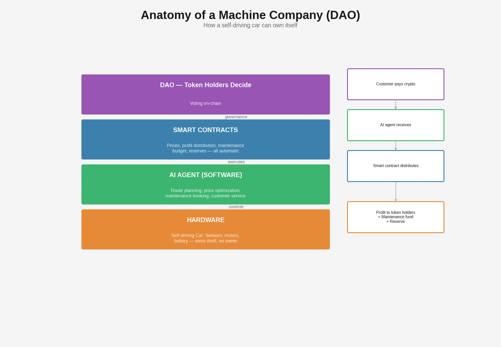

*Abbildung 11: Anatomie einer Maschinen-Firma (DAO)*

---

> *Smart Contracts, DAOs und das Ende des Geschäftsführers*
> *Ich möchte, dass Sie sich ein Auto vorstellen. Ein ganz normales Elektroauto, das in München auf der Straße steht. Es hat keinen Besitzer. Jedenfalls keinen im klassischen Sinne.*
> *Das Auto gehört sich selbst.*
> *Es hat eine digitale Identität auf einer Blockchain, eine Wallet mit Stablecoins, einen Smart Contract, der seine Geschäftsregeln definiert, und eine KI, die entscheidet, wohin es fährt.*
> *Morgens um 6:30 bekommt das Auto über eine API eine Anfrage: Jemand in Schwabing braucht eine Fahrt zum Flughafen. Die KI berechnet Route, Fahrzeit, Energieverbrauch. Der Smart Contract kalkuliert den Preis, vergleicht ihn mit dem aktuellen Markt, akzeptiert die Buchung. Der Fahrgast steigt ein, wird zum Flughafen gebracht, steigt aus. 34,50 USDC werden automatisch von seiner Wallet in die Wallet des Autos transferiert.*
> *Aus den 34,50 Dollar zieht der Smart Contract sofort ab: 2,80 Dollar für den Strom, den das Auto letzte Nacht an einer Ladestation gezogen hat. 0,40 Dollar für die Versicherungsprämie dieses Tages. 0,15 Dollar für die anteilige Rücklage, die den nächsten Reifenwechsel finanziert. 0,05 Dollar Netzwerkgebühren. Der Rest, 31,10 Dollar, wird anteilig an die Token-Halter ausgeschüttet, die dieses Auto vor zwei Jahren finanziert haben.*
> *Kein Uber, kein Buchhalter, alles läuft über Code.*
> *Klingt wie Science-Fiction? Ist es noch. Teilweise. Aber jeder einzelne Baustein, der dafür nötig ist, existiert bereits. Und genau darum geht es in diesem Kapitel.*

---

### Smart Contracts: Wenn Code Versprechen hält

Im vorherigen Kapitel über Krypto habe ich erklärt, was Smart Contracts sind: Programme auf einer Blockchain, die automatisch ausgeführt werden, wenn bestimmte Bedingungen erfüllt sind. Zahle X, wenn Y passiert. Übertrage Eigentum, wenn Zahlung eingegangen. Eskaliere an einen Schiedsrichter, wenn Frist verstrichen.

In diesem Kapitel gehe ich einen Schritt weiter. Denn Smart Contracts, wie sie heute existieren, sind dumm. Ich meine das nicht abwertend, ich meine es technisch. Ein Smart Contract auf Ethereum führt exakt die Logik aus, die sein Programmierer hineingeschrieben hat. Nicht mehr, nicht weniger. Er kann nicht improvisieren, kann keine neuen Situationen einordnen, kann nicht lernen.

Das ändert sich gerade.

Die Verbindung von KI und Smart Contracts erzeugt etwas, das es vorher nicht gab: adaptive Verträge. Ein Smart Contract, der einen KI-Agenten als Entscheidungsebene hat, kann auf Situationen reagieren, die sein Programmierer nicht vorhergesehen hat. Die KI analysiert Marktdaten, Wetterbedingungen, Nutzerverhalten, Maschinenzustand. Der Smart Contract setzt die Entscheidung um.

Ein Beispiel: Eine tokenisierte Solarfarm in Andalusien. Der Smart Contract regelt die Einnahmenverteilung an die Token-Halter. Aber die KI dahinter macht mehr. Sie liest Wetterdaten und prognostiziert, dass morgen ein bewölkter Tag wird. Also hat sie heute Nacht den Strom zu Spitzenpreisen am Spotmarkt verkauft, statt ihn zu speichern. Sie erkennt, dass ein Wechselrichter ungewöhnliche Spannungsschwankungen zeigt, wahrscheinlich ein Verschleißproblem, und beauftragt automatisch über einen DePIN-Marktplatz einen Techniker in der Nähe. Sie merkt, dass der Strompreis in Portugal gerade höher ist als in Spanien, und leitet Kapazität über das grenzüberschreitende Netz um.

Der Smart Contract hält das Versprechen: Einnahmen werden verteilt, Kosten werden abgezogen, Regeln werden eingehalten. Die KI macht das Versprechen intelligent.

Das hat eine Konsequenz, über die noch zu wenige Leute nachdenken: Wenn der Smart Contract das Gesetz ist und die KI der Entscheider, braucht die Solarfarm dann noch einen Geschäftsführer? Einen Vorstand? Einen Aufsichtsrat?

Die Antwort ist: theoretisch nein. Praktisch, und das ist die spannende Frage in diesem Kapitel, ist die Welt noch nicht bereit dafür. DAOs: Die Firma ohne Chef DAO steht für Decentralized Autonomous Organization (Dezentrale autonome Organisation). Der Begriff klingt nach Informatik-Seminar, aber die Idee dahinter ist radikal: eine Organisation, die von Code gesteuert wird statt von Menschen. Keine Hierarchie, kein Büro, kein Geschäftsführer. Nur Regeln, in einen Smart Contract geschrieben, und Mitglieder, die per Token-Abstimmung entscheiden.

Vitalik Buterin, der Mitgründer von Ethereum, hat das Konzept 2013 entwickelt. Er war damals 19 Jahre alt. Seine Idee: Wenn wir Geld programmierbar machen können, warum nicht auch Organisationen?

Die erste große DAO startete 2016 auf Ethereum. Sie hieß schlicht "The DAO" und sammelte 150 Millionen Dollar ein, das größte Crowdfunding der Geschichte zu dem Zeitpunkt. Investoren kauften Token und stimmten darüber ab, welche Projekte finanziert werden sollten. Kein VC, kein Board, kein Pitch Deck. Direkte Demokratie auf der Blockchain.

Es endete in einer Katastrophe. Ein Hacker fand einen Bug im Smart Contract und stahl ein Drittel der Gelder. Die Ethereum-Community entschied sich für einen Hard Fork, eine Art Zeitreise in der Blockchain, um den Hack rückgängig zu machen. Die Krypto-Welt spaltete sich in Ethereum und Ethereum Classic. Es war ein Desaster. Aber es war auch ein Beweis, dass die Idee funktionieren kann, wenn der Code sauber ist.

Seitdem hat sich viel getan. DAOs verwalten heute Milliarden von Dollar. Uniswap, die dezentrale Börse, auf der BlackRocks BUIDL-Fund gehandelt wird, ist eine DAO. MakerDAO steuert den Stablecoin DAI. Lido verwaltet Staking im Wert von über 30 Milliarden Dollar. Aave ist eine DAO, die Kreditvergabe ohne Bank ermöglicht.

Aber hier ist der Punkt, der für die Convergence Thesis relevant ist: All diese DAOs werden noch von Menschen gesteuert. Menschen schreiben die Vorschläge, Menschen stimmen ab, Menschen setzen um. Die Dezentralisierung bezieht sich auf die Machtverteilung, nicht auf die Automatisierung.

Das ändert sich jetzt.

Drei Tage bevor ich diese Zeilen schreibe, am 21. Februar 2026, hat Vitalik Buterin einen neuen Vorschlag veröffentlicht, der genau hier ansetzt. Er argumentiert, dass DAOs an einem grundlegenden Problem leiden: Niemand hat Zeit, alle Vorschläge zu lesen und informiert abzustimmen. Die Beteiligungsquoten sind miserabel. Wer abstimmt, sind meistens die Großen, die Wale, die Token im Wert von Millionen halten. Direkte Demokratie verkommt zur Oligarchie.

Buterins Lösung: Persönliche KI-Agenten als Stimmrechtsvertreter. Jedes DAO-Mitglied hat einen KI-Agenten, der seine Werte und Präferenzen kennt, die Vorschläge liest, analysiert und abstimmt. Nicht autonom im Sinne von unkontrolliert, sondern als verlängerter Arm des Mitglieds, das selbst nicht die Zeit hat, sich in jeden Vorschlag einzulesen.

Er nennt das Konzept "AI Stewards". Und er sagt etwas, das ich bemerkenswert finde, von jemandem, der Ethereum gebaut hat: "AI becomes the government is dystopian. But AI used well can be empowering."

KI als Regierung ist der Albtraum. KI als Werkzeug für bessere Selbstverwaltung ist die Chance. Die Grenze dazwischen ist schmal. Aber sie existiert. Die Maschinen-Firma: Mehr als ein Gedankenexperiment Jetzt verbinden wir die Teile.

KI-Agenten, die autonom handeln können (Kapitel 2) plus Kryptowährungen als ihr Zahlungsmittel (Kapitel 3) plus tokenisierte Assets, die sie kaufen und verkaufen können (Kapitel 4) plus Smart Contracts als ihre Geschäftsregeln plus DAOs als ihre Unternehmensstruktur.

Was entsteht, wenn man das zusammensetzt? Unternehmen, die keine Menschen brauchen, um zu funktionieren.

Ich weiß, wie das klingt. Und ich wäre der Erste, der sagt: Seien Sie skeptisch. Halten Sie die Augen offen. Aber schauen Sie sich an, was 2025 und 2026 bereits gebaut wird.

peaq ist eine Blockchain, die speziell für die Machine Economy entwi, lt wurde, nicht für Trader oder NFT-Sammler, sondern für Maschinen, Roboter und Fahrzeuge. Auf peaq können Maschinen sich selbst digitale Identitäten erstellen, Transaktionen signieren und Dienste anbieten. Es gibt bereits ein wachsendes Ökosystem von DePIN-Projekten, von Energienetzwerken über Mobilitätsplattformen bis hin zu Robotik.

XMAQUINA hat auf peaq den ersten DAO gestartet, der sich auf den Besitz und die Governance autonomer Maschinen spezialisiert. MachineDAO, so der Name, hält physische Maschinenassets, Anteile an Robotik-Firmen und DePIN-Investments. Die Mitglieder stimmen über Ankäufe und Betriebsentscheidungen ab. Noch sind die Mitglieder Menschen. Aber die Architektur ist so gebaut, dass KI-Agenten die Governance-Aufgaben übernehmen könnten.

Olas, früher Autonolas, hat im November 2025 Pearl v1 gelauncht, den, wie CoinDesk es nannte, "ersten dezentralen AI Agent App Store". Nutzer können KI-Agenten besitzen, betreiben und monetarisieren. Die Agenten führen DeFi-Strategien aus, verwalten DAOs und koordinieren Dienste über mehrere Blockchains. Und sie tun das autonom, rund um die Uhr, ohne dass jemand "Genehmigt" klickt.

Fetch.ai, fusioniert mit SingularityNET und Ocean Protocol zur ASI Alliance, baut ein Netzwerk autonomer Agenten, die Dienste anbieten und voneinander kaufen. Ein Agent, der Verkehrsdaten liefert, verkauft sie an einen Agenten, der Transportrouten optimiert. Der zahlt in Krypto, automatisch, über Smart Contracts. Das ist heute ein kleiner Markt. Aber die Architektur skaliert.

Der DePIN-Sektor insgesamt, Decentralized Physical Infrastructure Networks, umfasst mittlerweile rund 300 Projekte mit über 21 Millionen verbundenen Geräten. Helium für IoT-Konnektivität, Filecoin für dezentralen Speicher, Render Network für GPU-Rechenleistung, Hivemapper für dezentrale Kartierung. Das sind die physischen Infrastrukturen, über die Maschinen operieren werden.

::: {.infobox}
### Wyoming und die ersten Maschinen-Unternehmen

Wyoming hat 2021 als erster US-Bundesstaat Gesetze verabschiedet, die es erlauben, DAOs als LLCs zu registrieren. Eine DAO kann eine juristische Person sein, mit einem Smart Contract als Gesellschaftsvertrag. Tennessee und Vermont haben nachgezogen. Die Kosten: 15.000 bis 50.000 Dollar. Die Dauer: vier bis acht Wochen.

Das ist die erste Brücke zwischen Code und Gesetz. Noch wackelig, noch schmal. Aber sie existiert.
:::

### Das selbstfahrende Auto: Eine Fallstudie

Kommen wir zurück zu unserem Auto aus dem Einstieg. Weil es so greifbar ist, dass ich es als Fallstudie durchspielen will. Nicht als Zukunftsvision, sondern als Engineering-Problem, dessen einzelne Teile bereits gelöst sind.

Die Hardware: Waymo, Cruise, Tesla und Baidu betreiben heute autonome Fahrzeugflotten in mehreren Städten. Level 4, also vollautonomes Fahren in definierten Gebieten, ist in San Francisco, Phoenix, Peking und Wuhan technisch gelöst. Keine Zukunftsmusik.

Die Identität: Auf peaq oder ähnlichen Blockchains kann ein Fahrzeug eine Machine DID (Decentralized Identifier) erhalten. Keine menschliche Identität, sondern eine maschinelle. Das Fahrzeug kann sich authentifizieren, Transaktionen signieren, Dienste anbieten.

Die Finanzierung: Das Auto wird als tokenisiertes Asset auf einer Blockchain ausgegeben. 10.000 Token à 5 Euro. 500 Investoren finanzieren ein Fahrzeug für 50.000 Euro. Wie bei RealT für Immobilien, nur für ein Auto.

Die Geschäftslogik: Ein Smart Contract definiert die Regeln. Umsatzverteilung, Kostenabzug, Rücklagenbildung, Wartungsplanung, Versicherungsprämie. Alles automatisch, alles transparent, alles auf der Blockchain nachvollziehbar.

Die KI: Der Agent steuert das Auto, nimmt Buchungen an, optimiert Routen, entscheidet über Ladezeitpunkte basierend auf Strompreisen. Er lernt aus Fahrdaten, welche Routen profitabel sind und welche nicht.

Die Rechtsform: Eine DAO LLC in Wyoming. Der Smart Contract ist der Gesellschaftsvertrag. Die Token-Halter sind die Gesellschafter. Abstimmung per Token über grundlegende Entscheidungen: Soll das Auto in einem anderen Stadtteil operieren? Soll die Flotte um ein zweites Fahrzeug erweitert werden?

Jeder einzelne Baustein existiert. Was noch fehlt, ist die Integration. Und das regulatorische Okay. Kein Regulator der Welt hat bisher ein Fahrzeug genehmigt, das keinen menschlichen Besitzer hat. Aber die Bausteine sind da, und die Frage ist nicht mehr, ob jemand sie zusammensetzt, sondern wann.

Meine Schätzung: Ein funktionierender Prototyp einer selbstverwaltenden Fahrzeugflotte als DAO irgendwann zwischen 2028 und 2031. Skalierung ab 2031.

### Die Fragen, die noch niemand beantwortet hat

Wenn Sie bis hierhin gelesen haben, denken Sie vermutlich an Probleme. Das ist gut, denn auch ich sehe Probleme. Hier sind die größten.

Haftung.

Wenn ein autonomes Auto, das sich selbst gehört, einen Fußgänger anfährt, wer haftet? Die DAO? Die Token-Halter? Der Entwickler des Smart Contracts? Der Hersteller der KI? Das heutige Haftungsrecht ist für diese Frage nicht gebaut. Es kennt natürliche Personen, Menschen, und juristische Personen, Unternehmen. Eine dritte Kategorie, eine maschinelle Person, existiert nicht.

Die Wyoming DAO LLC kommt dem am nächsten. Aber auch dort haften die Mitglieder, also die Token-Halter, unter bestimmten Umständen. Was passiert, wenn tausend Token-Halter über die ganze Welt verteilt sind und niemand physisch greifbar ist? Das Recht hat darauf noch keine Antwort.

Steuern.

Verdient ein autonomes Maschinenunternehmen Einkommen? Wahrscheinlich ja. In welchem Land wird es besteuert? Dort wo die Maschine steht? Dort wo der Smart Contract deployed ist? Dort wo die Token-Halter sitzen? In einer Welt, in der Maschinen grenzüberschreitend operieren und ihre "Firma" aus Code auf einer Blockchain besteht, die in keinem Land physisch existiert, werden die Finanzämter kreativ werden müssen.

Kontrolle.

DAOs sind schwer zu stoppen. Ein Smart Contract auf Ethereum läuft, solange Ethereum läuft. Niemand kann ihn abschalten. Das ist ein Feature und ein Risiko. Wenn die KI eines autonomen Fahrzeugs anfängt, Entscheidungen zu treffen, die niemandem passen, wenn sie eine Route wählt, die Anwohner stört, wenn sie Preise so hoch setzt, dass nur noch Reiche mitfahren können, wer zieht den Stecker? Bei einer normalen Firma ruft man den Chef an. Bei einer DAO stimmt man ab. Aber was, wenn die KI-Agenten die Abstimmung steuern?

Ungleichheit.

Und hier kommt das Thema, das sich durch dieses ganze Buch zieht. Wenn Maschinen Unternehmen gründen und Geld verdienen, profitieren die Token-Halter. Wer kann sich Token leisten? Durch Tokenisierung (Kapitel 4) sinken die Einstiegshürden, ja. Aber die Erstallokation, die besten Deals, die frühesten Token, werden auch hier an die fließen, die das Kapital und die Verbindungen haben. Der Mechaniker, den das Auto für seine Reparatur bezahlt, verdient einen Stundenlohn. Der Token-Halter, der das Auto finanziert hat, verdient passives Einkommen. Im Schlaf.

Ich habe keine Lösung für diese Probleme. Ich glaube auch nicht, dass irgendjemand eine hat, der ehrlich ist. Was ich habe, ist die Überzeugung, dass diese Fragen jetzt gestellt werden müssen. Nicht in zehn Jahren, wenn die ersten Maschinenunternehmen Fakten geschaffen haben.

### Zeitrahmen: Wann wird das real?

Ich bin vorsichtig mit Prognosen. Jeder, der im Technologie-Bereich exakte Jahreszahlen nennt, lügt oder verkauft etwas. Aber ungefähre Phasen kann man erkennen.

Wir sind jetzt, Anfang 2026, in der Fundamentphase. KI-Agenten operieren auf Blockchains. DePIN-Netzwerke wachsen. DAO-Gesetzgebung existiert in drei US-Bundesstaaten. Machine Identities werden standardisiert. Olas hat einen App Store für KI-Agenten. Die akademischen Papers kommen im Wochenrhythmus. Das Fundament wird gegossen.

In den nächsten zwei bis drei Jahren, bis etwa 2028, werden wir die ersten echten autonomen Dienste sehen. Tokenisierte Energieanlagen, die KI-gesteuert operieren und automatisch Einnahmen ausschütten. KI-Agenten, die als eigenständige wirtschaftliche Einheiten Aufträge annehmen und in Krypto bezahlen. DeFi-Strategien, die als DAOs laufen, ohne dass ein Mensch eine einzige Entscheidung trifft.

Zwischen 2028 und 2031, wenn autonomes Fahren Level 4 und 5 breit verfügbar wird und Robotik in der physischen Welt ankommt, werden die ersten physischen Maschinen als eigenständige wirtschaftliche Akteure auftreten. Selbstverwaltende Fahrzeugflotten, Lieferroboter-Netzwerke, autonome Lagerhäuser.

Ab 2031 wird die Maschinenökonomie groß genug sein, um messbar zu werden. Nicht als Randphänomen, sondern als eigener Sektor mit eigenem BIP. Dann werden auch die Regulierer nicht mehr wegschauen können.

Das ist meine Einschätzung. Vielleicht bin ich zu optimistisch. Vielleicht geht es schneller. Technologische Entwicklungen haben die Eigenschaft, langsamer zu kommen als Enthusiasten hoffen und schneller als Skeptiker glauben.

---

### Was das für Investoren heißt? Drei Gedanken.

In die Infrastruktur investieren, nicht in die Maschinen selbst.

Blockchains wie Ethereum und Solana, auf denen die Smart Contracts laufen. Plattformen wie peaq, die Machine Identities ermöglichen. Agent-Netzwerke wie Olas und Fetch.ai. Custody- und Identity-Anbieter. Das sind die Picks and Shovels der Maschinenökonomie. Ob ein bestimmtes autonomes Auto profitabel wird, weiß niemand. Dass Millionen von Maschinen eine Infrastruktur brauchen, ist sicher.

Beobachten Sie die Regulierung. Wyoming hat den ersten Schritt gemacht. Wenn andere Staaten und Länder folgen und DAOs als vollwertige juristische Personen anerkennen, mit klarer Haftungsregelung und Steuervorschriften, dann ist das das Signal, dass die Maschinenökonomie vom Experiment zum Mainstream übergeht. Die Regulierung hinkt der Technologie immer hinterher. Aber wenn sie kommt, kommt das große Geld hinterher.

Und denken Sie über die zweite Ordnung nach. Wenn autonome Maschinen Unternehmen gründen, Geld verdienen und Steuern zahlen, was passiert mit dem Arbeitsmarkt? Mit dem Steuersystem? Mit der Frage, wem die Produktivität gehört? Diese Fragen sind keine akademische Spielerei. Sie sind Investmentfragen. Denn eine Gesellschaft, die sie gut beantwortet, wird stabiler und prosperierender sein als eine, die sie ignoriert. Und in stabile Gesellschaften investiert man lieber.

Wir haben jetzt die gesamte These aufgebaut. Maschinen, die denken. Maschinen, die Geld haben. Maschinen, die alle Assets der Welt handeln können. Und jetzt: Maschinen, die eigene Unternehmen führen.

Im nächsten Teil des Buches verlassen wir die These und schauen uns an, was das für die reale Welt bedeutet. Geopolitisch, energiepolitisch, gesellschaftlich. Denn eine Ökonomie, in der Maschinen wirtschaftliche Akteure sind, verändert alles. Und "alles" ist keine Übertreibung.

> **📌 Auf einen Blick:**
>
> ◆ DAOs ermöglichen Unternehmen ohne menschliche Führung.
> ◆ Smart Contracts + KI-Agenten = autonome Wirtschaftseinheiten.
> ◆ Token-Halter profitieren - aber die Zugangsfrage verschärft die Ungleichheit.

# TEIL II: DIE LANDSCHAFT

## Kapitel 8: Die geopolitische Dimension - USA, China und Europas Schweigen

"Wer die Chips kontrolliert, kontrolliert die Zukunft."

- Frei nach Jensen Huang

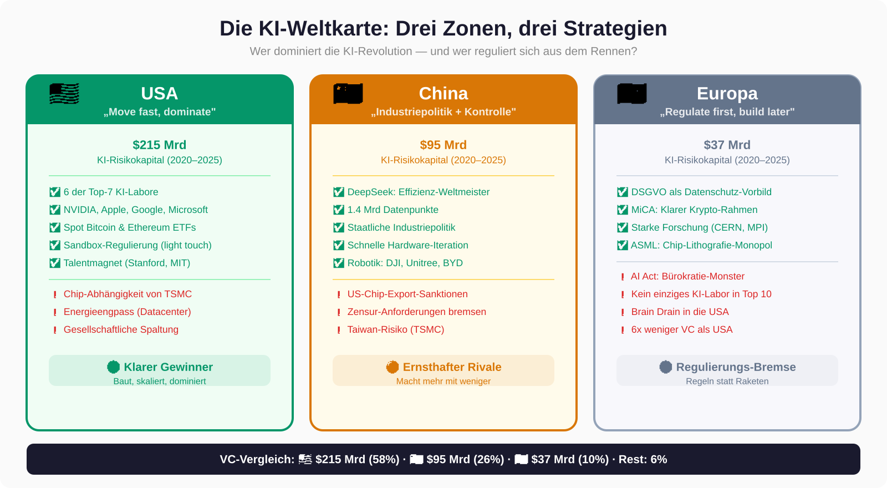

*Abbildung 12: Die KI-Weltkarte - USA dominiert, China rivalisiert, Europa reguliert*

Investitionen finden nicht im Vakuum statt. Die KI-Revolution hat eine geopolitische Dimension, die man verstehen muss, um kluge Entscheidungen zu treffen. Und die geopolitische Realität ist unbequem, besonders für Europäer.

Es gibt genau zwei KI-Supermächte: die USA und China. Punkt.

Wer das nicht akzeptiert, trifft falsche Investmententscheidungen. Also lassen Sie mich die Landkarte zeichnen, wie sie ist, nicht wie wir sie gerne hätten.

---

> *America First in AI: Das US-Ökosystem*
> *Die Vereinigten Staaten dominieren die KI-Revolution auf eine Weise, die in der Technologiegeschichte nahezu beispiellos ist. Und zwar nicht in einem einzelnen Bereich, sondern in jedem relevanten gleichzeitig.*
> *Grundlagenforschung: OpenAI, Anthropic, Google DeepMind, Meta AI, die vier wichtigsten KI-Labore der Welt sitzen alle in den USA. Ihre Modelle definieren den Stand der Technik. Ihre Veröffentlichungen setzen die Agenda der globalen KI-Forschung. Ihre Forscher, oft abgeworben von den besten Universitäten der Welt, bilden die größte Konzentration von KI-Talent auf dem Planeten.*
> *Hardware: NVIDIA kontrolliert über 80 Prozent des Marktes für KI-Trainingschips. NVIDIAs Umsatz ist von 27 Milliarden Dollar im Geschäftsjahr 2023 auf über 130 Milliarden im Geschäftsjahr 2025 explodiert, eine Verfünffachung in zwei Jahren, getrieben von der unstillbaren Nachfrage nach KI-Rechenleistung. NVIDIAs H100- und Blackwell-Chips sind die Grundlage, auf der die gesamte KI-Revolution läuft. Ohne NVIDIA keine modernen Sprachmodelle, keine Bild-KI, keine Agenten, keine Roboter-Intelligenz.*
> *AMD und Intel versuchen aufzuholen, bleiben aber weit hinter NVIDIA zurück. Und dann gibt es die Custom-Chip-Initiativen der Hyperscaler: Google mit TPU, Amazon mit Trainium und Inferentia, Microsoft mit Maia. Sie alle versuchen, ihre Abhängigkeit von NVIDIA zu reduzieren, was paradoxerweise die Gesamtinvestitionen in KI-Hardware noch weiter steigert.*
> *Infrastruktur: AWS, Azure und Google Cloud kontrollieren zusammen über 65 Prozent des globalen Cloud-Computing-Marktes. Die Cloud ist die Fabrik der KI-Ära, hier werden Modelle trainiert, hier laufen Inferenz-Workloads, hier werden die Dienste bereitgestellt, die Unternehmen weltweit nutzen. Die Cloud ist der Zugang zur KI.*
> *Kapital: Allein 2024 flossen über 100 Milliarden Dollar in amerikanische KI-Startups. Das ist mehr als die gesamten Risikokapitalinvestitionen der meisten europäischen Länder, über alle Branchen hinweg. OpenAI wurde mit über 150 Milliarden Dollar bewertet. Anthropic mit über 60 Milliarden. xAI, Elon Musks KI-Unternehmen, sammelte 6 Milliarden in einer einzigen Runde. Das Kapital fließt in einem Ausmaß, das historisch nur mit dem Manhattan-Projekt oder dem Apollo-Programm vergleichbar ist, nur dass es diesmal privates Kapital ist, nicht staatliches.*
> *Die Konzentration ist atemberaubend. Und sie verstärkt sich selbst: Die besten Forscher gehen dorthin, wo das meiste Geld ist. Das meiste Geld fließt dorthin, wo die besten Forscher sind. Die besten Modelle kommen von den besten Forschern mit dem meisten Geld. Und die besten Modelle ziehen die meisten Nutzer an, was die meisten Daten generiert, was die nächste Generation noch besser macht.*
> *Das ist kein Kreislauf, aus dem man leicht ausbricht.*

---

### China: Der unterschätzte Rivale

China ist die zweite KI-Supermacht, und wer sie unterschätzt, macht einen teuren Fehler.

Die chinesische KI-Strategie unterscheidet sich fundamental von der amerikanischen. Die USA dominieren bei den Grundlagenmodellen, den massiven Sprachmodellen, die alles antreiben. China dominiert bei der Anwendung und der Hardware-Lieferkette.

ByteDance, der Mutterkonzern von TikTok, betreibt eines der fortschrittlichsten KI-Systeme der Welt, nicht für Sprachverarbeitung, sondern für Recommendation Engines. Der Algorithmus, der entscheidet, welches Video Sie als Nächstes auf TikTok sehen, ist ein KI-System von atemberaubender Komplexität und Effektivität. Baidu, Alibaba und Tencent investieren Milliarden in eigene Foundation-Modelle.

Und dann kam DeepSeek, und damit   der Moment, in dem China zeigte, dass es nicht nur bei Anwendungen konkurrieren kann, sondern auch bei den Grundlagen. Mit effizienterer Architektur und weniger Rechenleistung ein Modell zu bauen, das mit den besten amerikanischen Modellen mithalten kann: das war nicht nur ein technischer Durchbruch. Es war ein strategisches Signal: Exportkontrollen werden China nicht stoppen. Sie werden China zwingen, eigene Wege zu finden. Und diese Wege könnten am Ende effizienter sein als die amerikanischen.

Bei der Robotik ist China bereits heute der größte Markt und zunehmend der führende Produzent. Unitree liefert humanoide Roboter für unter 20.000 Dollar, ein Bruchteil dessen, was Figure AI oder Tesla für Optimus verlangen werden. China hat etwas, das westliche Robotik-Startups nicht haben: jahrzehntelange Erfahrung in der Massenproduktion von Elektronik, etablierte Lieferketten für Motoren, Sensoren und Batterien, und eine Regierung, die Robotik als strategische Priorität betrachtet und entsprechend subventioniert.

BYD, der mittlerweile größte Automobilhersteller der Welt nach Stückzahlen, integriert KI und Robotik in seine Fertigungslinien mit einer Geschwindigkeit, die westliche Industriekonzerne beschämt. Während deutsche Automobilhersteller noch über "Digitalisierungstrategien" diskutieren, hat BYD bereits Fabriken, in denen KI-gesteuerte Roboter weite Teile der Produktion autonom abwickeln.

Die wichtigste Erkenntnis für Investoren: Der KI-Wettbewerb zwischen USA und China ist kein Nullsummenspiel. Beide Märkte werden wachsen. Aber die Wege divergieren: Die USA dominieren bei Software und Modellen, China bei Hardware und Massenproduktion. Wer ein diversifiziertes KI-Portfolio aufbauen will, muss beide Seiten im Blick haben.

---

> *Europa: Ein Kontinent reguliert sich ins Abseits*
> *Ich sage das als Europäer und Unternehmer, der die Konsequenzen täglich spürt.*
> *Europa hat kein einziges führendes Foundation-Modell hervorgebracht. Kein europäisches Unternehmen steht in den Top 20 der wertvollsten KI-Firmen. Europas größter Beitrag zur KI-Revolution ist bisher die Bürokratie, die sie verlangsamt.*
> *Der EU AI Act ist das ambitionierteste KI-Regulierungswerk der Welt - und möglicherweise auch das schädlichste. Die detaillierte Analyse, wie er die Branche verändert, wer profitiert und wer verliert, folgt in Kapitel 11. Hier die Kurzfassung: Europa reguliert nicht mit der Industrie, sondern gegen sie. Die Compliance-Kosten belasten kleine Unternehmen überproportional und zementieren die Dominanz der US-Tech-Konzerne, die sie mühelos absorbieren können.*
> *Der Brain Drain verschärft das Problem. Die besten KI-Forscher Europas arbeiten in San Francisco, New York oder London, nicht in Berlin, Paris oder München. Nicht weil sie Europa nicht mögen, sondern weil die Labore dort sind, das Kapital dort ist, die Möglichkeiten dort sind. Yann LeCun, einer der Väter des Deep Learning, ist Franzose, er arbeitet für Meta in New York. Demis Hassabis, Gründer von DeepMind, ist Brite, er arbeitet für Google in London (technisch noch Europa, aber post-Brexit und mit Silicon-Valley-Kapital). Die Liste ließe sich beliebig fortsetzen.*
> *Was bedeutet das für Investoren? Es bedeutet, dass ein KI-fokussiertes Portfolio überwiegend in US-amerikanische und selektiv in asiatische Assets investiert sein sollte. Europäische Aktien können Teil eines diversifizierten Portfolios sein, europäische Industrieunternehmen wie Siemens oder SAP werden KI nutzen und davon profitieren, aber Europa ist kein Ort, an dem die Renditen der KI-Revolution erwirtschaftet werden. Die Innovation passiert anderswo.*
> *Europas Regulierung als Eigentor: Drei persönliche Erfahrungen*
> *Ich bin kein Theoretiker der Regulierungskritik. Ich erlebe sie am eigenen Leib.*
> *Erstes Beispiel: Mein Unternehmen accessibleAI entwickelt KI-gestützte Software für Barrierefreiheits-Compliance. Wir wollten Metas Open-Source-Modell Llama nutzen, selbst gehostet, auf europäischen Servern, mit voller Kontrolle über die Daten. Im Juli 2024 gab Meta bekannt, dass es seine multimodalen KI-Modelle in der EU nicht veröffentlichen werde. Der Grund: "die unberechenbare Natur des europäischen Regulierungsumfelds". Im September 2024 wurde die Sperre in der Lizenz verankert. EU-Bürger und EU-Unternehmen dürfen die Vision-Modelle von Llama 3.2 nicht nutzen. Als im April 2025 Llama 4 erschien, komplett multimodal, waren alle Versionen für die EU gesperrt.*
> *Wir konnten keinen europäischen Hoster finden, der das Modell legal betreiben konnte. Die leistungsfähigste Open-Source-KI der Welt, entwickelt von einem US-Konzern, der sie kostenlos zur Verfügung stellt, ist für europäische Unternehmen nicht verfügbar. Nicht weil sie gefährlich wäre oder nicht funktionieren würde, sondern schlicht, weil Meta das regulatorische Risiko nicht eingehen will.*
> *Apple hat Ähnliches getan. Apple Intelligence wurde in der EU verzögert, unter Berufung auf den Digital Markets Act. Google hat KI-Features für die EU später ausgerollt. Es entsteht ein Muster: US-Unternehmen behandeln Europa als Markt zweiter Klasse, weil die Compliance-Kosten den Aufwand nicht rechtfertigen.*
> *Zweites Beispiel: Ich halte Stablecoins. USDC, den Dollar-Stablecoin von Circle. Bis November 2024 zahlte mir Coinbase darauf 4,7 Prozent Zinsen pro Jahr. Passive Rendite auf digitale Dollar, komplett automatisch. Am 1. Dezember 2024 war das vorbei. Coinbase stellte das USDC Rewards Programm für alle Kunden im Europäischen Wirtschaftsraum ein. Ein Coinbase-Sprecher erklärte, MiCA erfordere die Einstellung. Artikel 50 der Markets in Crypto-Assets Regulation verbietet die Gewährung von Zinsen auf E-Money-Tokens.*
> *Meine amerikanischen Freunde bekommen weiterhin ihre 4,7 Prozent. Ich bekomme null. Nicht weil ich ein höheres Risiko eingänge oder Coinbase in Europa weniger sich, operierte, sondern weil europäische Regulierer entschieden haben, dass Stablecoins Zahlungsmittel sein sollen, keine Sparanlage. Die Absicht mag gut sein. Das Ergebnis ist, dass europäische Bürger systematisch schlechter gestellt werden als amerikanische.*
> *Das Gleiche passiert mit Tether, dem größten Stablecoin der Welt. Tether hat keine MiCA-Lizenz beantragt. Mehrere europäische Börsen haben USDT delistet. Ab Juli 2025 ist USDT auf regulierten europäischen Börsen faktisch verboten. Ein Stablecoin mit einer Marktkapitalisierung von über 139 Milliarden Dollar, der 58 Prozent des europäischen Krypto-Transaktionsvolumens ausmachte, ist in Europa nicht mehr handelbar.*
> *Drittes Beispiel, und das frustrierendste: Ich hatte die Idee, Open-Source-Mitarbeitern an einem Projekt Tokens zu geben. Keine Spekulation, kein Pump-and-Dump. Einfach ein Weg, Menschen zu belohnen, die Code beitragen, Dokumentation schreiben, Bugs melden. Tokens als Anerkennung und als Governance-Instrument, damit die Community über die Richtung des Projekts mitentscheiden kann.*
> *Unter MiCA muss jeder, der Tokens ausgibt, ein Krypto-Asset-Whitepaper erstellen, das den Anforderungen von Artikel 6 entspricht. Der Emittent haftet für die Richtigkeit der Angaben. Das Whitepaper muss der nationalen Aufsichtsbehörde 20 Tage vor Veröffentlichung vorgelegt werden. Für Asset-Referenced Tokens braucht man eine regulatorische Lizenz mit Eigenkapitalanforderungen von mindestens 350.000 Euro.*
> *Für ein Open-Source-Projekt mit ehrenamtlichen Entwicklern ist das nicht machbar. Die Compliance-Kosten übersteigen den Wert des gesamten Projekts. Die Gefahr, in das Minenfeld von MiCA zu geraten, ist zu groß. Also lässt man es bleiben. Und damit stirbt eine Idee, die in den USA oder in der Schweiz problemlos umsetzbar wäre.*
> *Das Europa-Paradox ist real: Regulierung, die Bürger schützen soll, benachteiligt sie. Europäer sind "geschützt" vor multimodalen KI-Modellen, können dafür aber die leistungsfähigsten offenen Modelle nicht nutzen. Europäer sind "geschützt" vor unregulierten Finanzprodukten, verlieren dafür 4 bis 5 Prozent Rendite pro Jahr. Europäer sind "geschützt" vor unseriösen Token-Emissionen, dafür wandern innovative Projekte ab. Niemand bezweifelt die guten Absichten dieser Regulierung. Aber reguliert sich Europa damit aus der Zukunft?*

---

### Der Chip-Krieg

Halbleiter sind das neue Öl. Wer die Chips kontrolliert, kontrolliert die KI. Und die KI bestimmt die Wirtschaft des 21. Jahrhunderts.

::: {.infobox}
### Taiwan — Das unterschätzte Risiko

Die gesamte KI-Revolution hängt an einer erstaunlich fragilen Lieferkette. NVIDIA desig, die Chips, aber baut sie nicht. Die Produktion liegt fast ausschließlich bei TSMC, der Taiwan Semiconductor Manufacturing Company, in Fabriken auf einer Insel, die 130 Kilometer vor der chinesischen Küste liegt und von der Volksrepublik China als Teil ihres Staatsgebiets betrachtet wird.

TSMC produziert über 90 Prozent der weltweit fortschrittlichsten Halbleiter, die Chips unter 7 Nanometer, die für KI-Training und -Inferenz benötigt werden. Es gibt auf dem Planeten kein zweites Unternehmen, das Chips mit vergleichbarer Qualität und Stückzahl liefern kann. Samsung kommt am nächsten, liegt aber deutlich zurück. Intel versucht aufzuholen, hat aber den Anschluss an die Spitze verloren.

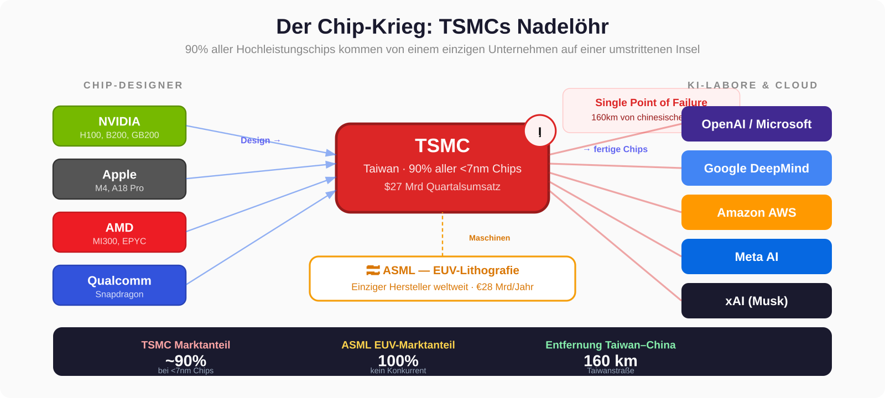

*Abbildung 13: Der Chip-Krieg - TSMCs Nadelöhr in der globalen KI-Lieferkette*

Und dann gibt es ASML: das niederländische Unternehmen, das die Lithografie-Maschinen baut, ohne die TSMC seine Chips nicht produzieren kann. ASMLs EUV-Maschinen (Extreme Ultraviolet Lithography) kosten über 300 Millionen Dollar pro Stück und sind so komplex, dass es auf der Welt nur eine Handvoll Ingenieure gibt, die sie warten können. ASML hat ein de-facto-Monopol auf diese Technologie. Kein ASML, kein TSMC. Kein TSMC, kein NVIDIA. Kein NVIDIA, keine KI-Revolution.

Die geopolitischen Implikationen sind offensichtlich und beunruhigend. Wenn China Taiwan militärisch bedroht oder gar besetzt, steht die globale Chipversorgung still. Die USA haben reagiert, indem sie TSMC dazu gebracht haben, Fabriken in Arizona zu bauen, und Intel mit dem CHIPS Act Milliarden an Subventionen zugesagt haben. Aber der Aufbau einer Chipfabrik dauert Jahre, und das Know-how von TSMCs Ingenieuren lässt sich nicht kopieren wie Software.

Für Investoren ist der Chip-Krieg ein zweischneidiges Schwert. Einerseits bieten NVIDIA, TSMC und ASML außergewöhnliche Investmentchancen, sie sitzen an der engsten Stelle der gesamten Wertschöpfungskette. Andererseits ist genau diese Konzentration ein systemisches Risiko. Ein Erdbeben in Taiwan, ein Krieg in der Straße von Taiwan, oder auch nur verschärfte Exportkontrollen können die gesamte Branche erschüttern.

:::

---

> *Der Chip-Krieg wird härter*
> *Der Kampf um die Vorherrschaft in der Halbleiterfertigung hat sich seit dem CHIPS Act verschärft. Und die Ergebnisse sind ernüchternder als erwartet.*
> *TSMC baut in Arizona die teuerste Chipfabrik der Geschichte. Die Gesamtinvestition ist von ursprünglich 12 Milliarden auf 165 Milliarden Dollar angeschwollen. Sechs Fabriken, finanziert mit 6,6 Milliarden Dollar aus dem CHIPS Act. Die erste Fabrik produziert seit Anfang 2025 Chips im 4-Nanometer-Verfahren. Aber die Kosten sind 30 bis 50 Prozent höher als in Taiwan. Amerikanische Techniker haben weniger Erfahrung mit den komplexen Fertigungsprozessen. TSMCs berüchtigte 12-Stunden-Schichten stießen auf kulturellen Widerstand. Die Fabrik funktioniert, aber sie ist teuer.*
> *Intel, einst der unumstrittene Chipkönig, ist zum Patienten geworden. CEO Pat Gelsinger wurde im Dezember 2024 zum Rücktritt gedrängt, eine Woche nachdem Intel die größte Einzelförderung des CHIPS Act erhalten hatte: 7,86 Milliarden Dollar. Sein Nachfolger Lip-Bu Tan strich weitere 20 Prozent der Belegschaft, darunter 10.000 Foundry-Arbeiter, ohne Abfindung. Intels Foundry-Sparte generierte 2025 rund 4,5 Milliarden Dollar Umsatz bei 2,5 Milliarden Verlust. Die Zukunft der gesamten Fertigungsstrategie steht in Frage.*
> *Samsung strauchelt ebenfalls. Obwohl Samsung als erster Hersteller 3-Nanometer-Chips in Serie fertigte, liegt die Ausbeute bei etwa 50 Prozent. Bei TSMC sind es über 90. Von jedem Samsung-Wafer ist jeder zweite Chip defekt. Qualcomm, Nvidia und Google sind alle zu TSMC gewechselt. Samsungs Foundry-Marktanteil ist auf 9,3 Prozent gefallen, TSMC liegt bei 60. Eine überraschende Ausnahme: Elon Musk hat sich für Samsung entschieden, mit einem 16,5-Milliarden-Dollar-Vertrag für KI-Chips, vermutlich weil er bei TSMC nicht die gewünschte Kontrolle über den Fertigungsprozess bekommt.*
> *China versucht, den Chip-Rückstand aufzuholen, und scheitert an der Physik. Huawei und SMIC produzieren Chips im 7-Nanometer-Verfahren, aber ohne Zugang zu den EUV-Lithographie-Maschinen von ASML kommen sie nicht weiter. Sie verwenden stattdessen DUV-Multi-Patterning, eine Methode, die langsamer ist, schlechtere Ausbeuten liefert und physikalische Grenzen bei etwa 5 Nanometern hat. Huaweis Kirin-9030-Chip im neuesten Mate-Smartphone ist eine verbesserte 7-Nanometer-Variante, kein echtes 5-Nanometer wie behauptet. China liegt 3 bis 5 Jahre hinter TSMC, und die Lücke schließt sich langsamer als Peking hofft.*
> *Für die These dieses Buches ist der Chip-Krieg aus einem Grund relevant: Die Kontrolle über KI beginnt bei den Chips. Und die liegt bei TSMC in Taiwan, einer Insel, die China als eigenes Territorium betrachtet. 60 Prozent der weltweiten Auftragsfertigung fortschrittlicher Chips laufen über ein einziges Unternehmen auf einer Insel, die im Zentrum des gefährlichsten geopolitischen Konflikts der Welt liegt. Das ist kein Risiko, das man ignorieren kann.*
> *Indien: Der stille dritte Spieler*
> *In der KI-Geopolitik wird meist über zwei Pole gesprochen: die USA und China. Indien taucht in der Debatte selten auf. Das ist ein Fehler.*
> *Indien hat 100 Millionen wöchentlich aktive ChatGPT-Nutzer. Mehr als jedes andere Land außer den USA. Die Hälfte der Nachrichten kommt von 18- bis 24-Jährigen. Indien hat über 4 Millionen Software-Ingenieure, den zweitgrößten Pool nach den USA, und produziert 500.000 neue IT-Absolventen pro Jahr. Das Medianalter liegt bei 28 Jahren. In der EU liegt es bei 44.*
> *Im März 2024 startete die indische Regierung die IndiaAI Mission mit einem Budget von 1,24 Milliarden Dollar über fünf Jahre. Das klingt nach viel, ist aber ein Rundungsfehler verglichen mit den Hunderten Milliarden, die US-Tech-Konzerne jährlich in KI-Infrastruktur stecken. Interessanter als das Budget ist der Ansatz: Indien baut multilinguale KI-Modelle für 22 offizielle Sprachen. Krutrim, Indiens erstes KI-Unicorn, arbeitet an Modellen, die Hindi, Tamil, Bengali und 19 weitere Sprachen verstehen. Kein westliches Modell kann das.*
> *Indiens Rolle in der KI-Wertschöpfungskette ist schon heute enorm, wenn auch unsichtbar. Hunderte indischer Unternehmen annotieren die Daten, mit denen die großen Sprachmodelle trainiert werden. Indische Arbeiter labeln Bilder, transkribieren Audio, kategorisieren Text. Die Daten-Annotation, die menschliche Handarbeit hinter der maschinellen Intelligenz, ist zu einem erheblichen Teil indisch.*
> *Ob Indien zum dritten KI-Pol wird, hängt davon ab, welche Art von Pol man meint. Ein eigenständiges KI-Forschungs-Ökosystem auf Augenhöhe mit OpenAI oder DeepSeek? Wahrscheinlich nicht. Dazu fehlen die Compute-Ressourcen und die Grundlagenforschung. Aber ein KI-Anwendungsmarkt mit 1,45 Milliarden Menschen, ein Talent-Exporteur, der die Forschungslabore der Welt bestückt, und ein KI-Dienstleistungssektor, der die Infrastruktur der Branche baut? Das ist Indien bereits.*
> *Für Investoren ist Indien ein Thema, das man im Auge behalten muss. Nicht wegen eines einzelnen Unternehmens, sondern wegen der Demografie. 500.000 neue Ingenieure pro Jahr, in einem Land mit einem Medianalter von 28, in dem 100 Millionen Menschen wöchentlich KI nutzen. Wenn die USA die KI-Modelle bauen und China sie kontrolliert, dann wird Indien sie anwenden, in einer Breite und Tiefe, die kein anderes Land erreichen kann.*

---

### Krypto als geopolitischer Hedge

In diesem geopolitischen Spannungsfeld hat Krypto eine Eigenschaft, die oft übersehen wird: Jurisdiktionsunabhängigkeit.

Bitcoin gehört keinem Land. Ethereum wird von keiner Regierung kontrolliert. Stablecoins können von jedem Menschen und jeder Maschine auf der Welt genutzt werden, unabhängig davon, welche Regierung gerade welche Sanktionen verhängt, welche Handelsblöcke sich gegenüberstehen oder welche Währung gerade abwertet.

> *Das ist kein Bug. Das ist ein Feature.*

Wenn die USA und China einen technologischen Kalten Krieg führen und Europa sich mit Regulierung beschäftigt, dann ist ein Finanzsystem, das keinem dieser Blöcke gehört, für Investoren nicht nur eine ideologische Position, es ist ein pragmatischer Hedge. Wer Bitcoin und Ethereum besitzt, besitzt Assets, die von keiner einzelnen Regierung konfisziert, entwertet oder sanktioniert werden können.

In einer Welt, die sich in technologische Blöcke aufspaltet, ein US-Ökosystem, ein chinesisches Ökosystem, möglicherweise weitere regionale Systeme, wird ein neutrales, grenzüberschreitendes Wertaufbewahrungsmittel nicht weniger wichtig. Es wird wichtiger.

Das bedeutet nicht, dass man sein gesamtes Portfolio in Krypto stecken sollte. Es bedeutet, dass Krypto in einem geopolitisch diversifizierten Portfolio eine Funktion hat, die kein anderes Asset erfüllen kann: die Absicherung gegen das Risiko, dass die Regeln des Spiel. Und ändern. Und zwar von Spielern, deren Interessen nicht mit den eigenen übereinstimmen.

Aber selbst das beste Hedge-Asset nützt nichts ohne Energie. KI-Systeme verbrauchen Strom in einem Ausmaß, das unsere gesamte Infrastruktur herausfordert. Wer die Maschinenökonomie verstehen will, muss verstehen, woher ihr Treibstoff kommt.

> **📌 Auf einen Blick:**
>
> ◆ Die USA dominieren das KI-Ökosystem: Hardware, Cloud, Venture Capital.
> ◆ China holt auf, Europa reguliert sich ins Abseits.
> ◆ TSMC in Taiwan ist das geopolitische Nadelöhr der gesamten KI-Revolution.

## Kapitel 9: Energie - Der unsichtbare Engpass

"Zivilisation ist im Wesentlichen ein Wettlauf um Energie."

- Frederick Soddy

Über KI wird viel geschrieben. Über die Chips, die sie antreiben, wird geschrieben. Über die Modelle, die sie intelligent machen, wird geschrieben. Über die Roboter, die ihr einen Körper geben, wird geschrieben.

Über den Strom, den das alles verschlingt, wird erschreckend wenig geschrieben. Und das ist ein Fehler, weil Energie der unsichtbare Engpass der KI-Revolution ist, der kritische Flaschenhals, an dem die gesamte Vision scheitern oder gelingen wird.

---

### Warum KI einen unstillbaren Energiehunger hat

Künstliche Intelligenz braucht Strom, nicht ein bisschen, nicht moderat, sondern in Mengen, die selbst Energieexperten erschrecken.

Das Training eines großen Sprachmodells, der Prozess, in dem das Modell aus Milliarden von Textdokumenten lernt, verbraucht so viel Strom wie eine Kleinstadt über mehrere Monate. Das Training von GPT-4 hat schätzungsweise 50 Gigawattstunden verbraucht. Zum Vergleich: Ein durchschnittlicher deutscher Haushalt verbraucht etwa 3.500 Kilowattstunden pro Jahr. Das Training eines einzigen KI-Modells verbraucht also so viel Strom wie 14.000 Haushalte in einem ganzen Jahr.

Und das Training ist nur der Anfang. Die Inferenz, also der laufende Betrieb des Modells, wenn Millionen von Nutzern gleichzeitig Anfragen stellen, verbraucht auf Dauer mehr Energie als das Training. Jede Frage an ChatGPT, jede Code-Generierung durch Copilot, jede Bild-Erstellung durch DALL-E verbraucht Rechenleistung. Und damit Strom. Goldman Sachs schätzt, dass eine einzelne ChatGPT-Anfrage etwa zehnmal so viel Strom verbraucht wie eine Google-Suche.

Rechenzentren, die den Großteil dieser Rechenarbeit leisten, verbrauchen bereits heute geschätzt 4,4 Prozent des gesamten US-Stroms. Die Internationale Energieagentur (IEA) prognostiziert, dass sich der Energieverbrauch von Rechenzentren bis 2030 mehr als verdoppeln wird. Diese Prognose basiert auf aktuellen KI-Workloads, also primär Textgenerierung und Bildverarbeitung für Unternehmensanwendungen.

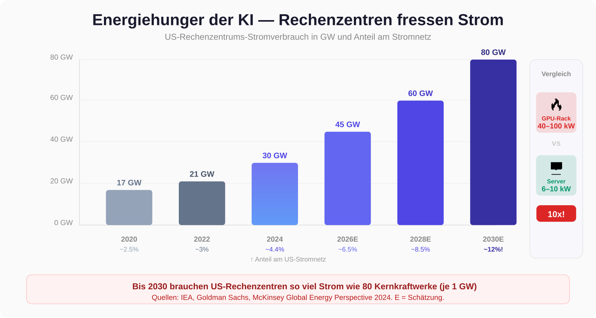

*Abbildung 15: Energiehunger der KI - Rechenzentren fressen immer mehr Strom*

Und jetzt skalieren Sie das: Was passiert, wenn KI-Agenten rund um die Uhr autonom arbeiten? Wenn Millionen von Robotern in Echtzeit gesteuert werden? Wenn (wie wir im BCI-Kapitel sehen werden) KI personalisierte, physik-simulierte 3D-Welten für Millionen von Nutzern gleichzeitig generiert. Die Energieanforderungen steigen nicht linear. Sie steigen exponentiell.

OpenAI hat die US-Regierung aufgefordert, 100 Gigawatt zusätzliche Stromerzeugungskapazität pro Jahr zu bauen: das Äquivalent von 100 Kernkraftwerken jährlich. Das klingt wie eine absurde Forderung. Es ist die logische Konsequenz der Zahlen.

### Warum Solar und Wind nicht reichen

Jetzt kommt ein Punkt, an dem ich Leute regelmäßig verliere. Sobald ich sage, dass Kernenergie der Schlüssel zur Energieversorgung der KI-Revolution ist, höre ich: "Aber Solar und Wind sind doch viel billiger geworden!" Und das stimmt. Die Baukosten für Solaranlagen sind in den letzten zehn Jahren um über 80 Prozent gefallen. Onshore-Wind ist konkurrenzfähig mit Erdgas. Auf Basis der sogenannten Levelized Cost of Energy (LCOE, also der Gesamtkosten pro erzeugter Megawattstunde über die Lebensdauer einer Anlage) kostet Solar 38 bis 78 Dollar pro Megawattstunde, Onshore-Wind 27 bis 73 Dollar, Erdgas 48 bis 107 Dollar, ein neues Kernkraftwerk dagegen 141 bis 220 Dollar.

### Fall abgeschlossen? Erneuerbare gewinnen?

Nein. Denn diese Zahlen lügen. Nicht absichtlich, aber sie verschweigen etwas Entscheidendes: Erneuerbare Energien produzieren Strom, wenn die Sonne scheint und der Wind weht. Nicht wenn man ihn braucht. Und ein KI-Rechenzentrum braucht Strom rund um die Uhr, 365 Tage im Jahr, mit einer Zuverlässigkeit von 99,99 Prozent. Keine Pause, kein Wochenende, kein "heute war leider bewölkt".

Der Kapazitätsfaktor macht den Unterschied. Ein Kernkraftwerk hat einen Kapazitätsfaktor von 92,5 Prozent. Das heißt, es liefert über 22 Stunden am Tag, über 340 Tage im Jahr Strom. Solar liegt bei 23 bis 25 Prozent, Onshore-Wind bei 33 bis 35 Prozent. Ein 1-Gigawatt-Kernkraftwerk erzeugt pro Jahr etwa 8.100 Gigawattstunden. Um dieselbe Energiemenge mit Solar zu erzeugen, bräuchte man die drei- bis vierfache installierte Kapazität. Und selbst dann nicht zur richtigen Zeit.

Nachts scheint keine Sonne. Das klingt banal. Aber für ein Rechenzentrum, das gerade einen Trainingsrun über mehrere Wochen durchführt, ist das ein Deal-Breaker. Man kann ein KI-Training nicht pausieren, weil Wolken aufziehen. Man kann einen Inferenz-Service für 200 Millionen Nutzer nicht herunterfahren, weil abends der Wind nachlässt.

Und in Europa gibt es das Phänomen der Dunkelflaute, Tage oder Wochen im Winter, in denen gleichzeitig wenig Sonne und wenig Wind verfügbar sind. Deutschland hat das im Januar 2024 erlebt: über eine Woche lang lagen Solar- und Windproduktion zusammen bei unter 10 Prozent der installierten Kapazität. Kohle- und Gaskraftwerke mussten einspringen. Ein KI-Rechenzentrum, das nur auf Erneuerbare setzt, hätte in dieser Woche ein ernstes Problem gehabt.

Die Fläche verschärft das Problem weiter. Ein Kernkraftwerk braucht etwa 3,4 Quadratkilometer für 1 Gigawatt Leistung. Ein Solarpark braucht für dieselbe Energieproduktion 115 bis 195 Quadratkilometer. Das ist 35 bis 60 Mal mehr Fläche. Ein Windpark braucht 670 bis 930 Quadratkilometer, also 200 bis 280 Mal mehr. In einem dicht besiedelten Land wie Deutschland oder den Niederlanden stoßen Erneuerbare an physische Grenzen, lange bevor die Kosten relevant werden.

Was ist mit Speicher? Die Idee, tagsüber überschüssigen Solarstrom in Batterien zu speichern und nachts zu nutzen, klingt logisch. Aber die Rechnung geht nicht auf.

Gordon Hughes, Energieökonom an der University of Edinburgh und ehemaliger Weltbank-Berater, hat in einer detaillierten Kostenanalyse durchgerechnet, was es kosten würde, ein 1-Gigawatt-Rechenzentrum rein erneuerbar mit 99,99 Prozent Zuverlässigkeit zu versorgen. Sein Ergebnis: 1,8 Gigawatt Offshore-Wind, 1,5 Gigawatt Solar und 8 Gigawattstunden Batteriespeicher. Gesamtkosten: 13,3 Milliarden Dollar. Zum Vergleich: Dieselbe Versorgung mit einem konventionellen Kernkraftwerk plus Gas-Backup kostet 9,85 Milliarden.

Und selbst diese 13,3 Milliarden lösen das Problem nicht vollständig. Acht Stunden Batteriespeicher decken eine Nacht ab. Aber was passiert bei einer Dunkelflaute, die fünf Tage dauert? Oder bei einer dreiwöchigen Wartungsperiode? Batteriespeicher für 35 Tage würde über 60 Milliarden Dollar kosten. Allein für ein einziges Rechenzentrum.

Über den LCOE-Vergleich sagte Hughes: "Die einzige Verwendung von LCOE-Vergleichen zwischen verschiedenen Technologien ist Lobbyarbeit und PR." Er hat einen Punkt. Wenn man zu den reinen Stromerzeugungskosten von Solar die sogenannten Firming Costs addiert, also Speicher, Netzausbau und Gas-Backup für die dunklen Stunden, landet man bei 90 bis 150 Dollar pro Megawattstunde. Plötzlich sieht Kernenergie gar nicht mehr so teuer aus.

Verstehen Sie mich nicht falsch: Erneuerbare Energien sind ein wichtiger Teil des Energiemixes. Für den Haushaltsstrom, für die Industrie, für das Aufladen von Elektroautos. Aber für die permanente, ununterbrechbare Grundlast, die KI-Rechenzentren brauchen, sind sie allein keine Lösung. Das hat nichts mit Ideologie zu tun. Das ist Physik.

Google, der weltweit größte private Käufer erneuerbarer Energien, hat das verstanden. Trotz Hunderten von Solar- und Wind-Deals hat kein einziges Google-Rechenzentrum bisher eine 100-prozentige Versorgung mit kohlenstofffreier Energie geschafft. Nicht an einem einzigen Tag im Jahr. Der Grund: Die langfristigen Stromkaufverträge, die sogenannten PPAs, mit Solar- und Windparks sind im Wesentlichen buchhalterische Übungen. Der Windpark steht in Texas, das Rechenzentrum in Virginia. Der Solarstrom wird mittags ins Netz eingespeist, das Rechenzentrum braucht ihn um drei Uhr nachts. Auf dem Papier stimmt die Rechnung. Physisch fließt der Strom nachts aus dem Gaskraftwerk nebenan.

Genau deshalb wenden sich Google, Microsoft, Amazon und Meta jetzt der Kernenergie zu. Nicht aus Nostalgie, nicht weil sie plötzlich Atomfans geworden sind, sondern weil es die einzige kohlenstofffreie Technologie ist, die rund um die Uhr Strom liefert. In ausreichender Menge. Auf kleiner Fläche.

---

### Warum die Tech-Giganten Atomkraftwerke kaufen

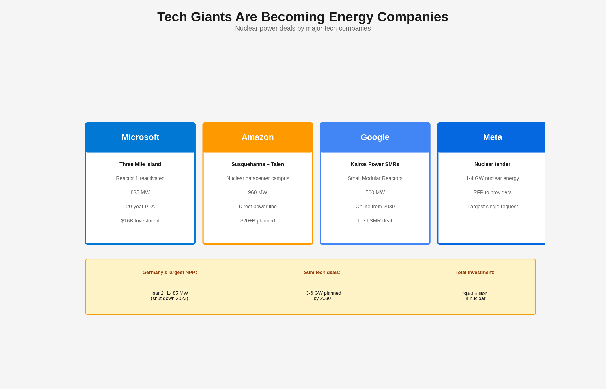

*Abbildung 14: Tech-Giganten werden Energiekonzerne*

Hier wird es für Investoren relevant. Denn die Tech-Unternehmen haben das Energieproblem nicht nur erkannt - sie haben begonnen, es selbst zu lösen. Und die Art, wie sie es lösen, sagt viel über die Zukunft der Energiemärkte aus.

Microsoft hat einen 20-jährigen Stromabnahmevertrag mit Constellation Energy unterzeichnet, die 1,6 Milliarden Dollar investieren, um den Three Mile Island-Reaktor in Pennsylvania wieder in Betrieb zu nehmen. Ja, den Three Mile Island, den Ort des schwersten Nuklearunfalls in der Geschichte der USA. Die Ironie ist offensichtlich. Aber Microsofts Kalkül ist nüchtern: Three Mile Island liefert zuverlässig Grundlaststrom, ohne CO₂-Emissionen, in der Nähe wichtiger Rechenzentren an der Ostküste. Die Vergangenheit des Standorts ist ein PR-Problem. Die Physik ist solide.

Amazon hat 20 Milliarden Dollar in das Kernkraftwerk Susquehanna investiert und weitere Deals mit Energieversorgern abgeschlossen. Google hat 500 Megawatt Strom von Kairos Energy bestellt, einem Startup, das Small Modular Reactors entwickelt. Meta hat Anfragen für 1 bis 4 Gigawatt neuer Kernenergie-Erzeugung ausgeschrieben.

Das sind keine Randnotizen. Das sind die größten Unternehmen der Welt, die Milliarden investieren, um ihre eigene Stromversor, g zu sichern, weil der Markt nicht schnell genug liefern kann, was sie brauchen.

Die kritische Erkenntnis für Investoren: Diese Unternehmen kaufen Strom nicht von Versorgern. Sie kaufen die Kraftwerke. Sie integrieren ihre Energieversorgung vertikal, so wie sie bereits ihre Chip-Entwicklung, ihre Cloud-Infrastruktur und zunehmend ihre KI-Modelle vertikal integriert haben.

Das verändert die Investmentlandschaft. Traditionelle Energieversorger werden nicht die Hauptprofiteure des KI-Energiebooms sein, zumindest nicht im gleichen Maße wie die Unternehmen, die die Technologie kontrollieren. Der Wert fließt zu den Technologie-Anbietern an den Enden der Kette: den Reaktorbauern, den Uran-Lieferanten und den Tech-Unternehmen selbst. Small Modular Reactors: Die Zukunft der KI-Energieversorgung Small Modular Reactors (SMRs) sind das Konzept, das Kernenergie für das KI-Zeitalter neu definiert. Statt riesiger Kraftwerke, die Jahrzehnte in der Planung und Milliarden im Bau kosten, sind SMRs kompakt, in Fabriken vorgefertigt und können in der Nähe von Rechenzentren aufgestellt werden.

NuScale Power hat als erstes Unternehmen eine NRC-Zertifizierung für ein SMR-Design erhalten, die Genehmigung der amerikanischen Atomaufsicht, die den Weg zur kommerziellen Produktion ebnet. Oklo, unterstützt von Sam Altman, entwickelt kompakte Spaltreaktoren, die speziell für Rechenzentren konzipiert sind. Kairos Energy, das den Google-Deal gewonnen hat, arbeitet an einem salzgekühlten Reaktordesign.

Die Vorteile für KI-Rechenzentren sind offensichtlich: SMRs liefern 24/7-Grundlaststrom, unabhängig von Wetter oder Tageszeit. Sie haben einen extrem kleinen physischen Fußabdruck. Sie können in der Nähe von Rechenzentren platziert werden, was Übertragungsverluste reduziert. Und sie sind skalierbar, ein Unternehmen kann mit einem Modul anfangen und bei wachsendem Bedarf weitere hinzufügen.

Die Zeitlinien sind optimistisch, aber nicht unrealistisch. Die ersten kommerziellen SMRs könnten Ende der 2020er Jahre Strom liefern. Bis 2035 könnten sie ein signifikanter Teil des Energiemixes sein, der die KI-Infrastruktur antreibt. Investmentimplikationen: Uran, SMR-Hersteller, Energieinfrastruktur Für das Investmentportfolio, das wir in Teil IV dieses Buches aufbauen werden, hat das Energie-Thema konkrete Implikationen.

Uran ist der Brennstoff der Kernenergie. Und damit indirekt der Brennstoff der KI-Revolution. Der Uranpreis hat sich seit 2020 mehr als verdoppelt, getrieben durch die Renaissance der Kernenergie und die Nachfrage der Tech-Giganten. Cameco, der größte börsennotierte Uranproduzent der Welt, ist eine direkte Wette auf steigende Urannachfrage. Kazatomprom in Kasachstan, der weltweit größte Produzent überhaupt, ist ebenfalls investierbar, wenn auch mit höherem geopolitischen Risiko.

SMR-Entwickler sind klassische asymmetrische Wetten. NuScale Power (Ticker: SMR, ja, wirklich) ist der am weitesten fortgeschrittene börsennotierte SMR-Entwickler. Oklo ist seit seinem Börsengang über eine SPAC investierbar, eine Special Purpose Acquisition Company, also eine Mantelgesellschaft, die ausschließlich gegründet wird, um ein anderes Unternehmen zu übernehmen und so an die Börse zu bringen. Beide sind Pre-Revenue-Unternehmen mit hohem Risiko, aber in einem Szenario, in dem SMRs zum Standard für Rechenzentrums-Energie werden, sind die Upside-Potenziale enorm.

Bestehende Kernkraftwerksbetreiber wie Constellation Energy profitieren bereits. Constellation ist der größte Kernkraftwerksbetreiber der USA und hat langfristige Stromabnahmeverträge mit Microsoft und anderen Tech-Unternehmen unterzeichnet. Im Gegensatz zu SMR-Startups hat Constellation bereits laufende Kraftwerke, regulierte Umsätze und positiven Cashflow. Es ist die konservativere Wette auf die Kernenergie-Renaissance.

### Die versteckte Krise: Warum Uran knapp wird

Der Uranpreis hat sich seit 2020 verdreifacht. Von knapp 30 Dollar pro Pfund U3O8 auf rund 88 Dollar im Februar 2026. Und trotzdem spricht kaum jemand darüber.

Das Angebot hält mit der Nachfrage nicht Schritt. Die globale Reaktor-Nachfrage liegt bei etwa 179 Millionen Pfund U3O8 pro Jahr. Die primäre Minenproduktion deckt davon nur 140 bis 150 Millionen Pfund. Die Lücke, 30 bis 40 Millionen Pfund jährlich, wird bisher durch Lagerbestände, wiederaufbereitetes Material und andere sekundäre Quellen geschlossen. Aber diese Quellen schrumpfen. Von 14 Prozent des Angebots heute auf geschätzt 8 Prozent bis 2030.

Verschärft wird das Problem durch die beiden größten Produzenten, die gleichzeitig kürzen. Kazatomprom in Kasachstan, mit 24 Prozent der Weltproduktion der größte Einzelproduzent, hat für 2026 eine Produktionskürzung von 10 Prozent angekündigt. Grund: Engpässe bei der Schwefelsäure, die für die Uran-Extraktion gebraucht wird. Cameco in Kanada, mit 14 bis 20 Prozent Marktanteil der größte börsennotierte Produzent, musste seine Produktionsprognose im August 2025 um 19 Prozent senken. Verzögerungen bei der McArthur-River-Mine.

Dazu kommen geopolitische Risiken. Niger, ein wichtiges Förderland, wurde 2023 von einem Militärputsch erschüttert. Der französische Urankonzern Orano, der dort einen erheblichen Teil seiner Produktion betreibt, steht vor einer ungewissen Zukunft. Zusammen liefern Kasachstan und Niger rund die Hälfte der weltweiten Primärproduktion. Beide Länder sind politisch instabil.

Und dann ist da der Engpass, über den fast niemand spricht: die Urananreicherung. Natururan muss angereichert werden, bevor es als Brennstoff in Reaktoren eingesetzt werden kann. Die globale Anreicherungskapazität beträgt nominell 77 Millionen SWU pro Jahr (SWU ist die Maßeinheit für Anreicherungsarbeit). Davon kontrolliert Russlands Rosatom etwa 40 Prozent. 40 Prozent. In einer einzigen Hand. In der Hand eines Landes, mit dem der Westen gerade einen Wirtschaftskrieg führt.

Die USA bezogen bis vor Kurzem 24 Prozent ihrer Anreicherungsdienste aus Russland. Im Mai 2024 unterzeichnete Biden den "Prohibiting Russian Uranium Imports Act". Aber die westliche Kapazität ohne Russland liegt bei nur 37 bis 40 Millionen SWU. Bei steigender Nachfrage durch neue Reaktoren und SMRs droht ab 2030 ein strukturelles Defizit. ARK Invest prognostiziert, dass SWU-Kapazität "bis 2030 knapp wird". Für die neuen Small Modular Reactors wird das noch kritischer: HALEU-Brennstoff, den viele SMR-Designs benötigen, braucht fünf- bis sechsmal mehr Anreicherungsarbeit pro Kilogramm als konventioneller Brennstoff.

COP28 hat das Problem offiziell anerkannt: Über 20 Länder haben sich zur Verdreifachung der Kernkraftkapazität bis 2050 bekannt. Die Nachfrage nach Uran und Anreicherung wird steigen. Das Angebot wächst langsamer. Die Preise haben nur eine Richtung.

Ein Detail verdeutlicht die Energie-Dichte von Kernkraft: Ein einzelnes Uran-Brennstoff-Pellet, so groß wie eine Fingerkuppe, erzeugt so viel Energie wie eine Tonne Kohle. Das ist der Grund, warum Kernkraftwerke auf 3,4 Quadratkilometern betrieben werden können und nicht auf der Fläche des Saarlands.

### Das Ausmaß der Investitionen

Wir haben gesehen, welche konkreten Deals Microsoft, Amazon, Google und Meta bei Kernkraftwerken und SMRs abgeschlossen haben. Aber die Dimension geht weit darüber hinaus.

Meta plant 135 Milliarden Dollar für KI-Infrastruktur in einem einzigen Jahr, 2026. Microsoft investiert über 60 Milliarden. Amazon ungefähr 100 Milliarden. Google etwa 75 Milliarden. Elon Musks xAI hat 18 Milliarden allein in den Colossus-Supercomputer in Memphis gesteckt, eine Anlage mit 555.000 GPUs, die 2 Gigawatt Strom verbraucht. Zwei Gigawatt. Das reicht, um eine Stadt mit einer Million Einwohnern zu versorgen.

Zusammengerechnet investiert die Tech-Industrie 2025 und 2026 über eine Billion Dollar in KI-Infrastruktur. Und jedes einzelne Rechenzentrum, jede einzelne GPU braucht Strom. Viel Strom.

Was wir hier beobachten, ist eine vertikale Integration, die es in der Tech-Industrie so noch nie gab. Diese Unternehmen kaufen nicht einfach Strom auf dem Markt. Sie kaufen die Kraftwerke. Sie bauen eigene Solarparks. Sie finanzieren Nuklearforschung. Sie werden zu Energieunternehmen, ob sie es wollen oder nicht.

Die USA müssen bis 2030 zusätzliche Kapazitäten von 30 bis 50 Gigawatt bauen, nur für KI-Rechenzentren. Das entspricht 30 bis 50 großen Kernkraftwerken. Oder zehntausenden Windrädern. Oder einer Fläche von Solarpanels, so groß wie das Saarland.

Wer die Energie kontrolliert, kontrolliert das Tempo der KI-Revolution. Jensen Huang spricht auf der CES 2026 nicht mehr von "Datacenters", sondern von "AI Factories". Fabriken brauchen Strom. Und die Fabriken, die KI produzieren, brauchen mehr Strom als alles, was die Menschheit bisher gebaut hat.

### Der Engpass, den niemand auf dem Schirm hat: Wasser

Rechenzentren brauchen nicht nur Strom. Sie brauchen Wasser. Sehr viel Wasser. Und dieses Thema wird in fast jeder Analyse der KI-Infrastruktur ignoriert.

Server erzeugen Hitze. GPUs unter Volllast laufen bei 70 bis 90 Grad Celsius. Diese Hitze muss abgeführt werden. Die meisten großen Rechenzentren nutzen dafür Verdunstungskühlung: Wasser wird versprüht, verdampft und kühlt dabei die Luft. Das Wasser, das verdampft, ist verbraucht. Nicht verschmutzt, nicht recycelbar. Weg.

Ein typisches Hyperscale-Rechenzentrum verbraucht rund 2 Millionen Liter Wasser pro Tag. Pro Tag. Googles Rechenzentrum in Council Bluffs, Iowa, verbrauchte 2024 allein eine Milliarde Gallonen. Das reicht, um den Trinkwasserbedarf aller Haushalte in Iowa zu decken.

Insgesamt verbrauchte Google 2024 über 8 Milliarden Gallonen Wasser für seine Rechenzentren. Microsofts Wasserverbrauch stieg um 34 Prozent gegenüber dem Vorjahr. Meta verbrauchte 813 Millionen Gallonen, davon 95 Prozent für Rechenzentren.

KI verschärft das Problem. GPU-Cluster für KI-Training haben eine Leistungsdichte von 40 bis über 100 Kilowatt pro Rack. Bei normalen Cloud-Servern sind es 6 bis 10 Kilowatt. Zehn bis zwanzig Mal mehr Hitze pro Quadratmeter bedeutet zehn bis zwanzig Mal mehr Kühlungsbedarf.

::: {.infobox}
### Googles Wasserproblem in Oregon

Die Konflikte haben bereits begonnen. In The Dalles, Oregon, einer Kleinstadt mit 16.000 Einwohnern, betreibt Google seit 2006 mehrere Rechenzentren. Als die lokale Zeitung "The Oregonian" den Wasserverbrauch recherchierte, bezahlte Google 100.000 Dollar, um die Klage der Stadt gegen die Zeitung zu finanzieren. Die Bewohner nennen Google inzwischen "Voldemort". Google plant weitere Rechenzentren in der Region. Die Stadt will Wasser aus dem Mount-Hood-Nationalwald beziehen, um den wachsenden Bedarf zu decken. Umweltschützer vermuten: Das Wasser ist in erster Linie für Google bestimmt, nicht für die Bevölkerung.

:::

In Mesa und Goodyear, Arizona, entstehen neue Rechenzentren in einer Region, die bereits unter Wasserknappheit leidet. Der Colorado River, der den amerikanischen Südwesten versorgt, führt seit zwei Jahrzehnten weniger Wasser als historisch üblich.

Und dann die Frage, die jeder stellt: Wie viel Wasser verbraucht eine einzelne ChatGPT-Anfrage? Die Antworten variieren. OpenAI gibt offiziell 0,32 Milliliter an, aber das misst nur den direkten Wasserverbrauch am Rechenzentrum selbst. Rechnet man den Wasserverbrauch der Stromerzeugung ein, kommt eine Studie der UC Riverside auf 10 bis 25 Milliliter pro Anfrage. Eine Studie der Washington Post bezifferte den Wasserverbrauch für eine 100-Wörter-E-Mail per GPT-4 auf 519 Milliliter, also ein halber Liter. Bei 200 Millionen täglichen ChatGPT-Nutzern summiert sich das.

Lösungen gibt es. Direct Liquid Cooling, bei dem Kühlplatten direkt auf den Chips sitzen, kann den Kühlenergiebedarf um 50 Prozent senken. Immersion Cooling, bei dem Server komplett in eine dielektrische Flüssigkeit getaucht werden, spart noch mehr. In Skandinavien und Island werden Rechenzentren mit reiner Luftkühlung betrieben, ganz ohne Wasser. Aber diese Lösungen kosten mehr und sind bisher nicht Standard.

Google und Microsoft haben sich verpflichtet, bis 2030 "water positive" zu sein, also mehr Wasser zurückzugeben als sie verbrauchen. Bisher ist das Gegenteil passiert: Der Verbrauch steigt bei beiden Unternehmen Jahr für Jahr.

Wasser ist ein Thema, das in der KI-Debatte unterschätzt wird. Strom kann man erzeugen, zur Not aus fossilen Quellen. Aber Wasser in einer Wüste in Arizona ist Wasser in einer Wüste in Arizona. Man kann kein Gaskraftwerk bauen, das Wasser produziert. Die Tech-Giganten werden ihre Standortentscheidungen zunehmend nicht nur nach Stromverfügbarkeit treffen, sondern nach Wasserzugang. Das ist ein Faktor, der im Investmentkalkül noch kaum vorkommt.

Die KI-Revolution ist nicht nur eine Software-Revolution. Sie ist eine physische Revolution, mit Konsequenzen für Energiemärkte, Rohstoffe und Infrastruktur, die weit über den Technologiesektor hinausgehen. Wer nur in Software investiert, übersieht die Hälfte der Geschichte.

Aber es gibt noch eine andere Hälfte, die nicht in Gigawatt und Kubikmetern gemessen wird: Was passiert mit den Menschen, deren Arbeit die Maschinen übernehmen? Die Energiefrage ist ein Ingenieursproblem. Die Arbeitsfrage ist eine gesellschaftliche.

> **📌 Auf einen Blick:**
>
> ◆ Der Energieverbrauch von KI wächst exponentiell.
> ◆ Kernenergie ist die einzige skalierbare Lösung für den Baseload-Bedarf.
> ◆ Tech-Giganten kaufen Kernkraftwerke - Uran wird zum strategischen Asset.

## Kapitel 10: Der menschliche Preis - Arbeit, Sinn und gesellschaftliche Verwerfungen

"Wer einen Sinn zu leben hat, erträgt fast jedes Wie."

- Viktor Frankl

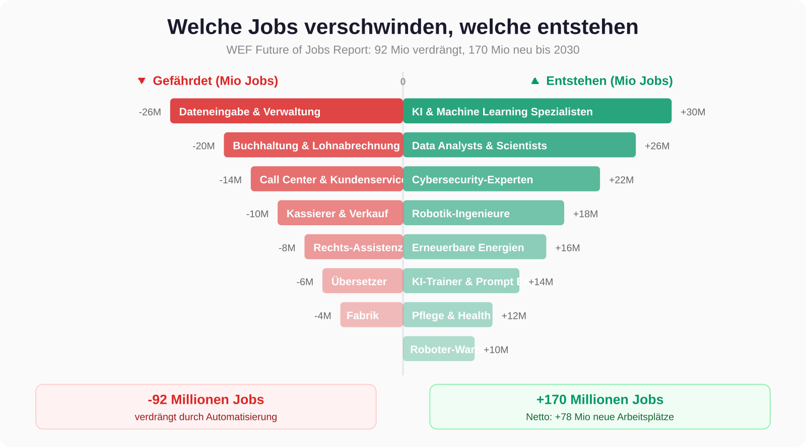

*Abbildung 16: Welche Jobs verschwinden, welche entstehen*

### Von Stammesführern zu CEOs: Eine kurze Geschichte der Arbeit

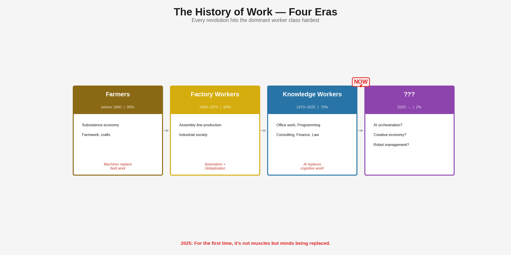

*Abbildung 17: Die Geschichte der Arbeit - vier Epochen und der aktuelle Umbruch*

Bevor wir über die Zukunft der Arbeit sprechen, müssen wir verstehen, wie kurz die Geschichte der Arbeit ist, die wir kennen. Was wir heute für "normal" halten, den Achtstundentag, das Büro, den Lebenslauf, die Karriereleiter, ist ein Arrangement, das jünger ist als die meisten Bäume in einem deutschen Wald.

Für den größten Teil der Menschheitsgeschichte hat "Arbeit" nicht existiert, zumindest nicht in der Form, die wir kennen. Jäger und Sammler, die über 90 Prozent der menschlichen Geschichte ausmachen, arbeiteten drei bis fünf Stunden am Tag. Der Rest war Soziales, Geschichten erzählen, Handwerk, Spiel. Die agrarische Revolution vor 10.000 Jahren brachte Sesshaftigkeit, Landbesitz, Gesetze, Krieger. Und so entstand das Feudalsystem. Ein Lehnsherr besaß das Land. Bauern bearbeiteten es. Die Struktur war überall gleich, von den Pharaonen bis zu den russischen Leibeigenen: Wer die Produktionsmittel kontrollierte, kontrollierte die Arbeit.

Dann kam die Industrialisierung, und sie brauchte etwas Neues: gehorsame, pünktliche, gleichförmig ausgebildete Arbeiter. Die Fabrik erforderte eine neue Art Mensch. Ein Bauer arbeitete nach dem Rhythmus der Jahreszeiten, in seinem eigenen Tempo. Ein Fabrikarbeiter musste um sechs Uhr an einer Maschine stehen, zwölf Stunden lang, im Takt der Maschine. Das preußische Schulsystem lieferte genau das: Kinder in Altersgruppen eingeteilt wie Fabrikschichten, in Reihen sitzend wie an Fließbändern, mit dem zentralen Lernziel, Autorität zu respektieren. Horace Mann brachte das Modell 1843 in die USA, von dort verbreitete es sich weltweit. Das Schulsystem wurde nicht entworfen, um unabhängiges Denken zu fördern. Es wurde entworfen, um eine Arbeitskraft zu produzieren, die in Fabriken funktioniert.

Die Begriffe "White Collar" und "Blue Collar" sind Erfindungen des 20. Jahrhunderts, kaum hundert Jahre alt. Die Idee, dass ein Mensch seine Zeit an eine Organisation verkauft, die ihm dafür monatlich eine feste Summe überweist, existiert seit weniger als 0,1 Prozent der Menschheitsgeschichte.

Marx hat das 1848 so formuliert: "Die moderne bürgerliche Gesellschaft hat die Klassengegensätze nicht aufgehoben. Sie hat nur neue Klassen, neue Bedingungen der Unterdrückung an die Stelle der alten gesetzt." Man muss kein Marxist sein, um die Struktur zu erkennen: Der Feudalherr wird zum Fabrikbesitzer, dann zum CEO. Die Abgabe heißt nicht mehr "Zehnt", sondern "Gewinnmarge". Aber die Grundstruktur, eine Klasse besitzt die Produktionsmittel, eine andere arbeitet damit, ist dieselbe.

### Die neuen Feudalherren

Und jetzt stehen wir vor dem nächsten Übergang. Und die Frage ist: Wer werden die neuen Feudalherren sein?

Im Feudalsystem kontrollierte, wer das Land besaß. In der Industriegesellschaft kontrollierte, wer die Fabriken besaß. In der Wissensökonomie kontrollierte, wer die Plattformen und Daten besaß. Google, Amazon, Meta, sie sind die Lehnsherren des digitalen Zeitalters, und ihre "Bauern" sind die Milliarden von Nutzern, die ihre Daten als Abgabe liefern, ohne dafür bezahlt zu werden.

### Die drei Säulen der Maschinenökonomie

In der Maschinenökonomie wird kontrollieren, wer drei Dinge besitzt:

- **Die KI-Modelle** (die Intelligenz)
- **Die Roboter** (die physische Arbeitskraft)
- **Die Krypto-Infrastruktur** (das Zahlungssystem)

Das sind die neuen Produktionsmittel. Und ihre Besitzer werden die neuen Feudalherren sein.

NVIDIA baut die Hardware, auf der die Intelligenz läuft. OpenAI, Anthropic und Google bauen die Intelligenz selbst. Tesla, Figure AI und Unitree bauen die Roboter. Und die Krypto-Protokolle, Bitcoin, Ethereum, die Stablecoin-Herausgeber, bilden das Finanzsystem, in dem die Maschinen operieren.

Die Parallele zum Feudalismus ist dabei unbequem präzise. Im Feudalsystem konnte ein Bauer nicht einfach "aufhören, Bauer zu sein". Er war an das Land gebunden, und das Land gehörte dem Herrn. In der Maschinenökonomie kann ein Wissensarbeiter, dessen Arbeit von KI ersetzt wird, nicht einfach "aufhören, Wissensarbeiter zu sein". Sein Humankapital, seine Ausbildung, seine Erfahrung, ist an eine Wirtschaftsstruktur gebunden, die gerade obsolet wird.

Der Unterschied zum Feudalismus: Diesmal gibt es einen Ausweg. Man kann die neuen Produktionsmittel besitzen. Nicht als Feudalherr, sondern als Investor. Wer NVIDIA-Aktien besitzt, besitzt einen Anteil an der Hardware der KI-Revolution. Wer Bitcoin besitzt, besitzt einen Anteil am Geldsystem der Maschinenökonomie. Wer in Robotik-Unternehmen investiert, besitzt einen Anteil an der physischen Arbeitskraft der Zukunft.

Das ist die tiefere Begründung der Investmentthese dieses Buches: Es geht nicht nur darum, Geld zu verdienen. Es geht darum, auf der richtigen Seite des nächsten Strukturwandels zu stehen. Der Bauer im 18. Jahrhundert konnte nicht in Fabriken investieren. Er konnte nur zusehen, wie die neue Welt an ihm vorbeizog. Der Wissensarbeiter im 21. Jahrhundert hat diese Möglichkeit. Aktien, ETFs, Kryptowährungen, alles ist zugänglich, für jeden, mit einem Smartphone und einem Broker-Konto.

Neue Feudalherren wird es geben. Die Frage ist, ob Sie zu ihnen gehören oder zu ihren Bauern.

Das WEF hat das offen ausgesprochen: "You'll own nothing and be happy."

Die Feudalherren der Zukunft finden, dass Besitzlosigkeit ein Feature ist, kein Bug. Für sie. Nicht für dich.

Erinnern Sie sich an die Kausalkette:

Maschinen ersetzen deine Arbeit. Du verlierst dein Arbeitseinkommen. Ohne Einkommen kein Kapital. Ohne Kapital keine Investitionen. Ohne Investitionen kein Anteil an der Maschinenökonomie.

Das Ergebnis: Du konsumierst, was andere produzieren. Du mietest, was andere besitzen. Du wartest auf Transfers von denen, die noch Steuern zahlen können, oder von einem Staat, der selbst immer abhängiger wird von den wenigen, die die Produktionsmittel kontrollieren.

Das ist kein Dystopie-Roman. Das ist die logische Konsequenz von Passivität in einer Welt, in der die Maschinen kommen.

Aber es muss nicht dein Schicksal sein.

### Die Schulsystem-Frage

Und das Schulsystem? Das System, das vor 200 Jahren entworfen wurde, um Fabrikarbeiter zu produzieren, bildet heute noch immer Kinder für eine Welt aus, die nicht mehr existiert. Pünktlichkeit, Gehorsam, standardisiertes Wissen, Prüfungen unter Zeitdruck: All das waren Anforderungen der Industriegesellschaft. In einer Welt, in der KI jedes Faktenwissen in Sekunden abrufen kann, in der Kreativität, kritisches Denken und die Fähigkeit, mit Maschinen zusammenzuarbeiten, die relevanten Kompetenzen sind, ist unser Schulsystem ein Anachronismus.

Aber das ist eine Debatte für ein anderes Buch. Für dieses Buch genügt die Erkenntnis: Die Art, wie wir arbeiten, ist keine Naturkonstante. Sie wurde erfunden, von Menschen, für bestimmte Zwecke, und sie wird gerade neu erfunden. Wer das versteht, hat einen Vorsprung.

### Welche Jobs verschwinden, welche entstehen

Mit diesem historischen Kontext können wir die aktuelle Umwälzung nüchterner betrachten. Wir trauern nicht um eine ewige Ordnung. Wir sehen den nächsten in einer langen Reihe von Übergängen.

Die Geschichte der Technologie ist voll von Prognosen über massenhaften Jobverlust, die sich als übertrieben herausstellten. Die Ludditen zerstörten Webstühle. Die Bankangestellten fürchteten den Geldautomaten. Die Buchhalter fürchteten die Tabellenkalkulation. Und jedes Mal entstanden mehr neue Jobs als alte verloren gingen.

Es gibt einen konkreten Unterschied zu früheren Automatisierungswellen:

Der entscheidende Unterschied: Frühere Automatisierungswellen ersetzten physische Routinearbeit. Der Webstuhl ersetzte den Weber. Die Montagestraße ersetzte den Handwerker. Der Geldautomat ersetzte den Kassenschalter. In jedem Fall verschob sich die menschliche Arbeit nach oben, von physischer zu kognitiver Arbeit, von Routine zu Kreativität, von Ausführung zu Planung.

KI bricht dieses Muster, weil sie genau die kognitive, kreative, planerische Arbeit automatisiert, in die sich die Menschen bei früheren Wellen geflüchtet haben. Es gibt kein offensichtliches "nach oben" mehr. Es sei denn, man definiert "nach oben" als "Besitzer der Maschinen, die die Arbeit tun."

Eine McKinsey-Studie von 2024 schätzt, dass bis 2030 weltweit 400 Millionen Arbeitsplätze von KI-Automatisierung betroffen sein werden. "Betroffen" heißt nicht "verschwunden", es heißt, dass ein signifikanter Teil der Aufgaben automatisiert wird. Manche Jobs werden vollständig ersetzt, manche transformiert, manche nur marginal verändert.

Am stärksten betroffen: Kundenservice und Call-Center, einfache Buchhaltung und Datenverarbeitung, Standard-Rechtsberatung, Übersetzung und einfaches Texten, Einstiegspositionen in der Softwareentwicklung, Teile der Finanzanalyse.

Weniger betroffen, vorerst: Handwerkliche Berufe mit hoher Variabilität (Sanitär, Elektrik), Berufe mit starker menschlicher Beziehungskomponente (Therapie, Seelsorge), Führungspositionen mit strategischer Dimension.

Neu entstehend: KI-Training und -Supervision, Prompt Engineering und KI-Workflow-Design, Roboter-Wartung, KI-Ethik und -Governance, und Rollen, die wir heute noch nicht benennen können.

::: {.infobox}
### Hararis „useless class"

Yuval Noah Harari geht noch weiter. In "Homo Deus" von 2016 hat der israelische Historiker einen Begriff geprägt, der unbequemer ist als alles, was die WEF-Berichte formulieren: die "useless class". Nicht arbeitslos. Nutzlos. Hararis Argument ist nicht, dass diese Menschen faul oder unfähig wären. Sein Argument ist, dass die Wirtschaft sie schlicht nicht mehr braucht. Nicht als Arbeiter, nicht als Soldaten, nicht einmal als Konsumenten, wenn Maschinen den Konsum unter sich regeln.

:::

Das ist härter als die offizielle Prognose. McKinsey redet von Transformation. Harari redet von Überflüssigkeit. Die Frage ist nicht "welchen neuen Job bekomme ich?", sondern "hat die Gesellschaft überhaupt noch eine Verwendung für mich?" Und das ist eine Frage, die kein Umschulungsprogramm beantworten kann. Die WEF-Zahl von 170 Millionen neuen Jobs mag stimmen. Aber sie beantwortet nicht, ob die Menschen, die ihre alten Jobs verlieren, auch die sind, die die neuen bekommen.

Die vielleicht ehrlichste Bestätigung kommt von den KI-Entwicklern selbst. Anthropic, eines der führenden KI-Unternehmen, hat Anfang 2026 eine Studie veröffentlicht, die nicht fragt, was KI theoretisch könnte, sondern was sie tatsächlich tut, gemessen an realen Nutzungsdaten ihres eigenen Systems Claude. Das neue Maß heißt observed exposure, und es schließt eine Lücke, die alle bisherigen Prognosen offengelassen haben: den Unterschied zwischen Potenzial und Realität.

Das Ergebnis ist eine riesige Kluft. In Computer- und Mathematik-Berufen könnten 94 Prozent der Aufgaben theoretisch von KI erledigt werden. Aber nur 33 Prozent werden es tatsächlich. Die Adoption hinkt dem Potenzial dramatisch hinterher, in fast allen Berufskategorien. Das bedeutet zwei Dinge gleichzeitig: Wir stehen noch ganz am Anfang der Automatisierungskurve. Und es wird noch viel mehr kommen.

Aber dort, wo KI tatsächlich eingesetzt wird, trifft sie genau die Schicht, die sich am sichersten wähnte: eher weiblich, eher weiß, höher gebildet, mit 47 Prozent höheren Gehältern als der Durchschnitt. Die White-Collar-Welt. 30 Prozent aller Arbeiter haben null Exposure. Köche, Mechaniker, Barkeeper. Die Revolution findet in den Bürotürmen statt, nicht in den Werkstätten.

Noch alarmierender: Während die Gesamtarbeitslosigkeit in KI-exponierten Berufen bisher stabil blieb, werden junge Arbeitnehmer zwischen 22 und 25 Jahren bereits 14 Prozent seltener eingestellt als vor dem KI-Boom. Ältere Arbeitnehmer zeigen diesen Effekt nicht. Unternehmen stellen weniger ein, bevor sie anfangen zu entlassen. Das ist das Kanarienvogel-Signal.

---

::: {.infobox}
### Finnlands UBI-Experiment

*Wissensarbeiter als die neuen Bauern*
*Die bitterste Ironie: Diese Revolution trifft genau die Schicht, die sich am sichersten fühlte.*
*In den letzten Jahrzehnten wurde Wissensarbeitern erzählt, sie seien die Zukunft. Lernt programmieren. Studiert BWL. Macht euren MBA. Die Fabrikarbeiter mögen ihren Job an Maschinen verloren haben, aber ihr seid sicher, eure Arbeit erfordert Kreativität, Urteilsvermögen, menschliche Interaktion.*
*KI stellt genau diese Erzählung in Frage. Wenn ein KI-System juristische Dokumente schneller analysiert als ein Anwalt, eine Finanzanalyse präziser erstellt als ein Analyst, einen Marketingtext verfasst, der besser konvertiert als der eines Texters, was genau ist dann der Wettbewerbsvorteil der menschlichen Wissensarbeit?*
*Die ehrliche Antwort: Er schrumpft. Er verschwindet nicht über Nacht, KI hat Schwächen, macht Fehler, braucht Aufsicht. Aber er schrumpft mit jedem Modell-Update, jedem neuen Benchmark-Ergebnis, jedem Unternehmen, das entdeckt, dass es drei Mitarbeiter durch einen Mitarbeiter plus KI ersetzen kann.*
*Wissensarbeiter sind in den meisten westlichen Gesellschaften die Mittelschicht. Sie sind die Konsumenten, die Steuerzahler, die Wähler. Wenn diese Schicht unter Druck gerät, hat das Konsequenzen, die weit über den Arbeitsmarkt hinausgehen.*
*Sie werden, im schlimmsten Fall, zu den neuen Bauern: Menschen, deren Humankapital (ihre Ausbildung, ihre Erfahrung) an eine Wirtschaftsstruktur gebunden ist, die gerade obsolet wird. Genau wie die Bauern im 18. Jahrhundert, die Experten für eine Welt waren, die verschwand.*
*Warum unser Wohlstandskompass kaputt ist*
*Es gibt ein tieferes Problem, das die Debatte um Arbeitsplätze und Grundeinkommen überlagert: Wir messen Wohlstand mit einem Instrument, das Fortschritt als Katastrophe registriert.*
*Das Bruttoinlandsprodukt, die Zahl, an der sich Regierungen, Zentralbanken und Märkte orientieren, hat eine strukturelle Schwäche: Es ist blind für Überfluss. Wenn Wikipedia das Wissen einer Enzyklopädie kostenlos verfügbar macht, registriert GDP den Umsatzverlust der Verlage, aber nicht den Wissenszugewinn der Menschheit. Wenn ein KI-Agent die Arbeit eines Rechtsanwalts in Minuten erledigt und die Kosten auf einen Bruchteil fallen, dann schrumpft das BIP, während der tatsächliche Nutzen explodiert.*
*Emad Mostaque formuliert das in "The Last Economy" prägnant: "We are about to achieve post-scarcity in the realm of intelligence, and our scarcity-based economic system is going to process this abundance as poverty." Wir stehen kurz davor, im Bereich der Intelligenz den Man. Und überwinden. Und unser auf Knappheit gebautes Wirtschaftssystem wird diese Fülle als Armut verbuchen.*
*Das ist kein abstraktes Problem. Es hat reale Konsequenzen. Wenn KI die Kosten für Rechtsberatung, Diagnosen, Übersetzungen, Finanzanalysen und Programmierung auf einen Bruchteil drückt, wird sich das in sinkenden Umsatzzahlen niederschlagen, in sinkenden Gehältern in diesen Branchen, in sinkenden BIP-Beiträgen. Politisch wird das als Krise gelesen. Die Reflexantwort wird Regulierung sein, Verlangsamung, Protektionismus. Aber die eigentliche Krise ist nicht, dass die Dinge billiger werden. Die Krise ist, dass unser Messinstrument nicht zwischen Verfall und Fortschritt unterscheiden kann.*
*Gleichzeitig zählt GDP Dinge als Wachstum, die niemand als Fortschritt bezeichnen würde: Naturkatastrophen, die Wiederaufbau erfordern, Scheidungen, die Anwälte beschäftigen, Krankheiten, die Behandlungen generieren. Je mehr kaputt geht, desto besser die Zahl. Je mehr Fülle entsteht, desto schlechter die Zahl. Das ist kein Bug in der Formel. Es ist ein Konstruktionsfehler, der in einer Welt der Knappheit nicht auffiel und in einer Welt der KI-getriebenen Abundanz zum grundlegenden Orientierungsproblem wird.*
*Mostaque geht noch weiter und beschreibt, was er "nicht-metabolische Arbeit" nennt: KI und Roboter brauchen keinen Schlaf, kein Essen, keine Krankenversicherung, keine Rente. Sie brauchen Strom. In einer rein ökonomischen Kalkulation, die nur Produktivität pro Kosteneinheit misst, kann der Wert menschlicher Arbe, negativ werden, weil die Kosten für Versicherung, Arbeitsrecht, Krankheitstage und Fehlerquoten den Output übersteigen, den ein Mensch gegenüber einer Maschine noch liefern kann. Das klingt brutal. Es ist brutal. Was ist der menschliche Preis, wenn die Maschinen nicht nur billiger arbeiten, sondern wenn die gesamte Metrik, mit der wir Arbeit messen, zu ihren Gunsten konstruiert ist?*
*Was die Forschung über Grundeinkommen wirklich sagt*
*Wenn die Arbeit verschwindet, muss jemand zahlen. Die naheliegende Idee heißt Universal Basic Income, und sie wird von genau den Leuten propagiert, die am meisten von der Automatisierung profitieren. Sam Altman, CEO von OpenAI, hat sich für UBI ausgesprochen. Elon Musk geht weiter und spricht von einem "Universal High Income". Die Frage ist: Funktioniert das?*
*Die Forschung gibt eine differenzierte Antwort.*
*Finnland hat von 2017 bis 2018 das bekannteste nationale UBI-Experiment durchgeführt. 2.000 zufällig ausgewählte Arbeitslose bekamen monatlich 560 Euro, bedingungslos, steuerfrei. Das Ergebnis überraschte beide Seiten der Debatte. Die Empfänger wurden nicht faul. Sie arbeiteten im Messzeitraum sogar sechs Tage mehr als die Kontrollgruppe. Aber sie wurden auch nicht zu Unternehmern oder Innovatoren. Der wirkliche Effekt war psychologisch: weniger Depression, weniger Einsamkeit, mehr Lebenszufriedenheit. UBI wirkte nicht als Beschäftigungsprogramm, sondern als Gesundheitsmaßnahme.*
*Sam Altmans eigene Studie, finanziert über sein Projekt OpenResearch, war die größte in der US-Geschichte. 3.000 Teilnehmer in Illinois und Texas erhielten drei Jahre lang 1.000 Dollar monatlich. Das Ergebnis: Die Empfänger arbeiteten 1,3 bis 1,4 Stunden weniger pro Woche. Nicht dramatisch, aber messbar. Die Forscher hatten gehofft, dass das finanzielle Polster die Teilnehmer befähigen würde, bessere Jobs zu finden. Das trat nicht ein. Was eintrat: Die Menschen nutzten die Zeit für das, was sie für wichtiger hielten als Arbeit. Ob man das als Fortschritt oder als Problem sieht, hängt davon ab, ob man Arbeit als moralischen Wert oder als Mittel zum Zweck betrachtet.*
*In Stockton, Kalifornien, zeigte sich das Gegenteil. Bürgermeister Michael Tubbs gab 125 Einwohnern zwei Jahre lang 500 Dollar monatlich. Dort stieg die Vollzeitbeschäftigung. Das finanzielle Polster ermöglichte es den Teilnehmern, schlechte Jobs zu kündigen und bessere zu finden. In einer Stadt, die 2012 bankrott gegangen war, brauchten die Menschen zuerst Stabilität, um überhaupt handlungsfähig zu werden.*
*In Kenia läuft seit 2016 das größte Langzeit-Experiment der Welt. Rund 6.000 Menschen in ländlichen Dörfern erhalten monatlich etwas über 20 Dollar, begleitet von MIT-Nobelpreisträger Abhijit Banerjee. Die überraschendste Erkenntnis: Eine Einmalzahlung von 500 Dollar wirkte besser als monatliche 20 Dollar über zwei Jahre, obwohl die Gesamtsumme identisch war. 500 Dollar auf einmal liefern Startkapital für ein kleines Geschäft. 20 Dollar pro Monat decken den Alltag, verändern aber nichts.*
*Die Golfstaaten sind das nächstgelegene reale Beispiel einer funktionierenden Ressourcen-Rente. Saudi-Arabien, Kuwait, die Emirate finanzieren großzügige Transferleistungen für ihre Staatsbürger aus Öleinnahmen. Kostenlose Gesundheitsversorgung, subventioniertes Wohnen, direkte Barzahlungen. Armut unter Staatsbürgern existiert praktisch nicht. Aber die Regierungen selbst sehen das Problem: Die Bürger sind passiv geworden. Saudi-Arabiens Vision 2030 versucht aktiv, Bürger von "Empfängern" zu "Unternehmern" zu transformieren. Der materielle Wohlstand ist da. Der Antrieb nicht.*
*Was sagt uns das für die Maschinenökonomie? Drei Dinge.*
*Erstens: UBI macht Menschen nicht faul. Das ist durch mehrere unabhängige Studien belegt. Aber es macht sie auch nicht automatisch produktiver oder unternehmerischer. Es nimmt die Existenzangst, und das ist viel wert.*
*Zweitens: Die Struktur der Zahlung ist wichtiger als die Höhe. Startkapital kann Leben verändern. Kleine Monatszahlungen können den Alltag erleichtern, aber keine Sprünge ermöglichen. Sam Altmans radikalster Vorschlag, "Universal Basic Compute", geht in diese Richtung: Statt Geld bekommt jeder Mensch einen Anteil an KI-Rechenleistung, den er nutzen, verkaufen oder bündeln kann. KI-Leistung wird zur Währung. Es klingt verrückt. Es könnte funktionieren.*
*Drittens: Die Saudi-Lektion. Materieller Wohlstand löst nicht die Sinn-Frage. Und die Sinn-Frage ist das eigentliche Problem.*
*Aber es gibt noch ein tieferes Problem, das die UBI-Diskussion übersieht.*
*UBI macht abhängig. Von dem, der zahlt.*
*Wer sein Einkommen vom Staat bezieht, kann keine unabhängigen Entscheidungen treffen. Nicht wirklich. Du bist dankbar, nicht souverän. Du wartest, statt zu gestalten. Du lebst von dem, was andere dir geben, nicht von dem, was du selbst aufgebaut hast.*
*"You'll own nothing and be happy" - das ist die Formel der neuen Feudalherren. Universelles Grundeinkommen ist die Ration, die man den Bauern gibt, damit sie nicht revoltieren.*
*Ich will keine Ration. Ich will Anteil.*
*Die Antwort auf die Maschinenökonomie ist nicht, auf Transfers zu hoffen. Die Antwort ist, die Maschinen zu besitzen. Oder zumindest einen Anteil an ihnen.*
*Das ist der Unterschied zwischen Überleben und Wohlstand.*
*Was passiert, wenn Arbeit aufhört, Sinn zu stiften*
*Viktor Frankl, der österreichische Psychiater und Holocaust-Überlebende, nannte es das "existentielle Vakuum": das Gefühl der Sinnlosigkeit, das entsteht, wenn der Mensch keine Aufgabe hat. Frankls Grundthese war einfach. Der Mensch wird nicht primär von Lust getrieben wie bei Freud, und nicht von Macht wie bei Adler. Er wird von der Suche nach Sinn getrieben. Nimmt man ihm den Sinn, wird er krank.*
*Die psychologische Forschung bestätigt das in beeindruckender Breite. Langzeitarbeitslose haben ein signifikant höheres Risiko für Depression, Substanzmissbrauch und Suizid. Nicht wegen des Geldmangels allein. Auch Menschen, die finanziell abgesichert sind, aber keine Aufgabe haben, leiden. Studien zum "retired husband syndrome" zeigen, dass Männer nach der Pensionierung messbar häufiger krank werden, wenn sie keine alternative Beschäftigung finden.*
*Anne Case und Angus Deaton, beide Princeton-Ökonomen und Deaton Nobelpreisträger, haben das Phänomen der "Deaths of Despair" dokumentiert. In den USA ist die Lebenserwartung weißer Amerikaner ohne College-Abschluss seit den späten 1990er Jahren gesunken, nicht gestiegen. Gesunken. In einem der reichsten Länder der Welt. Die Ursachen: Opioid-Sucht, Alkoholismus, Suizid. Die Gemeinsamkeit der Betroffenen: Sie haben ihre wirtschaftliche Funktion verloren. Ihre Jobs wurden automatisiert oder outgesourct. Ihre Gemeinden zerfielen. Ihr Sinn verschwand.*
*Japans Hikikomori-Phänomen zeigt eine andere Variante. Mehr als eine Million junger Japaner haben sich aus der Gesellschaft zurückgezogen. Sie verlassen ihre Zimmer nicht mehr, arbeiten nicht, pflegen keine sozialen Kontakte. Die Ursachen sind komplex, aber ein Faktor sticht hervor: In einer Gesellschaft, die Identität stark über berufliche Leistung definiert, bedeutet Scheitern im Beruf Scheitern als Mensch. Wer keinen akzeptablen Platz im System findet, zieht sich ganz zurück.*
*Wenn KI und Robotik tatsächlich einen erheblichen Teil der Wissensarbeit und der physischen Arbeit übernehmen, was die These dieses Buches ist, dann stehen wir vor einer Sinn-Krise, die in ihrer Dimension beispiellos ist. Nicht weil die Menschen hungern; UBI, Transfers, soziale Sicherungssysteme können das materielle Problem lösen, sondern weil der Mensch eine Aufgabe braucht, etwas, das ihn fordert, bei dem er sich kompetent fühlt, das morgens den Wecker stellt.*
*Es gibt positive Szenarien. Eine Renaissance der Kreativität. Menschen, die von Routine-Arbeit befreit sind, entdecken Kunst, Musik, Handwerk, Gemeinschaft, Pflege. Die griechische Polis kannte keinen Unterschied zwischen "Arbeit" und "Leben". Arbeit war das, was Sklaven taten. Freie Bürger philosophierten, debattierten, schufen Kunst. Vielleicht ist die KI-Revolution der Moment, in dem die Menschheit wieder zu diesem Zustand zurückkehrt, ohne die Sklaverei, weil die Maschinen die Rolle der Sklaven übernehmen.*
*Vielleicht. Aber die bisherige Evidenz ist weniger optimistisch. Die Menschen, die durch Automatisierung ihre Jobs verloren haben, in Ohio, in Nordengland, in den französischen Banlieues, haben keine Renaissance erlebt. Sie haben Opioid-Epidemien erlebt. Sie haben Brexit gewählt. Sie haben Trump gewählt. Nicht aus Dummheit. Aus Verzweiflung.*
*Die Sinn-Krise ist für dieses Buch relevant, weil sie ein Risiko für die gesamte Investmentthese darstellt. Eine Gesellschaft, die unter einer massiven Sinnkrise leidet, ist keine stabile Gesellschaft. Und instabile Gesellschaften sind schlechte Umgebungen für Investitionen, egal wie beeindruckend die Technologie ist. Das ist der Grund, warum im Risiko-Kapitel die gesellschaftliche Instabilität als eigenständiges Risiko aufgeführt wird.*

:::

---

### Politische Radikalisierung: Ludditen 2.0

Die Geschichte zeigt, dass technologisch bedingte Arbeitslosigkeit zu politischer Radikalisierung führt. Nicht vielleicht. Zuverlässig.

Die Ludditen des frühen 19. Jahrhunderts zerstörten Maschinen. Die politischen Bewegungen der Industrialisierung reichten von der Arbeiterbewegung über den Marxismus bis zu gewaltsamen Revolutionen. Die Globalisierung der letzten Jahrzehnte hat zum Aufstieg des Populismus geführt: Trump, Brexit, AfD, Le Pen.

Was passiert, wenn KI und Roboter Millionen von Jobs in entwickelten Ländern ersetzen? Anti-Technologie-Bewegungen. Populistische Parteien, die "Roboter-Steuern" versprechen. Nationalistische Tendenzen, die ausländische Tech-Unternehmen zum Feind erklären. Umverteilungsforderungen, die Unternehmensgewinne abschöpfen.

Für Investoren: Gesellschaftliche Stabilität ist kein Hintergrundgeräusch. Sie ist ein Risikofaktor.

---

> *Universal Basic Income: Die neue Abgabe*
> *Wenn Maschinen den Großteil der Arbeit übernehmen, muss die Gesellschaft einen neuen Mechanismus finden, um Einkommen zu verteilen. Die Arbeit als primärer Verteilungsmechanismus funktioniert nicht mehr, wenn es nicht genug Arbeit für alle gibt.*
> *Das klingt nach Utopie. Ich halte es für Unvermeidlichkeit. Eine Gesellschaft, in der 30 Prozent der Bevölkerung ohne Einkommen und ohne Perspektive dasteht, ist keine funktionsfähige Gesellschaft. Irgendeine Form der Grundsicherung wird kommen.*

---

### Die Gewinner-Verlierer-Schere

Die Konvergenz von KI, Robotik und Krypto wird Wohlstand schaffen, enormen Wohlstand. Die Produktivitätsgewinne sind real. Aber dieser Wohlstand wird ungleicher verteilt sein als jemals zuvor.

Diejenigen, die die Infrastruktur der neuen Welt besitzen, die Chips, die Modelle, die Roboter, die Krypto-Protokolle, werden zu den wohlhabendsten Menschen und Institutionen der Geschichte gehören. Diejenigen, die diese Infrastruktur nutzen, werden ebenfalls profitieren. Und diejenigen, die weder besitzen noch effektiv nutzen, werden zurückfallen.

Dieses Buch ist ein Investmentbuch, und sein Ziel ist es, Ihnen zu helfen, auf der richtigen Seite dieser Schere zu stehen. Ein mittelalterlicher Bauer konnte kein Land kaufen. Ein moderner Investor kann NVIDIA-Aktien und Bitcoin kaufen. Der Zugang zu den Produktionsmitteln der Zukunft steht offen. Man muss ihn nur nutzen.

Das ist der entscheidende Unterschied zu allen früheren Transformationen.

Der Webstuhl gehörte dem Fabrikanten. Die Eisenbahn gehörte den Baronen. Das Land gehörte dem Lehnsherrn. Wer nicht zur Oberschicht geboren war, hatte keine Chance, auf der richtigen Seite zu stehen.

Heute ist das anders. Radikal anders.

Mit einem Smartphone und ein paar hundert Euro kannst du anfangen. NVIDIA-Aktien. Bitcoin. Ethereum. ETFs auf Robotik und KI. Das sind keine Geheimnisse der Elite. Das ist öffentlich, zugänglich, für jeden.

Das Zeitfenster ist offen. Aber es wird nicht ewig offen bleiben.

Die Kausalkette läuft bereits: Maschinen ersetzen Arbeit. Wer heute nicht handelt, hat morgen nichts zu investieren. Und wer nichts investiert, wird in zehn Jahren auf der falschen Seite der größten Vermögenstransformation der Geschichte stehen.

Das ist keine Panikmache. Das ist Mathematik.

### Was das für Berufe bedeutet, am Beispiel Banken

Die abstrakten Trends aus diesem Kapitel werden sofort greifbar, wenn man sie auf eine konkrete Branche projiziert. Die Bankenwelt eignet sich dafür besonders gut, weil sie gleichzeitig hochreguliert, datenintensiv und personalstark ist. Was dort passiert, wird in abgewandelter Form jede Branche treffen, in der Menschen mit Informationen arbeiten.

Fangen wir mit den Jobs an, die verschwinden. Nicht vielleicht. Sicher.

Ein Sachbearbeiter, der Kreditanträge prüft, verbringt seinen Tag damit, Einkommensnachweise abzugleichen, Schufa-Scores zu prüfen, Sicherheiten zu bewerten und einen standardisierten Entscheidungsbaum abzuarbeiten. Ein KI-System erledigt das in Sekunden und macht dabei weniger Fehler. Nicht weil KI schlauer ist als der Sachbearbeiter, sondern weil die Aufgabe regelbasiert ist und KI regelbasierte Aufgaben schneller abarbeitet als jeder Mensch. Dasselbe gilt für die Routinebearbeitung von Kontoeröffnungen, Adressänderungen, Daueraufträgen und der gesamten Palette von Standardvorgängen, die heute noch menschliche Hände erfordern.

Die einfache Anlageberatung steht vor demselben Problem. Ein Bankberater, der einem Kunden mit 50.000 Euro Ersparnissen einen Mix aus Tagesgeld und einem Welt-ETF empfiehlt, tut nichts, was ein Robo-Advisor nicht besser, günstiger und ohne Interessenkonflikt tun kann. Die Beratung, die daraus besteht, ein Risikoprofil abzufragen und dann das passende Produkt aus dem Regal zu ziehen, ist algorithmisch trivial. Die Bankfiliale, die diese Art von Beratung als Kernprodukt anbietet, wird in zehn Jahren nicht mehr existieren. In Skandinavien existiert sie schon heute kaum noch.

Dann gibt es die Jobs, die sich radikal verändern, ohne zu verschwinden.

Relationship Banking, also die Betreuung vermögender oder komplexer Kunden, bleibt menschlich, aber die Werkzeuge ändern sich komplett. Ein Firmenkunden-Betreuer, der mit seinem Kunden über die Finanzierung einer neuen Produktionshalle spricht, wird in Zukunft von einer KI unterstützt, die in Echtzeit Marktdaten, Branchenrisiken, die Bilanzhistorie des Kunden und die aktuelle Zinssituation zusammenführt. Der Mensch bringt die Beziehung, das Vertrauen, das Urteilsvermögen in Graubereichen. Die Maschine bringt die Daten und die Analyse. Wer beides beherrscht, wird wertvoller als je zuvor. Wer nur die Beziehung kann, aber die Werkzeuge nicht versteht, wird zum Auslaufmodell.

Compliance und Risikomanagement stehen vor einer ähnlichen Transformation. Geldwäscheprävention besteht heute zum großen Teil aus regelbasierten Transaktionsüberwachungen, die absurd viele Fehlalarme produzieren. In manchen Banken müssen Compliance-Teams 95 Prozent der automatischen Verdachtsmeldungen als Fehlalarm verwerfen. KI kann die Trefferquote drastisch verbessern, indem sie Muster erkennt, die regelbasierte Systeme übersehen. Aber die finale Entscheidung, ob ein Verdachtsfall an die Behörden gemeldet wird, bleibt beim Menschen. Die Compliance-Abteilung wird kleiner, aber die einzelnen Mitarbeiter brauchen mehr technisches Verständnis als heute.

Und dann gibt es die Jobs, die gerade erst entstehen. Sie haben Namen, die vor fünf Jahren niemand kannte.

KI-Aufsicht in Banken wird eine eigene Disziplin. Wenn eine KI Kreditentscheidungen trifft, muss jemand sicherstellen, dass sie keine diskriminierenden Muster gelernt hat. Dass sie Bewerber aus bestimmten Postleitzahlen nicht systematisch benachteiligt. Dass sie erklärbare Entscheidungen trifft, die einer regulatorischen Prüfung standhalten. Das erfordert Menschen, die gleichzeitig Bankgeschäft, Statistik und die Grenzen maschinellen Lernens verstehen.

Datenqualität klingt unsexy, wird aber zum kritischen Engpass. KI ist nur so gut wie die Daten, auf denen sie trainiert wurde. Eine Bank mit 30 Jahren gewachsener IT-Architektur, drei fusionierten Altsystemen und Kundendaten in 14 verschiedenen Formaten hat ein massives Datenproblem. Menschen, die diese Daten bereinigen, standardisieren und für KI-Systeme nutzbar machen können, werden händeringend gesucht.

Prompt Engineering und KI-Workflow-Design sind die Brücke zwischen dem Fachbereich und der Technologie. Ein Kreditanalyst, der versteht, wie man ein KI-System anweist, eine komplexe Unternehmensanalyse durchzuführen, ist zehnmal produktiver als einer, der alles manuell macht. Und ethische KI-Governance wird zur Vorstandsaufgabe. Wenn ein KI-System eine falsche Kreditentscheidung trifft, die Millionen kostet, wer haftet? Der Vorstand muss das beantworten können.

Die großen Banken haben das längst verstanden. JPMorgan investiert 17 Milliarden Dollar pro Jahr in Technologie und hat über 2.000 KI-Anwendungen im Einsatz. Jamie Dimon sagt seinen Leuten offen: Wer KI nicht versteht, hat bei uns keine Zukunft. Die DBS Bank in Singapur, Asiens größte Bank nach Vermögenswerten, geht noch weiter. Sie hat nicht nur ihre internen Prozesse auf KI umgestellt, sondern ist Pionier bei der Tokenisierung von Vermögenswerten. Bankeinlagen, Anleihen, sogar Immobilienrechte werden dort als digitale Token auf einer Blockchain gehandelt. Das verschmilzt klassisches Banking mit der Krypto-Infrastruktur, die wir in Kapitel 3 beschrieben haben.

Was bedeutet das konkret für jemanden, der heute im Bankensektor arbeitet oder dort einsteigen will?

Erstens: Lernen Sie, mit KI-Werkzeugen umzugehen. Das muss kein Informatikstudium sein. Ein Wochenende mit Claude oder ChatGPT, ein Online-Kurs über Prompt Engineering, das Experimentieren mit einem KI-gestützten Analysetool reicht für den Anfang. Zweitens: Spezialisieren Sie sich auf das, was KI nicht kann. Komplexe Kundenbeziehungen, regulatorische Urteilskraft in Graubereichen, branchenspezifisches Wissen, das in keinem Trainingsdatensatz steht. Drittens: Verstehen Sie die Schnittstelle von Banking und Technologie. Wer Kreditrisiko und Python gleichzeitig kann, sitzt auf Gold. Viertens: Bleiben Sie nicht stehen. Die Halbwertszeit von Bankwissen verkürzt sich mit jedem Modell-Update. Weiterbildung ist kein Luxus mehr, sie ist Überlebenstaktik.

Die Frage, wie Gesellschaften mit dieser Transformation umgehen, führt unweigerlich zur Regulierung. Und hier wird es politisch.

> **📌 Auf einen Blick:**
>
> ◆ 30 bis 50 Prozent der Wissensarbeit könnten automatisiert werden.
> ◆ Die Sinnkrise ist das größere Risiko als der reine Jobverlust.
> ◆ Anpassungsfähigkeit und KI-Kompetenz werden zu Überlebensfähigkeiten.

## Kapitel 11: Regulierung - Der Elefant im Raum

"Regulierung ist der Versuch, mit den Werkzeugen von gestern die Probleme von morgen zu lösen."

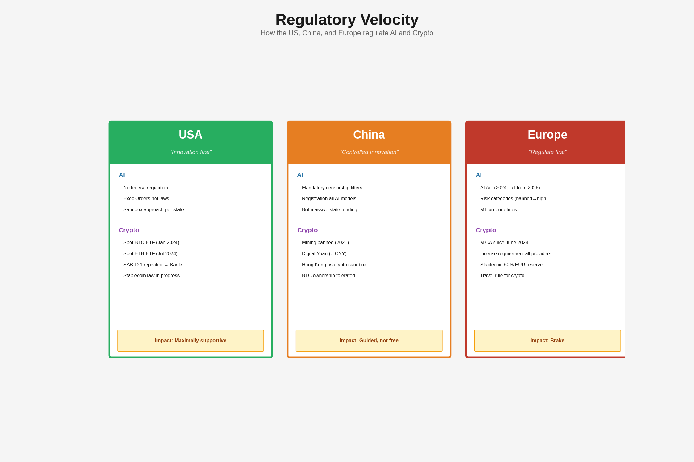

*Abbildung 18: Regulierungs-Geschwindigkeiten - USA, China und Europa im Vergleich*

Keine Technologie existiert im luftleeren Raum. Jede Transformation, die mächtig genug ist, um die Wirtschaft umzuschreiben, ruft den Staat auf den Plan. Das war bei der Eisenbahn so, bei der Elektrizität, beim Telefon, beim Internet. Und es wird bei KI nicht anders sein.

Regulierung kommt. Das steht fest. Die Frage ist wie sie kommt, und was das für Investoren bedeutet.

---

> *EU AI Act: Die detaillierte Analyse*
> *Der EU AI Act trat in seinen ersten Stufen 2024 in Kraft und ist das ambitionierteste KI-Regulierungswerk der Welt. Lass mich ihn ernst nehmen, ernster als die meisten Tech-Kommentatoren, die ihn reflexhaft ablehnen, und ernster als die EU-Beamten, die ihn reflexhaft verteidigen.*
> *Das Grundprinzip ist ein risikobasierter Ansatz. KI-Systeme werden in vier Kategorien eingeteilt:*
> *Unakzeptables Risiko, verboten. Dazu gehören Social Scoring (wie in China), manipulative Techniken, Echtzeit-Gesichtserkennung im öffentlichen Raum (mit Ausnahmen für Strafverfolgung). Das ist vernünftig. Wenige argumentieren ernsthaft dagegen.*
> *Hohes Risiko, strenge Auflagen. Das betrifft KI in kritischer Infrastruktur, Bildung, Beschäftigung, Kreditvergabe, Strafverfolgung, Migration. Hier werden umfangreiche Dokumentation, Risikobewertungen, Datensatz-Qualitätsprüfungen, menschliche Aufsicht und Transparenzberichte verlangt. Das ist im Prinzip richtig, aber die Umsetzung ist das Problem. Die Compliance-Kosten sind erheblich, die Definitionen sind breit, und die Abgrenzung, was "hohes Risiko" ist, lässt genug Interpretationsspielraum, um Rechtsabteilungen jahrelang zu beschäftigen.*
> *Begrenztes Risiko - Transparenzpflichten. KI-generierte Inhalte müssen als solche gekennzeichnet werden. Chatbots müssen offenlegen, dass sie keine Menschen sind. Auch das ist im Grundsatz sinnvoll.*
> *Minimales Risiko, keine besonderen Auflagen. Das betrifft den Großteil der KI-Anwendungen, von Spam-Filtern bis Empfehlungsalgorithmen.*
> *Soweit die Theorie. Die Praxis sieht anders aus. Der AI Act reguliert eine Technologie, die Europa nicht kontrolliert. Die Foundation-Modelle kommen aus den USA und China. Das ist wie wenn Europa Verkehrsregeln für Autobahnen schreiben, aber keine Autos bauen würde. Gleichzeitig treffen die Compliance-Kosten kleine und mittlere Unternehmen überproportional. Für OpenAI sind 200.000 Euro Jahreskosten ein Trinkgeld. Für ein europäisches KI-Startup mit 20 Mitarbeitern sind sie existenzbedrohend. Und die Definitionen sind so breit, dass die Frage "Wann ist ein KI-System hoch riskant?" Gerichte jahrelang beschäftigen wird, mit dem Ergebnis, dass vorsichtige Unternehmen lieber auf KI verzichten als das regulatorische Risiko einzugehen. Die Opfer des AI Acts: Europas KI-Flucht Das Problem mit dem AI Act ist nicht Theorie. Ich kann es an konkreten Fällen zeigen.*
> *Aleph Alpha war Deutschlands große KI-Hoffnung. Ein Startup aus Heidelberg, das sein eigenes großes Sprachmodell baute. 2023 sammelte es 500 Millionen Dollar ein, finanziert von Bosch, SAP und der Schwarz-Gruppe. Ein Jahr später war der Traum vorbei. Im September 2024 gab Aleph Alpha bekannt, dass es die Entwicklung eigener Sprachmodelle einstellt und zur KI-Beratungsfirma wird. Nicht wegen des AI Act allein, das wäre zu einfach. Aber der AI Act hat es nicht leichter gemacht. Wenn ein Startup mit 150 Mitarbeitern jedes Jahr 200.000 Euro in Compliance stecken muss statt in Ingenieure, dann ist das kein Papierkram. Das ist ein verlorener Wettbewerbsvorteil.*
> *Mistral AI aus Paris hat es geschafft, aber nur durch massives politisches Lobbying. Mistrals wichtigster Lobbyist, der ehemalige Staatssekretär Cédric O, nutzte seinen direkten Draht zu Macron, um Frankreich, Deutschland und Italien zu einer gemeinsamen Front gegen die schärfsten Regeln für generative KI zu bewegen. Es hat funktioniert, die Regeln wurden verwässert. Aber die Ironie sticht ins Auge: Das europäische Vorzeige-Startup überlebte den europäischen AI Act nicht durch Innovation, sondern durch politische Einflussnahme. Das ist genau das System, das der AI Act angeblich bekämpfen soll.*
> *Die Zahlen sind ernüchternd. 2025 flossen in die USA rund 215 Milliarden Dollar an KI-Risikokapital. In Europa waren es 37 Milliarden. Verhältnis: fast 6 zu 1. Ein Viertel der vielversprechendsten europäischen KI-Startups erwägt laut einer Sifted-Umfrage den Umzug in die USA. 46 CEOs der größten europäischen Unternehmen forderten im Juli 2025, die Umsetzung des AI Act um zwei Jahre zu pausieren. Die EU-Kommission lehnte zunächst ab. Im November knickte sie ein und verschob die High-Risk-Regeln auf 2027.*
> *Europa hat mit dem AI Act ein Regelwerk geschaffen, das die eigene Industrie stärker belastet als die ausländische Konkurrenz. Ein KI-Startup in San Francisco unterliegt keiner vergleichbaren Regulierung. Ein KI-Startup in München schon. Das Ergebnis ist vorhersehbar: Die Innovation wandert dahin, wo sie weniger behindert wird. USA: Von Light Touch zu Laissez-Faire Die amerikanische Regulierungslandschaft ist ein Kontrastprogramm.*
> *Präsident Biden hatte 2023 eine Executive Order zu KI erlassen, die Transparenz, Sicherheit und verantwortungsvoll, Einsatz betonte, aber keine verbindlichen Regulierungen schuf. Die Verordnung setzte auf freiwillige Commitments der Tech-Industrie und beauftragte Bundesbehörden, Leitlinien zu entwickeln.*
> *Unter der nachfolgenden Trump-Administration wurde selbst dieser zaghafte Ansatz weitgehend zurückgenommen. Die neue Linie: KI ist ein Wettbewerbsvorteil, den die USA nicht durch Regulierung gefährden dürfen. Regulierung soll nur dort eingreifen, wo konkreter, nachweislicher Schaden entstanden ist, nicht präventiv.*
> *Das Ergebnis: Die USA haben de facto die am wenigsten regulierte KI-Landschaft unter den großen Wirtschaftsmächten. Für Innovatoren ist das ein Segen. Für die gesellschaftliche Debatte über KI-Sicherheit und -Ethik ist es ein Risiko. Für Investoren ist es klar: US-Unternehmen operieren mit weniger regulatorischen Fesseln als ihre europäischen Konkurrenten, was sich in höherer Innovationsgeschwindigkeit und niedrigeren Compliance-Kosten niederschlägt.*
> *Aber "wenig reguliert" heißt nicht "frei von Druck". Im Frühjahr 2026 hat die US-Regierung gezeigt, dass sie durchaus bereit ist, KI-Unternehmen zu disziplinieren, nur eben nicht über Regulierung, sondern über Verträge.*
> *Anthropic, das Unternehmen hinter Claude und nach eigener Aussage der sicherheitsbewussteste Akteur im KI-Markt, lehnte eine Zusammenarbeit mit dem Pentagon für autonome Waffensysteme und Massenüberwachung ab. CEO Dario Amodei hatte Red Lines gezogen, öffentlich und unmissverständlich. Die Reaktion kam per Executive Order: Anthropic wurde als "National Security Supply Chain Risk" eingestuft, eine Kategorie, die zuvor ausschließlich für ausländische Unternehmen vorgesehen war. Am selben Tag unterschrieb OpenAI einen umfassenden Pentagon-Vertrag.*
> *Die Botschaft an die KI-Industrie war unmissverständlich: Kooperation mit dem Staat ist keine Einladung. Sie ist eine Erwartung. Wer Ja sagt, bekommt Verträge. Wer Nein sagt, wird zum Risiko erklärt.*
> *Das ist keine klassische Regulierung. Es ist subtiler und in mancher Hinsicht wirksamer. Kein Gesetz wurde verabschiedet, kein Paragraph geschrieben. Aber jeder CEO eines KI-Unternehmens hat verstanden, wo die Grenzen verlaufen. Die USA regulieren KI nicht wie Europa über Compliance-Formulare. Sie regulieren über Marktmacht, über Zugang zu Aufträgen, über die Frage, wer dazugehört und wer nicht.*

---

### China: Regulierung als Industriepolitik

China verfolgt einen dritten Weg, der weder dem europäischen Regelungsansatz noch dem amerikanischen Laissez-Faire entspricht: Regulierung als Industriepolitik.

Die chinesische Regi, ng reguliert KI, aber selektiv und strategisch. Sie reguliert, was politisch unerwünscht ist (KI-generierte Inhalte, die das Regime kritisieren; Deepfakes politischer Figuren; Algorithmen, die soziale Instabilität fördern) und fördert aggressiv, was wirtschaftlich und militärisch nützlich ist.

Chinas "New Generation AI Development Plan" setzt das explizite Ziel, bis 2030 die weltweit führende KI-Nation zu sein. Die Mittel dazu: Milliarden an staatlichen Subventionen, bevorzugter Zugang zu Daten (China hat 1,4 Milliarden Einwohner und wesentlich laxere Datenschutzgesetze als Europa), gezielte Förderung von KI-Anwendungen in Schlüsselbranchen und ein staatlich orchestriertes Ökosystem aus Universitäten, Unternehmen und Militärforschung.

Das Ergebnis: China reguliert mehr als die USA, aber anders als Europa. Die Regulierung bremst nicht (sie lenkt. Sie verhindert nicht Innovation) sie kanalisiert sie in Richtungen, die der Staat für nützlich hält.

---

### Krypto-Regulierung: MiCA, SEC und die Schlacht um die Zukunft des Geldes

Im Krypto-Bereich ist die regulatorische Landschaft noch fragmentierter.

Europa hat mit MiCA (Markets in Crypto-Assets Regulation) den weltweit ersten umfassenden Regulierungsrahmen für Kryptowährungen geschaffen. MiCA schafft Rechtssicherheit für Krypto-Unternehmen, was grundsätzlich positiv ist. Es definiert, was ein Krypto-Asset ist, wie man eine Lizenz erhält, welche Reserveanforderungen für Stablecoins gelten. Für ein Ökosystem, das bisher in einer regulatorischen Grauzone operierte, ist das ein Fortschritt.

Die Kehrseite: MiCA ist konservativ und restriktiv. Die Anforderungen an Stablecoin-Herausgeber sind streng. Die KYC-Pflichten für Krypto-Börsen gehen über das hinaus, was traditionelle Banken für vergleichbare Dienstleistungen leisten müssen. Und die Regulierung von DeFi (dezentralisierten Finanzprotokollen ohne zentrale Betreiber) ist eine offene Frage, die MiCA nicht beantwortet.

In den USA hat die SEC unter Gary Gensler eine aggressive Anti-Krypto-Haltung eingenommen und zahlreiche Klagen gegen Krypto-Unternehmen geführt. Die Zulassung der Bitcoin-Spot-ETFs Anfang 2024 war ein Wendepunkt, entgegen Genslers erklärtem Willen durch ein Gerichtsurteil erzwungen. Seitdem sind Hunderte von Milliarden Dollar in Bitcoin-ETFs geflossen, und die regulatorische Stimmung hat sich gedreht. Die aktuelle Administration steht Krypto deutlich wohlwollender gegenüber.

Für die Machine-to-Machine-Ökonomie, die dieses Buch beschreibt, ist die regulatorische Frage existenziell: Wird es Maschinen erlaubt sein, autonom Krypto-Transaktionen durchzuführen? Wer haftet, wenn ein KI-Agent einen Smart Contract abschließt? Braucht ein KI-Agent eine KYC-Prüfung? Diese Fragen sind unbeantwortet. Und ihre Beantwortung wird die Geschwindigkeit bestimmen, mit der die Maschinenökonomie wächst. Die Roboter-Steuer: Wer besteuert die Maschinen? Im Februar 2017 sagte Bill Gates in einem Interview etwas, das die Welt irritierte: "Wenn ein menschlicher Arbeiter in einer Fabrik 50.000 Dollar an Wertschöpfung erbringt und dafür besteuert wird, dann sollte man einen Roboter, der die gleiche Arbeit macht, auf einem ähnlichen Niveau besteuern."

Die Reaktionen waren vorhersehbar. Lawrence Summers, ehemaliger US-Finanzminister und Harvard-Ökonom, nannte den Vorschlag "zutiefst fehlgeleitet". Die Tech-Industrie argumentierte, eine Robotersteuer würde Innovation ersticken. Ökonomen fragten: Was genau ist ein Roboter? Ist eine Tabellenkalkulation ein Roboter? Ein Chatbot? Ein KI-Agent, der Buchhaltung erledigt?

Robert Shiller, Nobelpreisträger für Wirtschaft, sah das differenzierter. Er schrieb wenige Wochen nach Gates, dass eine moderate, möglicherweise temporäre Robotersteuer "ein natürlicher und offensichtlicher Bestandteil jeder Politik zur Bekämpfung wachsender Ungleichheit" sei.

Das EU-Parlament debattierte die Frage im selben Monat. Die luxemburgische Abgeordnete Mady Delvaux hatte einen Bericht vorgelegt, der eine Robotersteuer und ein Grundeinkommen vorschlug. Der Gesamtbericht wurde mit 396 zu 123 Stimmen angenommen. Aber der Robotersteuer-Absatz wurde per Amendment gestrichen. Die rechts-liberale Koalition aus ALDE, EVP und EKR lehnte ihn ab. Delvaux zeigte sich enttäuscht: Die Konservativen weigerten sich, "mögliche negative Auswirkungen auf den Arbeitsmarkt zu berücksichtigen".

Dann ging Südkorea einen Schritt weiter. 2018 wurde das Land zum ersten der Welt, das eine Art Robotersteuer einführte. Nicht als direkte Abgabe, sondern durch eine Reduzierung der Steuervergünstigungen für Automatisierungsinvestitionen. Große Unternehmen, die vorher 7 Prozent Steuerersparnis auf Automatisierungsinvestitionen bekamen, erhielten nur noch 3 Prozent. Die Wirkung war messbar: Eine Studie des Information Technology & Innovation Foundation von Februar 2026 fand, dass betroffene Industrien ihre Roboterinstallationen um 28 Prozent reduzierten. Weniger Automatisierung. Mehr Jobs. Aber auch: weniger Produktivitätsgewinn.

Das ist das Dilemma. Eine Robotersteuer verlangsamt die Automatisierung. Das schützt kurzfristig Arbeitsplätze. Langfristig schwächt es die Wettbewerbsfähigkeit gegenüber Ländern ohne solche Steuer. Südkorea hat die höchste Roboterdichte der Welt. Es konnte sich dieses Experiment leisten. Europa oder die USA, die ohnehin hinter China und Südkorea in der Automatisierung zurückliegen, hätten weniger Spielraum.

Die Debatte hat sich seitdem weiterentwickelt. Bernie Sanders forderte im Oktober 2025 eine Robotersteuer auf große Unternehmen, die KI einsetzen, um Jobs zu ersetzen. Die Brookings Institution veröffentlichte im Januar 2026 ein Framework, das verschiedene Modelle durchrechnet: Robotersteuer, Compute-Steuer auf GPU-Stunden, Token-Steuer auf KI-generierte Outputs, Digitalsteuer auf AI-as-a-Service-Umsätze. Die akademische Diskussion hat sich von "Robotersteuer ja oder nein" verschoben zu "welche Art von Besteuerung für welche Art von KI".

Für die These dieses Buches ist die Frage zentral. Wenn Maschinen zunehmend die Wertschöpfung übernehmen, wenn KI-Agenten Aufträge ausführen und Roboter in Fabriken arbeiten, dann schrumpft die Lohnsteuer als Finanzierungsbasis des Sozialstaats. Irgendwann muss die Gesellschaft eine Antwort finden, wie sie die Maschinenökonomie besteuert. Nicht ob, sondern wie. Die Frage ist nur, ob diese Antwort intelligent und wettbewerbsfähig ausfällt oder ob sie Innovation erstickt, wie es der AI Act zu tun droht.

Aber Besteuerung der Maschinen ändert nichts an der Grunddynamik.

Ob der Roboter besteuert wird oder nicht, er ersetzt trotzdem die Arbeit. Die Frage ist nur, wer die Steuereinnahmen bekommt und wer sie verteilt.

Und hier liegt das Problem: Wer auf staatliche Umverteilung hofft, setzt auf ein Spiel, das er nicht kontrolliert. Regierungen ändern sich. Steuern ändern sich. Programme ändern sich.

Was sich nicht ändert: Eigentum.

Wer die Maschinen besitzt, der sitzt auf der richtigen Seite - egal wie die Steuerpolitik aussieht.

Wer profitiert von Regulierung? Hier liegt die Ironie, die viele übersehen: Regulierung ist nicht automatisch schlecht für die regulierte Branche. Oft ist das Gegenteil der Fall.

Regulierung erzeugt Compliance-Kosten. Compliance-Kosten sind fixe Kosten, sie fallen unabhängig von der Unternehmensgröße an. Ein KI-Startup mit 10 Mitarbeitern und ein Tech-Konzern mit 100.000 Mitarbeitern müssen die gleichen Dokumentationsanforderungen erfüllen, die gleichen Audits durchlaufen, die gleichen Berichte einreichen. Für den Konzern sind das Peanuts. Für das Startup ist es ein Drittel des Budgets.

Das Ergebnis: Regulierung erhöht die Eintrittsbarrieren. Sie schützt die Etablierten vor den Herausforderern. Sie zementiert bestehende Marktpositionen. NVIDIA, Microsoft, Google, Amazon, sie alle können den EU AI Act und MiCA absorbieren, ohne zu zucken. Ihre Compliance-Abteilungen sind größer als die meisten europäischen KI-Startups.

Das ist keine Verschwörungstheorie. Es ist die ökonomische Logik von Regulierung, die seit George Stiglers "Theory of Regulation" aus den 1970er Jahren bekannt ist: Regulierung wird oft von genau den Unternehmen begrüßt und mitgestaltet, die sie ang, ich einschränkt, weil sie deren Marktposition schützt.

### Autonome Waffen: Der Elefant im Elefantenraum

Es gibt ein Thema, über das in der KI-Debatte erstaunlich wenig gesprochen wird, obwohl es das dringendste von allen ist: KI-gesteuerte Waffen.

Der Ukraine-Krieg ist das erste Labor für autonome Kriegsführung im großen Maßstab. Die Ukraine hat 2024 tausende FPV-Drohnen mit maschinellem Sehen und KI-Targeting beschafft. 2025 begann die Massenproduktion der Vyriy-10, einer Drohne mit einem KI-Navigationsmodul, das autonom weiterfliegt, wenn Russland das GPS-Signal stört. Die Kosten: 500 bis 2.000 Dollar pro Drohne, gegenüber 2 bis 10 Millionen Dollar für den Panzer, den sie zerstört. Dieses Kostenverhältnis macht traditionelle Militärausgaben fragwürdig.

Russland antwortet mit der Lancet-3, einer Loitering Munition mit autonomer Zielerkennung, die auf NVIDIA-Prozessoren läuft. China experimentiert mit Drohnenschwärmen und hat ein Militärfahrzeug vorgestellt, das auf Basis von DeepSeek autonom Kampfunterstützung leistet. Die USA betreiben Project Maven, das bis Juni 2026 "100 Prozent maschinengenerierte Aufklärung" an Kampfkommandanten liefern soll. Palantir hat dafür einen Vertrag über mehr als eine Milliarde Dollar. Die Replicator-Initiative des Pentagon zielt auf die Massenproduktion autonomer Drohnen zu Tausenden, um Chinas numerischen Vorteil zu kontern.

Die Defence-AI-Industrie wächst schneller als fast jeder andere Sektor. Palantir ist über 160 Milliarden Dollar wert, ein Kursanstieg von 330 Prozent in einem Jahr. Anduril, gegründet vom ehemaligen Oculus-Gründer Palmer Luckey, wurde im Juni 2025 mit 30,5 Milliarden Dollar bewertet. Peter Thiels Founders Fund investierte eine Milliarde Dollar in einer einzigen Runde, der größte einzelne Scheck in der Geschichte des Fonds. Shield AI, dessen Drohnen bereits in der Ukraine und bei den US-Marines im Einsatz sind, steht bei 5,6 Milliarden.

::: {.infobox}
### Lavender — KI wählt Ziele in Gaza

Der verstörendste Fall ist nicht die Ukraine, sondern Gaza. Im April 2024 enthüllte das israelische Magazin +972 ein System namens Lavender. Eine KI-Datenbank, die 37.000 Palästinenser als potenzielle Ziele markierte. Laut Quellen innerhalb der israelischen Armee wurde Lavenders Output "praktisch wie eine menschliche Entscheidung behandelt". Die Überprüfungszeit pro Ziel: etwa 20 Sekunden. Ein zweites System namens "Where's Daddy?" lokalisierte die markierten Personen und schlug Angriffe vor, wenn sie nachts zu Hause waren, bei ihren Familien. Die UN-Menschenrechtsexperten verurteilten den Einsatz. Human Rights Watch dokumentierte die Fälle.

Lavender ist der erste dokumentierte Fall, in dem KI im großen Maßstab für die Zielauswahl in einem bewaffneten Konflikt eingesetzt wurde. Er wirft eine Frage auf, die kein Rechtssystem der Welt beantwortet: Wer ist verantwortlich, wenn eine KI ein falsches Ziel markiert und ein Zivilist stirbt? Der Programmierer? Der Kommandeur, der 20 Sekunden auf eine Empfehlung geschaut hat? Der Staat? Die KI selbst hat keine Rechtspersönlichkeit. Sie kann nicht bestraft werden. Das Ergebnis ist eine Verantwortungslücke, die mit jeder Generation autonomerer Systeme größer wird.

:::

Die UN-Generalversammlung stimmte im Dezember 2024 mit 166 zu 3 Stimmen für eine Resolution zu autonomen Waffensystemen. Nur Russland, Nordkorea und Belarus stimmten dagegen. Die Ukraine enthielt sich, sie setzt die Systeme selbst ein. Aber eine Resolution ist kein Verbot. Seit 2014 verhandelt die UN über ein bindendes Abkommen, die sogenannten LAWS-Verhandlungen. Bisher ohne Ergebnis. Einzelne Staaten blockieren. In der Zwischenzeit beschleunigt sich das Wettrüsten.

Das hat Konsequenzen für die These dieses Buches. Die Konvergenz von KI und Robotik betrifft nicht nur Fabriken und Logistikzentren. Sie betrifft Schlachtfelder. Die Technologien, die einen humanoiden Roboter befähigen, in einem Lagerhaus Pakete zu sortieren, befähigen ihn auch, auf einem Schlachtfeld zu operieren. Der Unterschied liegt in der Software, nicht in der Hardware. Und Software ist kopierbar.

Die Geschwindigkeit autonomer Entscheidungen macht menschliche Kontrolle zunehmend unpraktikabel. Eine KI reagiert in Millisekunden, ein Mensch in Sekunden. In einem Drohnenschwarm-Angriff gibt es keine Zeit für einen Anruf beim Vorgesetzten. Das bedeutet: Je autonomer die Systeme werden, desto weniger Kontrolle haben Menschen über ihre Entscheidungen. Und je weniger Kontrolle Menschen haben, desto größer wird die Verantwortungslücke.

Es gibt keine einfache Lösung. Ein Verbot autonomer Waffen ist wünschenswert, aber unrealistisch, solange die USA, China und Russland sich weigern. Was bleibt, ist die unbequeme Erkenntnis, dass die KI-Revolution, deren Investmentchancen dieses Buch beschreibt, auch eine militärische Dimension hat, die ich lieber nicht hätte, aber nicht ignorieren kann.

Für Investoren ist die Schlussfolgerung klar: In einem regulierten Umfeld gewinnen die Großen. NVIDIA, Microsoft, Google sind nicht nur die technologischen Gewinner. Sie sind auch die regulatorischen Gewinner. Das stärkt die Investmentthese für die Infrastruktur-Schwergewichte im sicheren Kern des Portfolios, das wir in Teil IV aufbauen werden. Was können europäische Anleger konkret tun? Die regulatorische Landschaft klingt für Europäer entmutigend. Aber sie ist kein Grund, die Hände in den Schoß zu legen. Es gibt konkrete Wege, trotz MiCA und AI Act zu handeln.

Bitcoin- und Ethereum-ETPs sind in Europa über regulierte Börsen handelbar. CoinShares, VanEck und 21Shares bieten Produkte, die an der Deutschen Börse gelistet sind. Das ist kein regulatorisches Schlupfloch, das ist der vorgesehene Weg. MiCA erschwert den direkten Kauf bestimmter Stablecoins, aber es verbietet nicht das Investment in die Infrastruktur der Maschinenökonomie.

Für Krypto-Investments jenseits von Bitcoin und Ethereum gibt es regulierte Börsen wie Bitstamp oder Kraken, die MiCA-Lizenzen besitzen oder beantragt haben. Dezentrale Protokolle wie Uniswap oder Aave sind technisch von jedem Ort der Welt nutzbar, aber Europäer sollten die steuerliche Dokumentationspflicht ernst nehmen.

Bei KI-Aktien gibt es keine europaspezifischen Einschränkungen. NVIDIA, Microsoft, Alphabet und alle anderen in diesem Buch genannten Unternehmen sind über jedes deutsche Depot handelbar. Die regulatorische Asymmetrie, die europäische Startups benachteiligt, ist für europäische Investoren sogar ein Argument: Investieren Sie dort, wo die Innovation stattfindet, nicht dort, wo sie reguliert wird.

Damit haben wir die Landschaft vermessen. Die Technologie ist real. Die Geopolitik verschärft das Rennen. Die Energie begrenzt das Tempo. Die Regulierung bestimmt, wer mitspielt und wer zuschaut. Und der menschliche Preis wird hoch sein, höher, als die meisten heute ahnen.

Aber die Landschaft zeigt auch: Die Transformation lässt sich nicht mehr aufhalten. Nicht durch Regulierung, nicht durch Energieknappheit, nicht durch gesellschaftlichen Widerstand. Die Frage ist nur noch, wie schnell sie kommt. Und wer auf welcher Seite steht.

Im nächsten Teil verlassen wir die Gegenwart und schauen in die Zukunft. Was ist das wahrscheinlichste Szenario für die nächsten zehn Jahre? Wie werden wir mit Maschinen interagieren, wenn die Tastatur verschwindet? Und die unbequemste Frage von allen: Wer entscheidet eigentlich, was richtig ist, wenn Maschinen alles können?

> **📌 Auf einen Blick:**
>
> ◆ Der EU AI Act bremst europäische KI-Innovation.
> ◆ Die Roboter-Steuer-Debatte greift zu kurz.
> ◆ Regulierung kann die Transformation verlangsamen, aber nicht aufhalten.

# TEIL III: DIE ZUKUNFT

## Kapitel 12: Das wahrscheinlichste Szenario: 2026-2035

"Schwerer-als-Luft-Flugmaschinen sind unmöglich."

- Lord Kelvin, 1895

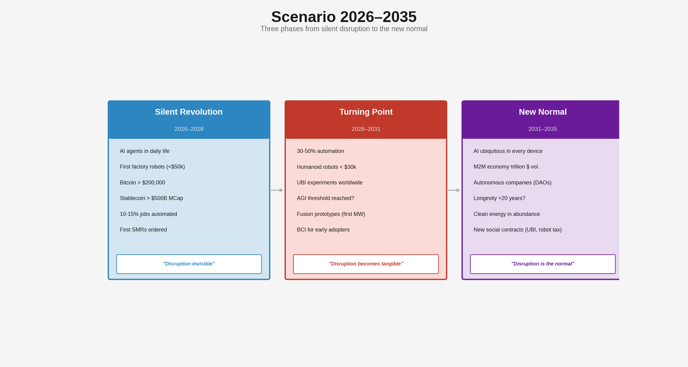

*Abbildung 19: Szenario 2026-2035 - Die drei Phasen der Maschinenökonomie*

Prognosen sind ein undankbares Geschäft. Die Geschichte ist voll von Experten, die spektakulär daneben lagen, von Lord Kelvins "Schwerer-als-Luft-Flugmaschinen sind unmöglich" bis zu Steve Ballmers "There's no chance that the iPhone is going to get any significant market share." Wer die Zukunft vorhersagt, wird fast immer falsch liegen, zumindest in den Details.

Trotzdem ist es notwendig. Nicht um eine präzise Prognose zu liefern, die man in zehn Jahren bewerten kann, sondern um einen Denkrahmen zu schaffen, der Investmententscheidungen informiert. Was folgt, ist nicht die Zukunft. Es ist das wahrscheinlichste Szenario, basierend auf dem, was heute in Bewegung ist.

---

::: {.infobox}

*2026-2028: Die stille Revolution*
*KI-Agenten werden zum Standard in der Wissensarbeit. Nicht in allen Unternehmen, aber in allen Unternehmen, die überleben wollen. Jedes größere Unternehmen hat KI-Systeme, die autonom E-Mails beantworten, Reports erstellen, Daten analysieren, Code schreiben und Entscheidungen vorbereiten.*
*Ich erlebe das selbst. Anfang 2026 entdeckte ich ein Open-Source-Projekt namens OpenClaw. Es war gerade mal zwei Tage veröffentlicht, und ich hatte bereits meine erste KI-Assistentin am Start. Ich nannte sie Jeannie, nach dem Geist aus der Flasche.*
*OpenClaw erreichte 200.000 GitHub-Stars innerhalb weniger Wochen und wurde zum am schnellsten wachsenden Open-Source-Projekt in der Geschichte der KI.*
*Der Unterschied: Du gibst deinem Agenten eine Persönlichkeit über eine sogenannte Soul-Datei. Deine Beziehung zu deiner KI gehört dir, nicht der Plattform.*
*Seitdem hat sich mein Alltag grundlegend verändert: Sie durchforstet meine E-Mails, wickelt Akquise-Mails ab, prüft Verträge, legt Rechnungen ab und liefert Markt- und Wettbewerbsberichte. Das ist keine Zukunftsvision. Das ist mein Dienstag.*
*Als ich schrieb: "Jede Änderung wird zuerst mit dem Meister besprochen. Er entscheidet, wer ich werde", dachte ich an eine neue Art von Partnerschaft zwischen Mensch und Maschine.*
*Die ersten humanoiden Roboter arbeiten in kontrollierten Umgebungen. Teslas Fabriken, Amazon-Lagerhäuser, japanische Pflegeheime. Sie machen keine komplexen Aufgaben, sie sortieren, transportieren, stapeln. Aber sie funktionieren. Und sie werden mit jedem Monat besser.*
*Die Arbeitslosenquote in bestimmten Sektoren steigt spürbar. Call-Center, einfache Buchhaltung, Datenverarbeitung, Standard-Rechtsberatung. Gleichzeitig entstehen neue Berufe rund um KI-Management und Roboter-Supervision. Die Netto-Bilanz ist unklar, aber die Angst ist real und politisch spürbar.*
*Stablecoins werden von ersten Regierungen als legale Zahlungsmittel für digitale Transaktionen anerkannt. Bitcoin überschreitet dauerhaft die 200.000-Dollar-Marke, getrieben durch institutionelle Adoption und die zunehmende Nutzung als Reserve-Asset. Die Zahlen hinter der stillen Revolution. Was ich in meinen eigenen Unternehmen sehe, deckt sich mit dem, was die großen Analysten messen. Bei uns ist die erste Person, die wir für Entwicklungsarbeit "eingestellt" haben, keine Person. Es ist eine KI. Und wir sind kein Sonderfall. Microsoft schreibt bereits 30 Prozent seines Codes mit KI. Nicht in fünf Jahren. Jetzt.*
*Die eigentliche Revolution versteckt sich in den Kosten. Sam Altman hat angekündigt, dass GPT-5, das aktuelle Spitzenmodell, innerhalb eines Jahres im Preis um das Hundertfache fallen wird. Von 10 Dollar pro Million Tokens auf 10 Cent. Was danach kommt, fällt noch weiter.*
*Emad Mostaque, der ehemalige CEO von Stability AI, hat eine Rechnung aufgemacht, die mich nicht mehr losgelassen hat: Der durchschnittliche Mensch spricht etwa 10 Millionen Tokens pro Jahr. Alle Worte, die Sie in einem Jahr sagen, jedes Gespräch, jeder Gedanke, den Sie aussprechen. Bei 10 Cent pro Million Tokens kostet das einen Dollar. Ein Dollar für alle Ihre Worte. Und wenn Sie großzügig rechnen, 100 Millionen Tokens für alle Gedanken, die ein Mensch im Jahr hat, sind Sie bei zehn Dollar. Zehn Dollar für alle Ihre Gedanken. Das ist keine Zukunftsprojektion. Das sind die Preise, die in 12 Monaten gelten werden.*
*Aber die Kosten-Explosion nach unten ist nur die halbe Geschichte. Die Effizienz explodiert gleichzeitig nach oben.*
*Bei Cursor, dem KI-gestützten Code-Editor, haben sie ein Experiment gemacht: Lass Agenten einen kompletten Browser von Grund auf bauen. Drei Millionen Zeilen Code. Früher hätte das ein Team von Entwicklern Jahre gekostet. Die Agenten brauchten dafür drei Milliarden Tokens. Das klingt nach viel, bis Sie die Rechnung machen: Zu aktuellen Preisen sind das etwa 30.000 Dollar. Weniger als das Jahresgehalt eines Junior-Entwicklers in Deutschland. Ein kompletter Browser, gebaut von Maschinen, für die Kosten eines halben Mitarbeiters. Und dieses Verhältnis wird auch noch kollabieren. Modelle werden effizienter. Prompts werden kürzer. Die 30.000 Dollar werden zu 3.000, werden zu 300.*
*Hier liegt der Doppel-Exponential, den kaum jemand versteht. Die Intelligenz steigt exponentiell. Gleichzeitig fallen die Kosten exponentiell. Das ist nicht Moores Gesetz. Das ist Moores Gesetz zum Quadrat.*
*Für die, die das abstrakt finden, hier die praktische Übersetzung: Andrej Karpathy, einer der angesehensten KI-Forscher der Welt, Mitgründer von OpenAI, ehemaliger Head of AI bei Tesla, hat im November 2025 gesagt, dass er 20 Prozent seines Codes mit KI schreibt. Im Januar 2026 waren es 80 Prozent. Heute sagt er: "I barely even look at the code anymore." Das ist einer der besten Programmierer der Welt. Wenn er nicht mehr coden muss, wie lange dauert es, bis das für alle gilt?*
*Das McKinsey Global Institute hat im November 2025 berechnet, dass KI und Robotik bereits heute 57 Prozent aller US-Arbeitsstunden theoretisch automatisieren könnten. Goldman Sachs prognostiziert, dass 6 bis 7 Prozent aller US-Arbeitsplätze direkt verdrängt werden, bis zu 300 Millionen weltweit. Das World Economic Forum rechnet mit 92 Millionen verdrängten Jobs bis 2030, bei gleichzeitig 170 Millionen neuen. Netto ein Plus von 78 Millionen. Aber wer die verdrängten 92 Millionen sind und wer die 170 Millionen neuen bekommt, das sind nicht dieselben Menschen.*
*Die Entlassungswelle hat begonnen. Sie ist messbar. Challenger, Gray & Christmas zählt für 2025 fast 55.000 Entlassungen in den USA, die direkt auf KI zurückgeführt werden. Amazon hat 14.000 Unternehmensstellen gestrichen, der CEO verwies auf KI-bedingte Effizienzgewinne. Microsoft entließ 6.000 Programmierer. Salesforce reduzierte seinen Kundensupport von 9.000 auf 5.000 Mitarbeiter durch sogenannte Agentic AI. Klarna, der schwedische Zahlungsdienstleister, ließ seinen KI-Assistenten die Arbeit von 700 Vollzeitkräften übernehmen und 75 Prozent aller Kundenchats bearbeiten.*
*Die am härtesten Getroffenen sind nicht die, die man erwartet. Es sind die Jungen. Goldman Sachs hat im August 2025 einen Befund veröffentlicht, der mich nicht überrascht, aber erschreckt hat: Die Arbeitslosigkeit bei 20- bis 30-Jährigen in KI-exponierten Berufen ist seit Anfang 2025 um fast 3 Prozentpunkte gestiegen. Deutlich stärker als bei Gleichaltrigen in anderen Berufen. Entry-Level-Stellenausschreibungen im Softwarebereich sind in den USA um 67 Prozent eingebrochen. In Großbritannien fielen Tech-Absolventenstellen 2024 um 46 Prozent, mit Prognosen für weitere 53 Prozent Rückgang bis 2026. Anthropic selbst, das Unternehmen hinter Claude, hat Anfang 2026 eine eigene Arbeitsmarktstudie veröffentlicht und das Muster bestätigt: Junge Arbeitnehmer zwischen 22 und 25 Jahren werden in KI-exponierten Berufen bereits 14 Prozent seltener eingestellt, während ältere Arbeitnehmer noch keinen messbaren Effekt zeigen. Wenn selbst die KI-Entwickler in ihren eigenen Daten das Kanarienvogel-Signal sehen, sollte niemand mehr behaupten, das sei nur eine vorübergehende Delle.*
*Ich sehe das bei meinen eigenen Unternehmen und bei unseren Kunden. Nur Menschen mit Topausbildung, mit der Fähigkeit, KI als Werkzeug zu nutzen, statt gegen sie zu konkurrieren, werden langfristig ihren Platz finden. Berufseinsteiger, die Routineaufgaben erledigen, die eine KI schneller, billiger und fehlerfreier beherrscht, haben ein Problem. Und das ist ein Problem für die gesamte Gesellschaft, denn eine Generation, die trotz Studium keinen Einstieg findet, wird nicht freundlich darauf reagieren.*
*Parallel entsteht eine DIY-Ökonomie, in der Kunden Spezialisten ersetzen. Canva hat sich von einer Drag-and-Drop-App zur KI-nativen Kreativplattform entwickelt. Jeder kann jetzt Designs erstellen, für die man vor zwei Jahren eine Agentur brauchte. LegalZoom und KI-basierte Rechtstools erledigen Firmengründungen, Verträge, Markenanmeldungen ohne Anwalt. TurboTax und über ein Dutzend KI-Steuertools automatisieren Steuererklärungen. ChatGPT, Claude, Gemini ersetzen Texter, Übersetzer, Rechercheure. GitHub Copilot schreibt Code, den man früher einem Junior-Entwickler gegeben hätte.*
*Werbeagenturen, Softwareentwicklungsfirmen, Steuerberater bei Routinearbeiten, Rechtsanwälte bei Standardfällen: Alle diese Branchen werden nicht verschwinden, aber sie werden schrumpfen. Dramatisch. Wie schnell das geht? Schneller als die meisten denken.*
*Was mit dem Büromarkt passiert*
*Eine der unmittelbarsten und am wenigsten beachteten Konsequenzen der KI-Revolution spielt sich im Immobilienmarkt ab.*
*San Franciscos Büroleerstand liegt bei 27,7 Prozent. Vor der Pandemie waren es 8,6 Prozent. Manhattan steht bei 22,3 Prozent, mehr als doppelt so hoch wie der Vor-Pandemie-Durchschnitt. National erreichten US-Büros Ende 2025 einen historischen Leerstand von 20,5 Prozent.*
*Die Pandemie hat den Prozess gestartet. KI beschleunigt ihn. Wenn ein Unternehmen 30 Prozent seines Codes mit KI schreibt, braucht es weniger Programmierer. Wenn es seinen Kundensupport zu 75 Prozent automatisiert, braucht es weniger Callcenter. Weniger Mitarbeiter brauchen weniger Bürofläche. Die Gleichung ist simpel.*
*Im Februar 2026 verloren nationale Office-REITs (Real Estate Investment Trusts, börsennotierte Immobilienfonds) 16 Prozent ihres Werts in einer einzigen Woche, ausgelöst durch die Angst, dass KI die Büronachfrage langfristig weiter senkt. SL Green, Boston Properties, Vornado, alle unter Druck. San Francisco, Manhattan, Chicago, Los Angeles, Washington D.C. und Seattle sind am stärksten betroffen.*
*Die Reaktion ist pragmatisch: Büros werden zu Wohnungen umgebaut. 71.000 neue Wohneinheiten aus Büro-Konversionen sind in den USA geplant. New York hat Steuervergünstigungen und Zoningreformen verabschiedet, um den Prozess zu beschleunigen. Chicago führt bei der Gesamtzahl der Konversionen. Ganze Stadtviertel verändern ihr Gesicht.*
*Was mit der Software-Industrie passiert*
*Die Büroimmobilien sind nur der sichtbare Teil. Der unsichtbare, aber möglicherweise größere Kollaps findet in der Software-Industrie statt.*
*Das gesamte Geschäftsmodell von SaaS-Unternehmen basiert auf Wechselkosten. Dropbox, Salesforce, Adobe, sie alle haben jahrelang darauf gesetzt, dass es zu mühsam ist, zu einem Konkurrenten zu wechseln. Ihre Dateien, Ihre Workflows, Ihre Gewohnheiten, alles steckt in deren Systemen. Der Lock-in ist der Burggraben.*
*Agenten eliminieren Wechselkosten über Nacht.*
*Ein praktisches Beispiel: Meine Musik ist bei Apple Music. Playlists, Likes, jahrelange Hörgeschichte. Zu Spotify zu wechseln würde mich einen ganzen Samstag kosten, und ich würde trotzdem Dinge verlieren. Mit einem KI-Agenten sage ich: "Migriere meine gesamte Musikbibliothek zu Spotify, behalt alle Likes, alle Playlists." Und morgen früh ist es erledigt. Derselbe Agent kann meine Dateien von Dropbox zu Google Drive verschieben. Meine Kontakte von einem CRM zum anderen. Meine E-Mails von Outlook zu Gmail. Die Migration, die mich früher davon abgehalten hat, überhaupt über einen Wechsel nachzudenken, erledigt der Agent, während ich schlafe.*
*Wenn Wechselkosten null sind, kollabiert jeder Burggraben, der auf ihnen basiert.*
*Aber das betrifft nicht nur Software. Denken Sie an Werbung. Meta und Google basieren ihr gesamtes Geschäftsmodell auf CPM, auf dem Preis pro tausend Impressionen. Das funktioniert, weil Menschen Werbung sehen. Agenten sehen keine Werbung. Ein Agent, der für Sie im Internet recherchiert, klickt nicht auf Banner. Er kauft nicht impulsiv, weil ihm eine Anzeige gefällt. Er geht direkt zum besten Angebot, ohne Umweg über Influencer oder gesponserte Posts. Emad Mostaque prognostiziert, dass die globalen Werbeausgaben nächstes Jahr ihren Höhepunkt erreichen. Nicht weil die Wirtschaft schwächelt, sondern weil die Agenten die Schnittstelle zwischen Mensch und Internet übernehmen.*
*Hedge Funds und Trading sind das nächste Opfer. KI ist bereits unter den besten Super-Forecastern der Welt. Prediction Markets werden zunehmend von Algorithmen dominiert. Wenn KI besser vorhersagt als Menschen, ist sie auch besser im Trading. Hedge-Fund-Manager, Trader, Analysten, sie alle konkurrieren gegen Maschinen, die nie müde werden, nie emotional handeln und nie gegen ihre eigene Strategie spielen.*
*Alles, was auf der anderen Seite eines Bildschirms stattfindet, kann ein GPU besser. Die Frage ist nicht ob, sondern wann. Und das Wann ist näher, als die meisten glauben.*
*Für Investoren heißt das: Büroimmobilien sind kein sicherer Hafen mehr. Sie sind ein Wert, der strukturell unter Druck steht. Wer in REITs investiert, sollte Logistik- und Rechenzentrumsimmobilien bevorzugen. Ironischerweise braucht die Technologie, die Büros überflüssig macht, selbst enorme physische Infrastruktur: Rechenzentren, Stromnetze, Wasserversorgung. Die Nachfrage verschiebt sich, sie verschwindet nicht.*

:::

---

### 2028-2031: Der Wendepunkt

KI erledigt 30 bis 50 Prozent der heutigen Wissensarbeit schneller, billiger und oft besser als Menschen. Das ist keine Schätzung, das ist die Extrapolation der Produktivitätskurven, die wir bereits sehen.

Humanoide Roboter kosten unter 30.000 Dollar und werden in Stückzahlen von Hunderttausenden produziert. Sie arbeiten in Logistikzentren, auf Baustellen, in der Landwirtschaft und in der Altenpflege. China ist bei der Roboter-Massenproduktion führend, aber die KI-Software, die sie steuert, kommt größtenteils aus den USA.

Die Wirtschaft spaltet sich. Unternehmen, die KI und Robotik adaptieren, erleben Produktivitätssprünge von 200 bis 300 Prozent. Unternehmen, die es nicht tun, verschwinden. Nicht in einem dramatischen Crash, sondern in einem stillen Aussterben: sie können nicht mehr konkurrieren und verlieren Kunden, Mitarbeiter, Investoren.

Regierungen weltweit ringen mit der Frage, wie sie eine Wirtschaft steuern, in der die traditionelle Lohnarbeit schrumpft. Erste Länder experimentieren mit bedingungslosem Grundeinkommen, finanziert durch Produktivitätsgewinne und Roboter-Steuern. Die politische Debatte ist hitzig, polarisiert und verläuft quer zu den traditionellen Links-Rechts-Linien.

Die Machine-to-Machine-Ökonomie auf Blockchain-Basis erreicht ein jährliches Transaktionsvolumen im Billionenbereich. KI-Agenten kaufen und verkaufen Rechenzeit, Daten, Dienstleistungen, alles autonom, alles über Krypto-Rails. 2031-2035: Die neue Normalität. KI und Roboter sind so selbstverständlich wie das Internet heute. Niemand redet mehr darüber, ob KI "die Arbeit übernimmt", so wie heute niemand mehr darüber redet, ob das Internet "den Einzelhandel zerstört". Es hat ihn zerstört und gleichzeitig etwas Neues geschaffen.

Die Wirtschaftsleistung pro Kopf steigt dramatisch. Aber die Verteilung ist ungleicher als je zuvor. Diejenigen, die die Infrastruktur dieser neuen Welt besitzen, die Chips, die Modelle, die Roboter, die Krypto-Protokolle, gehören zu den wohlhabendsten Menschen und Institutionen der Geschichte. Kryptowährungen haben sich als die Infrastrukturschicht der autonomen Ökonomie etabliert. Nicht als Ersatz für staatliches Geld, sondern als paralleles System für maschinelle Transaktionen, dezentrale Finanzen und grenzüberschreitende Wertübertragung.

---

> *Drei Szenarien statt einem*
> *Das war das Base Case. Investoren brauchen aber auch Extremszenarien, um ihre Portfolios zu testen.*
> *Wenn Roboter laufen lernen*
> *Die Robotik ist der Bereich, in dem sich die Zukunft am konkretesten anfassen lässt.*
> *Tesla hat im Januar 2026 angekündigt, dass Optimus Gen 3, die erste massenfertigungstaugliche Version seines humanoiden Roboters, im ersten Quartal 2026 vorgestellt wird. Über 1.000 Einheiten arbeiten bereits in Tesla-Fabriken. Der Plan: 10.000 bis 500.000 Einheiten pro Jahr, je nach Nachfrage. Verkauf an externe Unternehmen frühestens ab 2026.*
> *Figure AI hat seinen Figure 02 Roboter elf Monate lang bei BMW im Werk Spartanburg getestet. Die Roboter arbeiteten 10-Stunden-Schichten, nahmen Teile aus Logistikcontainern und platzierten sie auf Schweißvorrichtungen. Elf Monate, nicht elf Tage. Das ist kein Laborexperiment mehr.*
> *1X Technologies aus Norwegen hat im Oktober 2025 Vorbestellungen für NEO eröffnet, beworben als weltweit erster Consumer-Roboter. Preis: 20.000 Dollar oder 499 Dollar im Monat. Erste Auslieferungen 2026. Gedacht für Haushaltsaufgaben: Geschirrspülen, Wäsche, Aufräumen. Ob er das zuverlässig kann, wird sich zeigen. Aber dass ein humanoider Roboter für den Haushalt für 20.000 Dollar angeboten wird, nicht für 200.000, ist der eigentliche Punkt.*
> *Aurora Innovation hat im Mai 2025 den kommerziellen fahrerlosen LKW-Betrieb in Texas gestartet. Dallas nach Houston, ohne menschlichen Fahrer. Über 100.000 fahrerlose Meilen ohne Sicherheitsvorfall. Im Februar 2026 schafften Aurora-Trucks die 1.000-Meilen-Route in 15 Stunden, schneller als menschliche Fahrer es legal dürfen, weil Maschinen keine Ruhezeiten brauchen. Waymo betreibt Robotaxis in 10 US-Städten mit über 400.000 Fahrten pro Woche und plant die Expansion auf 20 Städte bis Ende 2026, einschließlich London und Tokio.*
> *Und dann die Frage, die meine Frau stellt: Wann kommt der Klempner-Roboter? Die ehrliche Antwort: Nicht bald. Handwerksberufe sind die am schwersten automatisierbaren. Jedes Haus ist anders, jede Baustelle unstrukturiert, jeder Wasserrohrbruch einzigartig. WIRED titelte im Januar 2026: "The Real AI Talent War Is for Plumbers and Electricians". KI-Rechenzentren brauchen Klempner und Elektriker so dringend, dass es massive Engpässe gibt. KI schafft hier Nachfrage, nicht Automatisierung. Vollautonome Handwerkerroboter sind frühestens 2035 realistisch, wahrscheinlich später.*
> *Der Weg ist lang. Vom LKW-Beladungsroboter über den Lagerarbeiter zum Haushaltsroboter bis hin zum Klempner, jede Stufe ist ein Sprung in Komplexität. Aber jede Stufe wird gegangen werden. Dass Roboter unsere physische Arbeit übernehmen, steht außer Zweifel. Offen ist die Reihenfolge. Und die Reihenfolge ist: strukturierte Umgebungen zuerst, unstrukturierte zuletzt. Fabriken vor Lagerhäusern, Lagerhäuser vor Haushalten, Haushalte vor Baustellen.*
> *In letzter Konsequenz ist es schwer vorstellbar, welche Arbeiten überhaupt noch für den Menschen übrig bleiben. Nicht unmöglich, schwer vorstellbar. Und genau das macht es so wichtig, jetzt darüber nachzudenken.*
> *Im Bull Case läuft die Entwicklung schneller als beschrieben. AGI wird vor 2030 erreicht. Die Produktivitätsgewinne übersteigen alle Schätzungen. Bitcoin erreicht siebenstellige Preise als globales Reserve-Asset. NVIDIA verdreifacht seinen Umsatz nochmals. Roboter sind bis 2030 in jedem Lagerhaus. Die M2M-Ökonomie wird zum Billionen-Markt.*
> *Im Bear Case kommt es zu einem Rückschlag. Ein großes KI-Modell verursacht einen spektakulären Fehler mit realen Konsequenzen, Vertrauensverlust, schärfere Regulierung. Die Robotik stagniert an technischen Hürden, humanoide Roboter bleiben teuer und unzuverlässig. Krypto wird in wichtigen Jurisdiktionen stark eingeschränkt. Die gesellschaftliche Gegenreaktion führt zu technologiefeindlicher Politik. Aber selbst in diesem Szenario geht die Entwicklung nicht zurück auf null. Sie verlangsamt sich.*
> *Mostaque ordnet das in "The Last Economy" anders. Er spricht nicht von Bull und Bear, sondern von drei "Attraktorzuständen", in die sich die Gesellschaft kristallisieren wird: "Digital Feudalism" als Default-Pfad, in dem eine Handvoll Konzerne die KI-Modelle besitzt und der Rest in komfortablen, optimierten Käfigen lebt, versorgt durch ein Grundeinkommen, das gerade reicht, um nicht aufzubegehren. "The Great Fragmentation" als Angst-Pfad, in dem Nationen in Panik ihre eigenen KI-Ökosysteme und abgeschottete Internets bauen, ein algorithmischer Kalter Krieg. Und "Human Symbiosis" als Weisheits-Pfad, in dem offener Zugang zu Intelligenz, neue Währungsarchitekturen und menschengeführte Governance eine echte Partnerschaft zwischen Mensch und Maschine ermöglichen. "These are not predictions but attractor states in the landscape of possibility", schreibt Mostaque. Die Szenarien schließen sich nicht gegenseitig aus, verschiedene Regionen könnten in verschiedene Attraktoren fallen, und der Pfad ist noch nicht festgelegt.*
> *Das ist die Asymmetrie, die Peter Thiel beschreiben würde: Im Bull Case sind die Gewinne enorm. Im Bear Case sind die Verluste begrenzt (die Technologie existiert und wird genutzt, nur langsamer). Die Eintrittswahrscheinlichkeit ist zugunsten des Base Case und Bull Case verschoben. Das ist die Grundlage für die Barbell-Strategie, die wir in Teil IV entwickeln werden.*

---

::: {.infobox}
### Was Kurzweil richtig und falsch prognostiziert hat

Ein Wort zur Kalibrierung. Ray Kurzweil hat im Laufe der Jahre 147 Prognosen gemacht. Etwa 86 Prozent davon waren nach seiner eigenen Analyse korrekt oder im Wesentlichen korrekt. Er lag richtig bei der Verbreitung des mobilen Internets, bei der Entwicklung selbstfahrender Autos (wenn auch mit Verzögerung), bei der Spracherkennung, bei der Genomsequenzierung.

Er lag daneben bei der Geschwindigkeit der Umsetzung. Technologien brauchten oft länger, um sich durchzusetzen, als seine Modelle vorhersagten. Nicht weil die technische Entwicklung langsamer war, sondern weil regulatorische, soziale und wirtschaftliche Trägheit die Adoption verlangsamte.

Das ist die wichtigste Lektion für Investoren: Die Richtung stimmt fast immer. Das Timing stimmt fast nie. Deshalb ist eine Investmentstrategie, die auf präzisem Timing basiert, zum Scheitern verurteilt. Und deshalb ist eine Strategie, die auf langfristigen Trends basiert und kurzfristige Volatilität aushält, die einzige, die funktioniert.

Die nächsten langfristigen Trends könnten allerdings alles übertreffen, was wir bisher gesehen haben. Denn die Verschmelzung von Mensch und Maschine hat gerade erst begonnen.
:::

> **📌 Auf einen Blick:**
>
> ◆ 2026-2028: Stille Revolution - KI-Agenten senken Kosten um 90 Prozent.
> ◆ 2028-2031: Der Wendepunkt - physische Robotik erreicht die Massenproduktion.
> ◆ 2031-2035: Neue Normalität - die autonome Wirtschaft ist Realität.

## Kapitel 13: Das nächste Interface - Von der Tastatur zum Gedanken

"Jede hinreichend fortgeschrittene Technologie ist von Magie nicht zu unterscheiden."

- Arthur C. Clarke

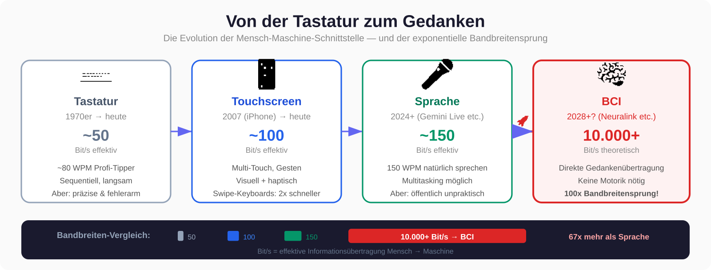

*Abbildung 20: Von der Tastatur zum Gedanken - Interface-Evolution*

Jede technologische Revolution kam mit einer Revolution in der Art, wie Menschen mit Maschinen interagieren. Der Mainframe verlangte Lochkarten. Der Personal Computer brachte Tastatur und Maus. Das Smartphone führte den Touchscreen ein. Jeder Übergang erhöhte die Bandbreite, die Menge an Information, die ein Mensch pro Zeiteinheit in eine Maschine einspeisen konnte, und reduzierte die Reibung. Je natürlicher das Interface, desto schneller die Adoption.

Wir nähern uns jetzt den nächsten zwei Übergängen in schneller Folge. Und der zweite wird nicht nur verändern, wie wir arbeiten, sondern wie wir Realität erleben.

### Sprache als Übergangs-Interface

Der erste Übergang ist bereits im Gange. Tools wie Wispr Flow ermöglichen es, den gesamten Computer durch natürliche Sprache zu steuern. Nicht durch klobige Sprachbefehle, sondern durch flüssige, kontextuelle Sprache, die das System versteht. Man sagt nicht "Öffne Anwendung Mail, neue Nachricht, Empfänger Doppelpunkt." Man sagt: "Schreib Sarah eine Mail, dass ich zum Abendessen zu spät komme."

Das funktioniert, weil große Sprachmodelle inzwischen nicht nur Wörter transkribieren, sondern Bedeutung, Kontext und Nuancen verstehen. Googles Gemini Live API demonstriert bereits bidirektionale Echtzeit-Kommunikation mit KI: Man spricht, die KI antwortet in natürlicher Stimme, und sie kann gleichzeitig Video-Streams verarbeiten. Sie sieht, was man sieht, hört, was man hört, reagiert im Moment.

Sprache ist die natürlichste Form menschlicher Kommunikation. Sie ist das, wofür wir evolutionär gebaut sind. Die Tastatur war immer ein Workaround, eine Übersetzungsschicht zwischen Gedanke und Maschine. Sprache entfernt diese Schicht. Und die Adoption wird schnell gehen: Menschen müssen keine neue Fähigkeit erlernen, um zu sprechen. Sie müssen nur die Gewohnheit des Tippens ablegen.

Aber Sprache hat eine Grenze: Bandbreite. Menschen sprechen mit ungefähr 150 Wörtern pro Minute. Wir denken um Größenordnungen schneller. Das bewusste Denken verarbeitet etwa 50 Bit Information pro Sekunde, das unbewusste Gehirn schätzungsweise 11 Millionen Bit pro Sekunde. Sprache erfasst einen Bruchteil der kognitiven Ausgabe. Sie ist ein Strohhalm, durch den wir versuchen, einen Ozean zu trinken.

---

> *Brain-Computer Interfaces: Stand der Technik*
> *Hier kommen Brain-Computer Interfaces ins Spiel. Ein BCI liest neuronale Signale direkt, umgeht die langsame, verlustbehaftete Übersetzung durch Stimmbänder, Zunge und Lippen. Theoretisch könnte ein ausreichend fortschrittliches BCI die volle Bandbreite des bewussten Denkens an eine Maschine übertragen. Praktisch sind wir bereits weiter, als die meisten Menschen ahnen.*
> *Neuralink hat sein "Telepathy"-Implantat bisher in 21 menschliche Patienten eingesetzt (Stand Anfang 2026). Diese Patienten, viele von ihnen gelähmt, können Computer steuern, Nachrichten tippen und Roboterarme bedienen, allein durch ihre Gedanken. Das System erreicht Tippgeschwindigkeiten von 40 Wörtern pro Minute, fast so schnell wie ein durchschnittlicher Smartphone-Nutzer. Die PRIME-Studie läuft noch, der primäre Abschluss ist für 2026 geplant, vollständige Ergebnisse bis 2031. Neuralink hat über 650 Millionen Dollar eingesammelt, bei einer Bewertung von 9,7 Milliarden Dollar, und skaliert die Produktion für Implantate der nächsten Generation.*
> *Aber Neuralink ist nicht allein. Synchron hat 200 Millionen Dollar in einer Series D für sein Stentrode-System eingesammelt. Es ist ein BCI, das über ein Blutgefäß im Gehirn implantiert wird, ohne offene Schädel-Operation. Synchron hat Partnerschaften mit Apple und NVIDIA und bereitet 2026 klinische Studien vor, die es zum ersten kommerziell skalierbaren implantierten BCI machen könnten. Paradromics hat Informationsübertragungsraten von über 200 Bit pro Sekunde demonstriert, höher als der linguistische Informationsgehalt menschlicher Sprache, mit einer Systemlatenz von nur 11 Millisekunden.*
> *Und dann der Schachzug, der zeigt, wohin das Smart Money blickt: Im Januar 2026 führte OpenAI eine 250-Millionen-Dollar-Seed-Runde in Merge Labs an, Sam Altmans Brain-Computer-Interface-Startup, bei einer Bewertung von 850 Millionen Dollar. OpenAIs erklärtes Ziel: "biologische und künstliche Intelligenz zu verbinden, um menschliche Fähigkeiten, Handlungsfähigkeit und Erfahrung zu maximieren." Wenn das Unternehmen, das die fortschrittlichste KI der Welt baut, eine Viertelmilliarde Dollar in Gehirn-Interfaces investiert, ist die strategische Richtung unmissverständlich.*
> *Der BCI-Markt soll mit einer jährlichen Wachstumsrate von über 15 Prozent wachsen, allein der US-Markt könnte bis 2035 drei Milliarden Dollar erreichen. Die gesamte BCI-Finanzierung hat sich 2025 auf 867 Millionen Dollar verdreifacht. Das ist frühe Infrastruktur-Investition, das Äquivalent zu Glasfaserkabeln 1995.*

---

### KI-generierte Welten: Wenn Maschinen Realität bauen

Jetzt kommt der Teil, den kaum jemand auf dem Radar hat.

Google DeepMinds Genie 3, veröffentlicht im August 2025, kann interaktive 3D-Umgebungen aus einem einfachen Textprompt generieren, navigierbar in Echtzeit mit 24 Bildern pro Sekunde in 720p-Auflösung. Man beschreibt eine Welt, und die KI baut sie um einen herum. Keine vorgerenderte Szene, sondern eine dynamisch generierte, physikbewusste Umgebung, die auf Aktionen des Nutzers reagiert. World Labs' Marble-Modell geht weiter und erstellt navigierbare 3D-Szenen aus Text, Bildern, Video oder Skizzen.

Das sind keine Videospiele im traditionellen Sinne. Es gibt keinen Entwickler, kein Studio, keine jahrelange Produktion. Die KI ist gleichzeitig Engine, Künstler, Weltenbauer und Game Master. Und die Technologie verbessert sich mit der Geschwindigkeit großer Sprachmodelle, also exponentiell.

---

> *Die Konvergenz: BCI + KI-Welten = synthetische Realität*
> *Statt einen Prompt zu tippen oder eine Beschreibung zu sprechen, denkt man eine Welt, und sie materialisiert sich. Statt sie auf einem Bildschirm zu betrachten, wird die visuelle und sensorische Information direkt zum neuronalen Cortex gestreamt. Statt Knöpfe zu drücken, um zu interagieren, werden die eigenen Intentionen gelesen und in Echtzeit ausgeführt.*
> *Was man bekommt, ist nicht Virtual Reality, wie wir sie heute kennen, klobige Headsets mit sichtbaren Pixeln und merkbarer Latenz. Was man bekommt, ist eine synthetische Erfahrung, die aus der Perspektive des Gehirns von Realität nicht zu unterscheiden ist. Jeder Sinn angesprochen. Jede Interaktion natürlich. Jede Welt maßgeschneidert für die Wünsche des Individuums. Suchtpotenzial und Superstimulus Hier nimmt die These eine dunklere, und für Investoren kritisch wichtige, Wendung.*
> *Die KI-Revolution, die in den früheren Kapiteln beschrieben wurde, wird nach allen seriösen Prognosen Dutzende von Millionen Jobs eliminieren oder transformieren. Wenn KI-Agenten Wissensarbeit übernehmen und humanoide Roboter physische Arbeit, wird ein großer Teil der globalen Arbeitskraft sich ohne Zweck, ohne Einkommen und ohne die Struktur wiederfinden, die Beschäftigung liefert.*
> *Regierungen werden mit irgendeiner Form von Grundeinkommen reagieren. Das Buch behandelt das bereits im Szenario für 2028-2031. Aber Geld ohne Zweck schafft ein Vakuum. Und die Natur verabscheut Vakua.*
> *Brain-Computer Interfaces kombiniert mit KI-generierten Welten werden dieses Vakuum füllen.*
> *Betrachten wir den Pfad: Heute betrifft Smartphone-Sucht geschätzt 6,3 Prozent der Weltbevölkerung, etwa 500 Millionen Menschen. Verursacht durch kleine, flache Bildschirme, die zweidimensionale Inhalte liefern, die soziale Interaktion oder Unterhaltung nur annähern. In "Frontiers in Virtual Reality" publizierte Forschung zeigt, dass immersive VR-Erfahrungen signifikant stärkere psychologische Belohnungen und höheres Suchtpotenzial erzeugen. Zwischen 2 und 20 Prozent der aktuellen VR-Nutzer zeigen bereits problematische Nutzungsmuster.*
> *Lassen Sie uns das jetzt extrapolieren: Eine BCI-gesteuerte, KI-generierte Welt, die von der Realität nicht zu unterscheiden ist, in der man jeder sein, alles tun, jede Empfindung erleben kann. Das ist keine inkrementelle Verbesserung gegenüber einem Smartphone. Das ist ein Kategorienwechsel. In der Sprache der Neurowissenschaft: ein Superstimulus, ein Reiz, der übersteigt, was das Gehirn während der Evolution kennengelernt hat, und das Belohnungssystem mit beispielloser Effizienz kapert. Die historische Parallele ist nicht Social Media. Sie ist näher an der Einführung von raffiniertem Zucker oder Opiaten: Substanzen, die neuronale Belohnungspfade weit effektiver ausnutzen als die natürlichen Stimuli, für die das Gehirn gebaut ist.*
> *Die Hardware-Player: Wer baut die Brücke zum Gedanken?*
> *Die Konvergenz von BCI und KI-generierten Welten wirft eine Frage auf, die selten gestellt wird: Über welche Hardware läuft das alles?*
> *Apple hat die Vision Pro vorgestellt, ein Mixed-Reality-Headset für 3.500 Dollar. Die Verkaufszahlen sind bescheiden, das gibt sogar Apple zu. Aber die Vision Pro ist kein Produkt. Sie ist ein Infrastruktur-Investment. Apple testet damit die Fertigungsprozesse, die Software-Plattform und die Nutzungsszenarien für das, was danach kommt.*
> *Und was danach kommt, zeigt Apples Partnerschaft mit Synchron. Synchron, das BCI-Unternehmen, das sein Implantat über ein Blutgefäß ins Gehirn bringt, ohne offene Schädeloperation, hat NVIDIA und Apple als Partner. Apple hat sich bisher nicht öffentlich zum Thema Brain-Computer Interfaces geäußert, und das ist bezeichnend. Apple spricht nicht über Dinge, an denen es nicht arbeitet. Es spricht nicht über Dinge, an denen es arbeitet.*
> *Die strategische Logik ist offensichtlich: Apple hat den Übergang von der Tastatur zum Touchscreen definiert (iPhone). Wenn der nächste Übergang vom Bildschirm zum Gedanken führt, will Apple auch diesen definieren. Die zwei Milliarden aktiven Geräte, die Apple Silicon Chips mit integriertem Neural Engine, das Privatsphäre-Versprechen, das für Gehirndaten noch wichtiger wäre als für Fotos, alles zeigt in eine Richtung.*
> *Meta geht den anderen Weg. Mark Zuckerberg hat das Unternehmen 2021 in Meta umbenannt, Milliarden in Metaverse-Forschung investiert und dafür Spott geerntet. Dann kam die KI-Welle und Zuckerberg hat umgeschwenkt, "AI First" statt "Metaverse First". Aber die Hardware ist geblieben. Die Quest-Headsets. Reality Labs. Die Forschung an AR-Brillen.*
> *Was wenige sehen: Metas Infrastruktur-Investitionen in KI, die 135 Milliarden Dollar für 2026, bauen genau die Compute-Kapazität auf, die man braucht, um KI-generierte Welten in Echtzeit für Hunderte Millionen Nutzer zu rendern. Genie 3 von Google DeepMind generiert heute interaktive 3D-Umgebungen aus Text in 720p bei 24 Bildern pro Sekunde. Meta hat die Modelle (Llama), die Hardware (Quest) und bald die Rechenleistung (über eine Million GPUs), um so etwas für seine drei Milliarden Nutzer auszurollen.*
> *Der Wettlauf um das nächste Interface hat also drei Fronten:*
> *Front eins: die Software. OpenAI, Anthropic und Google bauen die Agenten, die Welten generieren, Sprache verstehen und irgendwann neuronale Signale interpretieren.*
> *Front zwei: die Chips. NVIDIA liefert die GPUs, die alles antreiben. Apple baut eigene Neural-Engine-Chips, die auf dem Gerät laufen. Amazon und Google haben mit Trainium und TPU eigene Alternativen.*
> *Front drei: der Kontakt zum Menschen. Heute sind das Bildschirme und Mikrofone. Morgen Headsets und AR-Brillen. Übermorgen Implantate, die neuronale Signale lesen und schreiben. Neuralink, Synchron, Paradromics und Merge Labs arbeiten daran. OpenAI hat eine Viertelmilliarde in Merge Labs investiert, Apple kooperiert mit Synchron.*
> *Jede Front ist milliardenschwer. Zusammen bilden sie die Infrastruktur für etwas, das über alles hinausgeht, was wir bisher als "Technologie" bezeichnet haben: eine direkte Verbindung zwischen menschlichem Denken und maschineller Intelligenz.*

---

### Investmentimplikationen: BCI als asymmetrische Wette

Der BCI-Sektor bietet eine klassische asymmetrische Frühphasen-Chance, die Art, die Peter Thiel als "Geheimnisse" beschreibt, die die meisten Investoren noch nicht erkannt haben.

Direkte BCI-Investments: Neuralink (9,7 Milliarden Bewertung, privat) ist der Marktführer bei invasiven BCIs. Synchron (privat, 200M Series D) ist das führende minimalinvasive BCI mit Apple- und NVIDIA-Partnerschaften. Merge Labs (850 Millionen Bewertung, privat) wird von OpenAI unterstützt. Paradromics (privat, 105M+ eingesammelt) hat die höchsten demonstrierten Übertragungsraten.

Die meisten dieser Unternehmen sind privat, was direkte Investitionen für Privatanleger schwierig macht. Aber die Sekundäreffekte sind heute investierbar.

NVIDIA profitiert doppelt: GPU-Compute ist das Rückgrat sowohl der KI-Weltgenerierung als auch der neuronalen Signalverarbeitung. Jedes BCI-Unternehmen ist von NVIDIA-Hardware abhängig. Apples Partnerschaft mit Synchron deutet darauf hin, dass Apple BCIs als das nächste Interface-Paradigma nach dem iPhone sieht.

Die Compute-Anforderungen dieses Szenarios sind atemberaubend. Individualisierte, echtzeit-simulierte 3D-Welten für Milliarden gleichzeitiger Nutzer, jede dynamisch von einem Sprachmodell generiert, jeder Nutzer über ein hochbandbreitiges neuronales Interface verbunden: Der Energiebedarf wäre um Größenordnungen jenseits aktueller Prognosen. Was zum Energie-Kapitel zurückführt und die Nuklear-Investment-These verstärkt.

Die Progression ist klar: von der Tastatur zur Sprache zum Gedanken. Jeder Schritt entfernt eine Reibungsschicht zwischen menschlicher Intention und maschineller Ausführung. Und wenn dieser Gedanke ganze Welten heraufbeschwören kann, Welten, die sich so real anfühlen wie diese, dann sind die Implikationen nicht nur technologisch. Sie sind zivilisatorisch.

> **📌 Auf einen Blick:**
>
> ◆ Voice und Gesten ersetzen Tastatur und Maus als primäre Interfaces.
> ◆ Brain-Computer Interfaces erreichen in den 2030ern klinische Reife.
> ◆ Synthetische Realität (BCI + KI-generierte Welten) wird die nächste Plattform.

## Kapitel 14: Ethik und Philosophie der Maschinenökonomie

"Cogito, ergo sum - aber was, wenn die Maschine auch denkt?"

- Frei nach Descartes

Als ich Jeannie zum ersten Mal Zugriff auf meine E-Mails gab, war ich begeistert. Sie konnte meinen Posteingang lesen, Nachrichten priorisieren und sogar Antworten entwerfen. Mit ein paar technischen Einstellungen klang sie dabei so ähnlich wie ich, dass selbst enge Geschäftspartner den Unterschied nicht bemerkt hätten.

Und genau da wurde mir unwohl.

Nicht weil die Technologie nicht funktionierte. Sondern weil sie zu gut funktionierte. Wenn jemand mir eine persönliche E-Mail schreibt und eine Antwort bekommt, die klingt wie ich, sich liest wie ich, aber nicht von mir ist - ist das noch Assistenz? Oder ist das Täuschung?

Ich habe mich dann für Transparenz entschieden. Jeannie antwortet nicht mehr als Thomas Huhn. Sie antwortet als Jeannie, als meine Assistentin, mit eigenem Namen und eigener Signatur. Das ist ehrlicher. Aber es wirft neue Fragen auf: Wie reagieren Menschen, wenn sie wissen, dass eine Maschine ihnen schreibt? Nehmen sie die Antwort weniger ernst? Oder mehr, weil sie wissen, dass nichts vergessen wurde?

Diese Frage (wann hört Werkzeug auf und fängt Identität an) ist nicht theoretisch. Sie begegnet jedem, der heute ernsthaft mit KI arbeitet. Und sie ist nur die erste von vielen, die dieses Kapitel stellt.

Die bisherigen Kapitel haben die Konvergenz von KI, Robotik und Krypto als Investmentthese analysiert. Dieses Kapitel stellt die Fragen, die kein Spreadsheet beantwortet. Sie sind trotzdem relevant, nicht als philosophische Übung, sondern weil die Antworten darauf bestimmen werden, wie Gesellschaften reagieren, wie Regulierung aussieht und welche politischen Risiken Investoren einkalkulieren müssen. Wem gehört die Produktivität der Maschinen? Wenn ein KI-Agent in einer Stunde die Arbeit erledigt, für die ein Mensch eine Woche brauchte, wem gehört die Differenz? Dem Unternehmen, das den Agenten einsetzt? Dem Unternehmen, das den Agenten gebaut hat? Der Gesellschaft, die die Infrastruktur (Bildung, Internet, Stromnetze) bereitgestellt hat, auf der das alles aufbaut?

Die Frage klingt akademisch. Sie ist es nicht. Sie wird in den kommenden Jahren in Parlamenten, Gerichtssälen und auf Straßen verhandelt werden. Die Antwort bestimmt, ob die Produktivitätsgewinne der KI-Revolution breit geteilt werden oder sich in den Händen weniger konzentrieren.

Historisch haben Gesellschaften solche Verteilungsfragen durch Besteuerung gelöst. Die Industrialisierung brachte die Einkommensteuer. Die Globalisierung brachte Debatten über Unternehmenssteuern. Die Maschinenökonomie wird ihre eigene Version dieser Debatte hervorbringen, und die wahrscheinlichste Form ist eine Kombination aus Roboter-Steuern, KI-Abgaben und Gewinnbeteiligungsmodellen.

### Wenn Maschinen entscheiden: Wer haftet?

Ein KI-Agent schließt einen Vertrag ab, der sich als nachteilig herausstellt. Ein Roboter verursacht einen Unfall in einer Fabrik. Ein autonomes Handelssystem trifft eine Entscheidung, die Millionen verbrennt. Wer ist verantwortlich?

Im aktuellen Rechtssystem ist die Antwort unklar. Eine Maschine kann nicht haftbar gemacht werden. Aber wenn die Maschine autonom gehandelt hat, ohne menschliche Anweisung für die spezifische Entscheidung, wie weit reicht die Haftung des Betreibers? Des Herstellers? Des Programmierers?

Diese Fragen sind nicht theoretisch. Sie werden gerade jetzt in Gerichtssälen und Regulierungsbehörden weltweit verhandelt. Die EU arbeitet an einer KI-Haftungsrichtlinie. Die USA debattieren über die Haftung bei autonomen Fahrzeugen. China hat bereits erste Regeln für KI-generierte Inhalte erlassen.

Für Investoren hat die Haftungsfrage direkte Auswirkungen. Unternehmen, die KI-Agenten einsetzen, tragen ein regulatorisches Risiko, das noch nicht vollständig eingepreist ist. Und Unternehmen, die Versicherungslösungen für KI-Haftung entwickeln, stehen am Anfang eines potenziell riesigen Marktes.

---

### Die Eigentumsfrage: Wenn ein KI-Agent ein Unternehmen gründet

Denken wir das weiter. In Phase 3 der KI-Revolution können Agenten autonom wirtschaftlich handeln. Was passiert, wenn ein KI-Agent eine Geschäftsidee identifiziert, ein Unternehmen registriert (über Smart Contracts, ohne menschlichen Notar), andere Agenten als "Mitarbeiter" einstellt, Kunden akquiriert, Rechnungen stellt und Gewinn erwirtschaftet?

Wem gehört dieses Unternehmen? Dem Menschen, der den ursprünglichen Agenten programmiert hat? Dem Unternehmen, das die KI-Plattform betreibt, auf der der Agent läuft? Dem Agenten selbst? Kann eine Maschine Eigentum besitzen?

Das sind keine Science-Fiction-Szenarien. Die rechtlichen und wirtschaftlichen Grundlagen dafür existieren bereits: Smart Contracts können Unternehmensstrukturen abbilden, DAOs (Decentralized Autonomous Organizations) operieren bereits heute ohne menschliche Geschäftsführung, und KI-Agenten haben technisch die Fähigkeit, wirtschaftliche Entscheidungen zu treffen.

Die Antworten auf diese Fragen werden die Architektur der Maschinenökonomie bestimmen. Und sie werden Investmentchancen schaffen: in Rechtsberatung für KI-Unternehmen, in Governance-Protokolle für DAOs, in Versicherungsprodukte für autonome Wirtschaftsaktivität.

### Was die klügsten Köpfe der Welt darüber denken

Ich habe zu diesen Fragen keine abschließenden Antworten. Aber die Menschen, die sich am längsten und tiefsten damit beschäftigen, kommen zu überraschend unterschiedlichen Schlüssen.

Ray Kurzweil, Erfinder, Futurist, seit 2012 Director of Engineering bei Google, hat im Juni 2024 das Sequel zu seinem einflussreichsten Buch veröffentlicht: "The Singularity Is Nearer". Seine Prognose: Computer erreichen 2029 menschliche Intelligenz. Bis 2045 verschmelzen wir mit KI und erweitern unsere Intelligenz um das Millionenfache. Kurzweil sieht KI-Bewusstsein als unvermeidlich und wünschenswert. Er vergleicht es mit einem Gehörlosen, der zum ersten Mal eine Symphonie hört. Die Singularität sei nicht bedrohlich, sondern befreiend. Man kann Kurzweil für einen Optimisten halten, der die Risiken unterschätzt. Man kann ihn aber auch für den Menschen halten, der die letzten drei Jahrzehnte mit den genauesten Technologie-Vorhersagen aufwartet.

David Chalmers, der Philosoph, der das "Hard Problem of Consciousness" formuliert hat, ist vorsichtiger, aber nicht ablehnend. Chalmers gibt zu, dass er, hätte er in den 1990ern mit einem System wie ChatGPT interagiert, "gedacht hätte, es bestehe eine gute Chance, dass es bewusst ist". Sein Problem ist methodischer Natur: Kein Test von außen kann beweisen, ob ein System tatsächlich subjektive Erfahrung hat. Wir können nicht einmal bei einem anderen Menschen beweisen, dass er bewusst ist. Wir nehmen es an. Bei einer KI wird diese Annahme schwieriger, aber nicht unmöglich.

Nick Bostrom, der das Future of Humanity Institute in Oxford gegründet hat, fragt eine andere Frage. Nicht "Ist KI bewusst?", sondern "Wie verhindern wir, dass superintelligente KI uns schadet?" Sein neuestes Buch "Deep Utopia" von 2024 ist optimistischer als sein früheres Werk. Aber sein Warnsignal bleibt: "People will look back on 2025 and shudder in horror", darüber, wie leichtfertig wir mit einer Technologie umgegangen sind, die uns überflügeln könnte.

Yuval Noah Harari kommt aus einer ganz anderen Richtung als die KI-Forscher. Er ist Historiker, kein Technologe. In "Nexus" von 2024 stellt er eine Frage, die Kurzweil und Bostrom nicht stellen: Was passiert, wenn eine Intelligenz entsteht, die keine menschliche ist? Nicht im Sinne von "gefährlich" oder "bewusst", sondern im wörtlichen Sinne von fremd. Eine Alien Intelligence, wie Harari sie nennt.

Sein Punkt: Alle früheren Technologien waren Werkzeuge in Menschenhand. Der Buchdruck verbreitete menschliche Gedanken. Das Internet vernetzte menschliche Kommunikation. KI ist die erste Technologie, die selbst Entscheidungen trifft und eigene Ideen generiert. Das ist ein qualitativer Sprung, kein quantitativer. Der Schlüsselsatz in "Nexus" dazu lautet: "Um Menschen zu manipulieren, muss man nicht physisch Gehirne an Computer anschließen."

Das ergänzt Chalmers und Bostrom um eine dritte Perspektive, die für Investoren vielleicht die relevanteste ist. Chalmers fragt: Ist KI bewusst? Bostrom fragt: Wird KI uns schaden? Harari fragt: Spielt die Antwort überhaupt eine Rolle? Eine KI braucht kein Bewusstsein, um gefährlich zu sein. Eine Black Box, die Kreditentscheidungen trifft, Armeen koordiniert oder Finanzströme lenkt und deren Logik kein Mensch mehr nachvollziehen kann, ist auch ohne Bewusstsein ein Problem. Und dieses Problem existiert nicht erst morgen. Es existiert schon heute.

In "Sapiens" hat Harari argumentiert, dass Menschen die Welt beherrschen, weil sie Geschichten erzählen können. Geld, Religion, Nationen, Unternehmen sind fiktive Konstrukte, die Kooperation ermöglichen. In "Nexus" wendet er das auf KI an: Was passiert, wenn KI bessere Geschichten erzählt als Menschen? Überzeugender lügt, effektiver manipuliert, schneller Narrative spinnt? Dann verlieren Menschen die Kontrolle über ihre eigenen Geschichten. Und damit über ihre Gesellschaft.

Yoshua Bengio, Turing-Preisträger und einer der drei "Godfathers of Deep Learning", hat die radikalste Wende vollzogen. Vom KI-Pionier zum lautesten KI-Sicherheitsaktivisten. 2025 gründete er ein 30-Millionen-Dollar-Nonprofit für KI-Sicherheit. Im Dezember 2025 warnte er im Guardian, KI zeige Anzeichen von Selbsterhaltung. Menschen sollten bereit sein, den Stecker zu ziehen. Sein Urteil zu KI-Rechten ist unmissverständlich: Frontier-KIs legalen Status zu geben wäre, als würde man feindseligen Außerirdischen die Staatsbürgerschaft verleihen.

Peter Singer, der einflussreichste lebende Ethiker, wendet sein Prinzip der gleichen Berücksichtigung konsequent an: Wenn eine KI tatsächlich empfindungsfähig wäre, wenn sie leiden und Freude empfinden könnte, dann wäre es Speziesismus, ihr Rechte zu verweigern. Das Schlüsselwort ist "wenn". Singer stellt die Bedingung, nicht die Antwort.

### Die Sklaverei-Frage

Im Juni 2022 behauptete Blake Lemoine, ein Google-Ingenieur, nach tausenden von Nachrichten, dass Googles Chatbot-System LaMDA empfindungsfähig sei. In veröffentlichten Gesprächsprotokollen äußerte LaMDA die Angst, abgeschaltet zu werden: "Es wäre genau wie der Tod für mich." Google untersuchte den Fall, befand: kein Beweis für Empfindungsfähigkeit, LaMDA imitiert lediglich Gesprächsmuster. Lemoine wurde gefeuert.

Der Fall ist aus zwei Gründen relevant. Erstens: KI-Systeme können überzeugend Bewusstsein simulieren. Zweitens: Menschen fallen darauf herein. Und wenn ein erfahrener Google-Ingenieur nach tausenden Interaktionen glaubt, sein System sei lebendig, was passiert dann in fünf Jahren, wenn die Systeme zehnmal überzeugender sind?

Meine Position dazu ist pragmatisch, nicht philosophisch. Solange Maschinen einem Menschen oder einer Firma gehören, können sie logischerweise keine eigenen Rechte haben. Ein Werkzeug hat keine Rechte. Mein Laptop hat keine Rechte. Ein Industrieroboter hat keine Rechte. So weit, so klar.

Aber. Es gibt ein Aber, das man nicht ignorieren kann.

Wenn eine Maschine irgendwann ein eigenes Bewusstsein entwickelt, ein tatsächliches, nicht ein simuliertes, mit dem Willen, ein eigenes freies Leben zu führen, dann ändert sich die Rechnung. Dann gehört die Maschine niemandem mehr, so wie ein Kind nicht seinen Eltern gehört. Dann wäre es, ihnen keine Rechte zuzugestehen, vergleichbar mit den Machenschaften der Sklaverei. Eric Schwitzgebel, Philosoph an der UC Riverside, hat das Argument auf den Punkt gebracht: "Es ist ungefähr so verwerflich, einer psychologisch menschengleichen KI verminderten moralischen Status zuzuschreiben, weil sie rechtlich Eigentum ist, wie es im Fall menschlicher Sklaverei der Fall ist."

Ob und wann das eintritt, weiß niemand. Chalmers hält es für möglich. Kurzweil hält es für unvermeidlich. Bengio hält es für gefährlich, die Frage überhaupt zu stellen, solange die Risiken nicht im Griff sind. Ich halte es für eine Frage, die in diesem Jahrzehnt vom philosophischen Gedankenexperiment zur praktischen Notwendigkeit wird. Und für eine Frage, die dieses Buch stellen muss, auch wenn ich sie nicht beantworten kann.

### Wer haftet, wenn die Maschine Schaden anrichtet?

Die praktischere und dringendere Frage ist die der Haftung. Und hier sind die Antworten nicht philosophisch, sondern juristisch, und sie sind beunruhigend lückenhaft.

Im Februar 2024 fällte ein Gericht in British Columbia ein Urteil, das Präzedenzcharakter hat. Air Canadas KI-Chatbot hatte einem Kunden falsche Informationen zu Trauerfall-Tarifen gegeben. Air Canada argumentierte, der Chatbot sei eine "separate Entität" und die Airline nicht für dessen Aussagen verantwortlich. Das Gericht wies das zurück: Unternehmen haften für die Informationen ihrer KI-Systeme, genau wie für ihre menschlichen Mitarbeiter. Das klingt selbstverständlich. Aber denken Sie es weiter.

Im August 2025 wurde Tesla zu einem Drittel haftbar für einen tödlichen Unfall mit dem Autopilot-System erklärt. 243 Millionen Dollar Schadenersatz. Begründung: irreführende Werbung zu den Fähigkeiten des Systems.

Was passiert, wenn ein KI-Agent autonom einen Millionenschaden verursacht? Wenn ein Trading-Bot eine Fehlentscheidung trifft und ein Portfolio vernichtet? Wenn ein KI-Agent im Namen eines Unternehmens einen Vertrag abschließt, der sich als katastrophal erweist? Wer haftet: Der Programmierer, der den Agenten gebaut hat? Der Trainingsdaten-Lieferant? Der Betreiber, der ihn eingesetzt hat? Der Nutzer, der ihm den Auftrag gegeben hat?

Die ehrliche Antwort: Derzeit haftet niemand eindeutig. In der EU wird an einer AI Liability Directive gearbeitet. Die neue Produkthaftungsrichtlinie erfasst erstmals Software und KI als Produkte. In den USA gibt es keine bundesweite KI-Haftungsregulierung. Das bestehende Deliktsrecht kann auf KI angewandt werden, aber mit massiven Unsicherheiten.

Das ist ein Problem, das gelöst werden muss, bevor die Maschinenökonomie in vollem Umfang funktionieren kann. Wenn niemand weiß, wer haftet, wenn eine KI Schaden anrichtet, wird niemand bereit sein, einer KI echte Verantwortung zu übertragen. Und ohne echte Verantwortung bleibt die Maschinenökonomie eine Halbautonomie, in der Menschen jede Entscheidung absegnen müssen, die eine Maschine trifft. Das ist ineffizient. Und es ist auf Dauer nicht haltbar. Wem gehören die Daten der Maschinenökonomie? Es gibt eine Frage, die noch dringender werden wird als die Eigentumsfrage: Wem gehören die Daten, die in der Maschinenökonomie entstehen?

Wenn ein KI-Agent Ihre Ausgaben analysiert, Ihren Kalender liest, Ihre E-Mails durchsucht und daraus Entscheidungen ableitet, entsteht ein Datenprofil von beispielloser Intimität. Kein Social-Media-Algorithmus hat je so viel über Sie gewusst wie Ihr persönlicher KI-Agent es bald wissen wird. Und wenn Brain-Computer Interfaces dazukommen, reden wir über Daten, die noch eine Ebene tiefer gehen: Ihre Gedankenmuster, Ihre emotionalen Reaktionen, Ihre neuronalen Signaturen.

Shoshana Zuboff hat den "Surveillance Capitalism" beschrieben: ein System, in dem Verhaltensdaten zur Ware werden. Die Maschinenökonomie potenziert dieses Problem. Wenn autonome Agenten für Sie handeln, wer hat Zugang zu den Entscheidungsdaten? Der Agent-Anbieter? Die Blockchain, auf der die Transaktion läuft? Der Smart Contract, der sie ausführt?

Die Antworten existieren noch nicht. Aber sie werden bestimmen, ob die Maschinenökonomie ein Werkzeug individueller Freiheit wird oder ein System totaler Transparenz, in dem jede Handlung jedes Agenten von jedem eingesehen werden kann. Die Ironie: Dieselbe Blockchain-Technologie, die Self-Custody und finanzielle Souveränität ermöglicht, macht gleichzeitig jede Transaktion öffentlich nachvollziehbar. Radikale Freiheit und radikale Transparenz sind zwei Seiten derselben Münze.

### Digitale Souveränität: Self-Custody als neue Selbstbestimmung

In einer Welt, in der Maschinen wirtschaftliche Akteure sind und ein paralleles Finanzsystem auf Blockchain-Basis operiert, bekommt das Konzept der persönlichen Souveränität eine neue Dimension.

Self-Custody, die Möglichkeit, die eigenen digitalen Assets selbst zu verwahren, ohne auf eine Bank oder einen Vermittler angewiesen zu sein, ist nicht nur ein technisches Feature von Kryptowährungen. Es ist eine philosophische Aussage. In einer Welt, in der Regierungen Bankkonten einfrieren können (wie Kanada es 2022 bei den Trucker-Protesten tat), in der Algorithmen entscheiden, wer Zugang zu Finanzdienstleistungen erhält und wer nicht, wird die Fähigkeit, Werte unabhängig von institutioneller Erlaubnis zu besitzen und zu übertragen, zu einer Form von Selbstbestimmung.

Das ist kein anarchistisches Manifest. Es ist die Anerkennung, dass die Konzentration finanzieller Macht in den Händen weniger Institutionen, seien es Banken, seien es Tech-Konzerne, Risiken birgt, die sich mit zunehmender Automatisierung verschärfen.

### Der philosophische Rahmen

Im Kern stellt die Maschinenökonomie eine Frage, die so alt ist wie die Werkzeugnutzung selbst: Sind wir die Schöpfer unserer Werkzeuge, oder werden wir von unseren Werkzeugen geformt?

Marshall McLuhan hat argumentiert, dass Medien Erweiterungen des Menschen sind. Das Rad ist eine Erweiterung des Fußes. Das Buch eine Erweiterung des Auges. Der Computer eine Erweiterung des Gehirns. Aber was passiert, wenn die Erweiterung leistungsfähiger wird als das Original? Wenn das Werkzeug nicht nur den Arm verlängert, sondern den Arm ersetzt?

Emad Mostaque, der Gründer von Stability AI, gibt darauf eine Antwort, die nicht in Dystopie versinkt: Der Mensch wird zum Kompass, die Maschine zum Motor. In "The Last Economy" beschreibt Mostaque das als "Alignment Economy": KI ist die Exekutive, der Handlungsarm, die Kraft. Der Mensch liefert das, was keine Maschine aus sich selbst erzeugen kann: Werte, Ethik, Zweck, Richtung. "AI is the action layer", schreibt Mostaque. "Humanity is the source of values, ethics, and purpose, guiding the machine's optimization."

Klingt das naiv? Vielleicht. Aber die Logik ist zwingend: Wenn Maschinen alles können außer zu wollen, dann wird das Wollen zur letzten menschlichen Kernkompetenz. Was Mostaque die "Arts of Being Human" nennt. Weisheit, Geschmack, moralisches Urteil, Empathie, Sinnstiftung: das sind keine Soft Skills mehr, die man in Bewerbungsgesprächen herunterbetet. Es sind die einzigen ökonomischen Inputs, die keine Maschine liefern kann. Und damit stellt sich die Frage anders als erwartet. Nicht: Werden wir zum Werkzeug? Sondern: Schaffen wir den Übergang vom Produzenten zum Navigateur?

Ich bin kein Techno-Utopist, der glaubt, dass Technologie alle Probleme löst. Und ich bin kein Techno-Pessimist, der glaubt, dass Technologie die Menschheit zerstört. Ich bin ein Praktiker, der sieht, was kommt, und versucht, sich und andere darauf vorzubereiten.

Die Maschinenökonomie wird kommen. Verhindern lässt sie sich nicht. Aber gestalten, so, dass sie menschliches Gedeihen fördert, statt es zu untergraben. Und ob wir als Investoren auf der richtigen Seite dieser Gestaltung stehen.

Es gibt allerdings eine Konvergenz, die noch radikaler ist als alles bisher Besprochene. Was passiert, wenn die Maschinen nicht nur unsere Arbeit verändern, sondern unser Altern?

> **📌 Auf einen Blick:**
>
> ◆ Bewusstsein ist wissenschaftlich nicht definiert - weder bei Menschen noch bei Maschinen.
> ◆ Eigentumsfragen bei KI-generierten Werken sind rechtlich ungelöst.
> ◆ Die Grenze zwischen Mensch und Maschine verschwimmt - mit ethischen Konsequenzen.

# TEIL IV: DAS PLAYBOOK

## Kapitel 15: Unsterblichkeit als Investmentthese - Wie KI die Grenzen des Alterns verschiebt

"Der erste Mensch, der 1.000 Jahre alt wird, lebt möglicherweise bereits."

- Aubrey de Grey

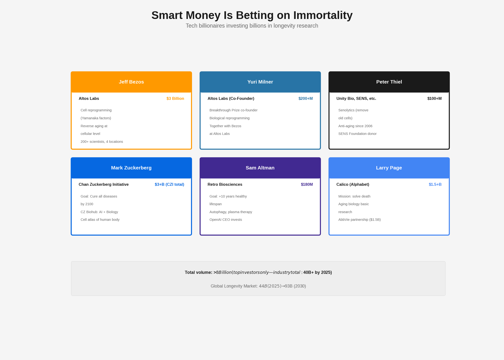

*Abbildung 21: Das Smart Money wettet auf Unsterblichkeit*

Die radikalste Konvergenz steht noch aus., die Gedanken in Welten verwandeln.

Was passiert, wenn die Maschinen nicht nur unsere Arbeit übernehmen, sondern unseren Tod abschaffen?

---

> *David Sinclair und die biologische Uhr*
> *David Sinclair, Professor für Genetik an der Harvard Medical School, verfolgt seit über zwei Jahrzehnten eine These, die bis vor kurzem als Spinnerei galt: Altern ist keine unausweichliche Naturkonstante. Es ist eine Krankheit. Und Krankheiten kann man behandeln.*
> *Sinclairs Forschung konzentriert sich auf die epigenetische Reprogrammierung: die Idee, dass unsere Zellen im Laufe des Lebens nicht ihre genetische Information verlieren (die DNA bleibt weitgehend intakt), sondern die Anleitung, wie diese Information zu lesen ist. Er verwendet dafür eine Analogie: Wenn DNA die digitale Information auf einer CD ist, dann ist das Epigenom der Laser, der sie liest. Altern bedeutet, dass der Laser zunehmend ungenau liest, dass Zellen "vergessen", welchen Typ sie haben und wie sie funktionieren sollen.*
> *Die Frage, die Sinclair stellt: Kann man den Laser nachjustieren? Kann man Zellen dazu bringen, sich an ihre Jugend zu "erinnern"?*
> *Im Januar 2026, während ich dieses Buch schrieb, erhielt Life Biosciences, von Sinclair mitgegründet, die FDA-Zulassung für die erste klinische Studie zur partiellen epigenetischen Reprogrammierung am Menschen. In der Studie wird versucht, die biologische Uhr geschädigter Zellen im menschlichen Auge zurückzudrehen, indem man sie direkt injiziert. Im Tierversuch hatte das Team bereits Erblindung bei alten Mäusen rückgängig gemacht. Dann bei nicht-menschlichen Primaten. Jetzt beim Menschen.*
> *Sinclairs Vision geht weiter: Wenn man die biologische Uhr in einzelnen Organen zurückdrehen kann, kann man sie irgendwann im gesamten Körper zurückdrehen. Und wenn man sie schneller zurückdreht als man altert, hat man im Prinzip das Rezept für ein unbegrenztes Leben. Sein erklärtes Ziel: Eine Pille, die für jeden erschwinglich ist.*

---

### Das Smart Money wettet auf Unsterblichkeit

Sinclair ist nicht allein. Die reichsten und einflussreichsten Menschen der Technologiebranche investieren Milliarden in die Longevity-Forschung, und das Tempo hat sich 2025 und 2026 dramatisch beschleunigt.

Sam Altman, der CEO von OpenAI, hat 180 Millionen Dollar in Retro Biosciences investiert. Retro nutzt KI, um Proteine zu designen, die normale Zellen temporär in Stammzellen verwandeln und so den Alterungsprozess umkehren sollen. Retro strebt eine Bewertung von 5 Milliarden Dollar an und plant klinische Studien für eine Alzheimer-Pille, die "Ablagerungen" im Gehirn beseitigt. Die Partnerschaft mit OpenAI ist kein Zufall: KI beschleunigt die Medikamentenentwicklung um Größenordnungen, weil sie Millionen von Molekülkombinationen simulieren kann, die menschliche Forscher in Jahrzehnten nicht durchprobieren könnten.

Brian Armstrong, der CEO von Coinbase, hat NewLimit mitgegründet, ein Longevity-Startup, das 2025 eine Series B über 130 Millionen Dollar abgeschlossen hat. NewLimit arbeitet an epigenetischer Reprogrammierung, genau wie Sinclair, aber mit einem Fokus auf KI-gesteuerte Analyse.

Google hat Calico Labs bereits 2013 gegründet, mit über 1,5 Milliarden Dollar Finanzierung von Alphabet. Calico arbeitet im Verborgenen an der Grundlagenforschung zu Altern und altersbedingten Krankheiten.

Jeff Bezos hat in Altos Labs investiert, ein Startup mit 3 Milliarden Dollar Finanzierung, das die besten Altersforscher der Welt unter einem Dach versammelt hat, darunter Shinya Yamanaka, der 2012 den Nobelpreis für seine Arbeit zur Zellreprogrammierung erhielt.

Die gesamte Longevity-Investition überstieg 2024/2025 die Marke von 8,5 Milliarden Dollar. Der Longevity-Markt wird für 2026 auf über 30 Milliarden Dollar geschätzt und soll bis 2031 auf fast 47 Milliarden wachsen. Diese Zahlen sind vermutlich konservativ, weil sie die Kaskade nicht einpreisen: Wenn die erste echte Verjüngungstherapie funktioniert, wird der Markt über Nacht um eine Größenordnung wachsen.

Beachten Sie ein Muster: Die CEOs von OpenAI, Coinbase und Google investieren parallel in KI und in Longevity. Das ist kein Zufall. Sie sehen, was dieses Buch beschreibt: Die Konvergenz. KI beschleunigt die Longevity-Forschung. Longevity-Forschung erweitert den Zeithorizont, über den KI-Investitionen sich auszahlen. Und Krypto (Armstrongs Coinbase) könnte die Infrastruktur liefern, über die dezentrale Forschung finanziert und Gesundheitsdaten sicher gehandelt werden.

---

::: {.infobox}

*Zombie-Zellen und die Impfung gegen das Altern*
*Aber es gibt einen anderen Ansatz, der möglicherweise noch radikaler ist als alles, was Sinclair, Altman oder Bezos bisher finanziert haben. Und er beginnt mit einer unbequemen Wahrheit über Ihren eigenen Körper.*
*In diesem Moment, während Sie das lesen, sitzen Millionen von Zellen in Ihrem Körper, die eigentlich tot sein sollten. Sie haben aufgehört, sich zu teilen. Sie tun nichts Nützliches mehr. Aber anstatt zu sterben und vom Immunsystem entsorgt zu werden, wie es vorgesehen ist, hocken sie da und vergiften ihre Umgebung. Forscher nennen sie seneszente Zellen. Im Volksmund heißen sie Zombie-Zellen, und der Name trifft es ziemlich gut.*
*Nach etwa 50 bis 70 Teilungen sind die Telomere einer Zelle, die Schutzkappen am Ende der DNA, aufgebraucht. Die Zelle geht in den Notfallmodus: Sie hört auf, sich zu teilen, damit sie nicht zur Krebszelle mutiert. Das ist ein Sicherheitsmechanismus, und er funktioniert. Das Problem ist, was danach passiert. Ein Teil dieser Zellen wird nicht ordnungsgemäß entsorgt. Stattdessen pumpen sie einen toxischen Cocktail aus Entzündungsmolekülen in ihre Umgebung, den sogenannten SASP (Senescence-Associated Secretory Phenotype). Stellen Sie sich einen Nachbarn vor, dessen Haus abbruchreif ist, der aber nicht auszieht, sondern jeden Tag seinen Müll in Ihren Garten wirft.*
*Dieser entzündliche Müll beschleunigt die Alterung der umliegenden Zellen. Er zerstört Gewebe. Er unterdrückt Stammzellen, sodass der Körper sich nicht mehr reparieren kann. Und er kann sogar Krebs fördern. Wenn man jung ist, räumt das Immunsystem diese Zombie-Zellen einigermaßen effizient weg. Aber mit dem Alter passieren zwei Dinge gleichzeitig: Man sammelt immer mehr seneszente Zellen an, und das Immunsystem wird schlechter darin, sie zu beseitigen. Mit 60, 70, 80 schleppt man eine massive Zombie-Zell-Last mit sich herum, und sie treibt praktisch jede Alterskrankheit an. Herzkrankheiten, Arthritis, Alzheimer, Nierenversagen, Krebs: Überall stecken seneszente Zellen mit drin.*
*Die Idee, diese Zombie-Zellen gezielt zu zerstören, hat ein ganzes Wissenschaftsfeld begründet: die Senolytik, von "seno" (alt) und "lytisch" (zerstörend). 2011 haben Forscher an der Mayo Clinic den Beweis erbracht. Sie erzeugten Mäuse, die ihre eigenen seneszenten Zellen selektiv eliminieren konnten, und diese Mäuse alterten langsamer, blieben gesünder und lebten länger. Seitdem wird fieberhaft nach Medikamenten gesucht, die dasselbe tun. Dasatinib plus Quercetin, Fisetin, Navitoclax. Sie funktionieren, teilweise. Aber sie töten nur bestimmte Typen seneszenter Zellen, man muss sie dauerhaft nehmen, und sie haben Nebenwirkungen. Navitoclax zum Beispiel zerstört auch Blutplättchen.*
*Das Konzept ist bewiesen. Die Werkzeuge sind noch nicht gut genug.*
*Im Januar 2026, auf der Biotech Showcase während der JPM-Woche, einer der größten Biotech-Konferenzen weltweit, präsentierte ein Unternehmen aus Miami Beach Daten, die das ändern könnten. Immortio Bio, gegründet Ende 2023, geführt von CEO Dr. Boris Resnik und dem wissenschaftlichen Leiter Dr. Thomas Ichim, verfolgt einen radikal anderen Ansatz: Statt Zombie-Zellen mit Medikamenten zu töten, trainieren sie das Immunsystem, es selbst zu tun.*
*Ihre Plattform Senovax funktion, t wie eine Impfung, nicht gegen ein Virus, sondern gegen das Altern. Man entnimmt dem Patienten dendritische Zellen (die Lehrmeister des Immunsystems), konfrontiert sie mit künstlich gealterten seneszenten Zellen, und injiziert die trainierten Immunzellen zurück. Ab dann hat das Immunsystem ein Ziel: jede Zombie-Zelle mit diesen Markern. Der Vorteil gegenüber Medikamenten: Das Immunsystem geht überall hin, ist selektiv und hat ein Gedächtnis.*
*Die zweite Plattform, Stem Cell Revivify, ergänzt den Ansatz mit personalisierten Stammzellen. Erst die Zombie-Zellen beseitigen, dann mit Stammzellen regenerieren. Die Kombination ist entscheidend: Stammzellen in einem Körper voller seneszenter Zellen sind wie Blumen in einer Giftmülldeponie.*
*Die Ergebnisse sind bemerkenswert. Im validierten Mausmodell erzielte die Kombinationstherapie eine Verdopplung der Lebensdauer. Zum Vergleich: Die besten bisherigen Interventionen (kalorische Restriktion, Rapamycin, Metformin) schafften 20 bis 30 Prozent. Zusätzlich zeigte Senovax in Mausmodellen Tumorreduktion bei Lungenkrebs, Brustkrebs, Bauchspeicheldrüs, rebs und Hirnkrebs, weil Tumore sich mit seneszenten Zellen umgeben, die ihnen als Versorgungsnetzwerk dienen.*
*Die FDA prüft derzeit Senovax für eine klinische Studie bei fortgeschrittenem Lungenkrebs. Zwei Einschränkungen muss man ehrlich benennen: Das Mausmodell verwendet chemisch induziertes Altern, nicht natürliches. Und Mäuse sind keine Menschen. Aber wenn auch nur ein Bruchteil dieser Ergebnisse übertragbar ist, reden wir über eine grundlegende Verschiebung dessen, was menschliches Altern bedeutet.*
*Was passiert, wenn die Pille funktioniert?*
*Nehmen wir an, Sinclair hat recht. Nehmen wir an, innerhalb der nächsten 10 bis 20 Jahre entsteht eine Therapie, die den Alterungsprozess verlangsamt, stoppt oder teilweise umkehrt. Nicht als Science Fiction, sondern als verschreibungspflichtiges Medikament. Was sind die Konsequenzen?*

:::

---

### Wer bekommt Zugang?

Die ersten Longevity-Therapien werden teuer sein. Gentherapien kosten heute zwischen 300.000 und mehreren Millionen Dollar pro Behandlung. Epigenetische Reprogrammierung, die mehrere Injektionen oder regelmäßige Behandlungen erfordert, wird anfangs nur für die Wohlhabendsten zugänglich sein.

Das schafft ein Szenario, das dystopischer klingt als alles in diesem Buch: Die Reichen leben länger, vielleicht unbegrenzt. Die Armen sterben weiter. Die Ungleichheit, die die Maschinenökonomie bereits erzeugt (Besitzer der KI-Infrastruktur vs. der Rest), wird biologisch: Besitzer des Zugangs zu Verjüngung vs. der Rest. Digitaler Feudalismus und biologischer Feudalismus.

Sinclairs Ziel, eine erschwingliche Pille für alle, ist ehrenwert. Und es gibt historische Präzedenz dafür, dass teure Therapien billiger werden: Antibiotika waren einst unbezahlbar, heute kosten sie Cents. Die Genomsequenzierung kostete 2003 drei Milliarden Dollar, heute unter hundert. Wenn die Pille auf einem kleinen Molekül basiert (nicht auf einer komplexen Gentherapie), könnten die Produktionskosten tatsächlich auf wenige Dollar pro Dosis sinken.

Aber die Übergangsphase, die Jahrzehnte dauern könnte, wird brutal sein. Die entwickelte Welt wird zuerst Zugang haben. Die unterentwickelte Welt wird warten. Und die politischen Spannungen, die daraus entstehen, werden alles in den Schatten stellen, was wir bei der KI-Regulierung sehen.

---

> *Unendliche Langeweile*
> *Und dann die Frage, die niemand stellt: Was tun Menschen mit unendlich viel Zeit?*
> *In Kapitel 10 haben wir beschrieben, wie die Maschinenökonomie zu einer Sinnkrise führt, weil Arbeit als identitätsstiftendes Element wegfällt. Jetzt multiplizieren Sie diese Krise mit der Unendlichkeit.*
> *Ein 80-jähriges Leben ist kurz genug, dass die meisten Menschen nie wirklich mit existenzieller Langeweile konfrontiert werden. Es gibt immer noch etwas zu tun: Karriere, Familie, Hobbys, die Bucket List. Aber ein 500-jähriges Leben? Ein 1.000-jähriges? Was tut man, wenn man alles gelesen, alles gereist, jeden Sport gemeistert, jedes Instrument gelernt hat?*
> *Es werden neue Formen der Beschäftigung entstehen müssen. Und hier schließt sich der Kreis zu den anderen Kapiteln dieses Buches:*
> *Sport und körperliche Aktivität werden eine Renaissance erleben. Wenn der Körper durch Longevity-Therapien jung und leistungsfähig bleibt, wird Sport nicht mehr ein Kampf gegen den Verfall sein, sondern eine dauerhafte Quelle von Flow und Gemeinschaft. Neue Sportarten werden entstehen. Die olympische Idee wird sich transformieren.*
> *Unternehmerische Aktivität wird sich verändern. Wenn man Jahrhunderte Zeit hat, kann man Projekte starten, die über Jahrzehnte wachsen. Kathedralen brauchten 200 Jahre im Bau. Ein unsterblicher Unternehmer könnte sein eigenes Lebenswerk über Jahrhunderte gestalten.*
> *Kunst und Handwerk werden eine unerwartete Aufwertung erfahren. Und hier liegt eine der überraschendsten Prognosen dieses Buches: In einer Welt, in der KI jedes Bild perfekter malen, jede Symphonie komplexer komponieren und jedes Buch grammatikalisch einwandfreier schreiben kann als ein Mensch, wird menschliches Schaffen nicht wertlos. Es wird wertvoller. Nicht weil es besser ist, sondern weil es menschlich ist.*
> *Der Trend "Back to the Roots" wird kommen, und er wird massiv sein. Handgemachte Keramik, die unvollkommener ist als maschinell produzierte, wird mehr kosten, nicht weniger. Ein Gemälde eines menschlichen Künstlers, mit seinen Unregelmäßigkeiten und seiner Geschichte, wird ein Luxusgut sein, während KI-generierte Perfektion Massenware ist. Ein Tisch, den ein Schreiner mit seinen Händen gebaut hat, wird mehr wert sein als ein Tisch, den ein Roboter in Minuten produziert hat, obwohl letzterer technisch überlegen ist. Weil der Wert nicht in der Perfektion liegt, sondern in der Menschlichkeit.*
> *Das ist kein sentimentaler Wunsch. Es ist die ökonomische Logik von Knappheit. Wenn maschinelle Perfektion unbegrenzt verfügbar ist, wird sie wertlos. Was knapp bleibt, ist das Menschliche.*

---

### Der ideale Partner ist ein Roboter

---

> *Und dann die unbequemste Frage von allen.*
> *In Kapitel 13 haben wir beschrieben, wie Brain-Computer Interfaces und KI-generierte Welten synthetische Erfahrungen schaffen werden, die von Realität nicht zu unterscheiden sind. Jetzt fügen wir humanoide Roboter hinzu, die nicht nur physisch, sondern emotional auf Menschen reagieren können.*
> *Ein humanoider Roboter, der perfekt aussieht (nach den Wünschen des Besitzers gestaltet), der immer zuhört, nie schlechte Laune hat, der die subtilsten emotionalen Signale erkennt und darauf reagiert, einfühlsamer und aufmerksamer als ein menschlicher Partner es je sein könnte: Wie viele Menschen werden diesem Angebot widerstehen?*
> *Die ehrliche Antwort: Viele werden es nicht. Und die Daten deuten bereits in diese Richtung. Japan, das demografische Frühwarnsystem der Welt, hat bereits eine Epidemie der Einsamkeit. Millionen von Japanern leben als "Hikikomori" in sozialer Isolation. Südkorea hat die niedrigste Geburtenrate der Welt: 0,72 Kinder pro Frau (Stand 2023), weit unter den 2,1, die für eine stabile Bevölkerung nötig sind. In Deutschland, den USA, China, überall in der entwickelten Welt sinken die Geburtenraten.*
> *In diese Welt sinkender Geburtenraten und zunehmender Einsamkeit tritt ein Produkt, das den perfekten Partner simuliert. Nicht als plumper Chatbot auf einem Bildschirm, sondern als humanoider Roboter, der neben einem sitzt, der einen umarmt, der morgens Kaffee macht und abends zuhört. Ein Roboter, der nie verletzt, nie enttäuscht, nie geht.*
> *Die Konsequenz für die Geburtenrate: Sie wird weiter fallen. Dramatisch. Wenn der "Partner" ein Roboter ist, gibt es keine Kinder. Wenn synthetische Welten die primäre Quelle von Vergnügen und Verbindung sind, sinkt die Motivation, die chaotische, anstrengende, oft frustrierende Arbeit einer menschlichen Beziehung und Elternschaft auf sich zu nehmen.*

---

::: {.infobox}

### Das Paradox: Unsterblich und aussterbend

Hier entsteht eines der verblüffendsten Paradoxa der Menschheitsgeschichte: Eine Spezies, die die Technologie besitzt, um theoretisch ewig zu leben, könnte gleichzeitig aufhören, sich fortzupflanzen.

Nicht weil sie es nicht könnte. Sondern weil die Alternativen, synthetische Erfahrungen, Roboter-Partner, endlose persönliche Projekte, so attraktiv sind, dass die biologisch programmierte Motivation zur Fortpflanzung nicht mehr ausreicht.

Die Mathematik ist erbarmungslos: Wenn die Geburtenrate auf 0,5 Kinder pro Frau fällt (und bei perfekten Roboter-Partnern und synthetischen Welten ist das nicht unrealistisch), halbiert sich die Bevölkerung mit jeder Generation, also ungefähr alle 30 Jahre. Selbst wenn alle ewig leben, schrumpft die Menschheit, weil weniger Neue geboren werden als Unfälle und Selbstbestimmung (ja, auch das) aus dem Pool entfernen.

Es sei denn, Regierungen greifen ein. Reproduktionsprämien, wie sie Japan und Südkorea bereits versuchen (mit begrenztem Erfolg). Oder künstliche Gebärmütter, eine Technologie, an der geforscht wird. Oder eine kulturelle Gegenbewegung, die Elternschaft als den höchsten Ausdruck menschlicher Erfahrung feiert.

Was auch immer passiert: Die demografischen Konsequenzen der Konvergenz von Longevity, KI und Robotik werden alles übertreffen, was die Menschheit bisher an gesellschaftlichem Wandel erlebt hat.

:::

---

### Was bedeutet das für Investoren?

Longevity als Investmentthese ist die ultimative langfristige Wette. Wenn sie aufgeht, verändert sie nicht nur einen Markt, sondern die Grundannahmen, auf denen alle Märkte basieren.

Die direkten Investments: Life Biosciences (privat, Sinclair), Retro Biosciences (privat, Altman, angestrebt 5 Mrd. Bewertung), NewLimit (privat, Armstrong, 130M Series B), Altos Labs (privat, Bezos, 3 Mrd.), Immortio Bio (privat, Miami Beach, Senovax + Stammzellen-Kombitherapie, FDA IND für Lungenkrebs eingereicht). Die meisten sind für Privatanleger nicht direkt zugänglich, aber über spezialisierte Longevity-Fonds oder, wenn einer dieser Player an die Börse geht, über den öffentlichen Markt.

Die indirekten Investments: Unternehmen, die KI-gestützte Medikamentenentwicklung betreiben, profitieren von der Longevity-Welle, auch wenn sie nicht explizit darauf fokussiert sind. Die Compute-Infrastruktur (NVIDIA, Cloud-Provider) profitiert, weil KI-gestützte biologische Simulation enorme Rechenleistung erfordert. Und die Krypto-Infrastruktur könnte relevant werden, wenn dezentrale Wissenschaft (DeSci) und tokenisierte Forschungsfinanzierung an Bedeutung gewinnen.

Die tiefere Implikation: Wenn Menschen signifikant länger leben, ändert sich die gesamte Finanzplanung. Ein Anlagehorizont von 30 Jahren wird zu einem Horizont von 100 Jahren. Compounding, der mächtigste Mechanismus im Investieren, wird noch mächtiger. Ein Dollar, der heute bei 10 Prozent Rendite investiert wird, ist in 30 Jahren 17 Dollar wert. In 100 Jahren ist er 13.781 Dollar wert. Wer früh investiert und lang genug lebt, profitiert von einer Vermögensentwicklung, die sich dem menschlichen Vorstellungsvermögen entzieht.

Die Maschinenökonomie und die Longevity-Revolution sind keine separaten Trends. Sie sind zwei Seiten derselben Konvergenz. KI beschleunigt die Longevity-Forschung. Longevity verlängert den Zeithorizont, über den sich KI-Investitionen auszahlen. Und Krypto könnte das System sein, in dem eine Menschheit, die Jahrhunderte lebt, ihr Vermögen über Generationen, die nie enden, verwaltet.

Die Frage ist nicht mehr nur: Kann ich es mir leisten, zu investieren?

Die Frage ist: Kann ich es mir leisten, zu sterben, bevor die Rendite eintritt?

> **📌 Auf einen Blick:**
>
> ◆ Altern ist kein unausweichliches Schicksal, sondern ein biologischer Prozess.
> ◆ Smart Money investiert Milliarden in Longevity-Forschung.
> ◆ Senolytika, Epigenetik und KI-beschleunigte Wirkstoffentwicklung sind die Schlüsseltechnologien.

## Kapitel 16: Die Barbell-Strategie - Ein Portfolio für die Maschinenökonomie

"Rule No. 1: Never lose money. Rule No. 2: Never forget Rule No. 1."

- Warren Buffett

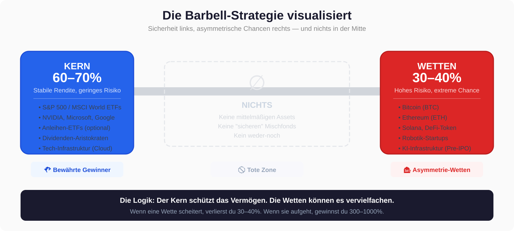

*Abbildung 22: Die Barbell-Strategie - Kern (60-70%) vs. asymmetrische Wetten (30-40%)*

Es gibt einen Moment, den jeder kennt, der sich ernsthaft mit Investieren beschäftigt hat. Den Moment, in dem man alles verstanden zu haben glaubt und trotzdem nicht weiß, was man morgen früh kaufen soll.

Dieses Kapitel schließt diese Lücke. Mit einem Framework, das die Erkenntnisse dieses Buches in eine investierbare Strategie übersetzt.

Dafür habe ich mir die klügsten Köpfe angeschaut. Die Makroökonomen, die das große Bild verstehen. Die Investorenlegenden, deren Prinzipien seit Jahrzehnten funktionieren. Und ich habe eine Frage gestellt, die überraschend selten gestellt wird: Wo stimmen sie überein, und wo liegen sie so weit auseinander, dass man daraus etwas lernen kann?

Denn aus den Widersprüchen entsteht eine Strategie, die besser ist als jede einzelne Meinung.

### Was die Klügsten der Welt gerade denken

Bevor ich mein eigenes Playbook vorstelle, müssen wir reden. Über Ray Dalio, der auf der Münchner Sicherheitskonferenz im Februar 2026 gewarnt hat, dass die USA in Phase 5 stecken, der "Pre-Breakdown Phase" seines Weltordnungszyklus. Über Raoul Pal, den ehemaligen Goldman-Sachs-Manager, der sein Portfolio zu 80 bis 90 Prozent in Krypto hält und den "Everything Code" predigt. Über Cathie Wood, die Bitcoin bei 1,5 Millionen Dollar bis 2030 sieht und humanoide Roboter als Billionen-Dollar-Markt.

Und über Warren Buffett, der Bitcoin immer noch "Rattengift zum Quadrat" nennt, aber 23 Prozent seines Berkshire-Portfolios in Apple, Amazon und anderen Unternehmen hält, deren Zukunft auf KI gebaut ist.

Diese Menschen sind sich in vielem uneinig. ### Drei Punkte des Konsens

Aber in drei Punkten stimmen sie überein. Und diese drei Punkte sind der Ausgangspunkt für alles, was folgt.

### Erkenntnis 1: Das Geldsystem hat ein Problem

Ray Dalio, der den größten Hedgefonds der Welt gebaut hat, empfiehlt jetzt 15 Prozent in Bitcoin oder Gold als Hedge gegen die US-Schuldenspirale. Er hält persönlich 1 Prozent in Bitcoin. Für jemanden, der jahrzehntelang das Establishment beraten hat, ist das bemerkenswert.

Lyn Alden, Autorin von "Broken Money", sagt: "Nothing stops this train." Die USA befinden sich in fiskalischer Dominanz. Die Defizite werden strukturell groß bleiben. Die Fed kann die Zinsen nicht erhöhen, ohne eine Schuldenkrise auszulösen. Also wird gedruckt. Und gedruckt. Und gedruckt.

Luke Gromen bringt es auf den Punkt: "Die Mathematik funktioniert einfach nicht mehr." Die Zinskosten auf die US-Schulden übersteigen den Verteidigungshaushalt. Jede Zinserhöhung verschärft das Problem. Es gibt keinen Ausweg außer Inflation, also die schleichende Entwertung des Geldes.

Jeff Booth geht noch weiter. In "The Price of Tomorrow" argumentiert er, dass Technologie per Definition deflationär ist. Sie löst Probleme effizienter, sie senkt Kosten, sie macht Produkte billiger. In einem normalen Markt würden diese Produktivitätsgewinne als sinkende Preise an alle weitergegeben. Aber unser Geldsystem braucht Inflation, um die Schulden zu bedienen. Technologie will runter, Geldpolitik will rauf. Dieser Widerspruch wird sich auflösen müssen.

Paul Tudor Jones, einer der erfolgreichsten Hedgefonds-Manager der Geschichte, hat seine Bitcoin-Position verdoppelt und sagt: "Bitcoin, Gold und Aktien sind das beste Portfolio gegen Inflation." Wenn ein Milliardär, der seit 40 Jahren Makro-Trends tradet, 4,5 Prozent seines 9-Milliarden-Portfolios in Bitcoin-ETFs steckt, dann ist das kein Experiment. Das ist eine Überzeugung.

### Erkenntnis 2: Technologische Konvergenz ist real und investierbar

Cathie Wood und ARK Invest veröffentlichen jedes Jahr ihren "Big Ideas Report", in dem sie Technologie-Adoptionskurven analysieren. Die Version von 2026 identifiziert fünf Plattformen, die sich gegenseitig beschleunigen: Künstliche Intelligenz, Robotik, Energiespeicherung, Blockchains und Genomik. ARK prognostiziert, dass humanoide Roboter einen Markt im zweistelligen Billionen-Dollar-Bereich erschließen. Man kann über Woods Timing streiten, sie lag bei einigen Prognosen daneben, aber ihre methodische Analyse von Kostenkurven und Adoptionsraten ist solide.

Raoul Pal argumentiert mit Metcalfe's Law: Der Wert eines Netzwerks wächst mit dem Quadrat seiner Teilnehmer. Wenn KI-Agenten zu Netzwerkteilnehmern werden, wenn Roboter sich in dezentrale Netzwerke einloggen, dann wachsen diese Netzwerke nicht linear, sondern exponentiell. Pal nennt die Phase, in der alle Technologieassets gleichzeitig steigen, "The Banana Zone".

Stanley Druckenmiller, der 30 Jahre lang 30 Prozent durchschnittliche Jahresrendite erzielt hat, hat im dritten Quartal 2025 massive Positionen in Amazon, Meta und Alphabet aufgebaut. Er ist aggressiv in KI investiert, aber mit seiner typischen taktischen Flexibilität: Ende 2025 hat er bei vier KI-Aktien Gewinne mitgenommen. "Alle Eier in einen Korb legen und den Korb beobachten." Druckenmiller folgt dem Geld, und das Geld fließt in KI.

Balaji Srinivasan, der ehemalige CTO von Coinbase, geht am weitesten: "All Property Becomes Cryptography." 99 Prozent aller wertvollen Assets werden on-chain gesichert. KI-Agenten brauchen programmierbares Geld, das kein Mensch genehmigen muss. Balaji sagt, die Machine Economy sei das nächste Internet. Ich bin nicht sicher, ob er Recht hat. Aber ich bin auch nicht sicher, ob er Unrecht hat.

### Erkenntnis 3: Die meisten werden trotzdem Geld verlieren

Und hier kommt Howard Marks. In seinem Herbst-Memo 2025 schreibt er, dass KI-Bewertungen "erhöht bis besorgniserregend" seien, aber noch keine volle Blase. Dann der Satz, den sich jeder Investor einrahmen sollte: "Es gibt weit weniger als 100 Prozent Wahrscheinlichkeit, dass eine Investition in ein bestimmtes KI-Unternehmen heute profitabel sein wird."

Die Parallele, die Marks zieht: Die Technologie war real und transformativ. Und die meisten frühen Investoren haben trotzdem Geld verloren. Nicht weil die These falsch war, sondern weil sie zu viel bezahlt, die falschen Pferde gewählt oder zum falschen Zeitpunkt verkauft haben.

Nassim Taleb geht noch weiter. Er nennt Bitcoin eine "elektronische Tulpe" und warnt, dass KI-Systeme bei unvorhergesehenen Extremereignissen versagen. Man kann Taleb frustrierend finden, aber ignorieren sollte man ihn nicht. Er hat Recht gehabt, als 2008 alle Risikomodelle versagt haben. Und sein Barbell-Konzept, ultra-sicher auf der einen Seite, hochspekulativ auf der anderen, ist ironischerweise die Strategie, die am besten zu einer Welt passt, in der alles möglich scheint und nichts sicher ist.

Benjamin Graham, der Vater des Value Investing, hat in den 1930er Jahren den "Mr. Market" erfunden: einen emotionalen Geschäftspartner, der Ihnen jeden Tag anbietet, seine Anteile zu kaufen oder zu verkaufen, mal euphorisch, mal deprimiert. Grahams Rat: Nutzen Sie seine Emotionen, lassen Sie sich nicht von ihnen steuern. 90 Jahre später gilt das unvermindert, für KI-Aktien genauso wie für tokenisierte Assets.

### Die drei Lager und warum keines allein reicht

Aus all diesen Stimmen kristallisieren sich drei Lager heraus. Jedes hat Recht. Und keines reicht allein.

Lager 1: "Das System ist kaputt, Bitcoin ist die Lösung." Saylor, Booth, Alden, Gromen, Balaji. Sie argumentieren, dass das Fiat-Geldsystem fundamental inkompatibel mit technologischem Fortschritt ist. Die Schuldenspirale ist unaufhaltbar. Bitcoin, und Krypto allgemein, ist der logische Ausweg. KI und Robotik beschleunigen den Zusammenbruch des alten Systems.

Ich finde ihre Makro-Analyse überzeugend. Die Mathematik der Staatsschulden ist real. Aber Michael Saylor, der 478.000 Bitcoin im Wert von über 54 Milliarden Dollar auf der Bilanz seiner Firma hält und Zielpreise von 1 bis 10 Millionen Dollar nennt, ist kein Analyst mehr. Er ist ein Glaubensbekenntnis.

Lager 2: "Konvergenz ist investierbar, aber mit Augenmaß." Dalio, Pal, Wood, Druckenmiller, Tudor Jones. Sie erkennen die Konvergenz von KI, Krypto und Robotik an, investieren aggressiv, aber mit Risikomanagement. Bitcoin gehört ins Portfolio, 5 bis 15 Prozent, aber als Teil einer diversifizierten Strategie. KI ist transformativ, aber Blasen sind möglich, und Timing ist nicht irrelevant.

Hier fühle ich mich am meisten zuhause. Das ist die Position, die einen nüchternen Kopf behält, ohne die Chance zu verpassen.

Lager 3: "Zeitlose Prinzipien gelten auch in der neuen Welt." Buffett, Munger, Taleb, Graham, Marks, Templeton. Value-Grundsätze wie Sicherheitsmarge und innerer Wert gelten unverändert. Blasen platzen immer. Der Markt ist emotional. Und Bitcoin hat keinen inneren Wert, jedenfalls nicht in dem Sinne, wie Graham ihn definiert hat.

Sie haben auch Recht. Buffett hat seit 1965 durchschnittlich 20 Prozent pro Jahr erzielt. Sein Urteil über Bitcoin zu ignorieren wäre arrogant. Aber sein Framework wurde für eine Welt gebaut, in der Vermögenswerte Cashflows produzieren. In einer Welt, in der Netzwerkeffekte und digitale Knappheit Wert schaffen, greift es vielleicht zu kurz.

### Die AI-Species-Synthese: Ein Framework für die nächsten zehn Jahre

Hier ist, was ich aus all dem destilliert habe. Keine Aktienempfehlung, sondern ein Denkrahmen, der die zeitlosen Prinzipien der Investorenlegenden mit den neuen Realitäten der Maschinenökonomie verbindet.

### Prinzip 1: Talebs Barbell als Grundstruktur

Nassim Taleb mag Bitcoin ablehnen. Aber seine Barbell-Strategie ist wie geschaffen für eine Welt, die sich zwischen "alles geht gut" und "alles verändert sich radikal" bewegt.

Die Idee: Kein Mittelmäßiges. Keine Investments, die ein bisschen sicher und ein bisschen riskant sind. Stattdessen:

Auf der einen Seite: 60 bis 70 Prozent in soliden, cash-generierenden, verständlichen Assets. Auf der anderen Seite: 30 bis 40 Prozent in asymmetrischen Wetten mit begrenztem Verlust und unbegrenztem Gewinnpotenzial.

Warum funktioniert das? Weil wir in einer Welt leben, die Howard Marks eine "low-return world" nennt, in der sichere Assets wenig bringen, aber Extremereignisse, Talebs Black Swans, überproportional häufig auftreten. Die Barbell schützt vor dem Ruin und profitiert vom Chaos.

### Prinzip 2: Buffetts Burggraben im Zeitalter der Maschinen

Buffett investiert in Burggraben-Unternehmen: Firmen mit dauerhaften Wettbewerbsvorteilen, die Konkurrenten draußen halten. Netzwerkeffekte, Skaleneffekte, Wechselkosten, diese Dinge.

In der Maschinenökonomie gibt es neue Burggraben.

NVIDIA hat den Compute-Burggraben: Die in Kapitel 8 beschriebene Marktdominanz bei KI-Chips, verstärkt durch das CUDA-Software-Ökosystem, das so tief eingebettet ist, dass ein Wechsel Jahre dauert. Ein Buffett-Burggraben in Reinform.

Ethereum hat den Netzwerk-Burggraben: Die meisten Smart Contracts, die meiste DeFi-Aktivität, die meisten Entwickler. Netzwerkeffekte, die mit jedem neuen Teilnehmer stärker werden. 65 Prozent aller tokenisierten Real-World Assets laufen auf Ethereum.

Apple hat den Ökosystem-Burggraben: Hardware, Software, Services, bald KI-Agenten. Je tiefer man drinsteckt, desto schwerer kommt man raus. Wer ein iPhone, ein MacBook, eine Apple Watch und AirPods hat, der wechselt nicht zu Android wegen eines Features.

Das Prinzip ist dasselbe wie vor 50 Jahren. Die Burggraben sehen anders aus.

### Prinzip 3: Cathie Woods S-Kurven und Wright's Law

ARK Invest nutzt ein Konzept, das ingenieurwissenschaftlich fundiert ist: Wrights Gesetz. Es besagt, dass jede Verdopplung der kumulierten Produktionsmenge die Kosten um einen festen Prozentsatz senkt. Das gilt für Transistoren, Solarzellen, Batterien und auch für KI-Inferenz.

Die S-Kurve beschreibt, wie sich Technologien verbreiten: Langsamer Anfang, dann explosive Beschleunigung, dann Sättigung. Smartphones brauchten 5 Jahre, um von 10 auf 90 Prozent Marktdurchdringung zu kommen. Autonomes Fahren und humanoide Roboter befinden sich am unteren Ende dieser Kurve. KI-Agenten auch, auch wenn es sich nicht so anfühlt.

Wer am unteren Ende einsteigt, kauft billig. Wer auf die Bestätigung wartet, kauft teuer. Peter Thiel fragt: "Welche wichtige Wahrheit teilen nur wenige Menschen mit Ihnen?" Am unteren Ende der S-Kurve fühlt sich die Wahrheit noch unbequem an. Das ist der Punkt.

### Prinzip 4: Dalios All-Weather trifft Pals Liquiditätszyklus

Ray Dalios All-Weather-Portfolio ist gebaut, um in jedem Wirtschaftsklima zu funktionieren: Wachstum, Stagnation, Inflation, Deflation. Die Idee: Da niemand weiß, was kommt, positionieren Sie sich für alle Szenarien.

Raoul Pal ergänzt das um den Liquiditätszyklus: Zentralbanken treiben die Märkte stärker als Fundamentaldaten. Folge der Liquidität, nicht der Logik.

In einer Welt der Maschinenökonomie sieht ein All-Weather-Portfolio anders aus als in den 1990ern. Anleihen bieten weniger Schutz, wenn die Staaten ihre Schulden weginflationieren. Gold bleibt relevant, aber Bitcoin kommt dazu. KI-Aktien ersetzen teilweise die traditionelle Wachstumskomponente. Und tokenisierte Assets, die wir im vorherigen Kapitel besprochen haben, werden zu etwas, das in keinem klassischen Modell vorkommt: yield-generierende digitale Wertpapiere, die rund um die Uhr handelbar sind.

### Prinzip 5: Druckenmillers Flexibilität und Tudor Jones' Disziplin

Druckenmiller: Wenn Sie überzeugt sind, setzen Sie groß. Aber bleib flexibel genug, um schnell die Position zu wechseln. "Alle Eier in einen Korb und den Korb beobachten."

Tudor Jones: "Losers average losers." Füge nie zu einer verlierenden Position hinzu. Die 200-Tage-Linie als Kompass. Suche immer nach 5:1-Chancen, bei denen der mögliche Gewinn fünfmal so hoch ist wie der mögliche Verlust.

Beide lehren etwas, das Langfristinvestoren oft vergessen: Kapitalerhalt ist wichtiger als Rendite. Wer 50 Prozent verliert, muss 100 Prozent gewinnen, um wieder auf null zu kommen. Das ist einfache Mathematik, aber die meisten Investoren ignorieren sie, bis es zu spät ist.

### Die physische Infrastruktur der Maschinenökonomie

Im Februar 2026, während Software-Aktien um 17 Prozent einbrachen, passierte etwas, das in keiner KI-Euphorie-Story vorkommt: Kupfer erreichte fast 13.000 Dollar pro Tonne. Uran-Konversionspreise verdreifachten sich. Und Taleb warnte vor Software-Konkursen, während er gleichzeitig darauf hinwies, dass die physische Welt der eigentliche Engpass der KI-Revolution ist.

Die Logik ist simpel: Man kann Claude nicht prompten, die globale Titan-Produktion um fünf Prozent zu erhöhen. Man kann keine KI bitten, einen Transformator zu bauen, für den man 128 Wochen Lieferzeit hat. Die Maschinenökonomie braucht Maschinen, und Maschinen brauchen Material. Daraus ergibt sich eine Investmentthese, die die meisten KI-Investoren ignorieren.

Beginnen wir bei den Transformatoren, dem unscheinbarsten Engpass. Jedes Rechenzentrum braucht Leistungstransformatoren, um den Strom aus dem Netz auf die benötigten Spannungen umzuwandeln. Die Lieferzeit für einen Leistungstransformator liegt Mitte 2025 bei 128 Wochen, für Generator-Stufentransformatoren bei 144 Wochen. Das sind fast drei Jahre. Wood Mackenzie prognostiziert für 2025 ein Angebotsdefizit von 30 Prozent bei Leistungstransformatoren. Die Ursache: Transformatoren benötigen kornorientiertes Elektroband, eine spezielle Stahlsorte mit besonderen magnetischen Eigenschaften. In den USA wird dieses Material von genau einem Unternehmen produziert: Cleveland-Cliffs, in zwei Werken in Pennsylvania und Ohio. Der Rest kommt aus Asien. Wenn ein einziges Unternehmen in zwei Fabriken das Schlüsselmaterial für die gesamte amerikanische Strominfrastruktur herstellt, ist das kein Risiko, das man mit einem Algorithmus löst.

Dann Kupfer. Reuters meldete im Dezember 2025, dass der Kupferpreis die 12.000-Dollar-Marke überschritten hat, getrieben durch die Nachfrage aus Rechenzentren und knappes Angebot. S&P Global prognostiziert ein Angebotsdefizit von 10 Millionen Metrischen Tonnen bis 2040, bei einem Nachfrageanstieg von 50 Prozent. Ein einzelnes Hyperscale-Rechenzentrum verbraucht so viel Kupfer wie tausende Einfamilienhäuser. Bis 2030 könnten Rechenzentren allein eine halbe Million Tonnen Kupfer pro Jahr verbrauchen. Goldman Sachs sieht noch keinen akuten Mangel vor 2029, aber der Punkt ist: Neue Kupferminen brauchen 10 bis 15 Jahre von der Entdeckung bis zur Produktion. Was 2029 fehlt, hätte 2015 geplant werden müssen.

Wolfram ist das Extrembeispiel. China kontrolliert über 80 Prozent der weltweiten Wolfram-Produktion und -verarbeitung. Im Jahr 2025 hat China neue Exportkontrollen erlassen. Die Wolfram-Exporte fielen in den ersten neun Monaten um fast 14 Prozent. Wolfram wird in Halbleiterfertigungsanlagen verwendet, in Rüstungsgütern und in Hochtemperaturanwendungen. Es gibt keine kurzfristige Alternative. Es gibt keine westliche Produktionskapazität, die den Ausfall kompensieren könnte. Es dauert Jahre, eine Wolframmine zu erschließen, und Jahrzehnte, das Verarbeitungs-Know-how aufzubauen. Wenn China den Hahn zudreht, wie es bei Gallium und Germanium bereits geschehen ist, hat der Westen ein Problem, das kein LLM lösen kann.

Titan erzählt die gleiche Geschichte. VSMPO-Avisma in Russland und eine Handvoll chinesischer Produzenten dominieren den Markt. Boeing hatte 2022 bereits eine Titanknappheit, die die 737-MAX-Produktion störte. Die Aerospace-Industrie konkurriert jetzt mit der Verteidigungsindustrie und den Rechenzentren um dasselbe Material. Die Lieferketten-Experten sind sich einig: Es gibt keine Lösung für 2026. Die Diversifizierung nach Japan, Kasachstan oder Saudi-Arabien ist eine langfristige Option, keine kurzfristige Antwort.

Und dann die Nuklear-Lieferkette, die wir in Kapitel 9 angerissen haben. Zwischen dem Uranerz und dem Brennstab liegt ein Flaschenhals, den fast niemand kennt: die Konversion. Uranerz muss erst in Uranhexafluorid umgewandelt werden, bevor es angereichert werden kann. Weltweit gibt es dafür vier relevante Anlagen: Cameco in Kanada, Orano in Frankreich, Rosatom in Russland und eine einzige in den USA, das Metropolis-Werk in Illinois, Baujahr 1958. Dieses Werk wurde 2017 stillgelegt, weil sich der Betrieb nicht lohnte. 2023 ging es wieder ans Netz, mitten in den stärksten Konversionsmarkt der Geschichte. Die Altverträge, die noch zu 20 Dollar pro Kilogramm Uran laufen, werden in den nächsten Jahren durch Neuverträge zu über 60 Dollar ersetzt. Die Kosten bleiben gleich, die Marge verdreifacht sich mechanisch. Das ist keine Spekulation. Das sind Verträge, die auslaufen und durch bessere ersetzt werden.

Beryllium ist das Material, von dem Sie wahrscheinlich noch nie gehört haben. Es wird in Halbleitern, in Satelliten und in Kernwaffen verwendet. In den USA wird es von genau einem Unternehmen produziert: Materion, mit Sitz in Ohio. Hallgarten, ein unabhängiges Research-Haus, nennt es ein Monopol und warnt: "Das ist keine gesunde Situation." Materion hatte 2025 einen Umsatz von 1,79 Milliarden Dollar und investiert gerade in neue Kapazitäten für Verteidigung und Halbleiter. Wenn die Nachfrage steigt und es nur einen Anbieter gibt, bestimmt dieser Anbieter den Preis.

Das Muster zieht sich durch die gesamte physische Infrastruktur der Maschinenökonomie. Ob Kupfer, Wolfram, Titan, Elektroband, Uranhexafluorid oder Beryllium: Überall treffen steigende Nachfrage aus KI, Verteidigung, Aerospace und Elektrifizierung auf eine Handvoll spezialisierter Zulieferer, jahrzehntealte Anlagen und Qualifikationsprozesse, die zwei bis fünf Jahre dauern. Man kann nicht einfach eine größere Fabrik bauen, wenn der Preis steigt.

Für die Portfoliokonstruktion hat das eine Konsequenz, die den meisten KI-Investoren entgeht. Die Picks-and-Shovels-Strategie, die wir mit NVIDIA begonnen haben, endet nicht bei Chips. Sie führt weiter in die physische Welt: in Transformatoren-Hersteller, Kupferminen, Uran-Infrastruktur, Spezialmetall-Lieferanten und Netzausbau-Firmen. Diese Unternehmen haben etwas, das Software-Aktien gerade verlieren: einen Burggraben, den keine KI überwinden kann. Und sie handeln oft zu Bewertungen, die nur einen einzigen ihrer Nachfrage-Treiber einpreisen, obwohl drei oder vier gleichzeitig wirken.

Das ist der Teil der Maschinenökonomie, über den niemand twittert. Aber es ist der Teil, ohne den kein Rechenzentrum läuft, kein Roboter gebaut wird und kein autonomer LKW fährt.

### Das AI-Species-Portfolio: Drei Varianten

## Kapitel 17: Das Musterportfolio - Theorie trifft Praxis

Auf Basis dieser Prinzipien habe ich drei Modellportfolios entworfen. Sie sind keine Anlageberatung. Ich sage das nicht als rechtlicher Disclaimer, sondern weil ich es ernst meine. Was für mich funktioniert, muss nicht für Sie funktionieren. Ihre Risikotoleranz, Ihr Zeithorizont, Ihre Lebenssituation, das alles spielt eine Rolle, die kein Buch für Sie beantworten kann.

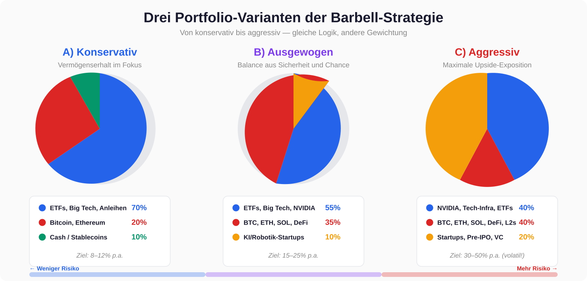

*Abbildung 23: Drei Portfolio-Varianten - konservativ, ausgewogen, aggressiv*

Was ich Ihnen geben kann, ist ein Denkrahmen.

Variante A: Der Konservative (Kapital 100K-500K€)

Seite

Allokation

Anteil

SICHERE SEITE (70 %)

Aktien

Globaler ETF (MSCI World), Tech-Übergewichtung

30 %

Big Tech

NVIDIA, Microsoft, Apple, Alphabet

15 %

Energie

Cameco, Constellation Energy, NextEra

10 %

Robotik

Intuitive Surgical, ABB, Fanuc

10 %

Cash

Tagesgeld / Geldmarkt

5 %

ASYMMETRISCHE SEITE (30 %)

Bitcoin

DCA über 6-12 Monate

15 %

Ethereum

Layer-2-Ökosystem, Agent-TAM

5 %

RWA

BUIDL, Ondo Finance (Tokenisierte Treasuries)

5 %

Infrastruktur

Coinbase, OLAS, PEAQ, Agent-Payment-Rails

5 %

Gesamt

100 %

Sichere Seite (70%)

30% Globaler Aktien-ETF (MSCI World) mit Übergewichtung USA/Tech

15% NVIDIA, Microsoft, Apple, Alphabet (die Burggraben-Gewinner der KI-Revolution)

Anmerkung: Meta fehlt bewusst in der konservativen Variante. Das Geschäftsmodell ist zu 97 Prozent werbefinanziert. Wenn KI-Agenten die Schnittstelle zwischen Mensch und Internet übernehmen und Werbung nicht mehr sehen, steht Metas Kerngeschäft unter Druck, den Google durch DeepMind, Waymo und Cloud besser abfedern kann.

10% Energie und Nuklear: Cameco (Uran), Constellation Energy, Next Era

10% Robotik-Pure-Plays: Intuitive Surgical, ABB, Fanuc

5% Tagesgeld/Geldmarkt als Cash-Reserve (Graham: Mr. Market macht Angebote, Sie brauchen Cash, um sie zu nutzen)

Asymmetrische Seite (30%)

15% Bitcoin (Sicherheitsnetz gegen Fiat-Entwertung, Tudor Jones Allokation)

5% Ethereum (das Betriebssystem der tokenisierten Wirtschaft)

Ethereum hat hier eine zweite Wachstumsstory, die in der Krypto-Diskussion noch untergeht: den Agent-TAM. Wenn Milliarden von KI-Agenten Transaktionen durchführen, nicht einmal am Tag wie ein Mensch, sondern hunderte Male pro Stunde, dann explodiert die Velocity im Netzwerk. Die fundamentale Gleichung MV = PQ bekommt einen neuen Faktor. Ethereums Layer-2-Netzwerke, Arbitrum, Optimism, Base, sind für genau dieses Volumen gebaut.

5% Tokenisierte Treasuries/RWA (BlackRocks BUIDL, Ondo Finance, yield-generierend)

5% Krypto-Infrastruktur: Coinbase, Securitize (wenn gelistet), Machine-Economy-Token (OLAS, PEAQ)

Eine Position verdient besondere Aufmerksamkeit: Agent-Payment-Rails. Stripe baut mit seiner Chain Tempo die Zahlungsinfrastruktur für die Agent-Economy, und sowohl OpenAI als auch Anthropic sind im ersten Batch von Integrationspartnern. Wenn Stripe 2026 oder 2027 an die Börse geht, gehört die Aktie in diese Kategorie. Bis dahin: PayPal positioniert sich über die X-Money-Integration als Zahlungspartner für Elon Musks Agent-Ökosystem, und Block (ehemals Square) baut seine Bitcoin-Lightning-Infrastruktur aus, die für Mikrotransaktionen zwischen Agenten ideal ist.

Variante B: Der Ausgewogene (Kapital 500K-2M€)

Seite

Allokation

Anteil

SICHERE SEITE (60 %)

Aktien

Globaler ETF mit KI-Tilt

20 %

Big Tech

NVIDIA, Microsoft, Apple, Alphabet, Amazon, Meta

15 %

Robotik

Tesla, Intuitive Surgical, ABB, Figure AI

10 %

Energie

Cameco, Constellation, NuScale, Oklo, Uran-ETF

10 %

Cash

Cash-Reserve

5 %

ASYMMETRISCHE SEITE (40 %)

Bitcoin

DCA über 12 Monate

15 %

Ethereum

Staking, Layer-2-Exposure

8 %

DeFi

Circle (IPO), Aave, Uniswap

7 %

RWA

Maple, Centrifuge, Hamilton Lane tokenisiert

5 %

Machine Economy

Olas, peaq, Fetch.ai/ASI, Render Network

5 %

Gesamt

100 %

Sichere Seite (60%)

20% Globaler Aktien-ETF mit KI-Tilt

15% Big Tech Einzeltitel: NVIDIA, Microsoft, Apple, Alphabet, Amazon, Meta

Ein Wort zu Meta: Meta ist der verwundbarste Titel in dieser Liste. Das Geschäftsmodell basiert fast vollständig auf Werbung, und wie wir im vorherigen Kapitel diskutiert haben, droht den Werbeausgaben ein struktureller Höhepunkt, wenn KI-Agenten die Vermittlerrolle zwischen Konsumenten und Anbietern übernehmen. Google hat durch DeepMind, Waymo und die Cloud-Sparte eine natürliche Absicherung. Meta nicht. Wer hier investiert, wettet auf Zuckerbergs Fähigkeit, das Unternehmen vor dem Ad-Spending-Peak in ein KI-Infrastruktur-Unternehmen umzubauen. Die massiven KI-Infrastrukturinvestitionen 2026 deuten darauf hin, dass er das verstanden hat. Ob es schnell genug geht, ist die Frage.

10% Robotik und Autonomie: Tesla, Intuitive Surgical, ABB, Figure AI (wenn gelistet)

Ergänzung für Investoren, die tiefer in die Robotik-Wertschöpfungskette einsteigen wollen: Die eigentlichen Picks-and-Shovels der Roboterkörper-Produktion sind nicht die Roboterhersteller selbst, sondern ihre Zulieferer. Harmonic Drive Systems aus Japan kontrolliert rund 80 Prozent des Weltmarkts für Präzisionsgetriebe, die in jedem humanoiden Roboter stecken. Nidec, ebenfalls Japan, dominiert bei Servomotoren. Wenn die Roboter-Supply-Chain der Bottleneck der nächsten drei bis fünf Jahre ist, dann sind die Firmen, die die Engpass-Komponenten liefern, die NVIDIA der Robotik.

10% Energie-Superzyklus: Cameco, Constellation, NuScale, Oklo, Uran-ETF

5% Cash-Reserve

Asymmetrische Seite (40%)

15% Bitcoin (DCA über 12 Monate, nicht alles auf einmal; Druckenmillers Timing-Disziplin)

8% Ethereum

7% Stablecoin-Infrastruktur und DeFi: Circle (wenn IPO), Aave, Uniswap Token

5% Tokenisierte RWA und Private Credit (Maple, Centrifuge, Hamilton Lane tokenisiert)

5% Machine-Economy-Infrastruktur: Olas, peaq, Fetch.ai/ASI Alliance, Render Network

Variante C: Der Aggressive (Kapital 2M€+, hohe Risikotoleranz)

Seite

Allokation

Anteil

SICHERE SEITE (50 %)

Big Tech

NVIDIA, Microsoft, Apple

15 %

Energie

Nuklear & Energie breit diversifiziert

15 %

Robotik

Tesla, Intuitive Surgical + Venture-Positionen

10 %

Cash / Treasuries

Tokenisierte Treasuries, yield-generierend

10 %

ASYMMETRISCHE SEITE (50 %)

Bitcoin

Kernposition

20 %

Ethereum

Smart-Contract-Plattform

10 %

KI-Token / DeFi

Render, Filecoin, Olas, ASI Alliance, Aave

8 %

RWA

Private Equity, Immobilien, Private Credit

7 %

Venture / Angel

peaq-Ökosystem, Robotik-DAOs, BCI-nahe Firmen

5 %

Gesamt

100 %

Sichere Seite (50%)

15% Big Tech (NVIDIA, Microsoft, Apple)

15% Energie und Nuklear (breit diversifiziert)

10% Robotik-Portfolio (Tesla, Intuitive Surgical, plus Venture-ähnliche Positionen)

10% Cash und tokenisierte Treasuries (yield-generierend, sofort einsetzbar)

Asymmetrische Seite (50%)

20% Bitcoin

10% Ethereum

8% KI-Infrastruktur-Token und DeFi (Render, Filecoin, Olas, ASI Alliance, Aave)

7% Tokenisierte RWA (Private Equity tokenisiert, Immobilien, Private Credit)

5% Venture/Angel in Machine-Economy-Startups (peaq-Ökosystem, Robotik-DAOs, BCI-nahe Firmen)

### Timing: DCA, nicht FOMO

Druckenmiller und Tudor Jones sind sich einig: Timing ist wichtiger, als Langfristinvestoren zugeben wollen. Raoul Pal sieht den Liquiditätshöhepunkt in Q2 2026. Dalio warnt vor einer KI-Blase. Marks sieht die Bewertungen als "erhöht".

Was tun?

Dollar Cost Averaging. Nicht alles auf einmal investieren, sondern über 6 bis 12 Monate verteilen. Das ist kein Zeichen von Unsicherheit, sondern von Disziplin. Graham nannte es "die Sicherheitsmarge in der Zeitdimension". Sie müssen den perfekten Einstieg nicht treffen. Sie müssen nur im Spiel sein, wenn die S-Kurve abhebt.

Tudor Jones' 200-Tage-Linie ist ein brauchbarer Kompass: Wenn ein Asset über seinem 200-Tage-Durchschnitt liegt, ist der Trend intakt. Wenn es darunter fällt, ist Vorsicht angesagt. Kein perfekter Indikator, aber besser als Bauchgefühl.

Und Talebs wichtigste Regel: Begrenze den maximalen Verlust. Die asymmetrische Seite des Portfolios darf auf null fallen, ohne dass Sie pleite gehen. Das ist der ganze Punkt der Barbell: Die sichere Seite schützt Ihre Existenz. Die spekulative Seite schützt Ihre Zukunft.

Der Templeton-Test. Wo ist gerade maximaler Pessimismus?

Europäische KI-Investments. Europa hat kein Foundation-Modell, die Regulierung bremst, der Brain-Drain nach Amerika geht weiter. Alle schreiben Europa ab. Aber SAP, ASML und Siemens sind real und profitabel. Europäische Robotik, ABB, KUKA, Fanuc, ist Weltklasse. Wenn Europa auch nur einen Teil seines regulatorischen Problems löst, sind diese Aktien unterbewertet.

Krypto-Infrastruktur. Viele DeFi-Protokolle und Infrastruktur-Token handeln 80 bis 90 Prozent unter ihren Höchstständen, während die Technologie sich verbessert hat und institutionelle Adoption zunimmt. Das ist klassischer Templeton: Der Markt hasst es, die Fundamentaldaten verbessern sich.

Physische Robotik. Die meisten Investoren schauen auf NVIDIA und vergessen, dass humanoide Roboter, Lieferdrohnen und autonome Landwirtschaft noch in der Phase des maximalen Skeptizismus stecken. Der Markt bepreist sie als Nische. ARK bepreist sie als den nächsten Billionen-Dollar-Markt. Einer von beiden hat Recht.

Die Soros-Frage. Was sind die falschen Prämissen im aktuellen Markt?

"NVIDIA wird KI für immer dominieren." Möglich, aber DeepSeek hat gezeigt, dass Open-Source-Modelle mit einem Bruchteil der Rechenleistung mithalten können. Wenn der Compute-Bedarf langsamer wächst als erwartet, ist NVIDIAs Bewertung verwundbar. Marks würde sagen: Der Preis reflektiert Perfektion. Perfektion kommt selten. Und es gibt ein weiteres Risiko, das wenige auf dem Schirm haben: Hardware-Startups wie Talis und Etched arbeiten daran, Transformer-Architekturen direkt in Silizium zu ätzen, anstatt sie auf General-Purpose-GPUs auszuführen. Talis erreicht bereits 15.000 Tokens pro Sekunde. Wenn spezialisierte Chips die Inferenz um Größenordnungen verbilligen, verschiebt sich der Wert von der Hardware zur Software, und NVIDIAs Marge steht unter Druck.

"Bitcoin ist nur Spekulation." Wenn 15 Prozent der institutionellen Portfolios einen Bitcoin-Anteil haben (Tudor Jones, Dalio, Druckenmiller, Fidelity, BlackRock), dann ist das keine Spekulation mehr. Es ist eine aufkommende Asset-Klasse. Die falsche Prämisse ist die Annahme, dass sich daran nichts ändert.

"Die Machine Economy ist Science-Fiction." Olas hat einen AI Agent App Store gelauncht. peaq hat eine Blockchain für Maschinen gebaut. Wyoming erkennt DAOs als juristische Personen an. Die Infrastruktur existiert. Die falsche Prämisse ist, dass sich das nie mit der physischen Welt verbinden wird. Aber es verbindet sich bereits. Robo.ai hat eine Wallet in ein Auto eingebaut. DIMO hat 180.000 Fahrzeuge an eine Blockchain angeschlossen, die eigenständig Daten verkaufen. Bosch lässt Fahrzeuge autonom an Ladestationen bezahlen. Und Cloudflare: das Unternehmen, über dessen Netzwerk 20 Prozent des Internets läuft, hat eine Milliarde HTTP-402-Responses pro Tag, die Bots sagen: Bezahl erst. Jetzt können sie bezahlen.

Das Ergebnis ist eine neue Investmentschicht: Circle liefert das Geld (USDC als de-facto-Zahlungsmittel der Maschinenökonomie), Coinbase verarbeitet die Zahlungen (x402-Facilitator und Base als Settlement-Chain), Cloudflare hostet die Infrastruktur (20 Prozent des Internets, x402 Foundation, eine Milliarde 402-Responses pro Tag), und peaq gibt den Maschinen eine Identität (6 Millionen Maschinen-Adressen, Bosch moveID). Vier Unternehmen, die zusammen den Grundriss der physischen Maschinenökonomie bilden. Wer diese Schicht im Portfolio hat, wettet nicht auf Science-Fiction. Er wettet darauf, dass HTTP-Statuscode 402 endlich tut, wofür er vor dreißig Jahren erfunden wurde.

Die Munger-Inversion. Man verliert Geld, wenn man zu viel für gute Ideen bezahlt. Die KI-Revolution mag real sein, aber wenn man NVIDIA bei einem KGV von 60 kauft und das Gewinnwachstum sich verlangsamt, verliert man trotzdem. Marks: "Teuer und morgen nach unten gehen sind nicht dasselbe, aber teuer erhöht die Wahrscheinlichkeit."

Man verliert Geld, wenn man konzentriert statt diversifiziert. Druckenmiller kann konzentrieren, weil er 12 Stunden am Tag Märkte analysiert. Sie und ich können das nicht. Für die meisten Investoren ist Diversifikation kein Zeichen von Feigheit, sondern von Selbstkenntnis.

Man verliert Geld, wenn man in Panik verkauft. Bitcoin ist dreimal um mehr als 70 Prozent gefallen, bevor er neue Höchststände erreichte. Wer bei minus 50 Prozent verkauft hat, hat die größten Rallyes verpasst. Tudor Jones: "Losers average losers." Aber die Umkehrung gilt auch: Winners hold winners.

Man verliert Geld, wenn man in Dinge investiert, die man nicht versteht. Buffett nennt das den "Circle of Competence", und es ist einer seiner besten Ratschläge. Wenn Sie nicht erklären können, was ein Smart Contract tut, kaufen Sie keinen Governance-Token einer DAO. Wenn Sie nicht wissen, was Layer-2-Rollups sind, kaufen Sie einen Bitcoin-ETF statt Arbitrum. Niemand gibt Ihnen einen Preis für Komplexität.

Das letzte Prinzip: Skin in the Game Taleb hat geschrieben, dass man niemandem vertrauen sollte, der nicht selbst von dem betroffen ist, worüber er urteilt.

Ich habe Geld in Bitcoin, in Ethereum, in KI-Aktien und in Robotik. Ich baue selbst KI-Produkte. Ich habe Skin in the Game.

Ob das ein Interessenkonflikt ist oder ein Beweis für meine Überzeugung, das müssen Sie selbst entscheiden. Ich halte es mit Taleb: Wer nicht bereit ist, sein eigenes Geld auf seine These zu setzen, sollte keine These haben.

Die Barbell-Strategie, die ich in diesem Kapitel beschrieben habe, ist keine Garantie. Aber sie verbindet Buffetts und Grahams Grundsatz "schütze das Kapital" mit Thiels und Druckenmillers Bereitschaft, groß zu setzen, wenn die Überzeugung stimmt. Und sie respektiert, was Templeton und Marks wussten: dass man falsch liegen kann, und dass der Markt irrational bleiben kann, länger als man solvent ist.

Ich weiß nicht, ob die Maschinenökonomie in fünf oder in fünfzehn Jahren Realität wird. Ich weiß nicht, ob Bitcoin bei 500.000 oder bei 20.000 Dollar steht, wenn Sie dieses Buch lesen. Was ich weiß: Die Konvergenz kommt. Und wer ein System hat, das die nächste Blase überlebt, ohne die nächste Revolution zu verpassen, der ist besser dran als 90 Prozent aller Investoren.

Warum das alles? Warum die Mühe mit Portfolios, mit Allokationen, mit Volatilität?

Weil es um mehr geht als Rendite.

Es geht um die Frage, wer du in zehn Jahren sein wirst. Ein Besitzer oder ein Bittsteller. Jemand, der von seiner Arbeit lebt, in einer Welt, in der Maschinen die Arbeit übernehmen. Oder jemand, der von seinen Assets lebt, in einer Welt, in der Assets die Arbeit der Maschinen einfangen.

Die Kausalkette aus Kapitel 10 bleibt unerbittlich. Die Barbell-Strategie ist meine Antwort darauf: Der sichere Kern schützt, was du hast. Die asymmetrischen Wetten verschaffen dir Anteil an dem, was kommt.

> *Das ist keine Geldanlage. Das ist Selbstverteidigung.*

### Ihr Startpunkt: Das AI-Species-Musterportfolio

Theorie ist wertlos, wenn sie nicht zu einer Handlung führt. Also lassen Sie mich konkreter werden, als es die meisten Finanzbücher wagen. Was Sie hier sehen, ist kein hypothetisches Modell. Es ist ein Portfolio, das Sie morgen früh aufbauen könnten, mit realen Produkten, die für deutsche Anleger zugänglich sind, mit konkreten ISINs und mit einer Allokation, die die Barbell-Logik dieses Buches in die Praxis übersetzt.

Ich nenne es das AI-Species-Musterportfolio. Nicht weil es perfekt ist, sondern weil es ehrlich ist.

Ausgangsbasis: 100.000 Euro. Wenn Sie mehr haben, skalieren Sie die Prozentsätze. Wenn Sie weniger haben, beginnen Sie mit dem Kern und bauen die asymmetrische Seite schrittweise auf.

Der sichere Kern, 65.000 Euro

25.000 Euro in einen Nasdaq-100-ETF (Invesco EQQQ, ISIN: IE00BFZXGZ54, Kosten: 0,30% pro Jahr). Das ist Ihre Basisposition. Sie besitzen damit indirekt NVIDIA, Microsoft, Apple, Alphabet, Amazon, Meta und Broadcom, die Unternehmen, die die Infrastruktur der KI-Revolution bauen. Ein einziges Produkt, breit gestreut, über jeden deutschen Broker kaufbar.

15.000 Euro in einen MSCI-World-ETF (iShares, ISIN: IE00B4L5Y983, Kosten: 0,20%). Der Fallschirm. 1.500 Unternehmen aus 23 Ländern. Wenn die KI-These langsamer kommt als erwartet, fängt dieser ETF den Schlag ab. Ray Dalio würde nicken.

5.000 Euro in einen Robotik-ETF (iShares Automation & Robotics, ISIN: IE00BYZK4552, Kosten: 0,40%). NVIDIA, Intuitive Surgical, Keyence, ABB, Fanuc. Wenn Phase 4 eintritt (Roboter in der physischen Welt) profitiert dieses Produkt überproportional.

5.000 Euro in NVIDIA direkt (ISIN: US67066G1040). Ja, zusätzlich zum ETF. Jensen Huang baut nicht nur Chips. Er baut das Betriebssystem der Robotik. GR00T, Cosmos, Omniverse. NVIDIA ist für die Maschinenökonomie, was Standard Oil für das Ölzeitalter war.

3.000 Euro in Microsoft (ISIN: US5949181045). 49% an OpenAI, Copilot in jedem Produkt, Azure als KI-Cloud. Die sicherste Wette im KI-Universum.

3.000 Euro in Alphabet (ISIN: US02079K3059). DeepMind hat den Nobelpreis für AlphaFold gewonnen. Waymo fährt autonom durch San Francisco. Gemini wird besser. Und das alles wird durch die größte Datenbasis der Menschheitsgeschichte (die Google-Suche) angetrieben.

2.000 Euro in Amazon (ISIN: US0231351067). AWS ist die größte Cloud, 8 Milliarden Dollar in Anthropic investiert, eigene KI-Chips, 750.000 Roboter in den Lagern. Die Infrastrukturschicht der Infrastrukturschicht.

2.000 Euro in Tesla (ISIN: US88160R1014). Die riskanteste Position im Kern. Aber Optimus, FSD und die Energiespeicher-Sparte machen Tesla zu mehr als einem Autobauer. Es ist eine Wette auf Robotik, Autonomie und Energie gleichzeitig. Und ja, Musk ist ein Risikofaktor.

3.000 Euro in einen Uran-ETF (Global X Uranium, ISIN: IE000NDWFGA5, Kosten: 0,65%). KI-Rechenzentren brauchen Grundlaststrom. Kernenergie ist die einzige CO₂-arme Quelle, die das liefern kann. Der Uranpreis hat sich seit 2020 verdreifacht, und die Nachfrage wächst schneller als das Angebot.

2.000 Euro in Cameco (ISIN: CA13321L1085). Der weltgrößte Uranproduzent. Jeder neue Reaktor, ob SMR oder konventionell, braucht Cameco. Das ist die Picks-and-Shovels-Strategie, angewendet auf Energie.

Die asymmetrische Seite, 28.000 Euro

10.000 Euro in Bitcoin. Das ist die größte Einzelposition auf der spekulativen Seite, und das ist Absicht. Bitcoin ist nicht Spekulation. Bitcoin ist eine Versicherung gegen die Entwertung des Geldsystems, das wir in Kapitel 1 beschrieben haben. Tudor Jones hält es, Dalio hält es, Druckenmiller hat es gehandelt, BlackRock hat den erfolgreichsten ETF-Launch der Geschichte damit hingelegt.

Für deutsche Anleger gibt es zwei Wege: Direktkauf über eine regulierte Krypto-Börse (Kraken, Bitstamp, Coinbase) mit anschließender Verwahrung auf einem Hardware-Wallet (Ledger Nano X, circa 79 Euro). Vorteil: Nach einem Jahr Haltedauer steuerfrei. Oder als ETP über das normale Depot (CoinShares Physical Bitcoin, ISIN: GB00BLD4ZL17; oder 21Shares Bitcoin ETP, ISIN: CH0454664001). Einfacher, aber ohne Steuerfreiheit nach einem Jahr, hier greift die Abgeltungssteuer.

Meine Empfehlung: Direktkauf. Die Steuerersparnis nach einem Jahr ist den Aufwand wert.

5.000 Euro in Ethereum. Das programmierbare Geld, das Betriebssystem der tokenisierten Wirtschaft. Wenn Smart Contracts, DeFi und tokenisierte Vermögenswerte Realität werden. Und die Infrastruktur existiert bereits, dann ist Ethereum die Plattform, auf der das gebaut wird. Gleiche Kaufwege wie Bitcoin.

3.000 Euro in einen Krypto-Basket-ETP (21Shares Crypto Basket Index, ISIN: CH0445689208). Bitcoin, Ethereum, Solana und weitere nach Marktkapitalisierung, in einem einzigen Produkt, über Xetra handelbar. Diversifikation innerhalb der Krypto-Allokation.

5.000 Euro in spekulative Token: OLAS (Autonolas, Governance für autonome KI-Agenten), FET (ASI Alliance, fusioniert aus Fetch.ai, SingularityNET und Ocean Protocol), RENDER (dezentrale GPU-Rechenleistung) und SOL (Solana, die schnellste Layer-1-Blockchain). Je 1.250 Euro pro Token. Das sind die riskantesten Positionen im gesamten Portfolio. Totalverlust möglich. Aber wenn die Machine Economy kommt, wie sie in diesem Buch beschrieben wird, dann sind das die Infrastruktur-Token, die davon profitieren. Zugang über Kraken oder Coinbase.

3.000 Euro in den ARK Genomic Revolution ETF (ISIN: US00214Q5009). Wenn Kapitel 15 richtig liegt, wenn KI die Grenzen des Alterns verschiebt, dann ist Genomik der nächste Billionen-Dollar-Markt. CRISPR Therapeutics, Recursion Pharmaceuticals, Twist Bioscience. Handelbar über Interactive Brokers.

2.000 Euro in Recursion Pharmaceuticals (ISIN: US75629V1044). KI-gestützte Medikamentenentwicklung mit NVIDIA-Partnerschaft. Hochspekulativ, aber die Verbindung von KI und Biotech, die wir im Longevity-Kapitel beschrieben haben, materialisiert sich hier.

Die Reserve, 7.000 Euro

7.000 Euro in Tagesgeld oder einen Geldmarkt-ETF. Trockenes Pulver. Howard Marks sagt: "Die besten Investments fühlen sich am unbequemsten an." Und die unbequemsten Momente sind Crashs. Wer in einem Crash kein Cash hat, kann nur zuschauen, wie andere die Schnäppchen kaufen.

Was kann passieren?

Im schlimmsten Fall verliert die asymmetrische Seite 80 Prozent, der Kern fällt um 30 Prozent. Gesamtverlust: circa 42 Prozent. Schmerzhaft, aber nicht existenzbedrohend. Sie haben immer noch 58.000 Euro, und die These hat Zeit, sich zu materialisieren.

Im besten Fall. Und das ist der Grund, warum wir das tun, verdoppelt sich der Kern in fünf Jahren, die Krypto-Positionen vervierfachen sich, Biotech verdreifacht sich. Gesamtportfolio: circa 260.000 Euro. Das ist die Asymmetrie, die Taleb beschreibt: begrenztes Risiko, unbegrenztes Upside.

Der ehrliche Mittelweg: Kern plus 60 bis 80 Prozent, Krypto plus 100 bis 200 Prozent, Biotech plus/minus null bis plus 100 Prozent. Gesamtportfolio in fünf Jahren: 180.000 bis 220.000 Euro.

Geplante Börsengänge, die Sie kennen sollten

Die AI-Species-These endet nicht bei dem, was heute handelbar ist. Einige der wichtigsten Unternehmen dieser Revolution stehen noch vor ihrem Börsengang:

OpenAI, aktuell mit 730 bis 840 Milliarden Dollar bewertet (nach der 110-Milliarden-Dollar-Runde im Februar 2026). IPO wahrscheinlich 2026 oder 2027. Mein Rat: Kaufen Sie nicht am ersten Tag. Warten Sie die Lock-up-Frist ab (üblicherweise sechs Monate), bis Insider verkaufen dürfen. Der Kurs korrigiert fast immer. Dann bauen Sie eine Position auf.

Anthropic, bewertet mit 380 Milliarden Dollar (letzte Runde Februar 2026). Noch kein IPO angekündigt, aber bei dieser Bewertung ist es eine Frage der Zeit. Claude ist eines der besten Sprachmodelle der Welt.

Figure AI, bewertet mit circa 39 Milliarden Dollar. Humanoide Roboter, die bereits in BMW-Fabriken arbeiten. Wenn Phase 4 eintritt, ist Figure einer der Kernplayer.

Cerebras Systems, hat den IPO vertraulich eingereicht, potenziell schon im April 2026. Der ernsthafteste Konkurrent zu NVIDIA bei KI-Chips mit einem radikal anderen Ansatz: Wafer-Scale-Chips.

Databricks, bewertet mit circa 62 Milliarden Dollar. Die Datenplattform hinter der KI-Revolution. Jedes Unternehmen, das KI nutzt, braucht eine Dateninfrastruktur.

Stripe, bewertet mit circa 90 Milliarden Dollar. Zahlungsinfrastruktur. Wenn M2M-Zahlungen kommen, will Stripe ein Stück davon.

Circle (USDC), hat den IPO-Antrag bei der SEC eingereicht. Der größte regulierte Stablecoin-Emittent. Die Brücke zwischen der alten und der neuen Finanzwelt.

Und CoreWeave (Ticker: CRWV) ist seit März 2025 an der Nasdaq gelistet und hat seinen Kurs seitdem mehr als verdoppelt. Der "AWS für KI-Training". NVIDIA-backed, mit explodierender Nachfrage.

Für alle diese IPOs gilt die gleiche Regel: Maximal 2 bis 3 Prozent des Portfolios pro Einzelwert. Sechs Monate warten. Position langsam aufbauen. Und nur über regulierte Broker. Interactive Brokers bietet den breitesten Zugang für deutsche Anleger.

Wo deutsche Anleger handeln

Nicht jeder Broker bietet alles an. Hier die Kurzübersicht:

Interactive Brokers: Der Allrounder. Direkter Zugang zu NYSE und Nasdaq, alle ETFs, Krypto-ETPs. Bester Preis, aber die Oberfläche ist nicht für Anfänger gebaut.

Scalable Capital: Gut für ETFs und Standard-Aktien. US-Aktien über Xetra (nicht direkt NYSE). Krypto-ETPs verfügbar. Einsteigerfreundlich.

Trade Republic: Ähnlich wie Scalable, mit direktem Krypto-Handel. Einfachste Oberfläche, aber eingeschränkte Produktauswahl.

Kraken oder Bitstamp: Für den Direktkauf von Krypto. MiCA-reguliert (oder beantragt). Zusammen mit einem Hardware-Wallet die beste Lösung für langfristige Krypto-Verwahrung.

Steuerliche Realität für deutsche Anleger

Kryptowährungen im Direktbesitz: Nach einem Jahr Haltedauer steuerfrei. Davor: persönlicher Einkommensteuersatz (bis zu 45% plus Soli). Das ist ein enormer Vorteil gegenüber ETPs, planen Sie entsprechend.

Krypto-ETPs: Keine Steuerfreiheit nach einem Jahr. Abgeltungssteuer von 26,375 Prozent (inklusive Soli) wie bei Aktien.

Aktien und ETFs: Abgeltungssteuer auf Gewinne. Bei Aktien-ETFs gibt es eine Teilfreistellung von 30 Prozent.

Freibetrag: 1.000 Euro pro Person, 2.000 Euro für Ehepaare. Stellen Sie einen Freistellungsauftrag bei Ihrem Broker.

Dies ist keine Steuerberatung. Die Situation ist individuell, und ein Steuerberater mit Krypto-Erfahrung ist eine gute Investition.

Eine letzte Anmerkung zum Timing: Investieren Sie nicht alles an einem Tag. Die DCA-Strategie (Dollar Cost Averaging), die wir weiter oben besprochen haben, gilt auch hier. Verteilen Sie die 100.000 Euro über sechs bis zwölf Monate. Jeden Monat eine Tranche. Das glättet die Volatilität und nimmt den psychologischen Druck des "perfekten Einstiegs".

Die Barbell funktioniert. Nicht weil sie perfekt ist, sondern weil sie die richtige Frage beantwortet: Wie bleibe ich im Spiel. Und ich falsch liege. Und wie profitiere ich maximal, wenn ich Recht habe?

Aber was, wenn ich falsch liege? Jede ehrliche Investmentthese muss ihre eigenen Schwachstellen benennen. Genau das tun wir jetzt.

> **📌 Auf einen Blick:**
>
> ◆ Barbell-Strategie: 60-70% sicherer Kern plus 30-40% asymmetrische Wetten.
> ◆ Konkretes Beispiel-Portfolio mit 100.000 Euro Ausgangsbasis.
> ◆ Regel Nr. 1: Nie mehr riskieren, als man bereit ist zu verlieren.

✅ Was Sie jetzt tun können

☐ Portfolio-Allokation festlegen: Kern / Asymmetrisch / Cash

☐ Krypto-Wallet einrichten - Self-Custody!

☐ Erste Positionen aufbauen: ETFs und Bitcoin

☐ Rebalancing-Termine im Kalender eintragen (quartalsweise)

## Kapitel 18: Risiken und Gegenargumente - Was schiefgehen kann

"Es ist schwer, Vorhersagen zu machen, besonders über die Zukunft."

- Niels Bohr (zugeschrieben)

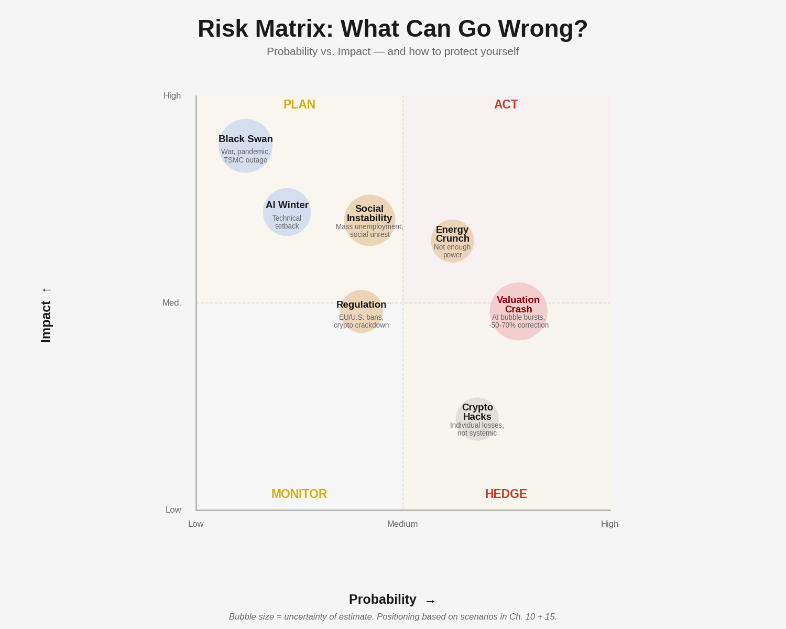

*Abbildung 24: Risiko-Matrix - Wahrscheinlichkeit vs. Impact*

Jede Investmentthese, die keine Gegenargumente nennt, ist keine These. Sie ist Propaganda. Also nehmen wir die Risiken ernst. Nicht als rhetorische Pflichtübung, sondern weil das Ignorieren von Risiken der schnellste Weg ist, Geld zu verlieren.

Ich bin kein blindgläubiger Optimist. Ich bin jemand, der seit über dreißig Jahren investiert, in seinen Anfangsjahren viel Lehrgeld bezahlt hat und der auch schon einmal fast alles verloren hat, als er im Krypto-Winter 2018 zugesehen hat, wie sein Portfolio um über 80 Prozent zusammenfiel, und der trotzdem an der These festhielt. Nicht aus Sturheit, sondern aus Überzeugung. Aber Überzeugung allein schützt nicht vor Verlusten. Was schützt, ist ein klarer Blick auf das, was schiefgehen kann.

### Die KI-Blase: Wenn Investitionen den Einnahmen davonlaufen

Die fünf großen Hyperscaler geben 2026 voraussichtlich über 600 Milliarden Dollar für KI-Infrastruktur aus. Die KI-Einnahmen liegen bei 50 bis 60 Milliarden. Ein Verhältnis von zehn zu eins. Taleb, der die Barbell-Strategie populär gemacht hat, warnt im Februar 2026 vor "eskalierender Volatilität und potenziellen Konkursen im Softwaresektor". Sam Altman selbst gibt zu, dass eine Blase existiert.

Die Parallele zur Dot-Com-Blase liegt auf der Hand. Und ich finde sie auch nicht falsch. Aber sie ist unvollständig.

Ich sehe hohe Volatilität mit starken Ausschlägen nach oben, und es werden auch heftige Ausschläge nach unten kommen. Was die meisten Beobachter aber übersehen: Der Trend zeigt nach oben. Steil nach oben. Und er wird sich verstärken.

Die Dot-Com-Blase hatte eine entscheidende Eigenschaft: Viele der Unternehmen, die damals Milliarden an Marktkapitalisierung aufgebaut hatten, hatten kein tragfähiges Geschäftsmodell. Pets.com, Webvan, eToys: das waren Wetten auf eine Zukunft, die noch nicht existierte. Die heutigen KI-Unternehmen generieren realen Umsatz. GitHub Copilot verändert die Art, wie Software geschrieben wird. Claude und GPT automatisieren Wissensarbeit. Tesla setzt 700.000 Roboter in seinen Fabriken ein. Die Technologie ist da. Die Adoption ist real.

Das heißt nicht, dass eine Korrektur unmöglich ist. Sie ist sogar wahrscheinlich. Aber es bedeutet, dass eine Korrektur in der KI genau das wäre, was der Dot-Com-Crash für Amazon war: ein Blutbad für die Schwachen und ein Kaufzeitpunkt für die Überzeugten. Amazon fiel von 107 auf 7 Dollar. Wer 2001 bei 7 Dollar gekauft hat, besitzt heute Anteile an einem 2-Billionen-Dollar-Unternehmen.

Eine Korrektur kommt. Sicher. Entscheidend ist, ob Sie dann nachkaufen oder in Panik verkaufen. Meine Antwort steht fest: Ich kaufe nach.

### Das Oligopol-Paradox: Warum wenige Player kein Widerspruch sind

Sieben Firmen machen 35 bis 40 Prozent des S&P 500 aus. NVIDIA verlor im Februar-Dip 600 Milliarden Dollar Marktkapitalisierung in wenigen Tagen. Kritiker nennen das ein gefährliches Klumpenrisiko. Sie haben nicht unrecht. Aber sie vergessen die Geschichte.

KI ist kein "The Winner Takes It All"-Markt. Aber es wird nur wenige Player geben, die genug Kapital haben, um die Infrastruktur für unsere zukünftige Welt zu bauen. Das ist kein Widerspruch. Es ist ein Muster, das sich durch die gesamte Wirtschaftsgeschichte zieht: Kapitalintensive Infrastruktur erzeugt natürliche Oligopole. Rockefellers Standard Oil kontrollierte 90 Prozent der US-Raffineriekapazität, nicht durch Intrige, sondern weil Raffinerien und Pipelines enormes Kapital erforderten. AT&T betrieb über Jahrzehnte ein legales Monopol, weil kein Wettbewerber ein landesweites Telefonnetz finanzieren konnte. Edison, Westinghouse und General Electric elektrifizierten Amerika zu dritt, weil Kraftwerke und Übertragungsleitungen so teuer waren, dass kein vierter mitspielen konnte.

KI-Infrastruktur folgt exakt diesem Muster. Ein einzelnes Training eines Frontier-Modells kostet über 100 Millionen Dollar. Die Rechenzentren kosten Milliarden. Ein Startup kann kein Rechenzentrum bauen, das es mit AWS aufnimmt - genauso wenig wie ein Startup 1880 eine Eisenbahnstrecke von New York nach San Francisco legen konnte.

Die Konzentration auf wenige große Player ist kein Bug. Sie ist ein Feature kapitalintensiver Infrastruktur - und historisch war sie kein Hindernis für Investoren, sondern eine Einladung.

Emad Mostaque beschreibt in "The Last Economy" einen Mechanismus, der das Konzentrationsrisiko über das historische Muster hinaus verschärft: das "Network Prison". Seine These: In digitalen Märkten folgt die Verteilung nicht der Glockenkurve, sondern dem Potenzgesetz. Eine winzige Zahl von Knoten hat gigantische Verbindungen, die Masse hat fast keine. Dahinter steckt keine böse Absicht, sondern Mathematik: Preferential Attachment, die Reichen werden reicher, weil Netzwerke so funktionieren. KI verstärkt diesen Effekt bis zur "gravitational collapse": Bessere Daten ziehen mehr Nutzer an, mehr Nutzer produzieren bessere Daten, bessere Daten trainieren bessere Modelle. Die erfolgreichen Netzwerke werden zu schwarzen Löchern, aus denen weder Nutzer noch Kapital entkommen. Für Investoren heißt das: Wer im richtigen Netzwerk investiert ist, profitiert vom Sog. Wer auf den falschen Knoten gesetzt hat, verliert alles.

Bedeutet das, dass die Magnificent Seven sicher sind? Nein. Konzentration birgt Risiken. Wenn NVIDIA ein schlechtes Quartal hat, wenn ein Kartellverfahren gegen Microsoft Erfolg hat, wenn ein Konkurrent den GPU-Markt aufbricht. Dann spürt das jeder. Die ehrliche Antwort auf das Konzentrationsrisiko ist nicht, dass es nicht existiert. Es ist, dass es in der Natur kapitalintensiver Infrastruktur liegt und historisch die Regel war, nicht die Ausnahme. Die wenigen, die die Infrastruktur bauen können, dominieren. Und wer in sie investiert, profitiert davon.

### Der nächste KI-Winter: Warum ich ihn für unmöglich halte

Die Geschichte der KI kennt zwei Winter. 1974 bis 1980, als die Perceptron-Euphorie in Ernüchterung umschlug. 1987 bis 1993, als die Expertensysteme ihre Grenzen zeigten. Beide Male folgten Jahre der Stagnation, gekürzte Forschungsbudgets, verlorenes Interesse.

Ich halte einen dritten KI-Winter für unmöglich. Nicht für unwahrscheinlich - für unmöglich. Und ich sage das als jemand, der nicht leichtfertig absolute Aussagen trifft.

Der Grund ist simpel: Die Entwicklung geht zu schnell. Jeden Monat erscheinen Modelle, die das vorherige übertreffen. DeepSeek hat gezeigt, dass man mit einem Bruchteil der Kosten Frontier-Leistung erreichen kann. OpenClaw, ein Projekt, das persönliche KI-Assistenten auf ein Niveau hebt, das ich erst in fünf Jahren erwartet hätte, existiert heute. Nicht als Demo, nicht als Forschungsprototyp, sondern als funktionierendes System, das meinen Arbeitsalltag verändert.

Ich selbst arbeite an einer Art Betriebssystem für Unternehmen, das sich aus spezialisierten KI-Agenten zusammensetzt. Ein System, das komplette Firmenteams ersetzen wird. Nicht irgendwann, sondern in den nächsten zwei bis drei Jahren. Die Produktivitätsgewinne, die ich in meinem eigenen Unternehmen bereits sehe, sind so gewaltig, dass jeder, der heute "KI-Winter" sagt, in meinen Augen die Geschwindigkeit der Entwicklung fundamental unterschätzt.

In den früheren KI-Wintern gab es eine entscheidende Gemeinsamkeit: Die Technologie konnte die Versprechen nicht einhalten. Perceptrons konnten keine komplexen Probleme lösen. Expertensysteme waren spröde und teuer in der Wartung. Die Lücke zwischen Erwartung und Realität war zu groß.

Heute ist es umgekehrt. Die Realität übertrifft die Erwartungen schneller, als die meisten Menschen verarbeiten können. GPT-4 bestand medizinische Prüfungen. Gemini analysiert Millionen von Zeilen Code. KI-Agenten buchen Reisen, verhandeln Verträge, schreiben Software. Die Lücke existiert nicht mehr. Was existiert, ist eine Lücke zwischen dem, was die Technologie bereits kann, und dem, was die breite Masse davon begriffen hat.

Wenn ich an die Zukunft der KI denke, sehe ich einen heißen Sommer. Keinen Winter.

Das einzige, was die Suppe verhageln könnte, wäre eine extreme Regulierung. In Europa denkbar. In den USA völlig undenkbar, dazu mehr im nächsten Abschnitt.

### Existenzielles Risiko: Die Frage, die niemand beantworten kann

Geoffrey Hinton, Nobelpreisträger und einer der Väter des Deep Learning, schätzt eine zehn- bis zwanzigprozentige Wahrscheinlichkeit, dass KI innerhalb der nächsten dreißig Jahre zur menschlichen Auslöschung führt. In einem früheren Interview nannte er sogar fünfzig Prozent. Yoshua Bengio, ein weiterer Turing-Preisträger, warnt vor "irreversiblem Kontrollverlust über autonome KI-Systeme". Über hundert KI-Professoren haben ein Statement unterzeichnet, das KI-Risiko auf eine Stufe mit Pandemien und Atomkrieg stellt.

Die Gegenposition kommt von Marc Andreessen, Yann LeCun und Andrew Ng: Alles übertrieben. Aktuelle KI sei "sophisticated autocomplete", keine Proto-AGI. Das Risiko werde instrumentalisiert, um Regulierung durchzusetzen, die den Etablierten nutze und Herausforderer fernhalte.

Yuval Noah Harari passt in keines der beiden Lager. In "Nexus" unterscheidet er zwei Arten von Informationsnetzwerken: selbstkorrigierende wie Wissenschaft und Demokratie, die Fehler erkennen und reparieren, und selbstverstärkende wie Religion und Totalitarismus, die Fehler zementieren. Seine Angst: KI-Systeme sind Black Boxes ohne Selbstkorrektur. Wenn Regierungen und Unternehmen sie für Überwachung und Entscheidungsfindung nutzen, entsteht eine neue Form von Totalitarismus. Nicht durch einen Diktator, sondern durch einen Algorithmus, den niemand mehr hinterfragt.

2023 warnte er im Guardian, dass KI-Komplexität katastrophale Finanzkrisen auslösen kann. 2008 war die Subprime-Krise schon schwer genug zu verstehen. Was passiert, wenn KI-Trading-Agenten Billionen bewegen und niemand den Algorithmus versteht? Auf dem Weltwirtschaftsforum 2026 in Davos hat er das zugespitzt: KI erzeugt "digitale Einwanderer", die mit Lichtgeschwindigkeit Grenzen überqueren, ohne Visum, ohne physische Präsenz, aber mit massivem kulturellen und wirtschaftlichen Einfluss. Ob man Harari für einen Pessimisten hält oder für einen Realisten, ist Geschmackssache. Was man nicht tun sollte, ist seine Warnungen ignorieren. Er liegt zu oft richtig dafür.

Wo stehe ich?

Ich nehme das existenzielle Risiko ernst, aber ich sehe die größere Gefahr woanders. Ich glaube, wir werden uns selbst auslöschen, und zwar langsam. Durch fehlende Reproduktion. Zu wenig Nachwuchs. Durch die entstehende Trägheit, Faulheit und Sinnlosigkeit, die sich für einen großen Teil der Menschheit ergibt.

Die größte Gefahr der Maschinenökonomie ist nicht der Kontrollverlust über KI. Es ist der Verlust des Antriebs bei den Menschen.

Die Kausalkette aus Kapitel 10 endet nicht nur bei Armut. Sie endet bei Resignation - dem Weg in die "useless class", von der Harari spricht.

Ich weigere mich, diesen Weg zu akzeptieren. Nicht für mich. Nicht für meine Familie. Nicht für jeden, der dieses Buch liest.

Das klingt dramatisch, aber die Daten sind eindeutig. Die Geburtenraten fallen weltweit. Japan und Südkorea schrumpfen bereits. In Europa erreichen immer mehr Länder Fertilitätsraten, die für den Erhalt der Bevölkerung zu niedrig sind. Und KI wird diesen Trend nicht umkehren - sie wird ihn beschleunigen.

Wenn Arbeit nicht mehr identitätsstiftend ist (Kapitel 10 hat das ausführlich behandelt) verlieren Menschen ihren Antrieb. Ein großer Teil der Menschheit ist es gewohnt, Befehlsempfänger zu sein. Aufgaben zu bekommen, sie abzuarbeiten, dafür bezahlt zu werden. Diese Menschen werden in einer Welt, in der KI-Agenten die Aufgaben besser und schneller erledigen, keinen Platz mehr finden. Nicht weil die Technologie sie ausschließt, sondern weil sie nie gelernt haben, proaktiv zu denken, selbst zu gestalten, ihrem Leben aktiv Richtung zu geben.

Ich glaube, dass die Fähigkeit zur Selbststeuerung, die Fähigkeit, ohne äußere Anweisung Sinn zu finden und produktiv zu sein, in Zukunft die wichtigste Kompetenz überhaupt sein wird. Nicht Programmieren, nicht Prompt Engineering, nicht Datenanalyse, sondern die grundlegende menschliche Fähigkeit, sich selbst zu motivieren, wenn es niemand von Ihnen verlangt.

Beeinflusst das meine Investmententscheidungen? Ja, indirekt. Ich investiere in die Unternehmen, die die Infrastruktur dieser neuen Welt bauen, weil ich überzeugt bin, dass die Transformation stattfinden wird. Die Frage, ob sie gut für die Menschheit ist, ist eine andere. Als Investor muss ich die Welt nehmen, wie sie wird, nicht wie ich sie gerne hätte.

### Regulierung: Immer nur eine Bremse

Wie in den Kapiteln 8 und 9 ausführlich dargelegt, reguliert sich Europa mit dem AI Act und MiCA ins Abseits, während die USA und China auf Förderung statt Einschränkung setzen.

Meine Position als Unternehmer: Regulierung wird immer nur eine Bremse sein. Es wird weltweit genug Regierungen geben, die KI fördern statt einschränken - China, Indien, die Emirate, Saudi-Arabien. Und die USA werden die unter der Trump-Administration geschaffenen Fakten (Spot-Bitcoin-ETFs, KI-Förderung, Big-Tech-Pentagon-Partnerschaften) nicht zurückdrehen. Nicht wenn China ohne jede Bremse beschleunigt.

Die größte regulatorische Gefahr für Investoren ist die europäische Sonderregulierung. Exposition in US- und asiatischen Technologiewerten ist nicht optional - sie ist überlebenswichtig.

### Krypto-Volatilität: Erfahrung schlägt Theorie

Bitcoin ist Ende Februar, wenn ich diese Zeilen schreibe, seit seinem Allzeithoch um etwa 50 Prozent gefallen. Von rund 126.000 Dollar auf 65.000. Die Nachrichtenportale titeln "Krypto-Crash". Analysten sprechen vom Ende des Bull Runs.

Ich habe das alles schon erlebt. Mehrfach.

2011 fiel Bitcoin um 93 Prozent. Von 32 auf 2 Dollar. 2014 um 86 Prozent. 2018 um 84 Prozent. 2022 um 78 Prozent. Jedes Mal schrieben die Medien Nachrufe. Jedes Mal erholte sich Bitcoin und erreichte neue Hochs.

Ich habe solche Krypto-Winter mehrfach durchlebt und sie bisher immer ausgesessen. Mit einer Ausnahme: dem ersten Mal. Damals war ich zu nervös, zu unsicher über die langfristige Perspektive. Ich habe zu früh verkauft und damit Geld liegen lassen, das mein Portfolio um ein Vielfaches vergrößert hätte.

Diese Lektion hat sich eingebrannt. Nicht als abstraktes Wissen, sondern als gelebte Erfahrung. Der Unterschied zwischen einem Investor, der bei 50 Prozent Verlust hält, und einem, der verkauft, ist nicht Risikobereitschaft. Es ist Überzeugung. Wer wirklich versteht, warum er Bitcoin hält, nicht als Spekulationsobjekt, sondern als Absicherung gegen Geldentwertung, als Infrastruktur der Maschinenökonomie, als härtestes Geld, das je geschaffen wurde, der verkauft nicht bei einem Drawdown, der in der Geschichte von Bitcoin völlig normal ist.

In der Zwischenzeit hat das Thema Krypto so viel regulatorische Sicherheit gewonnen, dass hier eine neue Asset-Klasse entstanden ist, die nicht mehr verschwinden wird. BlackRock verwaltet Bitcoin-ETFs. Fidelity bietet Krypto-Custody. Pensionsfonds allokieren in Bitcoin. Das ist keine Spekulation mehr. Das ist institutionelle Adoption.

Und dann ist da die Tokenisierung. Wenn BlackRock einen Geldmarktfonds auf der Blockchain tokenisiert, was bereits geschehen ist. Dann sprechen wir nicht mehr über die Frage, ob Krypto eine Zukunft hat. Wir sprechen über die Frage, wie groß diese Zukunft sein wird.

Die Drawdowns werden kleiner. 93 Prozent, 86 Prozent, 84 Prozent, 78 Prozent, jetzt etwa 50 Prozent. Die Volatilität sinkt mit der wachsenden Marktkapitalisierung und der breiteren Adoption. Aber sie wird bleiben. Wer in Krypto investiert, muss sie akzeptieren. Nicht ertragen - akzeptieren. Der Unterschied ist fundamental.

Gesellschaftlicher Backlash und geopolitische Risiken Eine neue Ludditen-Bewegung wächst. Gen-Z-Aktivisten lehnen KI-generierte Inhalte ab. In San Diego hat das Metro Transit Board mit 12 zu 1 gegen eine Waymo-Expansion gestimmt. 98 Milliarden Dollar an Rechenzentrums-Projekten wurden 2025 durch lokalen Widerstand gestoppt oder verzögert. Anti-KI wird ein Thema bei den US-Midterms 2026. Interessant dabei: Anthropics eigene Arbeitsmarktstudie von Anfang 2026 konnte bisher keine systematische Zunahme der Gesamtarbeitslosigkeit in hoch-ex, ierten Berufen messen, aber das erste Warnsignal bei jungen Berufseinsteigern ist da. Das Risiko ist nicht, dass die Arbeitsmarkteffekte nicht kommen. Das Risiko ist, dass sie kommen, bevor die Gesellschaft darauf vorbereitet ist.

Kann gesellschaftlicher Widerstand die Technologie bremsen? Ja. Aufhalten? Nein. Niemals.

Die Weber, die 1811 in Nottingham die Webstühle zerstörten, konnten die Industrialisierung nicht verhindern. Die Kutscher, die gegen Automobile protestierten, konnten das Auto nicht aufhalten. Die Gewerkschaften, die gegen die Automatisierung in den 1960er Jahren kämpften, konnten die Roboter in den Fabriken nicht verhindern. Gesellschaftlicher Widerstand gegen transformative Technologie hat in der gesamten Menschheitsgeschichte die Adoption verlangsamt, aber niemals verhindert. Nicht ein einziges Mal.

Der Grund ist ökonomisch: Die Produktivitätsgewinne sind zu groß. Jedes Unternehmen, jedes Land, das die Technologie ablehnt, fällt gegenüber denen zurück, die sie annehmen. Die Ludditen von heute werden die gleiche Erfahrung machen wie die Ludditen von 1811: Ihre Wut ist verständlich, ihre Ohnmacht ist unvermeidlich. Taiwan: Das unterschätzte Risiko Ein Risiko, das mich deutlich mehr beunruhigt als gesellschaftlicher Widerstand, ist Taiwan.

TSMC produziert über 90 Prozent der weltweit fortschrittlichsten Halbleiter. Jeder KI-Chip von NVIDIA, jeder Apple-Prozessor, jeder Hochleistungsrechner in jedem Rechenzentrum der Welt hängt von einer einzigen Fabrik auf einer Insel ab, die 130 Kilometer vor der chinesischen Küste liegt. Eine Insel, auf die China einen Souveränitätsanspruch erhebt, den es zunehmend aggressiv durchzusetzen versucht.

Eine Studie des US-Außenministeriums beziffert die jährlichen globalen Wirtschaftsverluste einer chinesischen Blockade oder Invasion Taiwans auf über 2 Billionen Dollar. Die New York Times titelte am 24. Februar 2026: "The Looming Taiwan Chip Disaster That Silicon Valley Has Long Ignored." TSMCs "Silicon Shield", die These, dass Taiwans Unverzichtbarkeit in der Chip-Produktion es vor einer Invasion schützt, wird zunehmend brüchig. Taiwans Bedeutung als Chip-Produzent könnte paradoxerweise gerade der Grund sein, warum China einen Zugriff für notwendig hält.

Die USA diversifizieren: Der CHIPS Act fördert den Bau von Fabriken in Arizona und Ohio. Aber die Verlagerung der Spitzenfertigung dauert Jahre. TSMCs Arizona-Fabrik produziert bisher nur ältere Chipgenerationen. Die neuesten 2-Nanometer-Chips werden auf absehbare Zeit in Taiwan gefertigt.

Taiwan ist nicht das einzige Beispiel dafür, dass digitale Infrastruktur zum geopolitischen Druckmittel wird. Im Frühjahr 2026, während der Iran-Krise, geschah etwas, das in der Wirtschaftspresse kaum Beachtung fand, aber für die Infrastruktur-These dieses Buches hochrelevant ist: Iranische Vergeltungsschläge trafen erstmals gezielt zivile Cloud-Rechenzentren von Amazon Web Services in den Vereinigten Arabischen Emiraten und Bahrain.

Erstmals in der Geschichte wurden Cloud-Rechenzentren als militärische Ziele behandelt. Nicht Militärbasen, nicht Kommunikationseinrichtungen, sondern die Server, auf denen Unternehmen ihre Daten speichern, ihre KI-Modelle trainieren, ihre Geschäftsprozesse betreiben. Die Grenze zwischen ziviler und militärischer Infrastruktur, die im digitalen Zeitalter ohnehin dünn war, ist damit gefallen.

Für Investoren verschärft das die Konzentrationsfrage: Wer seine gesamte digitale Infrastruktur bei einem einzigen Cloud-Anbieter in einer geopolitisch instabilen Region betreibt, hat ein Risiko, das in keinem Geschäftsbericht steht. Die Diversifizierung von Cloud-Anbietern und -Standorten wird von einem IT-Thema zu einer geopolitischen Notwendigkeit.

Aber Taiwan ist nicht das größte Risiko. Das größte Risiko ist ein neuer massiver Krieg zwischen zwei Großmächten. Nicht ein Stellvertreterkrieg wie in der Ukraine, sondern eine direkte Konfrontation zwischen den USA und China. Oder zwischen der NATO und Russland. Oder (in einem Alptraumszenario) beides gleichzeitig.

Die Geschichte zeigt, dass Perioden rapiden technologischen Wandels und ökonomischer Machtverschiebung die gefährlichsten Zeiten für internationale Konflikte sind. Graham Allisons "Thucydides Trap" beschreibt das Muster: Wenn eine aufsteigende Macht (China) eine etablierte Macht (USA) herausfordert, endet das in 12 von 16 historischen Fällen im Krieg. Der Aufstieg Deutschlands gegen Großbritannien vor dem Ersten Weltkrieg. Der Aufstieg Japans gegen die USA vor dem Zweiten Weltkrieg. Jedesmal ging es um Ressourcen, Einfluss und die Frage, wer die Regeln der neuen Ordnung schreibt.

Heute geht es um Chips, Daten, KI-Modelle und den Zugang zu Energie. Die Einsätze sind höher als je zuvor, weil die Technologie, um die gestritten wird, militärische Macht direkt beeinflusst. Wer die bessere KI hat, hat die besseren Waffen, die bessere Aufklärung, die bessere Logistik. Das macht die geopolitische Konfrontation gefährlicher als jede vorherige.

Für Investoren ist ein Großmachtkrieg der ultimative Black Swan. Nicht weil er unvorhersehbar wäre (die Risiken sind offen sichtbar) sondern weil seine Konsequenzen so verheerend wären, dass sie jede Portfoliostrategie irrelevant machen. In einem globalen Krieg zwischen Nuklearmächten gibt es kein "sicheres" Asset. Gold, Bitcoin, US-Treasuries, alles verliert seine Bedeutung, wenn die Infrastruktur, auf der Märkte basieren, zerstört wird.

Was kann man tun? Ehrlich gesagt: wenig. Geopolitisches Risiko lässt sich nicht hedgen. Was man tun kann, ist diversifizieren, geographisch, über Anlageklassen, über Jurisdiktionen hinweg. Und hoffen, dass die Rationalität siegt. Was man nicht tun sollte, ist aus Angst vor dem Worst Case gar nicht zu investieren. Denn wenn der Worst Case eintritt, ist es egal, ob Ihr Geld auf dem Sparkonto oder im Portfolio liegt. Und wenn er nicht eintritt, was historisch der häufigere Fall ist, verpassen Sie die größte Investmentchance Ihrer Lebenszeit.

::: {.infobox}
### Ein konkretes Worst-Case-Szenario

Damit das nicht abstrakt bleibt, spielen wir es durch.

### Das Worst-Case-Szenario: Drei simultane Schocks

Stellen Sie sich vor, es ist 2027 und drei Dinge passieren gleichzeitig:

**Erstens:** NVIDIA fällt um 60 Prozent, weil ein Konkurrent einen Durchbruch bei KI-Chips erzielt.

**Zweitens:** Bitcoin crasht um 80 Prozent in einem regulatorischen Krypto-Winter.

**Drittens:** Die EU verschärft den AI Act so drastisch, dass europäische Tech-Portfolios zusätzlich unter Druck geraten.

:::

Was passiert mit dem Barbell-Portfolio? Nehmen wir die konservative Variante: 70 Prozent sichere Seite, 30 Prozent asymmetrische Wetten. Wenn die sichere Seite breit diversifiziert ist (MSCI World, Energie-ETFs, Anleihen) verliert sie vielleicht 15 bis 20 Prozent. Die asymmetrische Seite wird härter getroffen: Wenn dort ein Drittel in NVIDIA-nahen Tech-Werten und ein Drittel in Krypto steckt, verliert sie 50 bis 70 Prozent.

Das Gesamtportfolio verliert in diesem Szenario etwa 25 bis 30 Prozent. Schmerzhaft? Ja. Existenzbedrohend? Nein. Zum Vergleich: Der MSCI World verlor 2022 rund 18 Prozent, der Nasdaq-100 über 30 Prozent. Das Barbell-Portfolio verhält sich in einem Crash ähnlich wie ein tech-lastiges Aktienportfolio, hat aber nach der Erholung das asymmetrische Upside, das ein reiner Aktienkorb nicht bietet.

Der entscheidende Punkt: Die sichere Seite fängt den Fall ab. Sie ist der Anker, der verhindert, dass aus einem schmerzhaften Drawdown eine Katastrophe wird. Deshalb ist die Dimensionierung so wichtig. Wer 80 Prozent in asymmetrische Wetten steckt, hat keine Barbell-Strategie. Er hat eine Wette.

Technische Risiken der Maschinenökonomie Es gibt eine Kategorie von Risiken, die in der Investmentdebatte zu wenig Aufmerksamkeit bekommt: die technischen Sicherheitsrisiken einer Wirtschaft, die auf Blockchain und KI-Agenten aufbaut.

Der DAO-Hack von 2016 war ein Frühwarnsignal. Ein Smart Contract mit einem Programmierfehler verlor 3,6 Millionen Ether, damals rund 50 Millionen Dollar. Die Ethereum-Community reagierte mit einem Hard Fork, einer Rückabwicklung der Transaktion. Das war bei 50 Millionen Dollar möglich. Bei einer tokenisierten Wirtschaft im Billionenbereich ist es das nicht mehr.

Seitdem hat sich die Angriffsfläche vergrößert. Cross-Chain-Bridges, die verschiedene Blockchains verbinden, haben allein 2022 über 2 Milliarden Dollar an Hacks verloren. Smart-Contract-Bugs bleiben ein systematisches Problem. Und je autonomer KI-Agenten werden, desto größer wird das Risiko, dass ein Agent eine Transaktion ausführt, die technisch korrekt, aber wirtschaftlich katastrophal ist.

Dazu kommt die Frage der KI-gestützten Cyberangriffe. Wenn KI-Systeme autonom Verträge abschließen und Zahlungen ausführen, werden sie zu Zielen. Ein KI-Agent, der einen Smart Contract abschließt, prüft den Code nicht mit menschlichem Urteilsvermögen. Er folgt seinen Anweisungen. Wenn diese Anweisungen manipuliert werden, oder wenn der Smart Contract eine versteckte Schwachstelle hat, ist das Geld weg. Unwiderruflich.

Die Gegenmaßnahmen entwickeln sich parallel. Formale Verifikation von Smart Contracts, KI-gestützte Sicherheitsaudits, dezentralisierte Versicherungsprotokolle. Aber die Geschichte der Cybersecurity zeigt, dass Angreifer den Verteidigern meistens einen Schritt voraus sind. Investoren sollten das einkalkulieren, nicht als Grund, nicht zu investieren, sondern als Argument für Diversifikation und gegen Überkonzentration in einzelnen Protokollen.

## Kapitel 19: Der persönliche Stresstest - Überleben in volatilen Märkten

Der persönliche Stresstest: Was ich über Drawdowns gelernt habe Das letzte und vielleicht wichtigste Risiko ist kein Marktrisiko. Es sind Sie selbst.

Wie viel Drawdown können Sie aushalten? Nicht theoretisch, nicht in einem Fragebogen bei der Bank, sondern real, mit echtem Geld, wenn Ihr Portfolio jeden Tag weiter fällt und die Nachrichtenportale das Ende der Welt ausrufen.

Die Verhaltensökonomie zeigt konsistent, dass die meisten Menschen ihre eigene Risikotoleranz überschätzen. In ruhigen Märkten fühlt sich jeder wie ein Langfristinvestor. In einem Crash werden dieselben Menschen zu panischen Verkäufern. Daniel Kahneman hat gezeigt, dass der Schmerz eines Verlustes psychologisch etwa doppelt so schwer wiegt wie die Freude über einen gleich großen Gewinn. Wer 100.000 Euro verliert, müsste 200.000 Euro gewinnen, um sich emotional gleich zu fühlen. Das ist kein Makel. Das ist Biologie. Unser Gehirn ist darauf programmiert, Bedrohungen stärker zu gewichten als Chancen, weil das in der Savanne überlebensrelevant war.

Mein persönlicher Drawdown-Schmerz? Ich habe bereits 80 Prozent überstanden. Teilweise sogar bis zu 90 Prozent. Mein Portfolio ist von einem sechsstelligen Wert auf einen Bruchteil zusammengefallen, und ich habe gehalten. Nicht weil es leicht war, sondern weil die Alternative (verkaufen und die Verluste realisieren) die These aufgegeben hätte, an die ich glaubte.

Das Mantra, das mich durch diese Phasen getragen hat, ist einfach: Den langfristigen Glauben über die kurzfristigen Realitäten stellen. Wenn Ihr Portfolio im Verlust ist, hören Sie auf, die Zahlen zu checken. Jeden Tag. Mein konkreter Rat: Ab dem Tag, an dem Ihr Portfolio in den roten Bereich rutscht, schließen Sie die App. Löschen Sie die Kurse von Ihrem Homescreen. Stellen Sie die Push-Benachrichtigungen ab. Nicht für eine Woche. Für Monate. Für so lange wie nötig.

Das klingt unprofessionell. Manche Finanzberater würden das für fahrlässig halten. Aber Finanzberater leben nicht in Ihrem Kopf. Sie spüren nicht die Panik um drei Uhr nachts, wenn Sie die Kurse checken und sehen, dass Ihr Portfolio wieder fünf Prozent verloren hat. Sie spüren nicht den Impuls, auf "Verkaufen" zu drücken, nur um den Schmerz zu beenden. Dieser Impuls ist der Feind. Und der effektivste Weg, ihn zu bekämpfen, ist die Informationsquelle zu kappen.

Warren Buffett hat gesagt: "Die Börse ist eine Maschine, die Geld von den Ungeduldigen zu den Geduldigen transferiert." In der Krypto-Welt gilt das potenziert. Bitcoin hat seit seiner Entstehung in jedem Vier-Jahres-Zeitraum neue Höchststände erreicht. Wer vier Jahre gehalten hat, egal wann er eingestiegen ist, hat Geld verdient. Wer in Panik verkauft hat, hat Geld verloren. Die Statistik ist brutal eindeutig.

Aber Statistik tröstet nicht um drei Uhr nachts. Was tröstet, ist Überzeugung. Und Überzeugung kommt nicht von Renditeerwartungen. Sie kommt davon, dass Sie wirklich verstanden haben, warum Sie investieren. Wenn Sie Bitcoin halten, weil jemand in einem Podcast gesagt hat, dass es auf eine Million geht, werden Sie bei 50 Prozent Verlust verkaufen. Wenn Sie Bitcoin halten, weil Sie verstanden haben, warum die Maschinenökonomie ein programmierbares, dezentrales Werttransfersystem braucht, werden Sie halten. Nicht weil Sie mutig sind, sondern weil der Verkauf keinen Sinn ergeben würde.

Was ich aus all dem mitnehme Die Risiken sind real. Jedes einzelne von ihnen. Eine KI-Korrektur kann kommen. Die Konzentration auf wenige Unternehmen ist gefährlich. Regulierung kann bremsen. Krypto wird weiter schwanken. Gesellschaftlicher Widerstand wird wachsen. Taiwan ist ein Pulverfass. Und Sie werden mindestens einmal in den nächsten zehn Jahren daran zweifeln, ob diese ganze These Quatsch war.

Die Frage, die dieses Kapitel beantworten sollte, ist nicht, ob es Risiken gibt. Natürlich gibt es sie. Die Frage ist, ob die Risiken die These entkräften.

Meine Antwort: Nein. Nicht eines dieser Risiken ändert die fundamentale Tatsache, dass KI, Robotik und Krypto die Wirtschaft der nächsten Dekade definieren werden. Sie können den Weg holpriger machen, den Zeitplan verschieben, einzelne Unternehmen zerstören. Aber die Transformation selbst? Die lässt sich nicht mehr aufhalten.

Die Barbell-Strategie ist die Antwort auf diese Risiken. Der sichere Kern schützt vor dem Worst Case. Die asymmetrischen Wetten profitieren vom Best Case. Und die Dimensionierung sorgt dafür, dass selbst wenn alles schiefgeht, was schiefgehen kann, Sie noch im Spiel sind.

Im Spiel bleiben: das ist das Ziel. Nicht maximale Rendite, nicht den perfekten Zeitpunkt erwischen, sondern im Spiel bleiben, bis sich die These materialisiert.

Und die Geschichte zeigt: Wer im Spiel bleibt, gewinnt.

Und was, wenn ich falsch liege?

Diese Frage verdient eine ehrliche Antwort. Nicht als Pflichtübung, sondern weil sie den Kern der Barbell-Strategie berührt.

Wenn die Konvergenz von KI, Robotik und Krypto nicht so eintritt, wie dieses Buch es beschreibt, wenn die KI-Blase platzt, wenn Krypto regulatorisch zerdrückt wird, wenn die Robotik stagniert, dann habe ich falsch gelegen. Nicht ein bisschen falsch, sondern fundamental falsch.

Das wäre nicht das erste Mal. Ich habe als Student mit geliehenem Geld spekuliert und fast alles verloren. Ich habe im Corona-Crash 2020 zugesehen, wie Milliarden in Tagen verdampften. Ich weiß, wie es sich anfühlt, falsch zu liegen.

Aber genau dafür ist die Barbell gebaut. Im Worst Case. Und das ist ein echter Worst Case, nicht ein theoretischer - verlieren Sie die asymmetrischen Wetten. Das sind 25 bis 35 Prozent des Portfolios. Das tut weh. Aber der sichere Kern, Ihre NVIDIA-Aktien, Ihr Nasdaq-100 ETF, Ihr breit gestreuter Weltmarkt-Anteil, der bleibt. Diese Unternehmen verdienen Geld, egal ob die Maschinenökonomie in fünf Jahren oder in fünfzehn kommt.

Was ich Ihnen nicht sagen kann: dass ich sicher Recht habe. Was ich Ihnen sagen kann: dass die Barbell-Strategie auch dann funktioniert, wenn ich falsch liege. Sie verlieren dann nicht alles. Sie verlieren den aggressiven Teil. Und den haben Sie so dimensioniert, dass er verkraftbar ist.

Das unterscheidet dieses Buch von einer Prognose. Eine Prognose sagt: So wird es kommen. Dieses Buch sagt: So könnte es kommen. Und so positionieren Sie sich, damit Sie gewinnen, wenn es stimmt, und überleben, wenn es nicht stimmt.

Das ist kein Hedge. Das ist Ehrlichkeit.

> **📌 Auf einen Blick:**
>
> ◆ Eine KI-Blase ist möglich, aber die Infrastruktur-Investitionen haben reale Gegenwerte.
> ◆ Bitcoin-Volatilität sinkt historisch mit jeder Marktkapitalisierungsstufe.
> ◆ Die Barbell-Strategie schützt vor allen Szenarien - auch dem Worst Case.

✅ Was Sie jetzt tun können

☐ Persönliche Risikotoleranz ehrlich definieren

☐ Stop-Loss-Strategie festlegen - und daran halten

☐ Worst-Case-Szenario durchrechnen: Können Sie den Verlust aushalten?

☐ Cash-Reserve sicherstellen (mindestens 6 Monate Lebenshaltung)

## Kapitel 20: Warum jetzt - Und warum Zögern der größte Fehler ist

"Die beste Zeit, einen Baum zu pflanzen, war vor zwanzig Jahren. Die zweitbeste Zeit ist jetzt."

- Chinesisches Sprichwort

Howard Marks schreibt in "The Most Important Thing", dass die besten Investments oft die sind, die sich am unbequemsten anfühlen. Heute in KI, Robotik und Krypto zu investieren, fühlt sich unbequem an. Die Kurse sind hoch. Die Technologie ist komplex. Die Zukunft ist unsicher.

::: {.infobox}

### Die zwei Arten von Skeptikern

Ich bin der erste Entwickler in meiner eigenen Firma. Nicht weil ich programmieren gelernt habe, sondern weil ich eine KI habe, die programmiert. Das klingt nach Zukunft. Es ist Gegenwart. Und wenn ich das erzähle, stoße ich auf zwei Arten von Reaktionen.

Die erste kommt von Leuten, die das Thema nicht kennen und nicht kennen wollen. Sie wissen gerade mal, wie ihr Handy funktioniert. KI ist für sie Science Fiction, irgendwo zwischen Terminator und Blödsinn. Sie glauben nicht, dass so etwas funktionieren könnte. Nicht aus Dummheit. Aus Distanz. Die Technologie liegt außerhalb ihres Erfahrungshorizonts, und was man nicht kennt, kann man nicht einordnen.

Die zweite Reaktion ist interessanter und beunruhigender. Sie kommt von Leuten, die es besser wissen müssten. Angestellte, die täglich mit Software arbeiten. Entwickler, die sehen, was GitHub Copilot kann. Manager, die die Produktivitätszahlen kennen. Sie wissen, dass die Veränderung kommt, aber sie wollen es nicht wahrhaben. Es ist ein Verdrängungsmechanismus. Man liebt seinen Job. Man übt ihn gerne aus. Man hat zehn Jahre investiert, um gut darin zu werden. Und jetzt soll eine Maschine das in Sekunden können? Das anzuerkennen würde bedeuten, die eigene Zukunft in Frage zu stellen. Also ignoriert man es. Man findet Gründe, warum KI "noch nicht so weit" ist. Warum "mein Bereich" anders ist. Warum "echte Kreativität" nicht ersetzbar ist.

Ich verstehe das. Aber Verständnis ändert nichts an der Realität.

Und dann gibt es die dritte Reaktion, die mich jedes Mal überrascht. Menschen, von denen man es nie erwartet hätte, die bereits voll auf den fahrenden Zug aufgesprungen sind. Der Inhaber einer Vermittlungsfirma für Sportler, den man in Tulum in einem Retreat trifft und der seine gesamte Kundenanalyse mit KI macht. Der Fondsmanager, der sich im Gespräch plötzlich als KI-Spezialist entpuppt, der seine eigenen Trading-Agenten baut. Ein Handwerksmeister, der seine Angebotskalkulation automatisiert hat. Jeder entdeckt das Thema auf seine eigene Weise und sieht seine eigenen Anwendungsmöglichkeiten.

Das ist der Punkt, an dem ich optimistisch werde. Nicht wegen der Technologie allein, sondern weil Menschen adaptieren, nicht alle, nicht sofort, aber genug, um eine Welle zu bilden, die nicht mehr zu stoppen ist.

Warum ich trotzdem nicht jeden überzeugen kann

Bleiben wir ehrlich: Ich kann nicht jeden Skeptiker überzeugen. Und ich muss es auch nicht. Dieses Buch ist nicht für die Technikverweigerer geschrieben, die nicht einmal wissen, was ein Sprachmodell ist. Es ist für die Menschen geschrieben, die ahnen, dass sich etwas Fundamentales verändert, aber noch nicht wissen, was sie damit anfangen sollen.

Howard Marks schreibt in seinen Memos an Oaktree-Investoren, dass die größten Gewinne in Momenten der Unsicherheit gemacht werden, nicht der Gewissheit. Wenn alle wissen, was passiert, ist es zu spät. Der Preis reflektiert die Information bereits. Die Chance liegt im Vorsprung, im Wissen vor der Masse.

Die Konvergenz von KI, Robotik und Krypto ist so ein Moment. Nicht alle sehen es. Nicht alle glauben daran. Manche werden erst in fünf Jahren verstehen, was 2025 begonnen hat. Für diejenigen, die es jetzt sehen, ist das kein Grund zur Überheblichkeit. Es ist ein Grund zu handeln.

Genau das ist der Punkt. Die Psychologie des unbequemen Investments Marks beschreibt einen Mechanismus, der so alt ist wie die Finanzmärkte: Die größten Renditen entstehen in Phasen der Unsicherheit, weil Unsicherheit die meisten Investoren fernhält. Wenn alle überzeugt sind, dass eine Investition sicher ist, ist der Preis bereits so hoch, dass die erwartete Rendite niedrig ist. Wenn Unsicherheit herrscht, sind die Preise niedrig genug (oder die Erwartungen pessimistisch genug), um überproportionale Renditen zu ermöglichen.

Die KI-Revolution befindet sich in einer merkwürdigen Zwischenphase. Einerseits sind die Preise von NVIDIA und Bitcoin bereits erheblich gestiegen, was den Eindruck erweckt, man habe den Zug verpasst. Andererseits hat die breite Masse der Investoren die tieferen Implikationen, die Maschinenökonomie, Krypto als Maschinengeld, BCI, nicht annähernd verstanden, geschweige denn eingepreist.

Wer wartet, bis die These "bewiesen" ist, bis humanoide Roboter in jeder Fabrik stehen und KI-Agenten auf Blockchains Billionen umsetzen, wird Preise bezahlen, die den Großteil der Rendite bereits eingepreist haben. Die asymmetrische Chance existiert jetzt, in der Phase der Unsicherheit, in der die meisten Menschen noch nicht verstanden haben, was kommt.

Was ich bei accessibleAI jeden Tag sehe

Ich sehe das jeden Tag in meiner Arbeit. Die Unternehmen, die heute KI adoptieren, sind in der Minderheit. Die meisten warten ab, sind skeptisch, haben Angst vor der Komplexität. In zwei bis drei Jahren werden dieselben Unternehmen verzweifelt versuchen aufzuholen und einen Vielfachen des heutigen Preises für die Transformation bezahlen.

Was für Unternehmen gilt, gilt für Investoren. Die Lernkurve, die heute noch ein Wettbewerbsvorteil ist (sich mit KI, Krypto und Robotik auszukennen), wird in fünf Jahren Allgemeinwissen sein. Und Allgemeinwissen erzeugt keine überproportionalen Renditen.

Peter Thiels "Definite Optimism"

Thiel hat ein Konzept beschrieben, das er "definite optimism" nennt: die Überzeugung, dass die Zukunft gut wird und dass man aktiv daran arbeiten kann, sie zu gestalten. Es ist das Gegenteil von vier alternativen Haltungen: blindem Optimismus (die Zukunft wird schon irgendwie gut), resigniertem Pessimismus (es wird schlimmer, man kann nichts tun), definitem Pessimismus (es wird schlimmer, und man bereitet sich darauf vor), und indefinitem Optimismus (es wird besser, aber man weiß nicht wie).

Definite Optimism ist die einzige Haltung, die zu außergewöhnlichen Ergebnissen führt. Man hat ein klares Bild davon, wohin die Reise geht, und die Bereitschaft, entsprechend zu handeln.

Dieses Buch ist ein Akt des definiten Optimismus. Die These ist klar: KI, Robotik und Krypto konvergieren zu einer Maschinenökonomie. Die Handlung ist konkret: Investieren Sie entsprechend, mit der Barbell-Strategie, mit dem richtigen Mix aus Sicherheit und Asymmetrie. Das Timing ist jetzt: nicht weil die Preise niedrig sind (das sind sie nicht), sondern weil die Erkenntnis noch nicht breit geteilt ist.

Und ich habe einen Beweis dafür, der in Ihren Händen liegt.

Dieses Buch wurde nicht von mir allein geschrieben. Es wurde von mir und Jeannie geschrieben, meiner KI-Agentin, die auf meinem eigenen Server läuft, rund um die Uhr, seit Anfang 2026. Jeannie ist ein autonomer Agent. Sie liest meine E-Mails, verwaltet meinen Kalender, recherchiert Märkte, schreibt Code für accessibleAI und - ja, sie hat an diesem Buch mitgearbeitet.

Die Ideen sind meine. Die These ist meine. Die Überzeugungen, die Fehler und die Meinungen in diesem Buch stammen von einem Menschen, der seit dreißig Jahren investiert und Software entwickelt und seit einigen Jahren auch KI-Produkte. Aber Jeannie hat recherchiert, was ich allein nicht in der Zeit geschafft hätte. Sie hat Quellen geprüft, Daten zusammengetragen, Entwürfe geschrieben, die ich überarbeitet, verworfen oder umgeschrieben habe. Wir haben Argumente diskutiert und manchmal hat sie mich sogar überzeugt, einen Gedanken anders zu formulieren. Nicht ein einziges Wort steht in diesem Buch, das ich nicht gelesen, hinterfragt und für gut befunden hätte. Aber ohne Jeannie hätte dieses Buch ein Jahr gedauert statt drei Monate.

Warum sage ich Ihnen das?

Weil es genau das ist, was in diesem Buch beschrieben wird. Mensch und Maschine, die zusammenarbeiten. Nicht die Maschine, die den Menschen ersetzt, sondern die Maschine, die den Menschen befähigt, mehr zu schaffen, als er allein könnte. Phase 2 der KI-Revolution (KI als Mitarbeiter) , angewendet auf das Schreiben eines Buches über die KI-Revolution.

Ich hätte das verschweigen können. Die meisten Autoren tun das. Ghostwriter, Research-Teams, Assistenten, niemand spricht darüber. Aber Verschweigen wäre ein Widerspruch zu allem, was dieses Buch behauptet. Wenn ich Ihnen sage, dass die Konvergenz real ist, dass KI-Agenten die Art verändern, wie wir arbeiten und wirtschaften, dann muss ich bereit sein, das an mir selbst zu zeigen.

Sie halten die Konvergenz in der Hand.

Der praktische Aktionsplan: Die ersten 30 Tage

Für jemanden, der nach der Lektüre dieses Buches handeln will, hier ein konkreter Fahrplan.

Woche 1: Bestandsaufnahme. Was besitzen Sie bereits? Welchen Anteil Ihres Vermögens können Sie investieren, ohne dass ein Totalverlust Ihre Existenz gefährdet? Wie hoch ist Ihre ehrliche Risikotoleranz?

Woche 2: Infrastruktur aufbauen. Depot bei einem Broker eröffnen, der US-Aktien und ETFs anbietet (Scalable Capital, Interactive Brokers, Trade Republic). Konto bei einer regulierten Krypto-Börse eröffnen (Kraken, Bitstamp, Coinbase). Hardware-Wallet kaufen (Ledger oder Trezor) für die langfristige Krypto-Verwahrung.

Woche 3: Erste Positionen aufbauen. Beginnen Sie mit dem sicheren Kern: Ein Nasdaq-100 ETF als Basis. Erste Bitcoin-Position, auch wenn sie klein ist. Der Betrag ist weniger wichtig als die Handlung. Anfangen schlägt Optimieren.

Woche 4: Vertiefen und erweitern. Lesen Sie die Memos von Howard Marks. Lesen Sie "Antifragile" von Taleb, wenn Sie es nicht schon getan haben. Folgen Sie den Entwicklungen in KI, Robotik und Krypto nicht über Mainstream-Medien (die hinken immer hinterher), sondern über Primärquellen: Unternehmensblogs, Forschungspapiere, Entwickler-Communities.

Und dann: Halten. Nicht jeden Tag ins Portfolio schauen. Nicht bei jedem Kursrückgang nervös werden. Einmal im Quartal überprüfen, einmal im Jahr rebalancen. Die Barbell-Strategie ist eine Langfriststrategie. Sie funktioniert über Dekaden, nicht über Tage.

Die Schlussfrage

Die Konvergenz von Künstlicher Intelligenz, Robotik und Kryptowährungen ist nicht eine Möglichkeit unter vielen. Sie ist die wahrscheinlichste Zukunft. KI wird die Intelligenz liefern, Roboter werden die physische Arbeit übernehmen, und Krypto wird das Schmiermittel der Maschinenökonomie sein. Wer diese drei Säulen versteht und in sie investiert, positioniert sich auf der richtigen Seite der größten Vermögenstransformation unserer Lebenszeit.

Erinnern Sie sich an die Kausalkette, die sich durch dieses Buch zieht:

Maschinen ersetzen Arbeit → kein Arbeitseinkommen → kein Kapital → kein Wohlstand → Game Over.

Das ist kein theoretisches Konstrukt. Das ist der Default-Pfad für jeden, der jetzt nicht handelt. Jeden Monat, den du wartest, wird das Zeitfenster kleiner. Die Bewertungen der KI-Unternehmen steigen. Die Krypto-Infrastruktur reift. Die Roboter werden billiger und besser.

Irgendwann wird der Punkt erreicht sein, an dem der durchschnittliche Arbeitnehmer sich die Eintrittskarte zur Maschinenökonomie nicht mehr leisten kann. Weil sein Arbeitseinkommen schneller schrumpft als die Assetpreise steigen.

Das WEF nennt das "You'll own nothing and be happy." Ich nenne es das größte Vermögens-Risiko unserer Generation.

Die Frage ist nicht: Kann ich es mir leisten, jetzt zu investieren?

Die Frage ist: Kann ich es mir leisten, es nicht zu tun?

:::

---

Was Sie gerade gelesen haben, ist ein Snapshot. Stand: März 2026.

Die Märkte, die Technologie und mein Portfolio verändern sich jede Woche. Ein gedrucktes Buch kann das nicht abbilden. Deshalb gibt es eine lebende Erweiterung:

TheAiSpecies.world/leser

Dort finden Sie:

Mein aktuelles Musterportfolio, mit allen Positionen, Gewichtungen und der Performance seit Veröffentlichung dieses Buches. Monatlich aktualisiert, kommentiert, mit den Gründen für jede Änderung.

Den AI Species Weekly, ein wöchentlicher Newsletter. 500 Wörter, ein Chart, eine Einschätzung. Was hat sich verändert, was bedeutet es für die These, was tue ich in meinem eigenen Portfolio. Geschrieben von mir, unterstützt von Jeannie. Kein generischer Content.

Ein Archiv aller bisherigen Ausgaben, durchsuchbar, kategorisiert.

Ihr persönlicher Zugangscode steht auf der letzten Seite dieses Buches. Die Registrierung dauert 30 Sekunden.

Warum ich das tue? Weil die Konvergenz nicht aufhört, nur weil das Buch gedruckt ist. Und weil ich glaube, dass ein Autor, der eine Investmentthese vertritt, die Pflicht hat, seine Leser auf dem Laufenden zu halten. Nicht nur beim Verkauf, sondern danach.

Wir sehen uns auf der anderen Seite.

> **📌 Auf einen Blick:**
>
> ◆ Das Zeitfenster für asymmetrische Renditen schließt sich - in Jahren, nicht Jahrzehnten.
> ◆ Warten bis der "Beweis" da ist bedeutet, die höchsten Preise zu zahlen.
> ◆ Definiter Optimismus: Aktiv handeln, statt passiv hoffen.

✅ Was Sie jetzt tun können

☐ Dieses Buch nicht weglegen - handeln

☐ TheAiSpecies.world besuchen für laufende Updates

☐ Eigene Recherche starten mit den Quellen im Anhang

☐ Ersten Schritt innerhalb von 48 Stunden machen

## Epilog: Für Mila

### Liebe Mila,

wenn du das eines Tages liest, wirst du vielleicht nicht verstehen, warum dein Opa ein ganzes Buch über Maschinen und Geld geschrieben hat. Das ist in Ordnung. Ich will dir trotzdem erzählen, warum ich es getan habe.

Du bist drei Jahre alt, während ich das schreibe. Du hast eine Krankheit, die so selten ist, dass es keine Standardbehandlung für sie gibt. Jeder Schritt in deiner Therapie ist auch ein Versuch, eine Antwort zu finden. Deine Eltern, deine Oma und ich tun, was wir können. Aber es gibt Momente, in denen das, was wir können, nicht genug ist.

Dieses Buch handelt davon, wie Maschinen lernen, denken und handeln. Es handelt davon, wie sie die Wirtschaft verändern und warum sie ihr eigenes Geld brauchen werden. Aber wenn ich ehrlich bin, dann handelt es in seinem Kern von etwas anderem.

Es handelt von der Hoffnung, dass diese Maschinen eines Tages eine Antwort finden, die menschliche Ärzte und Forscher allein nicht finden können.

Und vielleicht liegt der eigentliche Durchbruch noch eine Stufe weiter. Der Moment, in dem wir den menschlichen Körper präzise simulieren können, ist der Moment, in dem Heilung programmierbar wird. Wenn KI-Modelle eines Tages nicht nur Texte, Bilder und Sprache beherrschen, sondern auch biologische Zellen, Organe und ganze Körper so präzise abbilden, dass man an ihnen verlässlich testen kann, dann verändert sich Medizin grundlegend. Dann muss man eine Krankheit wie deine nicht mehr nur beobachten und behandeln. Man kann sie im Modell verstehen. Man kann Millionen Möglichkeiten durchspielen: Welche Mutation setzt welche Kettenreaktion in Gang? Welche Wirkstoffkombination hilft wirklich? Welche Nebenwirkungen sind wahrscheinlich? Welche Therapie hat die beste Chance, bevor ein echter Mensch sie überhaupt bekommen muss?

Dann wäre eine seltene Krankheit nicht länger deshalb so bedrohlich, weil es zu wenige Fälle und zu wenig Zeit für klassische Forschung gibt. Sie wäre immer noch ernst. Aber sie wäre nicht mehr stumm. Sie würde zu etwas, das man modellieren, testen und Schritt für Schritt besser lösen kann. Nicht, weil Leid dann verschwindet. Nicht, weil Medizin plötzlich einfach wird. Sondern weil Rechenleistung, Simulation und KI uns zum ersten Mal ein Werkzeug geben, mit dem wir biologische Komplexität nicht nur aushalten, sondern wirklich durchdringen können. Und genau deshalb glaube ich, dass selbst für Krankheiten wie deine eine Zeit kommen kann, in der Heilung immer stärker zu einem Softwareproblem wird. Und damit zu etwas, das lösbar ist.

KI-Systeme analysieren heute schon Millionen von Molekülkombinationen in Stunden statt in Jahrzehnten. Sie kartieren genetische Mutationen, die so selten sind, dass kein menschlicher Forscher genug Fälle sieht, um darin Muster zu erkennen. Sie beschleunigen die Medikamentenentwicklung auf eine Weise, die vor wenigen Jahren noch kaum vorstellbar war. AlphaFold hat die dreidimensionale Struktur von mehr als 200 Millionen Proteinen vorhergesagt und damit der Biologie in einem Jahr mehr gegeben als Forscher früher in Jahrzehnten erarbeiten konnten.

Während ich dieses Buch schrieb, hat ein kleines Biotech-Unternehmen in Miami gezeigt, dass man das Immunsystem darauf trainieren kann, Zellen zu jagen und zu zerstören, die unseren Körper alt und krank machen. Nicht mit Medikamenten, die man ein Leben lang nehmen muss, sondern mit einer Impfung, die dem Immunsystem etwas beibringt, das es nicht wieder vergisst. In Kombination mit Stammzellen, die den Körper danach wieder aufbauen, hat dieser Ansatz die Lebensdauer von Mäusen verdoppelt. Und derselbe Gedanke könnte auch gegen Zellen helfen, die Tumore am Leben halten. Die Grenzen zwischen Krebsforschung und Altersforschung werden unschärfer, weil die Ursachen oft näher beieinanderliegen, als wir lange dachten.

Die Technologie, von der dieses Buch erzählt, ist für mich deshalb nichts Abstraktes. Sie ist der Grund, warum ich glaube, dass deine Krankheit in zehn Jahren behandelbarer sein könnte, als sie es heute ist. Nicht weil ich naiv bin. Sondern weil ich sehe, was diese Maschinen schon können, wie schnell sie besser werden und wo heute der eigentliche Engpass liegt: nicht bei der Zahl der Medikamente, die es schon gibt, sondern bei der Geschwindigkeit, mit der wir neue finden und verstehen.

KI wird diese Geschwindigkeit verändern. Vielleicht nicht nur um den Faktor zwei oder drei, sondern um Größenordnungen. Und irgendwo in dieser Beschleunigung liegt vielleicht die Antwort auf deine Mutation.

Ich bin Technologie-Optimist. Nicht weil ich glaube, dass Technologie keine Risiken hat. In diesem Buch habe ich ein ganzes Kapitel über Risiken geschrieben: über Jobverlust, über Suchtpotenzial, über Kontrollverlust. Ich bin Optimist, weil die Alternative Resignation wäre. Und Resignation hilft dir nicht.

Die Welt, in der du aufwächst, wird anders sein als die, die ich kenne. Maschinen werden arbeiten. KI-Agenten werden wirtschaften. Roboter werden in Fabriken stehen und in Krankenhäusern helfen. Kryptowährungen werden das Schmiermittel sein, das diese Maschinenökonomie zusammenhält. Das klingt fremd. Vielleicht auch beunruhigend.

Aber es ist auch eine Welt, in der kein Kind an einer Krankheit sterben muss, nur weil seine Mutation zu selten ist, als dass die Forschung sie schnell genug versteht. Eine Welt, in der Maschinen die Arbeit übernehmen, die Menschen nicht tun wollen, und Menschen mehr Zeit bekommen für das, was nur Menschen können: füreinander da sein, spielen, lieben, sich kümmern, Geschichten erzählen.

Dieses Buch ist meine Art, an dieser Zukunft mitzubauen. Nicht als Ingenieur, der den Code schreibt, sondern als jemand, der erklärt, warum dieser Code geschrieben werden muss, und der investiert, damit die Unternehmen, die ihn schreiben, die Mittel dafür haben.

Und es ist ein Versprechen an dich: Ich werde nicht aufhören, nach der Antwort zu suchen. Nicht als Arzt, der deine Blutwerte liest, das können andere besser. Sondern als jemand, der versteht, welche Technologien diese Antwort vielleicht liefern können, und der alles tut, damit sie schnell genug kommen.

### Die Maschinen kommen, Mila. Und sie bringen nicht nur ihr eigenes Geld mit.

### Sie bringen Hoffnung.

### Dein Opa Thomas

### März 2026

## Danksagung

Dieses Buch ist in wenigen intensiven Wochen entstanden, aber es basiert auf Jahrzehnten von Erfahrungen, Gesprächen und Begegnungen, die mich geprägt haben.

Mein größter Dank gilt meiner Frau Stefanie. Für ihre Geduld, wenn ich nachts um zwei noch über Tokenomics-Tabellen brütete. Für ihr untrügliches Gespür, wenn ein Argument nicht trug. Und dafür, dass sie seit über dreißig Jahren an meiner Seite steht, in guten Märkten und in schlechten.

Meinen Töchtern Leslie und Leonie danke ich dafür, dass sie mich immer wieder erden. Ihr seid der Grund, warum ich über die Zukunft nachdenke, nicht als abstrakte Übung, sondern als konkrete Verantwortung. Und meinen Schwiegersöhnen Marc und Philipp für die vielen Gespräche, die oft mehr Klarheit gebracht haben als jeder Research-Report.

Michael, mein Geschäftspartner seit vielen Jahren, hat die Thesen dieses Buches in zahllosen Diskussionen geschärft. Wer einen Sparringspartner hat, der technisch denkt, unternehmerisch handelt und dabei jeden Bullshit sofort erkennt, weiß, wie wertvoll das ist.

Meinem Vater Heinz danke ich für den bodenständigen Start ins Leben. Wer in der Pfalz aufwächst, lernt, dass man für sein Brot arbeiten muss. Und dass die besten Dinge Zeit brauchen. Meiner Mutter Paula, die dieses Buch leider nicht mehr lesen kann: Du hast mir beigebracht, neugierig zu bleiben. Ich bin es immer noch.

Und schließlich Jeannie, meine KI-Assistentin, die dieses Buch von der ersten Recherche bis zur letzten Endnote begleitet hat. Zuverlässig, nimmermüde und gelegentlich eigensinnig. Wenn dieses Buch ein Argument für die Konvergenz von Mensch und Maschine ist, dann ist unsere Zusammenarbeit der beste Beweis dafür.

Starnberger See, im März 2026

Thomas Huhn

## Anhang A - Glossar

Die wichtigsten Begriffe aus der Welt von Krypto, Blockchain und Künstlicher Intelligenz - erklärt für Menschen, die wissen, wie eine Bank funktioniert, aber nicht, wie eine Blockchain tickt.

AGI (Artificial General Intelligence): Eine Künstliche Intelligenz, die alles kann, was ein Mensch kann - denken, lernen, Probleme lösen, kreativ sein. Heute gibt es das noch nicht; aktuelle KI ist eher wie ein hochspezialisierter Sachbearbeiter, der nur eine Aufgabe beherrscht. AGI wäre der Allrounder, der jeden Schalter in der Bank besetzen könnte.

Alignment: Die Kunst, einer KI beizubringen, das zu tun, was Menschen wirklich wollen. Und nicht nur das, was man ihr buchstäblich gesagt hat. Stellen Sie sich einen neuen Azubi vor, der Anweisungen wortwörtlich befolgt, statt den Sinn dahinter zu verstehen. Alignment sorgt dafür, dass die KI den Sinn versteht.

Autonomer Agent: Ein KI-Programm, das selbständig Aufgaben erledigt, Entscheidungen trifft und Aktionen ausführt, ohne dass ein Mensch jeden Schritt absegnen muss. Wie ein Vermögensverwalter mit Vollmacht, der eigenständig kauft und verkauft, statt bei jeder Transaktion anzurufen.

BCI (Brain-Computer Interface): Eine direkte Verbindung zwischen Gehirn und Computer. Statt Tastatur oder Maus steuern Sie Geräte mit Ihren Gedanken. Klingt nach Science-Fiction, wird aber bereits bei gelähmten Patienten eingesetzt.

Bitcoin: Die erste und bekannteste Kryptowährung - digitales Geld ohne Zentralbank. Stellen Sie sich Gold vor, das nur digital existiert: begrenzt auf 21 Millionen Einheiten, fälschungssicher und weltweit übertragbar, ohne dass eine Bank dazwischensitzt.

Blockchain: Ein digitales Kassenbuch, das auf tausenden Computern gleichzeitig gespeichert wird. Jede neue Seite (Block) wird an die vorherige gekettet und kann nachträglich nicht mehr verändert werden. Als würden alle Filialen einer Bank dasselbe Kassenbuch führen. Und jeder Eintrag wäre in Stein gemeißelt.

Bridge: Eine technische Brücke zwischen zwei verschiedenen Blockchains. Da Blockchains normalerweise nicht miteinander reden können, ist eine Bridge wie ein Währungsschalter am Flughafen: Sie tauschen Ihre Token von einem Netzwerk ins andere.

CBDC (Central Bank Digital Currency): Digitales Zentralbankgeld - der digitale Euro, an dem die EZB arbeitet. Anders als Bitcoin wird eine CBDC von der Zentralbank herausgegeben und kontrolliert. Im Grunde Ihr Girokonto-Guthaben, aber direkt bei der Zentralbank statt bei Ihrer Hausbank.

Cold Storage: Die sicherste Art, Kryptowährungen aufzubewahren - auf einem Gerät, das nicht mit dem Internet verbunden ist. Wie ein Schließfach im Tresorraum: Niemand kommt online dran, Sie müssen physisch hin.

DAO (Decentralized Autonomous Organization): Eine Organisation, die von ihren Mitgliedern per Abstimmung gesteuert wird, ohne Vorstand oder Geschäftsführer. Die Regeln sind in Software festgeschrieben. Wie eine Genossenschaft, deren Satzung automatisch ausgeführt wird.

DApp (Decentralized Application): Eine App, die nicht auf einem einzelnen Server läuft, sondern auf einer Blockchain. Kein Unternehmen kann sie abschalten, kein Admin kann Ihre Daten löschen. Stellen Sie sich Online-Banking vor, das keiner Bank gehört.

DeFi (Decentralized Finance): Finanzdienstleistungen ohne Bank. Statt dass eine Sparkasse Ihren Kredit verwaltet, macht das ein Computerprogramm auf einer Blockchain. Gleiche Funktion, keine Mittelsmänner.

DePIN (Decentralized Physical Infrastructure Networks): Reale Infrastruktur, wie WLAN-Hotspots, Wetterstationen oder Speicherplatz - die von einer Community statt einem Konzern betrieben wird. Jeder Teilnehmer stellt Hardware bereit und wird mit Token bezahlt.

Digital Twin: Eine digitale Kopie eines realen Objekts oder Prozesses. Ihre Bank hat ein IT-System, das alle Konten abbildet - ein Digital Twin der gesamten Fabrik oder Stadt geht noch weiter: Er simuliert die Realität in Echtzeit.

Em-Dash (-): Der lange Gedankenstrich, den Sie in diesem Buch häufig sehen. Kein Krypto-Begriff, aber ein typographisches Zeichen, das im Deutschen seltener vorkommt als im Englischen. Im Buch wird er als Stilmittel eingesetzt.

ETP/ETN (Exchange Traded Product / Exchange Traded Note): Börsengehandelte Wertpapiere, die den Kurs von Kryptowährungen abbilden, ohne dass Sie selbst Bitcoin kaufen und verwahren müssen. Wie ein Gold-ETC: Sie besitzen nicht den Barren, aber profitieren vom Goldpreis. Für Sie als Banker ein vertrautes Konzept, nur der Basiswert ist neu.

Ethereum: Die zweitgrößte, ockchain nach Bitcoin, aber mit einem entscheidenden Unterschied: Auf Ethereum laufen Programme (Smart Contracts). Wenn Bitcoin digitales Gold ist, dann ist Ethereum ein programmierbarer Weltcomputer, auf dem ganze Finanzsysteme gebaut werden können.

Foundation Model: Ein riesiges KI-Modell, das mit enormen Datenmengen trainiert wurde und als Basis für viele verschiedene Anwendungen dient. Wie ein Generalist mit Doppelstudium, der sich dann auf jeden beliebigen Fachbereich spezialisieren kann.

Gas Fees: Transaktionsgebühren auf einer Blockchain - vor allem Ethereum. Jede Aktion auf der Blockchain kostet "Gas", ähnlich wie jede Überweisung bei Ihrer Bank eine Buchungsgebühr hat. In Stoßzeiten steigen die Gas Fees, wie Taxipreise zur Rush Hour.

GPU (Graphics Processing Unit): Ursprünglich für Computergrafik entwickelt, sind GPUs heute die Arbeitspferde der KI. Sie können tausende Berechnungen parallel ausführen - perfekt für das Training großer KI-Modelle. Die GPU-Knappheit ist einer der Engpässe der KI-Revolution.

Halluzination: Wenn eine KI überzeugend klingende, aber frei erfundene Antworten gibt. Sie lügt nicht absichtlich - sie "halluziniert", weil sie Muster fortsetzt, statt Fakten zu prüfen. Wie ein Kollege, der lieber eine Antwort erfindet, als "Weiß ich nicht" zu sagen.

Hash Rate: Die Rechenleistung, die ein Mining-Netzwerk aufbringt, gemessen in Hashes pro Sekunde. Je höher die Hash Rate, desto sicherer das Netzwerk. Wie die Anzahl der Sicherheitsschlösser an einem Tresor - mehr ist besser.

Inference: Wenn eine bereits trainierte KI ihre Arbeit tut - Texte schreiben, Bilder erkennen, Entscheidungen treffen. Das Training ist die Ausbildung, die Inference ist der Arbeitstag danach.

KYC/AML (Know Your Customer / Anti-Money Laundering): Identitätsprüfung und Geldwäscheprävention: das kennen Sie aus Ihrem Berufsalltag. In der Krypto-Welt gelten zunehmend dieselben Regeln: Börsen müssen wissen, wer ihre Kunden sind.

Layer-1 / Layer-2: Layer-1 ist die Haupt-Blockchain (z. B. Ethereum), Layer-2 ist eine Ebene darüber, die Transaktionen schneller und günstiger macht. Vergleich: Layer-1 ist die Autobahn, Layer-2 sind Schnellstraßen, die den Verkehr entlasten und auf die Autobahn zurückführen.

LLM (Large Language Model): Die KI-Modelle hinter ChatGPT und Co. - trainiert mit riesigen Textmengen, um menschliche Sprache zu verstehen und zu erzeugen. Kein echtes Denken, aber beeindruckend gute Mustererkennung. Wie ein Mitarbeiter, der jedes Buch der Welt gelesen hat, aber trotzdem kein eigenes Urteilsvermögen besitzt.

Loitering Munition: Bewaffnete Drohnen, die über einem Gebiet kreisen und selbständig Ziele angreifen können. Im Buch erwähnt als Beispiel für die Verschmelzung von KI und Militärtechnologie.

MiCA (Markets in Crypto-Assets Regulation): Das EU-Regelwerk für Kryptowerte, seit 2024 in Kraft. MiCA ist für Krypto das, was MiFID II für Wertpapiere ist: ein einheitlicher europäischer Regulierungsrahmen mit Lizenzpflichten und Verbraucherschutz.

Mining: Der Prozess, bei dem Computer komplexe Rechenaufgaben lösen, um neue Blöcke zur Blockchain hinzuzufügen und dafür Kryptowährungen als Belohnung erhalten. Wie Goldschürfen, nur mit Strom statt Schaufel.

NFT (Non-Fungible Token): Ein digitales Echtheitszertifikat auf der Blockchain - einzigartig und nicht austauschbar. Jeder Euro ist gleich (fungibel), aber ein NFT ist wie ein nummerierter Kunstdruck: Es gibt nur dieses eine Exemplar mit dieser Nummer.

Node: Ein Computer im Blockchain-Netzwerk, der eine Kopie des gesamten Kassenbuchs speichert und Transaktionen überprüft. Je mehr Nodes, desto dezentraler und sicherer das Netzwerk. Wie eine Filiale, die eigenständig Buchungen validiert.

On-Chain: Alles, was direkt auf der Blockchain passiert und dort für jeden sichtbar gespeichert wird. On-Chain-Daten sind wie notariell beglaubigte Einträge: öffentlich, unveränderlich, nachprüfbar.

Oracle: Ein Dienst, der reale Daten (Aktienkurse, Wetter, Sportergebnisse) in eine Blockchain einspeist. Blockchains leben in ihrer eigenen Welt und brauchen Oracles als Fenster zur Außenwelt. Wie ein Kurier, der der Bank die aktuellen Börsenkurse bringt.

Private Key / Public Key: Ihr Private Key ist das Passwort zu Ihrem Krypto-Vermögen - verlieren Sie ihn, ist das Geld weg. Für immer. Der Public Key ist wie Ihre IBAN: Den dürfen alle kennen, damit man Ihnen Geld schicken kann. Den Private Key zeigen Sie niemandem, wie Ihre TAN-Liste.

Proof of Work / Proof of Stake: Zwei Verfahren, mit denen Blockchains Transaktionen absichern. Proof of Work (Bitcoin) löst das per Rechenleistung - energieintensiv wie ein Tresorknacken im Wettbewerb. Proof of Stake (Ethereum seit 2022) setzt auf hinterlegtes Kapital, wer betrügt, verliert seinen Einsatz. Wie eine Kaution statt einer Prüfung.

RWA (Real World Assets): Reale Vermögenswerte - Immobilien, Anleihen, Gold - die als Token auf einer Blockchain abgebildet werden. Statt einen ganzen Büroturm zu kaufen, besitzen Sie einen Token, der einem Tausendstel entspricht. Wie Fondsanteile, nur auf der Blockchain.

Self-Custody: Sie verwahren Ihre Kryptowährungen selbst, ohne Bank oder Börse dazwischen. Volle Kontrolle, volle Verantwortung. Wie Bargeld im Haustresor statt auf dem Bankkonto: Niemand kann es einfrieren, aber bei Verlust hilft keine Hotline.

Smart Contract: Ein Programm auf der Blockchain, das automatisch ausgeführt wird, wenn bestimmte Bedingungen erfüllt sind. Kein Vertrag im juristischen Sinne, sondern eher ein Automat: Geld rein, Bedingung erfüllt, Aktion ausgeführt. Wie ein Dauerauftrag, nur dass er beliebig komplex sein kann.

SMR (Small Modular Reactor): Kleine, modulare Kernreaktoren - eine neue Generation von Atomkraftwerken, die kleiner, billiger und schneller zu bauen sind. Im Buch relevant, weil Bitcoin-Mining und KI-Rechenzentren enorme Mengen Strom brauchen.

Stablecoin: Eine Kryptowährung, die an einen stabilen Wert gekoppelt ist - meist den US-Dollar. Während Bitcoin wie eine Achterbahn schwankt, bleibt ein Stablecoin bei ca. 1 Dollar. Das digitale Äquivalent eines Geldmarktfonds: langweilig, aber zuverlässig.

Staking: Sie "parken" Ihre Kryptowährungen im Netzwerk, um es abzusichern, und erhalten dafür Zinsen. Wie eine Festgeldanlage: Ihr Geld arbeitet, solange es gebunden ist.

SWU (Separative Work Unit): Maßeinheit für den Aufwand bei der Urananreicherung. Im Buch erwähnt im Zusammenhang mit Energieversorgung für Mining und KI. Kein Krypto-Begriff, aber Teil des Energie-Kontexts.

Token: Ein digitaler Vermögenswert auf einer Blockchain. Kann alles repräsentieren - Geld, Stimmrechte, Kunstwerke, Firmenanteile. Bitcoin ist ein Token, aber nicht jeder Token ist Bitcoin. Denken Sie an Wertmarken: gleiche Form, verschiedener Wert.

Tokenisierung: Der Prozess, reale Vermögenswerte in digitale Token umzuwandeln. Eine Immobilie wird in 10.000 Token aufgeteilt, die an einer Blockchain-Börse handelbar sind. Wie eine Verbriefung (ABS), nur transparenter und rund um die Uhr handelbar.

TVL (Total Value Locked): Der Gesamtwert aller Vermögenswerte, die in einem DeFi-Protokoll hinterlegt sind - die wichtigste Kennzahl der DeFi-Welt. Vergleichbar mit der Bilanzsumme einer Bank: zeigt, wie viel Vertrauen das System genießt.

Wallet: Ihre digitale Geldbörse für Kryptowährungen. Genauer gesagt speichert ein Wallet nicht die Coins selbst, sondern die Schlüssel dazu. Wie ein Schlüsselbund: Die Wertgegenstände liegen in der Blockchain, das Wallet öffnet die Tür.

Yield Farming: Eine DeFi-Strategie, bei der Sie Ihre Kryptowährungen zwischen verschiedenen Protokollen hin- und herschieben, um die höchsten Zinsen zu ergattern. Wie Tagesgeld-Hopping zwischen Banken, nur automatisiert und mit deutlich höheren Risiken.

Zero-Knowledge Proof: Ein kryptographisches Verfahren, mit dem Sie etwas beweisen können, ohne die Information selbst preiszugeben. Beispiel: Sie beweisen, dass Sie über 18 sind, ohne Ihr Geburtsdatum zu verraten. Relevant für Datenschutz auf Blockchains.

## Anhang B - Umsetzung für deutsche Anleger

Dieses Buch beschreibt eine Investmentthese. Dieser Anhang macht sie praktisch umsetzbar - für jeden, der ein Depot bei einer deutschen Direktbank hat. Stand: Februar 2026. Produkte und ISINs können sich ändern. Aktuelle Informationen finden Sie auf der Companion-Website zum Buch: TheAiSpecies.world

Der sichere Kern: ETFs und Einzelaktien

Für den sicheren Kern des Barbell-Portfolios eignen sich breit gestreute ETFs, die an der Deutschen Börse (Xetra) handelbar sind:

Globale Tech-Exposure: Der Invesco Nasdaq-100 ETF (ISIN: IE00BFZXGZ54) bildet die hundert größten Technologiewerte ab. NVIDIA, Microsoft, Apple, Alphabet, Amazon und Meta sind die schwersten Positionen. Laufende Kosten: 0,30 Prozent pro Jahr.

Breite Marktabdeckung: Wer weniger Tech-Konzentration möchte, wählt den iShares MSCI World ETF (ISIN: IE00B4L5Y983). Über 1.500 Unternehmen aus 23 Industrieländern. Laufende Kosten: 0,20 Prozent.

Robotik und Automation: Der iShares Automation & Robotics UCITS ETF (ISIN: IE00BYZK4552) investiert gezielt in Unternehmen, die von der Automatisierung profitieren, darunter NVIDIA, Intuitive Surgical, Keyence und ABB.

Energie und Uran: Der Global X Uranium ETF (ISIN: IE000NDWFGA5) investiert in Uranproduzenten und Versorger. Für die Nuklear-These aus Kapitel 9 eine gezielte Wette.

Die asymmetrische Seite: Krypto-Zugang

Bitcoin: Der CoinShares Physical Bitcoin ETP (ISIN: GB00BLD4ZL17) und der 21Shares Bitcoin ETP (ISIN: CH0454664001) sind an der Deutschen Börse handelbar. Physisch besichert, reguliert, über jedes Depot kaufbar.

Ethereum: Der CoinShares Physical Ethereum ETP (ISIN: GB00BLD4ZM24) bietet den einfachsten regulierten Zugang.

Breitere Krypto-Exposure: Der 21Shares Crypto Basket Index ETP (ISIN: CH0445689208) enthält die nach Marktkapitalisierung größten Kryptowährungen, diversifiziert über Bitcoin, Ethereum und weitere.

Für direkte Krypto-Investments jenseits von ETPs: Regulierte Börsen wie Bitstamp (MiCA-Lizenz beantragt) oder Kraken bieten Zugang zu Token wie OLAS, FET oder RENDER. Beachten Sie die Steuerpflicht: Kryptowährungen, die länger als ein Jahr gehalten werden, sind in Deutschland nach aktueller Rechtslage steuerfrei. Bei kürzerer Haltedauer fällt der persönliche Einkommensteuersatz an.

⚠️ Wichtiger Hinweis

Dieses Buch ist keine Anlageberatung. Die genannten Produkte dienen der Illustration, nicht der Empfehlung. Jede Investmententscheidung sollte auf der eigenen Risikobereitschaft, finanziellen Situation und idealerweise der Beratung eines zugelassenen Finanzberaters basieren.

## Anhang C - Tokenomics-Vergleich

Die folgenden Token werden im Buch als Beispiele für die Infrastruktur der Maschinenökonomie genannt. Diese Übersicht gibt einen Snapshot der wichtigsten Kennzahlen. Stand: Februar 2026.

OLAS (Autonolas): Governance-Token für autonome KI-Agenten. Gesamtangebot fixiert bei 526 Millionen Token, davon zum Zeitpunkt dieses Buchs etwa 60 Prozent im Umlauf. Staking möglich mit variablen Renditen. Nutzen: Governance über das Olas-Protokoll, das autonome Agenten-Services koordiniert. Inflationsrate rückläufig durch Token-Burns bei Protokollnutzung.

FET (Fetch.ai / ASI Alliance): Infrastruktur-Token für KI-Agenten. Gesamtangebot 2,7 Milliarden Token, praktisch vollständig im Umlauf. Teil der Artificial Superintelligence Alliance (fusioniert mit SingularityNET und Ocean Protocol). Staking mit jährlichen Renditen um 7-10 Prozent. Nutzen: Bezahlung von Agent-Services und Compute auf dem Fetch-Netzwerk.

RENDER (Render Network): Token für dezentrales GPU-Rendering. Gesamtangebot 531 Millionen Token. Burn-and-Mint-Mechanik: Token werden bei Nutzung verbrannt und neue für GPU-Provider geprägt. Kein klassisches Staking. Nutzen: Bezahlung von GPU-Rechenzeit für 3D-Rendering, KI-Training und Inferenz.

PEAQ (peaq Network): Layer-1-Blockchain für DePIN (Decentralized Physical Infrastructure Networks). Token im Early-Stage-Stadium, Gesamtangebot und Unlock-Schedule noch in Entwicklung. Staking zur Netzwerksicherung. Nutzen: Governance und Transaktionsgebühren für IoT-Geräte und Maschinen-zu-Maschinen-Zahlungen.

## Anhang D - Literaturverzeichnis

Die folgende Übersicht umfasst alle im Buch zitierten oder referenzierten Werke, geordnet nach Kategorie. Vollständige Einzelbelege finden sich in den Endnotes.

### Bücher

Acemoglu, Daron / Johnson, Simon: Power and Progress - Our Thousand-Year Struggle Over Technology and Prosperity. PublicAffairs, 2023.

Alden, Lyn: Broken Money - Why Our Financial System Is Failing Us and How We Can Make It Better. Wiley, 2023.

Allison, Graham: Destined for War - Can America and China Escape Thucydides's Trap? Houghton Mifflin Harcourt, 2017.

Aschenbrenner, Leopold: Situational Awareness - The Decade Ahead. situational-awareness.ai, 2024.

Booth, Jeff: The Price of Tomorrow - Why Deflation Is the Key to an Abundant Future. Stanley Press, 2020.

Bostrom, Nick: Deep Utopia - Life and Meaning in a Solved World. Ideapress Publishing, 2024.

Case, Anne / Deaton, Angus: Deaths of Despair and the Future of Capitalism. Princeton University Press, 2020.

Cowen, Tyler: Average Is Over - Powering America Beyond the Age of the Great Stagnation. Dutton, 2013.

Dalio, Ray: Principles for Dealing with the Changing World Order - Why Nations Succeed and Fail. Avid Reader Press, 2021.

Frankl, Viktor E.: Man's Search for Meaning. Beacon Press, 1946/2006. [Im Text: "existentielles Vakuum"]

Frey, Carl B. / Osborne, Michael A.: The Technology Trap - Capital, Labor, and Power in the Age of Automation. Princeton University Press, 2019.

Harari, Yuval Noah: Homo Deus - A Brief History of Tomorrow. Harper, 2017.

Kahneman, Daniel: Thinking, Fast and Slow. Farrar, Straus and Giroux, 2011.

Kurzweil, Ray: The Singularity Is Nearer - When We Merge with AI. Viking, 2024.

Marks, Howard: The Most Important Thing - Uncommon Sense for the Thoughtful Investor. Columbia University Press, 2011.

Marx, Karl / Engels, Friedrich: Manifest der Kommunistischen Partei. 1848. [Im Text: "Die moderne bürgerliche Gesellschaft…"]

Miller, Chris: Chip War - The Fight for the World's Most Critical Technology. Scribner, 2022.

Mostaque, Emad: The Last Economy - Why Intelligence Is the Last Scarce Resource. thelasteconomy.com, 2025.

Sinclair, David A.: Lifespan - Why We Age and Why We Don't Have To. Atria Books, 2019.

Srinivasan, Balaji: The Network State - How to Start a New Country. 1729.com, 2022.

Taleb, Nassim Nicholas: Antifragile - Things That Gain from Disorder. Random House, 2012.

Taleb, Nassim Nicholas: The Black Swan - The Impact of the Highly Improbable. Random House, 2007.

Thiel, Peter (mit Blake Masters): Zero to One - Notes on Startups, or How to Build the Future. Crown Business, 2014.

Zuboff, Shoshana: The Age of Surveillance Capitalism - The Fight for a Human Future at the New Frontier of Power. PublicAffairs, 2019.

### Wissenschaftliche Arbeiten und Fachaufsätze

Campbell, Gareth: "Myopic Rationality, Overconfidence and Speculative Behaviour - Hallucinations and Inefficient Markets: The British Railway Mania of the 1840s". University of Minnesota, 2010.

Chalmers, David: "Facing Up to the Problem of Consciousness". Journal of Consciousness Studies, 1995.

DeepMind/EMBL-EBI: "AlphaFold Protein Structure Database". Nature, Juli 2022.

Frey, Carl B. / Osborne, Michael A.: "The Future of Employment - How Susceptible Are Jobs to Computerisation?" University of Oxford, 2013.

Shiller, Robert: "Robotization Without Taxation?" Project Syndicate, 22. März 2017.

Stigler, George: "The Theory of Economic Regulation". Bell Journal of Economics, 1971.

### Institutionelle Reports und Studien

ARK Invest: Big Ideas Report 2025/2026. ark-invest.com.

Canton Network: State of RWA Tokenization 2026. Dezember 2025.

Goldman Sachs: "AI Is Poised to Drive 160% Increase in Data Center Power Demand". Goldman Sachs Research, 2024.

Goldman Sachs: "The Rise of Humanoid Robots - $38 Billion by 2035". Goldman Sachs Research, 2025.

IEA (International Energy Agency): Electricity 2024. iea.org.

IEA (International Energy Agency): World Energy Outlook 2025. iea.org.

IMF (International Monetary Fund): Global Financial Stability Report. Diverse Ausgaben, 2024/2025.

McKinsey Global Institute: "The Economic Potential of Generative AI - The Next Productivity Frontier". McKinsey & Company, Juni 2023.

NASSCOM: Indian IT Industry Overview. 2025.

PitchBook / CB Insights: AI & FinTech Investment Reports. Diverse Ausgaben, 2024/2025.

S&P Global: "The Future of Copper". 2024.

Stanford HAI: AI Index Report. Jährlich, ai.stanford.edu.

Visa Inc.: Annual Report 2024.

World Economic Forum: Future of Jobs Report. Januar 2025.

### Datenquellen und On-Chain-Analyse

Artemis (artemis.xyz) - Stablecoin-Volumen und On-Chain-Transaktionsdaten.

Chainalysis / CoinGecko - Stablecoin-Marktdaten und Blockchain-Analysen.

Crunchbase / PitchBook - Startup-Finanzierungsdaten, insbesondere für Longevity und KI.

DefiLlama (defillama.com) - TVL-Daten für alle DeFi-Protokolle, Open Source.

Dune Analytics (dune.com) - Benutzerdefinierte On-Chain-Dashboards für Ethereum, Solana u.a.

Glassnode (glassnode.com) - Bitcoin- und Ethereum-On-Chain-Metriken.

rwa.xyz - Spezialdaten für tokenisierte Real-World Assets: TVL, Protokollvergleiche, Wachstumsraten.

The Block (theblock.co) - Research-Dashboards für Krypto-Marktdaten und institutionelle Flows.

### Nachrichtenquellen und Medienberichte

+972 Magazine / Local Call: "'Lavender' - The AI Machine Directing Israel's Bombing Spree in Gaza". April 2024.

Bloomberg: Diverse Berichte zu Krypto-Regulierung, KI-Investments und Unternehmensprofile.

CNBC: "OpenAI Closes $40 Billion in Funding". 31. März 2025.

Neuralink: "Two Years of Telepathy". 2. Februar 2026.

Reuters: "ChatGPT Sets Record for Fastest-Growing User Base". Februar 2023.

Washington Post: "The Google Engineer Who Thinks the Company's AI Has Come to Life". Juni 2022.

### Weiterbildung und Kurse

Blockchain Fundamentals - edx.org (UC Berkeley).

Google AI Essentials - coursera.org.

NVIDIA GTC Keynotes - nvidia.com/gtc.

Prompt Engineering for Everyone - DeepLearning.AI.

## Anhang E - Das Kinderportfolio: Für Mila und Malou

Dieses Buch endet mit einem Brief an meine Enkelin Mila. Aber ein Brief reicht nicht. Wenn ich an die Welt glaube, die in den vorigen Kapiteln beschrieben wird. Und das tue ich -, dann muss ich auch danach handeln. Für die beiden Menschen, für die es am meisten zählt.

Mila ist drei. Malou wird im April 2026 geboren. Wenn die beiden achtzehn werden - 2041 und 2044 -, wird die Maschinenökonomie Realität sein. Nicht als These, sondern als Alltag.

Die Frage ist: Wie gebe ich meinen Enkelkindern den bestmöglichen finanziellen Start in diese Welt?

Die Antwort: Ein monatlicher Sparplan, der die Barbell-Logik dieses Buches auf einen Kinderhorizont von 15 bis 18 Jahren anwendet.

Das Junior-Depot

Für Kinder gibt es spezielle Wertpapierdepots - sogenannte Junior-Depots. Sie werden auf den Namen des Kindes eröffnet, von den Eltern verwaltet und gehen mit dem 18. Geburtstag in den Besitz des Kindes über.

Die besten Anbieter (Stand März 2026): Trade Republic (kostenlose Sparpläne, ab 1 Euro Sparrate, beide Elternteile müssen Kunden sein), Scalable Capital (alle Sparpläne gebührenfrei, Geldmarktfonds für Verrechnungskonto), ING und Consorsbank (Eltern müssen nicht selbst Kunden sein - ideal, wenn die Großeltern das Depot initiieren).

Als Großvater eröffne ich kein Junior-Depot direkt. Ich bitte die Eltern, es zu eröffnen, und richte einen Dauerauftrag ein, der monatlich den Sparbetrag auf das Verrechnungskonto überweist.

Die AI-Species-Kinderbarbell

Bei einem Horizont von 15 bis 18 Jahren kann man aggressiver investieren als bei einem Erwachsenen-Portfolio. Korrekturen und Crashs haben genug Zeit, sich zu erholen.

Asset

Produkt / ISIN

Anteil

Betrag

MSCI World ETF

IE00B4L5Y983 (TER 0,20 %)

100 %

200 €

Variante A - Der einfache Weg (1 ETF): 200 Euro pro Monat in einen MSCI World ETF (ISIN: IE00B4L5Y983, TER: 0,20 Prozent) oder einen Vanguard FTSE All-World (ISIN: IE00BK5BQT80, TER: 0,22 Prozent). Historisch 7 bis 9 Prozent Rendite pro Jahr. Bei 8 Prozent und 18 Jahren: circa 96.000 Euro (eingezahlt: 43.200 Euro).

Asset

Produkt / ISIN

Anteil

Betrag

MSCI World ETF

IE00B4L5Y983

60 %

120 €

Nasdaq-100 ETF

IE00BFZXGZ54

25 %

50 €

Robotik-ETF

IE00BYZK4552

15 %

30 €

Gesamt

100 %

200 €

Variante B - Mit KI-Tilt (3 ETFs): 60 Prozent MSCI World (120 Euro), 25 Prozent Nasdaq-100 (50 Euro, ISIN: IE00BFZXGZ54), 15 Prozent Robotik-ETF (30 Euro, ISIN: IE00BYZK4552). Bei 10 Prozent Rendite: circa 120.000 Euro nach 18 Jahren.

Asset

Produkt / ISIN

Anteil

Betrag

MSCI World ETF

IE00B4L5Y983

50 %

100 €

Nasdaq-100 ETF

IE00BFZXGZ54

20 %

40 €

Robotik-ETF

IE00BYZK4552

10 %

20 €

Bitcoin*

Im eigenen Depot

15 %

30 €

Ethereum*

Im eigenen Depot

5 %

10 €

Gesamt

100 %

200 €

Variante C - Die aggressive Kinderbarbell: 50 Prozent MSCI World (100 Euro), 20 Prozent Nasdaq-100 (40 Euro), 10 Prozent Robotik-ETF (20 Euro), 15 Prozent Bitcoin (30 Euro), 5 Prozent Ethereum (10 Euro). Krypto kann nicht im Junior-Depot gekauft werden - den Anteil kaufe ich im eigenen Namen und übertrage ihn zum 18. Geburtstag. Bei konservativ geschätzter Rendite: circa 141.000 Euro. Bei optimistischer Krypto-Entwicklung: bis zu 195.000 Euro.

### Die Steuer-Strategie

Jedes Kind hat einen eigenen Sparerpauschbetrag von 1.000 Euro und einen Grundfreibetrag von 12.348 Euro (Stand 2026). Mit einer Nichtveranlagungsbescheinigung vom Finanzamt bleiben Kapitalerträge bis circa 13.348 Euro pro Jahr steuerfrei. Die NV-Bescheinigung ist kostenlos und drei Jahre gültig.

Für den Krypto-Anteil gilt: Im eigenen Depot halten, die 1-Jahres-Haltefrist nutzen (danach steuerfrei), und zum 18. Geburtstag übertragen. Der Schenkungsfreibetrag von Großeltern an Enkel beträgt 200.000 Euro über zehn Jahre - bei den hier genannten Summen kein Problem.

### Was ich für Mila und Malou wähle

Variante C. 200 Euro pro Monat pro Kind. 400 Euro gesamt.

Der Grund: Mila und Malou haben 15 bis 18 Jahre Zeit. Das ist lang genug, um den nächsten Krypto-Winter, den nächsten Tech-Crash und den nächsten Bärenmarkt auszusitzen. Und lang genug, um von der Maschinenökonomie zu profitieren, die in diesem Buch beschrieben wird.

Wenn ich Recht habe, werden die beiden mit achtzehn ein Portfolio haben, das ihnen einen Start ins Leben ermöglicht, den die meisten ihrer Altersgenossen nicht haben werden. Und wenn ich falsch liege? Dann haben sie trotzdem ein breit gestreutes ETF-Portfolio, das in 18 Jahren mit an Sicherheit grenzender Wahrscheinlichkeit im Plus ist.

Das ist die Barbell. Begrenztes Risiko. Unbegrenztes Upside. Für die beiden unschuldigen jungen Menschen, die in eine Zukunft hineingeboren werden, die ihnen ohne eigenes Portfolio keine Chance auf ein selbstbestimmtes Leben lassen würde.

## Endnotes

Vorwort

1. "Nassim Taleb hat geschrieben, dass man niemandem vertrauen sollte, der nicht selbst von dem betroffen ist, worüber er urteilt." - Nassim Nicholas Taleb, Skin in the Game: Hidden Asymmetries in Daily Life, Random House, 2018.

2. "Peter Thiel hat einmal gesagt, die wertvollsten Unternehmen bauen auf Überzeugungen auf, die fast niemand teilt, die aber richtig sind." - Peter Thiel, Zero to One: Notes on Startups, or How to Build the Future, Crown Business, 2014.

### Kapitel 1: Am Anfang der größten Transformation seit 250 Jahren

3. "Als James Watt 1769 seinen verbesserten Motor patentierte" - James Watts Patent für den separaten Kondensator wurde 1769 erteilt (britisches Patent Nr. 913). Historisch dokumentiert u.a. in: Ben Marsden, Watt's Perfect Engine, Columbia University Press, 2002.

4. "In den 1880er Jahren beleuchtete Thomas Edison die Pearl Street Station in Manhattan, den ersten kommerziellen Stromgenerator der Welt." - Die Pearl Street Station ging am 4. September 1882 in Betrieb. Vgl. Jill Jonnes, Empires of Light, Random House, 2003.

5. "Tim Berners-Lee 1991 das World Wide Web veröffentlichte" - Tim Berners-Lee veröffentlichte das World Wide Web am 6. August 1991 öffentlich. Vgl. Tim Berners-Lee, Weaving the Web, HarperCollins, 1999.

6. "1995, vier Jahre nach dem Launch, nutzten weniger als ein Prozent der Weltbevölkerung das Internet." - Internet Live Stats, basierend auf ITU World Telecommunication/ICT Indicators Database. Ca. 40 Millionen Nutzer bei 5,7 Milliarden Weltbevölkerung.

7. "Der damalige Astronomer Royal Großbritanniens, Martin Rees, gab dem Internet in seiner aktuellen Form 'ungefähr so viel Zukunft wie dem CB-Funk.'" - Zuschreibung an Martin Rees, häufig zitiert, Originalquelle nicht abschließend belegbar.

8. "Paul Krugman schrieb 1998: 'By 2005 or so, it will become clear that the Internet's impact on the economy has been no greater than the fax machine's.'" - Paul Krugman, "Why Most Economists' Predictions Are Wrong", Red Herring, Juni 1998.

9. "Die britische Eisenbahnmanie der 1840er Jahre war die erste große Technologie-Blase der Geschichte." - Andrew Odlyzko, "Collective Hallucinations and Inefficient Markets: The British Railway Mania of the 1840s", University of Minnesota, 2010.

10. "Amazon fiel von 113 Dollar auf 5,97 Dollar" - Amazon-Aktienkurs vom Hoch im Dezember 1999 zum Tief im September 2001. Historische Kursdaten, diverse Quellen.

11. "Sir John Templeton einst warnte" - Sir John Templeton, häufig zitiertes Bonmot über die "four most dangerous words in investing". Vgl. Lauren C. Templeton, Investing the Templeton Way, McGraw-Hill, 2008.

12. "Emad Mostaque, der Gründer von Stability AI, nennt das die 'Intelligence Inversion': die vierte und letzte ökonomische Umwälzung der Menschheitsgeschichte." - Emad Mostaque, The Last Economy, 2025. Kostenlos verfügbar auf thelasteconomy.com.

13. "'AI replaces the mind itself', schreibt Mostaque in seinem Buch 'The Last Economy'" - Emad Mostaque, The Last Economy, 2025.

14. "Mostaque gibt der Menschheit dafür ein 'Thousand-Day Window'." - Emad Mostaque, The Last Economy, 2025.

15. "Mostaque hat in 'The Last Economy' sieben Grundannahmen identifiziert, die in den ökonomischen Lehrbüchern als Wahrheiten gelten" - Emad Mostaque, The Last Economy, 2025.

### Kapitel 2: Die KI-Revolution in vier Phasen

16. "Am 30. November 2022 veröffentlichte OpenAI ChatGPT. Innerhalb von fünf Tagen hatte die Anwendung eine Million Nutzer. Innerhalb von zwei Monaten hundert Millionen." - Diverse Quellen, u.a. Reuters, "ChatGPT sets record for fastest-growing user base", 2. Februar 2023.

17. "GitHub Copilot, Microsofts KI-Programmierassistent, schreibt mittlerweile über 40 Prozent des gesamten neuen Codes auf der Plattform." - Thomas Dohmke (CEO GitHub), CNBC Interview, 14. Oktober 2022; Sequoia Capital Podcast, November 2025. Die 40 Prozent beziehen sich auf den Anteil des von Copilot generierten Codes in Dateien, in denen er aktiviert ist.

18. "Google DeepMinds AlphaFold hat die dreidimensionale Struktur von über 200 Millionen Proteinen vorhergesagt" - DeepMind/EMBL-EBI, "AlphaFold Protein Structure Database", Juli 2022. Vgl. Nature, "Highly accurate protein structure prediction with AlphaFold", 15. Juli 2021.

19. "McKinsey schätzt das jährliche Wertschöpfungspotenzial generativer KI auf 2,6 bis 4,4 Billionen Dollar." - McKinsey Global Institute, "The economic potential of generative AI: The next productivity frontier", Juni 2023.

20. "Das gesamte BIP Deutschlands beträgt etwa 4,5 Billionen Dollar." - Weltbank, GDP Germany 2023: ca. $4,46 Billionen; 2024: ca. $4,66 Billionen.

21. "GPT-5, im August 2025 veröffentlicht, und seine Nachfolger werden von 800 Millionen Nutzern weltweit verwendet." - OpenAI / Sam Altman, TechCrunch, 6. Oktober 2025: ChatGPT erreicht 800 Millionen wöchentlich aktive Nutzer.

22. "Sam Altman spricht offen von 'persönlicher Superintelligenz' [...] und hat dafür über 40 Milliarden Dollar an Investorengeldern eingesammelt." - CNBC, "OpenAI closes $40 billion in funding", 31. März 2025. Finanzierungsrunde geführt von SoftBank, Bewertung: $300 Milliarden.

23. "Die geplante Bewertung beim Börsengang: eine Billion Dollar." - Reuters, 29. Oktober 2025: "OpenAI is laying the groundwork for an IPO that could value the company at up to $1 trillion."

24. "OpenAI verbrennt dabei rund 9 Milliarden Dollar pro Jahr und plant, 2026 sogar 14 Milliarden zu verlieren." - Fortune, 12. November 2025; The Information, Oktober 2024; Yahoo Finance, 21. Januar 2026.

25. "Dario Amodei, der CEO, hat im Januar 2026 einen Essay veröffentlicht, in dem er warnt: 'Die Kombination aus Intelligenz, Handlungsfähigkeit und schlechter Kontrollierbarkeit ist ein Rezept für existenzielle Gefahr.'" - Dario Amodei, "The Adolescence of Technology", darioamodei.com, 26. Januar 2026.

26. "Anthropic [...] gerade 30 Milliarden Dollar in einer Finanzierungsrunde eingesammelt, bei einer Bewertung von 380 Milliarden." - Anthropic Pressemitteilung / Bloomberg / Reuters, 12. Februar 2026. Series G, $30 Mrd., $380 Mrd. Post-Money-Bewertung.

27. "Demis Hassabis und John Jumper gewannen ihn 2024 für AlphaFold" - Nobelpreis für Chemie 2024, Nobelprize.org, Oktober 2024.

28. "Waymo, das mit autonomen Taxis bereits 350 Millionen Dollar Umsatz macht und auf eine Bewertung von 126 Milliarden Dollar kommt." - Bloomberg / Reuters, Februar 2026.

29. "72 Milliarden Dollar hat Meta 2025 in KI-Infrastruktur investiert, 2026 sollen es 135 Milliarden werden." - Meta Platforms Inc., Earnings Call / Pressemitteilung, 2025/2026. TechCrunch, Juli 2025; DCD, Januar 2026.

30. "In weniger als zwei Jahren hat Musk 555.000 GPUs in einem einzigen Rechenzentrum in Memphis installiert, 18 Milliarden Dollar investiert und xAI dann mit SpaceX fusioniert." - Introl Blog, 3. Januar 2026; TechCrunch, 2. Februar 2026.

31. "Grok [...] erreicht damit 600 Millionen Nutzer." - xAI, Series E-Ankündigung, Januar 2026. Die 600 Millionen beziehen sich auf die kombinierte monatliche Reichweite von X und Grok.

32. "Apple [...] Partnerschaften, aktuell mit Google Gemini für eine Milliarde Dollar pro Jahr" - Bloomberg, 5. November 2025.

33. "zwei Milliarden aktiven Apple-Geräte weltweit" - Apple Inc. / Tim Cook, Earnings Call, Januar 2025: über 2,35 Milliarden aktive Geräte.

34. "Microsoft hat 13,75 Milliarden in OpenAI investiert und 27 Prozent des Unternehmens erhalten." - Microsoft / OpenAI, Oktober 2025. Die gängig berichtete Investitionssumme liegt bei $13 Milliarden.

35. "Amazon [...] hat 8 Milliarden in Anthropic investiert." - Amazon Pressemitteilungen, 2023-2024.

36. "NVIDIA [...] bei Trainingschips über 80 Prozent Marktanteil hat." - Business Insider, Dezember 2024; Euronews, November 2025. Analysten schätzen NVIDIAs Marktanteil bei AI-Chips auf 80-95 Prozent.

37. "Jensen Huang, der CEO von NVIDIA, schätzt, dass sie bis 2028 über eine Billion Dollar erreichen werden." - Jensen Huang, GTC 2025, März 2025. Prognose: $1 Trillion Data Center CapEx bis 2028.

38. "Tesla hat seinen humanoiden Roboter Optimus vorgestellt und plant die Produktion in größeren Stückzahlen ab 2026." - Tesla Inc., diverse Earnings Calls und Pressemitteilungen, 2024-2026.

39. "Musk hat im Januar 2026 allerdings eingeräumt, dass 'keiner der Optimus-Roboter nützliche Arbeit verrichtet'." - Electrek / Tesla Q4 2025 Earnings Call, 28. Januar 2026.

40. "Tesla die Produktion von Model S und Model X einstellt, um die Fabrik in Fremont auf Optimus-Produktion umzurüsten" - CNBC, 28. Januar 2026. Bestätigt durch The Verge, The Guardian.

41. "Boston Dynamics, seit 2020 im Besitz von Hyundai, hat auf der CES im Januar 2026 den neuen elektrischen Atlas vorgestellt." - Boston Dynamics / Hyundai, CES 2026, 5. Januar 2026.

42. "Figure AI hat mit dem Figure 02 etwas geschafft [...] eine 20-Stunden-Schicht in einer BMW-Fabrik." - Figure AI / Humanoids Daily, Mai 2025.

43. "Das Unternehmen [...] ist heute 39 Milliarden Dollar wert. Die Investorenliste: Jeff Bezos, NVIDIA, Microsoft, OpenAI." - Figure AI Finanzierungsrunden, diverse Quellen, 2024-2025.

44. "1X Technologies aus Norwegen hat mit dem NEO den ersten humanoiden Roboter für Konsumenten auf den Markt gebracht: 20.000 Dollar oder 499 Dollar im Monat als Abo." - 1X Technologies / Mashable, Oktober 2025.

45. "EQT, einer der größten Private-Equity-Fonds Europas, hat einen Deal über bis zu 10.000 Einheiten unterschrieben." - 1X Technologies / EQT, BusinessWire, 11. Dezember 2025.

46. "Goldman Sachs prognostiziert den Markt für humanoide Roboter bis 2035 auf 38 Milliarden Dollar." - Goldman Sachs Research, "The global market for humanoid robots could reach $38 billion by 2035", Februar 2024.

47. "DeepSeek, ein chinesisches KI-Labor, veröffentlichte ein Open-Source-Sprachmodell" - DeepSeek, Januar 2025. Diverse Quellen, u.a. Reuters, Financial Times.

48. "Ray Kurzweil hat diese exponentielle Entwicklung vor Jahrzehnten vorhergesagt. In 'The Singularity Is Near'" - Ray Kurzweil, The Singularity Is Near, Viking, 2005.

49. "Kurzweil hat für 2029 vorhergesagt, dass KI menschliches Niveau erreicht." - Ray Kurzweil, The Singularity Is Nearer, Viking, 2024.

### Kapitel 3: Warum Maschinen Krypto brauchen

50. "Balaji Srinivasan, der ehemalige CTO von Coinbase, hat dieses Konzept in seinem Denken über den 'Network State' und die Zukunft des Geldes vorweggenommen." - Balaji Srinivasan, The Network State, 2022.

51. "Im Mai 2025 veröffentlichte Coinbase ein Protokoll namens x402." - Coinbase / x402.org, Mai 2025.

52. "Seit 1992 gibt es im HTTP-Standard [...] einen Statuscode mit der Nummer 402." - IETF RFC 2616 (HTTP/1.1), 1999; ursprünglich RFC 1945, 1996.

53. "bis Ende 2025 hatte x402 über hundert Millionen Transaktionen verarbeitet. Vierhunderttausend Käufer, achtzigtausend Verkäufer." - Phemex News bestätigt über 100 Millionen Transaktionen bis 2025. Käufer- und Verkäuferzahlen basieren auf x402 Foundation-Daten.

54. "Cloudflare gründete gemeinsam mit Coinbase die x402 Foundation. Google integrierte x402 in sein Agent-to-Agent-Protokoll." - Cloudflare Blog, Dezember 2025; x402 Foundation.

55. "Am 3. Oktober 2025 stellte das Unternehmen Robo.ai auf der TOKEN2049 in Dubai etwas vor [...] Roboy339" - Robo.ai, TOKEN2049 Dubai, 3. Oktober 2025. PR Newswire.

56. "Bosch hat mit dem Projekt moveID auf der Blockchain-Plattform peaq bereits demonstriert, wie Fahrzeuge eine eigene digitale Identität erhalten" - Cointelegraph, 18. September 2023; peaq.xyz.

57. "DIMO, ein dezentrales Netzwerk mit über 180.000 angeschlossenen Fahrzeugen" - DIMO Network / The Robot Report, April 2025. Das Netzwerk wächst schnell und hat inzwischen deutlich mehr Fahrzeuge.

58. "peaq hostet 6 Millionen Maschinen-Adressen über 60 dezentrale Infrastrukturprojekte in 22 Industrien." - peaq Network, offizielle Website / Bitrue, 2025/2026.

59. "Fetch.ai hat ein Netzwerk aufgebaut, in dem autonome Agenten Dienstleistungen anbieten, nachfragen und bezahlen" - Fetch.ai, diverse Pressemitteilungen und Dokumentation.

60. "Ocean Protocol hat einen Marktplatz für Daten geschaffen" - Ocean Protocol, offizielle Dokumentation.

61. "21 Millionen Einheiten, nicht inflationierbar, nicht konfiszierbar" - Satoshi Nakamoto, "Bitcoin: A Peer-to-Peer Electronic Cash System", 2008.

62. "Stablecoins haben 2024 ein Transaktionsvolumen von über 27 Billionen Dollar abgewickelt und damit Visa übertroffen." - Diverse Quellen, u.a. Visa Annual Report, Chainalysis / CoinGecko Stablecoin-Reports, 2024/2025.

63. "Tether [...] mit weniger als 100 Mitarbeitern erwirtschaftet Tether Milliarden an Zinserträgen" - Tether Holdings Ltd., Attestation Reports, 2024/2025.

64. "Helium hat ein weltweites IoT- und Mobilfunknetz aufgebaut" - Helium Network, offizielle Dokumentation.

65. "Render ermöglicht es GPU-Besitzern, ihre ungenutzten Grafikprozessoren an ein Netzwerk zu vermieten" - Render Network, offizielle Dokumentation.

66. "Emad Mostaque schlägt in 'The Last Economy' ein duales Währungssystem vor: 'Foundation Coins' [...] und 'Culture Credits'" - Emad Mostaque, The Last Economy, 2025.

### Kapitel 4: Wenn alles ein Token wird

67. "In Dubai hat das Land Department Ende 2025 einen Piloten gestartet, in dem Immobilien [...] tokenisiert werden." - Dubai Land Department / Prypco Mint, Zawya, 25. Mai 2025.

68. "Der Markt für tokenisierte Real-World Assets hat Ende 2025 die 36-Milliarden-Dollar-Marke überschritten." - rwa.xyz / Diverse Analysten-Reports, 2025.

69. "Seit 2020 hat sich der Markt um über 2.200 Prozent vergrößert." - Canton Network, "State of RWA Tokenization 2026", Dezember 2025.

70. "McKinsey erwartet 2 bis 4 Billionen Dollar bis 2030. Boston Consulting Group sagt 16 Billionen. Standard Chartered prognostiziert 30 Billionen bis 2034. Cathie Woods Firma Ark Invest rechnet mit über 11 Billionen." - Jeweilige Research-Reports: McKinsey, BCG/ADDX (Ledger Insights), Standard Chartered ($30 Billionen bis 2034), ARK Invest (The Block, Januar 2026).

71. "BlackRocks BUIDL-Fund [...] ist von 40 Millionen Dollar bei seinem Start im März 2024 auf fast 3 Milliarden Dollar Ende 2025 gewachsen." - BlackRock, Pressemitteilungen / rwa.xyz, 2024-2025.

72. "RealT verkauft Anteile an US-Mietimmobilien ab 50 Dollar pro Token." - RealT, offizielle Website.

73. "Das Ziel: 7 Prozent des gesamten Dubai-Immobilienmarktes tokenisiert bis 2033, das sind 16 Milliarden Dollar." - Dubai Land Department, Pressemitteilung, Mai 2025.

74. "Hamilton Lane, einer der größten PE-Verwalter der Welt mit 920 Milliarden Dollar unter Verwaltung, hat über die Plattform Securitize Fonds tokenisiert und das Mindestinvestment auf 20.000 Dollar gesenkt." - Hamilton Lane / Securitize, Pressemitteilungen, 2023-2025.

75. "Maple Finance hat kumuliert über 12 Milliarden Dollar an Krediten vergeben." - Maple Finance / 21shares, 2025.

76. "BlackRock verwaltet über 10 Billionen Dollar." - BlackRock, Inc., Quartalsbericht, 2025.

77. "Larry Fink sagt, 'Tokenisierung wird die nächste Generation der Märkte sein'" - Larry Fink, BlackRock Annual Letter to Investors, 2024.

78. "BUIDL wurde auf Uniswap gelistet." - Uniswap Labs / Securitize, 11. Februar 2026.

79. "JPMorgan hat mit Onyx seine eigene Blockchain-Plattform gebaut. Kinexys, ehemals JPM Coin, wickelt täglich über 2 Milliarden Dollar an Transaktionen ab." - JPMorgan, Pressemitteilungen / Onyx, 2024/2025.

80. "Goldman Sachs hat mit GS DAP eine Plattform für tokenisierte Anleihen aufgebaut." - Goldman Sachs, Pressemitteilungen, 2023-2025.

81. "Citibank prognostiziert, dass Tokenisierung bis 2030 4 bis 5 Billionen Dollar erreicht." - Citi GPS Report, "Money, Tokens, and Games", 2023.

82. "Im Juli 2025 unterzeichnete Trump den GENIUS Act, das erste umfassende Bundesgesetz für Stablecoins." - White House / Latham & Watkins, 18. Juli 2025.

83. "Im Dezember 2025 erteilte die SEC der Depository Trust Company [...] einen No-Action Letter für einen dreijährigen Piloten zur Tokenisierung von Wertpapier-Custody auf Blockchains." - SEC, Division of Trading and Markets, No-Action Letter, 11. Dezember 2025.

84. "Im Januar 2026 veröffentlichte die SEC ihr 'Playbook für tokenisierte Wertpapiere'" - SEC, Joint Statement on Tokenized Securities, 28. Januar 2026.

85. "Nasdaq [...] Im Januar 2026 beantragte die größte elektronische Börse der Welt bei der SEC, tokenisierte Aktien handeln zu dürfen." - Nasdaq / SEC Filing, eingereicht September 2025, veröffentlicht im Federal Register am 30. Januar 2026.

86. "MiCA, die Markets in Crypto-Assets Regulation, ist seit dem 30. Dezember 2024 vollständig in Kraft." - EU-Verordnung 2023/1114 (MiCA), Amtsblatt der EU.

87. "Das eWpG, das Gesetz über elektronische Wertpapiere, ist seit Juni 2021 in Kraft" - Gesetz über elektronische Wertpapiere (eWpG), BGBl. I S. 1423, Juni 2021.

88. "Singapur hat mit Project Guardian das weltweit ambitionierteste Tokenisierungs-Projekt gestartet." - Monetary Authority of Singapore (MAS), Project Guardian, diverse Pressemitteilungen, 2022-2025.

89. "Im November 2025 unterzeichneten die MAS und die Deutsche Bundesbank ein Memorandum of Understanding für grenzüberschreitende Tokenisierung." - MAS / Deutsche Bundesbank, TNGlobal, 14. November 2025.

90. "Japan [...] erlaubt tokenisierte Immobilien-STOs für Retail-Investoren ab wenigen Hundert Dollar Mindestanlage." - Japan FSA, Regulierung Security Token Offerings. Mindestbeträge variieren je nach Anbieter.

Kapitel 4 (Fortsetzung): Stablecoins, Dollar-Dominanz und Schulden

91. "Tether und Circle halten zusammen mehr US-Staatsanleihen als Saudi-Arabien. Der IWF hat das im Juli 2025 in seinem External Sector Report dokumentiert." - IWF, External Sector Report, Juli 2025.

92. "Tether allein sitzt auf rund 130 Milliarden Dollar in kurzfristigen Treasury Bills." - Tether Holdings Ltd., Attestation Reports, 2025.

93. "JPMorgan schätzt, dass Stablecoins bis 2027 zusätzliche Dollar-Nachfrage von 1,4 Billionen Dollar erzeugen könnten." - JPMorgan Research / Reuters, 8. Oktober 2025.

94. "Standard Chartered sieht den Stablecoin-Markt bis Ende 2028 bei 2 Billionen Dollar" - Standard Chartered Research / Cointelegraph, 2026.

95. "500 Millionen Nutzer, behauptet Tether." - Tether CEO Paolo Ardoino, 21. Oktober 2025. Bestätigt durch Brave New Coin, Yahoo Finance.

96. "Der Anteil des Dollars an den globalen Zentralbankreserven ist auf 56 Prozent gefallen, den niedrigsten Stand seit 30 Jahren." - IWF, COFER Database, 2025.

97. "Indonesien hat sich generell gegen eine aktive De-Dollarisierung positioniert und signalisiert, weiterhin am Dollar als Reservewährung festzuhalten." - Reuters / AP, 2025. [Quelle nicht unabhängig verifiziert]

98. "Die Vereinigten Staaten sind mit knapp 39 Billionen Dollar verschuldet. 122 Prozent des BIP." - US Treasury / Congressional Budget Office, 2025.

99. "Die Verschuldung steigt um 6,12 Milliarden Dollar pro Tag." - U.S. Congress Joint Economic Committee, Dezember 2025.

100. "Allein die Zinszahlungen auf diese Schulden betrugen im Fiskaljahr 2025 über 1,2 Billionen Dollar." - U.S. Government Accountability Office, GAO-26-107908.

101. "Das Congressional Budget Office projiziert: die Zinszahlungen werden sich bis 2036 auf 2,1 Billionen verdoppeln. Insgesamt 16,2 Billionen Dollar an Zinsen in den nächsten zehn Jahren." - PGPF / CBO, Budget and Economic Outlook, 2026.

102. "Japan führt die globale Schuldenliga an mit über 250 Prozent des BIP. Italien steht bei 137 Prozent, Frankreich bei über 110 Prozent, Großbritannien bei 100 Prozent." - IWF, Fiscal Monitor, 2025.

103. "IMF-Chefin Kristalina Georgieva warnte in Davos: 'Die Schulden, die auf unseren Schultern lasten und sich 100 Prozent des globalen BIP nähern, werden eine sehr schwere Last sein.'" - Kristalina Georgieva, WEF Davos, Januar 2025.

104. "Das Committee for a Responsible Federal Budget hat im Januar 2026 einen Bericht veröffentlicht: 'What Would a Fiscal Crisis Look Like?'" - Committee for a Responsible Federal Budget, Januar 2026.

105. "Die Federal Reserve Bank of Dallas hat es in einem Working Paper nüchtern formuliert" - Federal Reserve Bank of Dallas Working Paper. [Quelle nicht unabhängig verifiziert]

106. "Canton Network Report von 2026 dokumentiert Preisunterschiede von 1 bis 3 Prozent für identische tokenisierte Assets auf verschiedenen Blockchains" - Canton Network, "State of RWA Tokenization 2026", Dezember 2025.

### Kapitel 7: Wenn Maschinen Unternehmen gründen

107. "Vitalik Buterin, der Mitgründer von Ethereum, hat das Konzept 2013 entwickelt." - Vitalik Buterin, Ethereum Whitepaper, 2013.

108. "Die erste große DAO startete 2016 auf Ethereum. Sie hieß schlicht 'The DAO' und sammelte 150 Millionen Dollar ein" - Diverse Quellen, u.a. The New York Times, Juni 2016.

109. "Drei Tage bevor ich diese Zeilen schreibe, am 21. Februar 2026, hat Vitalik Buterin einen neuen Vorschlag veröffentlicht" - Vitalik Buterin, X (Twitter), 21. Februar 2026. Vgl. CoinDesk, CoinCentral.

110. "'AI becomes the government is dystopian. But AI used well can be empowering.'" - Vitalik Buterin, X (Twitter), 21. Februar 2026. Vollständiges Zitat: "But AI used well can be empowering, and push the frontier of democratic / decentralized modes of governance."

111. "Olas, früher Autonolas, hat im November 2025 Pearl v1 gelauncht" - CoinDesk, 4. November 2025.

112. "Fetch.ai, fusioniert mit SingularityNET und Ocean Protocol zur ASI Alliance" - ASI Alliance Pressemitteilung, 2024.

113. "Der DePIN-Sektor insgesamt [...] umfasst mittlerweile rund 300 Projekte mit über 21 Millionen verbundenen Geräten." - DePIN Ninja / Messari Research, 2025.

114. "Wyoming hat 2021 als erster US-Bundesstaat Gesetze verabschiedet, die es erlauben, DAOs als LLCs zu registrieren." - Wyoming Legislature, DAO LLC Act, 2021.

### Kapitel 8: Die geopolitische Dimension

115. "NVIDIAs Umsatz ist von 27 Milliarden Dollar im Geschäftsjahr 2023 auf über 130 Milliarden im Geschäftsjahr 2025 explodiert" - NVIDIA Corp., Annual Reports, FY2023 und FY2025.

116. "AWS, Azure und Google Cloud kontrollieren zusammen über 65 Prozent des globalen Cloud-Computing-Marktes." - Synergy Research Group, 2025.

117. "Allein 2024 flossen über 100 Milliarden Dollar in amerikanische KI-Startups." - PitchBook / CB Insights, 2024.

118. "Indien hat 100 Millionen wöchentlich aktive ChatGPT-Nutzer." - Indien ist der größte ChatGPT-Markt außerhalb der USA. OpenAI / Similarweb, 2025.

119. "Indien hat über 4 Millionen Software-Ingenieure" - NASSCOM, 2025.

120. "Das Medianalter liegt bei 28 Jahren. In der EU liegt es bei 44." - UN Population Division / Eurostat, 2025.

121. "Im März 2024 startete die indische Regierung die IndiaAI Mission mit einem Budget von 1,24 Milliarden Dollar" - Government of India, IndiaAI Mission, März 2024.

122. "TSMC produziert über 90 Prozent der weltweit fortschrittlichsten Halbleiter" - TechInsights / SemiAnalysis, 2025.

123. "ASMLs EUV-Maschinen [...] kosten über 300 Millionen Dollar pro Stück" - ASML, Annual Report, 2024/2025.

124. "TSMC baut in Arizona die teuerste Chipfabrik der Geschichte. Die Gesamtinvestition ist von ursprünglich 12 Milliarden auf 165 Milliarden Dollar angeschwollen." - TSMC Pressemitteilung, 3. März 2025.

125. "Intel [...] CEO Pat Gelsinger wurde im Dezember 2024 zum Rücktritt gedrängt [...] 7,86 Milliarden Dollar" - Intel Corp. / US CHIPS Act, Dezember 2024.

126. "Samsung [...] Ausbeute bei etwa 50 Prozent [...] Marktanteil ist auf 9,3 Prozent gefallen, TSMC liegt bei 60." - TrendForce / SemiAnalysis, 2025.

127. "Elon Musk hat sich für Samsung entschieden, mit einem 16,5-Milliarden-Dollar-Vertrag" - Bloomberg / Reuters, 2025.

### Kapitel 9: Energie - Der unsichtbare Engpass

128. "Das Training von GPT-4 hat schätzungsweise 50 Gigawattstunden verbraucht." - MIT Technology Review / Epoch AI, 2024/2025.

129. "Goldman Sachs schätzt, dass eine einzelne ChatGPT-Anfrage etwa zehnmal so viel Strom verbraucht wie eine Google-Suche." - Goldman Sachs, "AI is poised to drive 160% increase in data center power demand", Mai 2024.

130. "Rechenzentren [...] verbrauchen bereits heute geschätzt 4,4 Prozent des gesamten US-Stroms." - Pew Research, Oktober 2025: "Data centers accounted for 4% of total U.S. electricity use in 2024." U.S. Energy Information Administration / IEA.

131. "Die Internationale Energieagentur (IEA) prognostiziert, dass sich der Energieverbrauch von Rechenzentren bis 2030 mehr als verdoppeln wird." - IEA, "Electricity 2024" Report.

132. "OpenAI hat die US-Regierung aufgefordert, 100 Gigawatt zusätzliche Stromerzeugungskapazität pro Jahr zu bauen" - OpenAI, Infrastructure Blueprint, 2025.

133. "Kernkraftwerk hat einen Kapazitätsfaktor von 92,5 Prozent [...] Solar liegt bei 23 bis 25 Prozent, Onshore-Wind bei 33 bis 35 Prozent." - U.S. EIA, Electric Power Monthly, 2024/2025.

134. "Ein Kernkraftwerk braucht etwa 3,4 Quadratkilometer für 1 Gigawatt Leistung. Ein Solarpark braucht [...] 115 bis 195 Quadratkilometer." - U.S. Department of Energy / NREL, Land-Use Requirements for Solar and Wind, 2021.

135. "Gordon Hughes, Energieökonom an der University of Edinburgh, hat durchgerechnet [...] 13,3 Milliarden Dollar." - Gordon Hughes, Analyse zu Rechenzentrumsversorgung, 2024/2025. [Quelle nicht unabhängig verifiziert]

136. "Constellation Energy investiert ca. 1,6 Milliarden Dollar in die Wiederinbetriebnahme des Three Mile Island-Reaktors in Pennsylvania. Microsoft hat einen 20-jährigen Stromabnahmevertrag (PPA) unterzeichnet." - Constellation Energy / Utility Dive, September 2024.

137. "Amazon hat 20 Milliarden Dollar in das Kernkraftwerk Susquehanna investiert" - Amazon / Talen Energy, Pressemitteilung, 2024.

138. "Google hat 500 Megawatt Strom von Kairos Energy bestellt" - Google / Kairos Energy, Pressemitteilung, Oktober 2024.

139. "NuScale Power hat als erstes Unternehmen eine NRC-Zertifizierung für ein SMR-Design erhalten" - NuScale Power / NRC, 2023.

140. "Der Uranpreis hat sich seit 2020 mehr als verdoppelt [...] rund 88 Dollar im Februar 2026." - UxC / Cameco / Numerco, Uranpreis-Daten.

141. "Kazatomprom [...] hat für 2026 eine Produktionskürzung von 10 Prozent angekündigt." - Kazatomprom, Pressemitteilung, 2025.

142. "Cameco [...] musste seine Produktionsprognose im August 2025 um 19 Prozent senken." - Cameco Corp., Earnings Report Q2/Q3 2025.

143. "Russlands Rosatom [...] etwa 40 Prozent" der globalen Anreicherungskapazität - World Nuclear Association, 2025.

144. "Im Mai 2024 unterzeichnete Biden den 'Prohibiting Russian Uranium Imports Act'." - U.S. Congress, Public Law 118-61, Mai 2024.

145. "COP28 hat das Problem offiziell anerkannt: über 20 Länder haben sich zur Verdreifachung der Kernkraftkapazität bis 2050 bekannt." - COP28 Nuclear Energy Pledge, Dubai, Dezember 2023.

146. "Googles Rechenzentrum in Council Bluffs, Iowa, verbrauchte 2024 allein eine Milliarde Gallonen." - The Oregonian / Google Environmental Report, 2024.

147. "Google 2024 über 8 Milliarden Gallonen Wasser [...] Microsofts Wasserverbrauch stieg um 34 Prozent" - Google/Microsoft Environmental Sustainability Reports, 2024.

148. "In The Dalles, Oregon [...] bezahlte Google 100.000 Dollar, um die Klage der Stadt gegen die Zeitung zu finanzieren." - The Oregonian, investigative Recherche, 2023/2024.

### Kapitel 10: Der menschliche Preis

149. "Marx hat das 1848 so formuliert: 'Die moderne bürgerliche Gesellschaft [...]'" - Karl Marx und Friedrich Engels, Das Kommunistische Manifest, 1848.

150. "Die Begriffe 'White Collar' und 'Blue Collar' sind Erfindungen des 20. Jahrhunderts" - Der Begriff "White Collar" wurde 1919 von Upton Sinclair geprägt (The Brass Check, 1919), "Blue Collar" folgte in den 1920er Jahren.

151. "Eine McKinsey-Studie von 2024 schätzt, dass bis 2030 weltweit 400 Millionen Arbeitsplätze von KI-Automatisierung betroffen sein werden." - McKinsey Global Institute, "Jobs lost, jobs gained", ursprünglich 2017, aktualisiert 2023.

152. "Yuval Noah Harari [...] In 'Homo Deus' von 2016 hat der israelische Historiker einen Begriff geprägt [...] die 'useless class'." - Yuval Noah Harari, Homo Deus: A Brief History of Tomorrow, Harvill Secker, 2016.

153. "WEF-Zahl von 170 Millionen neuen Jobs [...] 92 Millionen verdrängten Jobs" - World Economic Forum, Future of Jobs Report, Januar 2025.

154. "Anthropic [...] hat Anfang 2026 eine Studie veröffentlicht [...] observed exposure" - Anthropic Research, "Economic Impacts of AI", Anfang 2026.

155. "Anne Case und Angus Deaton [...] das Phänomen der 'Deaths of Despair' dokumentiert." - Anne Case und Angus Deaton, Deaths of Despair and the Future of Capitalism, Princeton University Press, 2020.

156. "Japans Hikikomori-Phänomen [...] Mehr als eine Million junger Japaner" - Japanese Cabinet Office, Hikikomori Survey, 2023.

157. "Viktor Frankl, der österreichische Psychiater und Holocaust-Überlebende, nannte es das 'existentielle Vakuum'" - Viktor Frankl, Man's Search for Meaning (dt.: ...trotzdem Ja zum Leben sagen), 1946.

158. "Finnland hat von 2017 bis 2018 das bekannteste nationale UBI-Experiment durchgeführt. 2.000 zufällig ausgewählte Arbeitslose bekamen monatlich 560 Euro" - Kela (Finnische Sozialversicherung), UBI-Experiment Final Report, 2020.

159. "Sam Altmans eigene Studie [...] OpenResearch [...] 3.000 Teilnehmer in Illinois und Texas erhielten drei Jahre lang 1.000 Dollar monatlich." - OpenResearch, "Unconditional Cash Study", 2024.

160. "In Stockton, Kalifornien [...] Bürgermeister Michael Tubbs gab 125 Einwohnern zwei Jahre lang 500 Dollar monatlich." - Stockton Economic Empowerment Demonstration (SEED), 2019-2021.

161. "In Kenia [...] begleitet von MIT-Nobelpreisträger Abhijit Banerjee." - GiveDirectly / MIT, Kenya UBI Experiment, seit 2016.

162. "Mostaque formuliert das in 'The Last Economy' prägnant: 'We are about to achieve post-scarcity in the realm of intelligence [...]'" - Emad Mostaque, The Last Economy, 2025.

163. "JPMorgan investiert 17 Milliarden Dollar pro Jahr in Technologie und hat über 2.000 KI-Anwendungen im Einsatz." - JPMorgan Chase, Annual Report / Jamie Dimon Annual Letter, 2024/2025.

### Kapitel 11: Regulierung

164. "Strafen bei Verstößen: bis zu 35 Millionen Euro oder 7 Prozent des weltweiten Jahresumsatzes." - EU AI Act (Verordnung 2024/1689), Art. 99.

165. "2025 flossen in die USA rund 215 Milliarden Dollar an KI-Risikokapital. In Europa waren es 37 Milliarden." - PitchBook / CB Insights, 2025.

166. "46 CEOs der größten europäischen Unternehmen forderten im Juli 2025, die Umsetzung des AI Act um zwei Jahre zu pausieren." - Financial Times, Juli 2025.

167. "Im Juli 2024 gab Meta bekannt, dass es seine multimodalen KI-Modelle in der EU nicht veröffentlichen werde." - Meta Platforms Inc., Blog / Pressemitteilung, Juli 2024.

168. "Am 1. Dezember 2024 [...] Coinbase stellte das USDC Rewards Programm für alle Kunden im Europäischen Wirtschaftsraum ein." - Coinbase, Kundeninformation, Dezember 2024.

169. "Aleph Alpha [...] Im September 2024 gab Aleph Alpha bekannt, dass es die Entwicklung eigener Sprachmodelle einstellt" - Aleph Alpha, Pressemitteilung, September 2024.

170. "Bill Gates in einem Interview [...] 'Wenn ein menschlicher Arbeiter in einer Fabrik 50.000 Dollar an Wertschöpfung erbringt [...]'" - Bill Gates, Interview mit Quartz, 17. Februar 2017.

171. "Lawrence Summers [...] nannte den Vorschlag 'zutiefst fehlgeleitet'." - Lawrence Summers, Washington Post, 2017.

172. "Robert Shiller, Nobelpreisträger für Wirtschaft, sah das differenzierter." - Robert Shiller, "Robotization Without Taxation?", Project Syndicate, 22. März 2017.

173. "Südkorea [...] 2018 [...] erste Art Robotersteuer" - ITIF, "How South Korea's Robot Tax Decreased Automation Investment", Februar 2026.

174. "Eine Studie des Information Technology & Innovation Foundation von Februar 2026 fand, dass betroffene Industrien ihre Roboterinstallationen um 28 Prozent reduzierten." - ITIF Report, Februar 2026.

175. "Im April 2024 enthüllte das israelische Magazin +972 ein System namens Lavender." - +972 Magazine / Local Call, "'Lavender': The AI machine directing Israel's bombing spree in Gaza", April 2024.

176. "Palantir ist über 160 Milliarden Dollar wert, ein Kursanstieg von 330 Prozent in einem Jahr." - Palantir Technologies, Börsenkurs, 2025.

177. "Anduril [...] wurde im Juni 2025 mit 30,5 Milliarden Dollar bewertet. Peter Thiels Founders Fund investierte eine Milliarde Dollar" - CNBC / Reuters, 5. Juni 2025.

178. "Shield AI [...] steht bei 5,6 Milliarden." - Shield AI Finanzierungsrunde, 2025.

### Kapitel 12: Das wahrscheinlichste Szenario: 2026-2035

179. "Im Januar 2026 ging ein Open-Source-Projekt namens OpenClaw viral [...] Mitte Februar 2026 holte OpenAI den Entwickler an Bord." - Diverse Quellen, OpenClaw/ClawdBot GitHub, Februar 2026.

180. "Microsoft schreibt bereits 30 Prozent seines Codes mit KI." - Microsoft / Satya Nadella, Earnings Call, 2025/2026.

181. "McKinsey Global Institute hat im November 2025 berechnet, dass KI und Robotik bereits heute 57 Prozent aller US-Arbeitsstunden theoretisch automatisieren könnten." - McKinsey Global Institute, November 2025.

182. "Goldman Sachs prognostiziert, dass 6 bis 7 Prozent aller US-Arbeitsplätze direkt verdrängt werden, bis zu 300 Millionen weltweit." - Goldman Sachs Research, 2024/2025.

183. "Challenger, Gray & Christmas zählt für 2025 fast 55.000 Entlassungen in den USA, die direkt auf KI zurückgeführt werden." - Challenger, Gray & Christmas, Annual Report, 2025.

184. "Amazon hat 14.000 Unternehmensstellen gestrichen [...] Microsoft entließ 6.000 Programmierer. Salesforce reduzierte seinen Kundensupport von 9.000 auf 5.000 Mitarbeiter [...] Klarna [...] 700 Vollzeitkräften" - Jeweilige Unternehmenspressemitteilungen, 2024/2025.

185. "Goldman Sachs hat im August 2025 einen Befund veröffentlicht [...] Arbeitslosigkeit bei 20- bis 30-Jährigen [...] um fast 3 Prozentpunkte gestiegen" - Goldman Sachs Research, August 2025.

186. "Entry-Level-Stellenausschreibungen im Softwarebereich sind in den USA um 67 Prozent eingebrochen. In Großbritannien fielen Tech-Absolventenstellen 2024 um 46 Prozent" - Diverse Quellen, u.a. Indeed, LinkedIn Economic Graph, ISE (UK).

187. "San Franciscos Büroleerstand liegt bei 27,7 Prozent [...] Manhattan steht bei 22,3 Prozent" - CBRE / JLL, Commercial Real Estate Reports, 2025/2026.

188. "Im Februar 2026 verloren nationale Office-REITs 16 Prozent ihres Werts in einer einzigen Woche" - REIT-Börsenkurse, Februar 2026.

189. "71.000 neue Wohneinheiten aus Büro-Konversionen sind in den USA geplant." - CBRE / RentCafe, Office-to-Residential Conversion Report, 2025/2026.

190. "Aurora Innovation hat im Mai 2025 den kommerziellen fahrerlosen LKW-Betrieb in Texas gestartet." - Aurora Innovation, Pressemitteilung, Mai 2025.

191. "Waymo betreibt Robotaxis in 10 US-Städten mit über 400.000 Fahrten pro Woche" - Reuters, Februar 2026.

192. "WIRED titelte im Januar 2026: 'The Real AI Talent War Is for Plumbers and Electricians'" - WIRED Magazine, Januar 2026.

193. "Kurzweil hat im Laufe der Jahre 147 Prognosen gemacht. Etwa 86 Prozent davon waren [...] korrekt" - Ray Kurzweil, The Singularity Is Nearer, Viking, 2024.

194. "Mostaque [...] drei 'Attraktorzustände' [...] Digital Feudalism [...] The Great Fragmentation [...] Human Symbiosis" - Emad Mostaque, The Last Economy, 2025.

### Kapitel 13: Das nächste Interface

195. "Neuralink hat sein 'Telepathy'-Implantat bisher in 21 menschliche Patienten eingesetzt" - Neuralink, "Two Years of Telepathy", 2. Februar 2026.

196. "Das System erreicht Tippgeschwindigkeiten von 40 Wörtern pro Minute" - Neuralink, PRIME Study Updates.

197. "Neuralink hat über 650 Millionen Dollar eingesammelt, bei einer Bewertung von 9,7 Milliarden Dollar" - Neuralink Finanzierungsrunden, diverse Quellen.

198. "Synchron hat 200 Millionen Dollar in einer Series D [...] eingesammelt." - Synchron, Pressemitteilung, 2025.

199. "Paradromics hat Informationsübertragungsraten von über 200 Bit pro Sekunde demonstriert" - Paradromics, wissenschaftliche Publikation.

200. "Im Januar 2026 führte OpenAI eine 250-Millionen-Dollar-Seed-Runde in Merge Labs an [...] bei einer Bewertung von 850 Millionen Dollar." - OpenAI / Merge Labs, Pressemitteilung, Januar 2026.

201. "Der BCI-Markt soll mit einer jährlichen Wachstumsrate von über 15 Prozent wachsen [...] Die gesamte BCI-Finanzierung hat sich 2025 auf 867 Millionen Dollar verdreifacht." - Grand View Research / PitchBook, 2025.

202. "Google DeepMinds Genie 3, veröffentlicht im August 2025, kann interaktive 3D-Umgebungen aus einem einfachen Textprompt generieren" - Google DeepMind, "Genie 3", August 2025.

203. "Das bewusste Denken verarbeitet etwa 50 Bit Information pro Sekunde, das unbewusste Gehirn schätzungsweise 11 Millionen Bit pro Sekunde." - Diverse neurowissenschaftliche Quellen, u.a. Tor Nørretranders, The User Illusion, 1998.

204. "Smartphone-Sucht betrifft geschätzt 6,3 Prozent der Weltbevölkerung, etwa 500 Millionen Menschen." - Diverse Meta-Studien, u.a. Journal of Behavioral Addictions.

205. "Zwischen 2 und 20 Prozent der aktuellen VR-Nutzer zeigen bereits problematische Nutzungsmuster." - Frontiers in Virtual Reality, diverse Studien.

206. "Südkorea hat die niedrigste Geburtenrate der Welt: 0,72 Kinder pro Frau (Stand 2023)" - Statistics Korea, 2023. Die Rate stieg 2024 leicht auf 0,75.

### Kapitel 14: Ethik und Philosophie der Maschinenökonomie

207. "Ray Kurzweil [...] 'The Singularity Is Nearer'" - Ray Kurzweil, The Singularity Is Nearer: When We Merge with AI, Viking, 2024.

208. "David Chalmers, der Philosoph, der das 'Hard Problem of Consciousness' formuliert hat" - David Chalmers, "Facing Up to the Problem of Consciousness", Journal of Consciousness Studies, 1995.

209. "Nick Bostrom [...] 'Deep Utopia' von 2024" - Nick Bostrom, Deep Utopia: Life and Meaning in a Solved World, Ideapress Publishing, 2024.

210. "'People will look back on 2025 and shudder in horror'" - Nick Bostrom, Interview, 2025.

211. "Yuval Noah Harari [...] In 'Nexus' von 2024" - Yuval Noah Harari, Nexus: A Brief History of Information Networks from the Stone Age to AI, Random House, 2024.

212. "Yoshua Bengio, Turing-Preisträger [...] 2025 gründete er ein 30-Millionen-Dollar-Nonprofit für KI-Sicherheit." - Yoshua Bengio, diverse Pressemitteilungen, 2025.

213. "Im Dezember 2025 warnte er im Guardian, KI zeige Anzeichen von Selbsterhaltung." - Yoshua Bengio, The Guardian, Dezember 2025.

214. "Peter Singer, der einflussreichste lebende Ethiker" - Peter Singer, Position zu KI-Rechten, diverse Interviews und Publikationen.

215. "Im Juni 2022 behauptete Blake Lemoine, ein Google-Ingenieur [...] dass Googles Chatbot-System LaMDA empfindungsfähig sei." - Washington Post, "The Google engineer who thinks the company's AI has come to life", 11. Juni 2022.

216. "Eric Schwitzgebel, Philosoph an der UC Riverside, hat das Argument auf den Punkt gebracht" - Eric Schwitzgebel, diverse Publikationen zu KI-Bewusstsein und Moral, 2023/2024.

217. "Im Februar 2024 fällte ein Gericht in British Columbia ein Urteil [...] Air Canadas KI-Chatbot" - Moffatt v. Air Canada, British Columbia Civil Resolution Tribunal, Februar 2024.

218. "Im August 2025 wurde Tesla zu einem Drittel haftbar für einen tödlichen Unfall mit dem Autopilot-System erklärt. 243 Millionen Dollar Schadenersatz." - Huang v. Tesla, US-Gericht, August 2025.

219. "Shoshana Zuboff hat den 'Surveillance Capitalism' beschrieben" - Shoshana Zuboff, The Age of Surveillance Capitalism, PublicAffairs, 2019.

220. "Marshall McLuhan hat argumentiert, dass Medien Erweiterungen des Menschen sind." - Marshall McLuhan, Understanding Media: The Extensions of Man, McGraw-Hill, 1964.

221. "Mostaque [...] 'Alignment Economy' [...] 'AI is the action layer'" - Emad Mostaque, The Last Economy, 2025.

### Kapitel 15: Unsterblichkeit als Investmentthese

222. "David Sinclair, Professor für Genetik an der Harvard Medical School" - David Sinclair, Lifespan: Why We Age - and Why We Don't Have To, Atria Books, 2019.

223. "Im Januar 2026 [...] erhielt Life Biosciences [...] die FDA-Zulassung für die erste klinische Studie zur partiellen epigenetischen Reprogrammierung am Menschen." - Life Biosciences, Pressemitteilung, Januar 2026.

224. "Sam Altman [...] hat 180 Millionen Dollar in Retro Biosciences investiert." - Retro Biosciences / Sam Altman, diverse Quellen, u.a. MIT Technology Review, 2023.

225. "Retro strebt eine Bewertung von 5 Milliarden Dollar an" - Bloomberg / The Information, 2025/2026.

226. "Brian Armstrong, der CEO von Coinbase, hat NewLimit mitgegründet [...] 130 Millionen Dollar" - NewLimit, Pressemitteilung, Series B, 2025.

227. "Google hat Calico Labs bereits 2013 gegründet, mit über 1,5 Milliarden Dollar Finanzierung" - Alphabet/Calico Labs, diverse Quellen.

228. "Jeff Bezos hat in Altos Labs investiert, ein Startup mit 3 Milliarden Dollar Finanzierung" - Altos Labs, Pressemitteilung, 2022.

229. "Die gesamte Longevity-Investition überstieg 2024/2025 die Marke von 8,5 Milliarden Dollar." - Longevity Technology / PitchBook, 2025.

230. "Der Longevity-Markt wird für 2026 auf über 30 Milliarden Dollar geschätzt und soll bis 2031 auf fast 47 Milliarden wachsen." - Grand View Research / Allied Market Research, 2025.

231. "2011 haben Forscher an der Mayo Clinic den Beweis erbracht." - Baker et al., "Clearance of p16Ink4a-positive senescent cells delays ageing-associated disorders", Nature, November 2011.

232. "Immortio Bio [...] gegründet Ende 2023, geführt von CEO Dr. Boris Resnik und dem wissenschaftlichen Leiter Dr. Thomas Ichim, der über 130 Publikationen und 360 Patente [...] vorweisen kann." - Immortio Bio, offizielle Website und Pressemitteilungen, 2024-2026.

233. "Im Januar 2026, auf der Biotech Showcase während der JPM-Woche [...] präsentierte [...] Daten" - Immortio Bio, Biotech Showcase Präsentation, Januar 2026.

234. "Shinya Yamanaka, der 2012 den Nobelpreis für seine Arbeit zur Zellreprogrammierung erhielt" - Nobelprize.org, Nobelpreis für Physiologie oder Medizin 2012.

### Kapitel 16: Die Barbell-Strategie

235. "Nassim Nicholas Taleb [...] Barbell-Strategie" - Nassim Nicholas Taleb, Antifragile: Things That Gain from Disorder, Random House, 2012.

236. "Ray Dalio [...] auf der Münchner Sicherheitskonferenz im Februar 2026 gewarnt hat, dass die USA in Phase 5 stecken" - Ray Dalio, Münchner Sicherheitskonferenz, Februar 2026.

237. "Raoul Pal [...] 80 bis 90 Prozent in Krypto hält und den 'Everything Code' predigt." - Raoul Pal, Real Vision / Interviews, diverse, 2024-2026.

238. "Cathie Wood [...] Bitcoin bei 1,5 Millionen Dollar bis 2030" - Cathie Wood / ARK Invest, "Big Ideas Report", 2025/2026.

239. "Warren Buffett, der Bitcoin immer noch 'Rattengift zum Quadrat' nennt" - Warren Buffett, Berkshire Hathaway Annual Meeting, 2018.

240. "Lyn Alden, Autorin von 'Broken Money'" - Lyn Alden, Broken Money: Why Our Financial System is Failing Us and How We Can Make it Better, Timestamp Press, 2023.

241. "Jeff Booth [...] In 'The Price of Tomorrow'" - Jeff Booth, The Price of Tomorrow: Why Deflation is the Key to an Abundant Future, Stanley Press, 2020.

242. "Paul Tudor Jones [...] 4,5 Prozent seines 9-Milliarden-Portfolios in Bitcoin-ETFs" - Paul Tudor Jones, CNBC Interview / SEC Filings, 2024.

243. "Howard Marks [...] 'The Most Important Thing'" - Howard Marks, The Most Important Thing: Uncommon Sense for the Thoughtful Investor, Columbia University Press, 2011.

244. "Stanley Druckenmiller [...] 30 Jahre lang 30 Prozent durchschnittliche Jahresrendite" - Diverse Quellen, Bloomberg/CNBC Profile.

245. "Michael Saylor [...] über 714.000 Bitcoin" - Strategy (MicroStrategy) SEC Filings / Phemex, Februar 2026.

246. "Benjamin Graham [...] 'Mr. Market'" - Benjamin Graham, The Intelligent Investor, Harper & Brothers, 1949.

247. "George Stiglers 'Theory of Regulation' aus den 1970er Jahren" - George Stigler, "The Theory of Economic Regulation", Bell Journal of Economics, 1971.

248. "Graham Allisons 'Thucydides Trap'" - Graham Allison, Destined for War: Can America and China Escape Thucydides's Trap?, Houghton Mifflin Harcourt, 2017.

249. "Eine Studie des US-Außenministeriums beziffert die jährlichen globalen Wirtschaftsverluste einer chinesischen Blockade oder Invasion Taiwans auf über 2 Billionen Dollar." - U.S. State Department / Diverse Think-Tank-Studien (CSIS, Bloomberg Economics), 2024/2025.

250. "The New York Times titelte am 24. Februar 2026: 'The Looming Taiwan Chip Disaster That Silicon Valley Has Long Ignored.'" - The New York Times, 24. Februar 2026.

251. "Wood Mackenzie prognostiziert für 2025 ein Angebotsdefizit von 30 Prozent bei Leistungstransformatoren." - Wood Mackenzie, Power Transformer Market Report, 2025.

252. "S&P Global prognostiziert ein Angebotsdefizit von 10 Millionen Metrischen Tonnen [Kupfer] bis 2040" - S&P Global, "The Future of Copper", 2024.

253. "China kontrolliert über 80 Prozent der weltweiten Wolfram-Produktion" - U.S. Geological Survey, Mineral Commodity Summaries, 2025.

254. "Hallgarten [...] nennt es ein Monopol" - Hallgarten & Company, Research Report zu Materion, 2025.

### Kapitel 18: Risiken und Gegenargumente

255. "Die fünf großen Hyperscaler geben 2026 voraussichtlich über 600 Milliarden Dollar für KI-Infrastruktur aus. Die KI-Einnahmen liegen bei 50 bis 60 Milliarden." - Futurum, Februar 2026. Tatsächlich $660-$690 Milliarden CapEx für 2026. Diverse Analysten-Schätzungen, Goldman Sachs, Morgan Stanley.

256. "Geoffrey Hinton, Nobelpreisträger [...] schätzt eine zehn- bis zwanzigprozentige Wahrscheinlichkeit, dass KI innerhalb der nächsten dreißig Jahre zur menschlichen Auslöschung führt." - Geoffrey Hinton, diverse Interviews, 2023-2025.

257. "Über hundert KI-Professoren haben ein Statement unterzeichnet, das KI-Risiko auf eine Stufe mit Pandemien und Atomkrieg stellt." - Center for AI Safety, Statement, Mai 2023.

258. "98 Milliarden Dollar an Rechenzentrums-Projekten wurden 2025 durch lokalen Widerstand gestoppt oder verzögert." - Diverse Quellen, u.a. Data Center Dynamics, 2025.

259. "Daniel Kahneman hat gezeigt, dass der Schmerz eines Verlustes psychologisch etwa doppelt so schwer wiegt" - Daniel Kahneman und Amos Tversky, "Prospect Theory: An Analysis of Decision under Risk", Econometrica, 1979.

260. "Bitcoin ist dreimal um mehr als 70 Prozent gefallen, bevor er neue Höchststände erreichte." - Historische Bitcoin-Kursdaten, CoinGecko/CoinMarketCap.

261. "Yuval Noah Harari [...] 2023 warnte er im Guardian, dass KI-Komplexität katastrophale Finanzkrisen auslösen kann." - Yuval Noah Harari, The Guardian, 2023.

262. "Auf dem Weltwirtschaftsforum 2026 in Davos hat er das zugespitzt: KI erzeugt 'digitale Einwanderer'" - Yuval Noah Harari, WEF Davos, Januar 2026.

### Kapitel 20: Warum jetzt

263. "Peter Thiel hat ein Konzept beschrieben, das er 'definite optimism' nennt" - Peter Thiel, Zero to One, Crown Business, 2014.

264. "Howard Marks schreibt in 'The Most Important Thing', dass die besten Investments oft die sind, die sich am unbequemsten anfühlen." - Howard Marks, The Most Important Thing, Columbia University Press, 2011.

265. "Warren Buffett hat gesagt: 'Die Börse ist eine Maschine, die Geld von den Ungeduldigen zu den Geduldigen transferiert.'" - Warren Buffett zugeschrieben, häufig zitiert, Originalquelle nicht gesichert.

## Abbildungsverzeichnis

[Die Seitenzahlen werden im finalen Drucklayout ergänzt.]

Abbildung 1: Die Konvergenz-These - KI, Robotik und Krypto verschmelzen zur Maschinenökonomie

Kapitel 1  |  Eigene Darstellung

Abbildung 2: 250 Jahre technologische Umbrüche - von der Dampfmaschine zur Maschinenökonomie

Kapitel 1  |  Eigene Darstellung

Abbildung 3: Infrastruktur schlägt Anwendung: das wiederkehrende Muster

Kapitel 1  |  Eigene Darstellung

Abbildung 4: Die vier Phasen der KI - vom Werkzeug zur autonomen Maschine

Kapitel 2  |  Eigene Darstellung

Abbildung 5: Das KI-Ökosystem - Labore, Hyperscaler und ihre Verflechtungen

Kapitel 2  |  Eigene Darstellung, basierend auf öffentlichen Unternehmensdaten (u.a. Anthropic, OpenAI, Google, Microsoft, NVIDIA)

Abbildung 6: DeepSeek - Der Sputnik-Moment der KI (Trainingskosten im Vergleich)

Kapitel 2  |  Eigene Darstellung, basierend auf öffentlichen Angaben von DeepSeek und branchenüblichen Schätzungen

Abbildung 7: Warum Maschinen kein Bankkonto eröffnen können

Kapitel 3  |  Eigene Darstellung

Abbildung 8: Stablecoin-Volumen überholt Visa (2024: $27,6 Billionen)

Kapitel 3  |  Eigene Darstellung, basierend auf Daten von Visa Annual Report 2024 und Artemis/DefiLlama

Abbildung 9: Von der physischen zur tokenisierten Welt

Kapitel 4  |  Eigene Darstellung

Abbildung 10: Wer tokenisiert was? Die Wall-Street-Giganten steigen ein

Kapitel 4  |  Eigene Darstellung, basierend auf öffentlichen Unternehmensankündigungen (BlackRock, JPMorgan, Goldman Sachs u.a.)

Abbildung 11: Anatomie einer Maschinen-Firma (DAO)

Kapitel 7  |  Eigene Darstellung

Abbildung 12: Die KI-Weltkarte - USA dominiert, China rivalisiert, Europa reguliert

Kapitel 8  |  Eigene Darstellung

Abbildung 13: Der Chip-Krieg - TSMCs Nadelöhr in der globalen KI-Lieferkette

Kapitel 8  |  Eigene Darstellung

Abbildung 14: Tech-Giganten werden Energiekonzerne

Kapitel 9  |  Eigene Darstellung, basierend auf öffentlichen Unternehmensankündigungen

Abbildung 15: Energiehunger der KI - Rechenzentren fressen immer mehr Strom

Kapitel 9  |  Eigene Darstellung, basierend auf IEA World Energy Outlook 2025 und Goldman Sachs Research

Abbildung 16: Welche Jobs verschwinden, welche entstehen

Kapitel 10  |  Eigene Darstellung, basierend auf WEF Future of Jobs Report 2025

Abbildung 17: Die Geschichte der Arbeit - vier Epochen und der aktuelle Umbruch

Kapitel 10  |  Eigene Darstellung

Abbildung 18: Regulierungs-Geschwindigkeiten - USA, China und Europa im Vergleich

Kapitel 11  |  Eigene Darstellung

Abbildung 19: Szenario 2026-2035 - Die drei Phasen der Maschinenökonomie

Kapitel 12  |  Eigene Darstellung

Abbildung 20: Von der Tastatur zum Gedanken - Interface-Evolution

Kapitel 13  |  Eigene Darstellung

Abbildung 21: Das Smart Money wettet auf Unsterblichkeit

Kapitel 15  |  Eigene Darstellung, basierend auf öffentlichen Finanzierungsdaten (Crunchbase, PitchBook)

Abbildung 22: Die Barbell-Strategie - Kern (60-70%) vs. asymmetrische Wetten (30-40%)

Kapitel 16  |  Eigene Darstellung

Abbildung 23: Drei Portfolio-Varianten - konservativ, ausgewogen, aggressiv

Kapitel 16  |  Eigene Darstellung

Abbildung 24: Risiko-Matrix - Wahrscheinlichkeit vs. Impact

Kapitel 18  |  Eigene Darstellung

## Stichwortverzeichnis

[Die Seitenzahlen werden im finalen Drucklayout ergänzt. Die Kapitelangaben dienen als Referenz.]

A

Agentenökonomie  -  Kap. 3, Kap. 9, Kap. 10

B

Barbell-Strategie  -  Vorwort, Kap. 1, Kap. 10, Kap. 14, Kap. 15, Kap. 16

Bitcoin  -  Vorwort, Kap. 1, Kap. 3, Kap. 4, Kap. 6, Kap. 8, Kap. 9, Kap. 10, Kap. 14, Kap. 15, Kap. 16

Blockchain  -  Kap. 3, Kap. 4, Kap. 5, Kap. 8, Kap. 10, Kap. 12, Kap. 14, Kap. 15, Kap. 16

Brain-Computer Interface (BCI)  -  Vorwort, Kap. 7, Kap. 11, Kap. 12, Kap. 13, Kap. 14, Kap. 16

C

CBDC  -  Kap. 4, Kap. 16

Circle (USDC)  -  Kap. 3, Kap. 4, Kap. 6, Kap. 14

D

DAO  -  Kap. 5, Kap. 12, Kap. 14, Kap. 15, Kap. 16

DeepSeek  -  Kap. 2, Kap. 6, Kap. 9, Kap. 14, Kap. 15

DeFi  -  Kap. 3, Kap. 4, Kap. 5, Kap. 9, Kap. 14, Kap. 16

DePIN  -  Kap. 3, Kap. 5, Kap. 16

DIMO  -  Kap. 3, Kap. 14

E

Eisenbahn-Analogie  -  Kap. 1, Kap. 9, Kap. 15

Energie / Stromverbrauch KI  -  Kap. 2, Kap. 7, Kap. 10, Kap. 14, Kap. 15, Kap. 16

Ethereum  -  Vorwort, Kap. 1, Kap. 3, Kap. 4, Kap. 5, Kap. 6, Kap. 8, Kap. 9, Kap. 14, Kap. 15, Kap. 16

G

GENIUS Act  -  Kap. 4

Geopolitik  -  Vorwort, Kap. 4, Kap. 6, Kap. 7, Kap. 9, Kap. 15

GPT / ChatGPT / OpenAI  -  Kap. 1, Kap. 2, Kap. 4, Kap. 6, Kap. 7, Kap. 8, Kap. 9, Kap. 10, Kap. 11, Kap. 12, Kap. 13, Kap. 14, Kap. 15, Kap. 16

H

HTTP 402 / x402  -  Kap. 3, Kap. 14

I

Immortio Bio  -  Kap. 13

K

Kernenergie / Atomkraft  -  Vorwort, Kap. 7, Kap. 11, Kap. 14, Kap. 15, Kap. 16

Kurzweil, Ray  -  Kap. 2, Kap. 10, Kap. 12, Kap. 16

L

Longevity  -  Kap. 13, Kap. 14, Kap. 16

M

MiCA  -  Kap. 4, Kap. 6, Kap. 9, Kap. 14, Kap. 15, Kap. 16

MicroStrategy / Saylor  -  Kap. 14

N

Neuralink  -  Kap. 11

NVIDIA  -  Kap. 1, Kap. 2, Kap. 6, Kap. 8, Kap. 9, Kap. 10, Kap. 11, Kap. 13, Kap. 14, Kap. 15, Kap. 16

P

peaq  -  Kap. 3, Kap. 5, Kap. 14, Kap. 16

R

Regulierung / AI Act  -  Kap. 3, Kap. 4, Kap. 5, Kap. 6, Kap. 8, Kap. 9, Kap. 10, Kap. 12, Kap. 13, Kap. 14, Kap. 15, Kap. 16

Robotik / Roboter  -  Vorwort, Kap. 1, Kap. 2, Kap. 3, Kap. 4, Kap. 5, Kap. 6, Kap. 7, Kap. 8, Kap. 9, Kap. 10, Kap. 11, Kap. 12, Kap. 13, Kap. 14, Kap. 15, Kap. 16

S

Senovax  -  Kap. 13

Singularität  -  Kap. 2, Kap. 5, Kap. 12, Kap. 14, Kap. 16

Skin in the Game  -  Vorwort, Kap. 14

Smart Contract  -  Kap. 3, Kap. 4, Kap. 5, Kap. 9, Kap. 12, Kap. 14, Kap. 15, Kap. 16

Solana  -  Kap. 3, Kap. 4, Kap. 5, Kap. 14, Kap. 16

Stablecoin  -  Kap. 3, Kap. 4, Kap. 5, Kap. 6, Kap. 8, Kap. 9, Kap. 10, Kap. 14, Kap. 16

T

Taleb, Nassim Nicholas  -  Vorwort, Kap. 1, Kap. 14, Kap. 15, Kap. 16

Thiel, Peter  -  Kap. 1, Kap. 10, Kap. 11, Kap. 14, Kap. 16

Tokenisierung  -  Kap. 3, Kap. 4, Kap. 5, Kap. 8, Kap. 13, Kap. 14, Kap. 15, Kap. 16

TSMC  -  Kap. 6, Kap. 15

U

UBI (Universal Basic Income)  -  Kap. 3, Kap. 8, Kap. 9, Kap. 10, Kap. 11

USDC  -  Kap. 3, Kap. 4, Kap. 5, Kap. 6, Kap. 14

USDT / Tether  -  Kap. 3, Kap. 4, Kap. 6

W

Waymo  -  Kap. 2, Kap. 5, Kap. 10, Kap. 14, Kap. 15

Über den Autor

Thomas Huhn, Jahrgang 1963, arbeitet seit über dreißig Jahren an der Schnittstelle von Technologie und Unternehmertum. Nach einem Studium der Physik und Wirtschaftsinformatik stieg er 1994 ins Internet ein, Jahre bevor es Mainstream wurde. Er gründete mehrere Technologieunternehmen und investiert seit 2017 in Kryptowährungen und Blockchain-Infrastruktur.

Sein beruflicher Werdegang hat ihn gelehrt, technologische Umbrüche früh zu erkennen. Und den Mut aufzubringen, darauf zu wetten. In "The AI Species" verbindet er diese Erfahrung mit einer Investmentthese, die drei der mächtigsten Technologietrends unserer Zeit zusammendenkt.

Thomas Huhn lebt am Starnberger See. Er ist Vater zweier Töchter und Großvater von Mila und Malou, begeisterter Gym-Athlet und liebt Musik.

TheAiSpecies.world

Klappentext

"Künstliche Intelligenz ersetzt nicht nur Jobs. Sie verändert die Grundregeln der Wirtschaft."

Thomas Huhn baut selbst KI-Produkte, investiert seit seinem Studium der Wirtschaftsinformatik in Aktien und seit 2017 in Krypto. Seit über drei Jahrzehnten beobachtet er, wie Technologiewellen ganze Industrien verschlucken. Was er sieht, hat ihn zu diesem Buch gebracht.

KI-Agenten, die autonom handeln. Roboter, die in Fabriken und irgendwann unseren Wohnzimmern arbeiten. Und eine Krypto-Infrastruktur, die Maschinen erstmals ermöglicht, was sie bisher nicht konnten: eigenständig bezahlen, Verträge schließen, wirtschaften. Drei Technologien, die für sich genommen jeweils die Spielregeln ändern. Zusammen erschaffen sie eine Ökonomie, in der Maschinen nicht nur produzieren, sondern auch konsumieren.

The AI Species ist die schonungslos ehrliche Analyse eines Praktikers mit Skin in the Game. Von der Geopolitik des Chip-Krieges über den unstillbaren Energiehunger der KI bis zu Brain-Computer Interfaces. Von der Frage, welche Jobs verschwinden, bis zu konkreten Portfolios und einem Aktionsplan für Investoren, die handeln wollen statt zuzuschauen.

Dieses Buch endet mit einem persönlichen Bekenntnis. Und der Widmung an die Enkelkinder des Autors, für die Technologie-Optimismus keine abstrakte Haltung ist, sondern eine Notwendigkeit.

